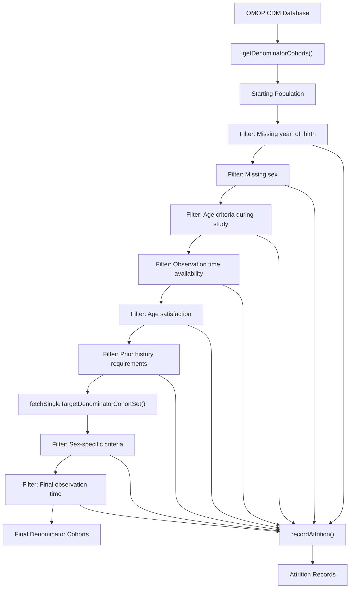
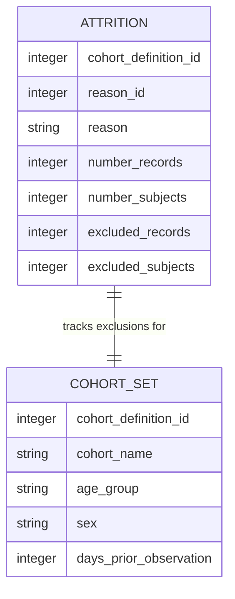
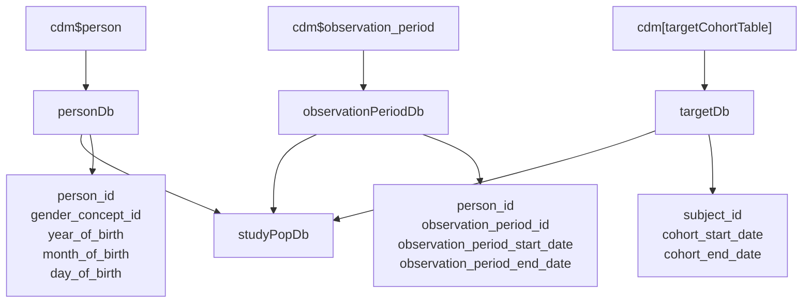
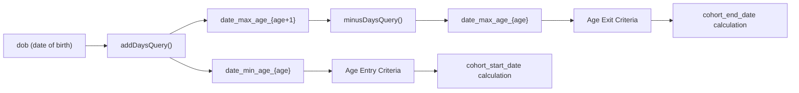
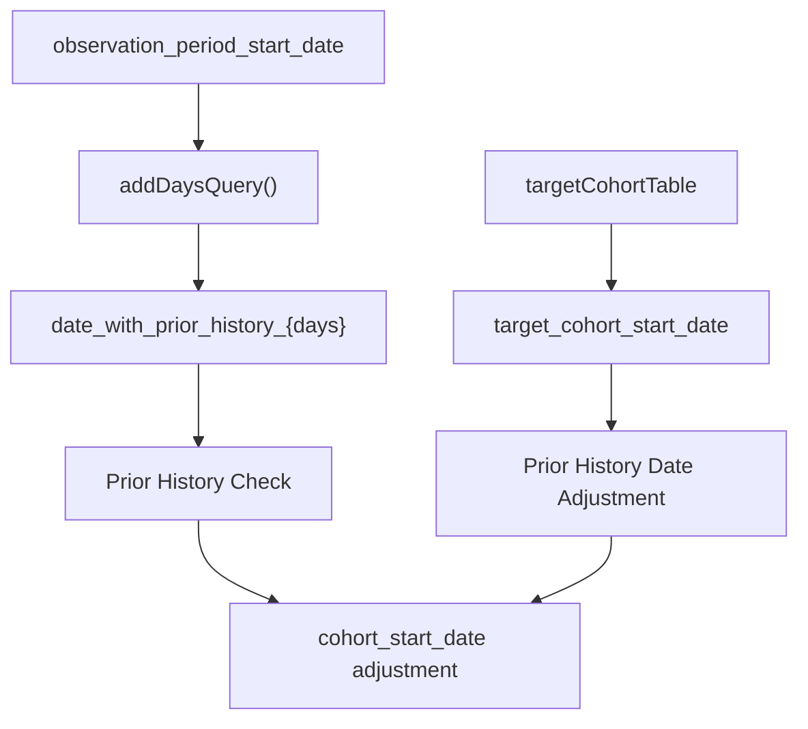
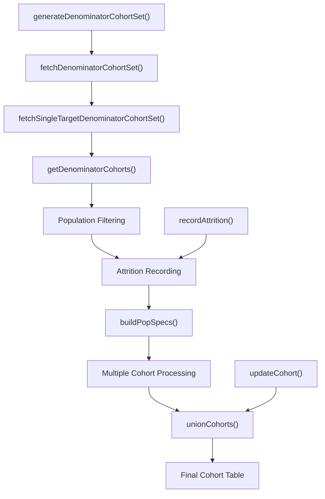

# Page: Population Filtering and Attrition

# Population Filtering and Attrition

<details>
<summary>Relevant source files</summary>

The following files were used as context for generating this wiki page:

- [R/generateDenominatorCohortSet.R](R/generateDenominatorCohortSet.R)
- [R/getDenominatorCohorts.R](R/getDenominatorCohorts.R)
- [vignettes/a02_Creating_denominator_populations.Rmd](vignettes/a02_Creating_denominator_populations.Rmd)

</details>


This document covers the technical implementation of population filtering and attrition tracking during denominator cohort generation in the IncidencePrevalence package. It explains how individuals are systematically filtered based on various criteria and how exclusions are tracked throughout the process.

For information about the high-level cohort generation process, see [Denominator Cohort Creation](#4.1). For details about target cohorts and time-at-risk windows, see [Target Cohorts and Time-at-Risk](#4.2).

## Overview of Population Filtering

Population filtering in the IncidencePrevalence package follows a systematic multi-stage process where individuals from the OMOP CDM database are progressively filtered based on study requirements. Each filtering step removes individuals who do not meet specific criteria while maintaining detailed records of exclusions.

### Filtering Pipeline



Sources: [R/getDenominatorCohorts.R:19-455](), [R/generateDenominatorCohortSet.R:477-738]()

## Attrition Tracking System

The package implements a comprehensive attrition tracking system that records the number of individuals excluded at each filtering step. This system provides transparency into how the final denominator population was derived.

### Attrition Record Structure



The `recordAttrition()` function is called at each filtering step to maintain these records. Each attrition record captures both the remaining population and the number excluded at that specific step.

Sources: [R/getDenominatorCohorts.R:134-364](), [R/generateDenominatorCohortSet.R:557-588]()

## Core Filtering Implementation

The primary filtering logic is implemented in the `getDenominatorCohorts()` function, which processes individuals through a series of sequential filters.

### Database Table Preparation



Sources: [R/getDenominatorCohorts.R:29-124]()

### Sequential Filtering Steps

The filtering process follows this sequence:

| Step | Reason ID | Filter Criteria | Function Lines |
|------|-----------|----------------|----------------|
| 1 | 1 | Starting population | [134-139]() |
| 2 | 2 | Missing year of birth | [141-150]() |
| 3 | 3 | Missing sex (not Male/Female) | [152-172]() |
| 4 | 4 | Cannot satisfy age criteria | [184-224]() |
| 5 | 5 | No observation time during study | [226-247]() |
| 6 | 6 | Doesn't satisfy age criteria | [308-322]() |
| 7 | 7 | Prior history requirement not fulfilled | [341-364]() |
| 8 | 8 | Sex-specific exclusions | [567-588]() |
| 10 | 10 | No observation time after all criteria | [655-663]() |

Sources: [R/getDenominatorCohorts.R:134-364](), [R/generateDenominatorCohortSet.R:567-663]()

## Population Filtering Criteria

### Age-Based Filtering

The system implements sophisticated age-based filtering using calculated date ranges:



The age filtering uses these key variables:
- `date_min_age_{minAge}`: Date when person reaches minimum age
- `date_max_age_{maxAge}`: Date when person reaches maximum age (day before next birthday)
- Age ranges are inclusive of the minimum age and exclusive of the maximum age + 1

Sources: [R/getDenominatorCohorts.R:255-280](), [R/getDenominatorCohorts.R:306-322]()

### Prior Observation Filtering

Prior observation requirements are enforced through calculated dates:



The system calculates `date_with_prior_history_{daysPriorObservation}` by adding the required prior observation days to the observation period start date.

Sources: [R/getDenominatorCohorts.R:284-290](), [R/getDenominatorCohorts.R:325-348]()

## Cohort Date Calculation

The final cohort start and end dates are calculated using complex date logic:

### Start Date Logic
```
cohort_start_date = MAX(
  study_start_date,
  date_min_age_{minAge},
  date_with_prior_history_{daysPriorObservation},
  target_cohort_start_date (if applicable)
)
```

### End Date Logic
```
cohort_end_date = MIN(
  study_end_date,
  observation_period_end_date,
  date_max_age_{maxAge},
  target_cohort_end_date (if applicable)
)
```

Sources: [R/getDenominatorCohorts.R:375-425]()

## Integration with Cohort Generation

The filtering system integrates with the broader cohort generation process through several key functions:



The `buildPopSpecs()` function creates specifications for multiple cohort variants based on age groups, sex criteria, and prior observation requirements. Each specification results in separate filtering and attrition tracking.

Sources: [R/generateDenominatorCohortSet.R:65-85](), [R/generateDenominatorCohortSet.R:354-392](), [R/generateDenominatorCohortSet.R:761-799]()

## Performance Optimization

The filtering system includes several performance optimizations:

- **Batched Processing**: Cohorts are processed in batches of 10 when there are many subgroups [R/generateDenominatorCohortSet.R:820-903]()
- **Intermediate Tables**: Temporary tables are used and cleaned up systematically [R/generateDenominatorCohortSet.R:343-348]()
- **Database-Side Filtering**: Filtering operations are pushed to the database level rather than performed in R [R/getDenominatorCohorts.R:127-433]()

Sources: [R/generateDenominatorCohortSet.R:820-947](), [R/getDenominatorCohorts.R:444-447]()