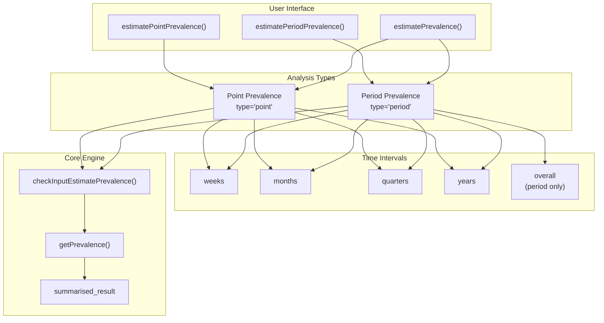
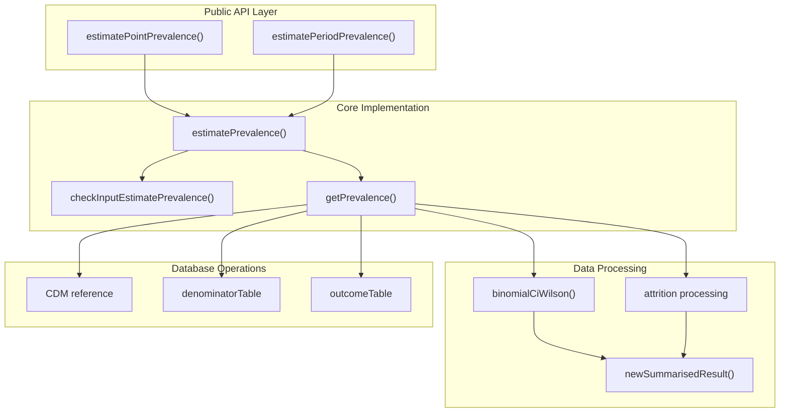
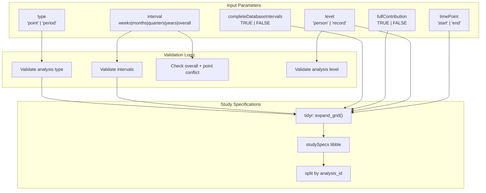
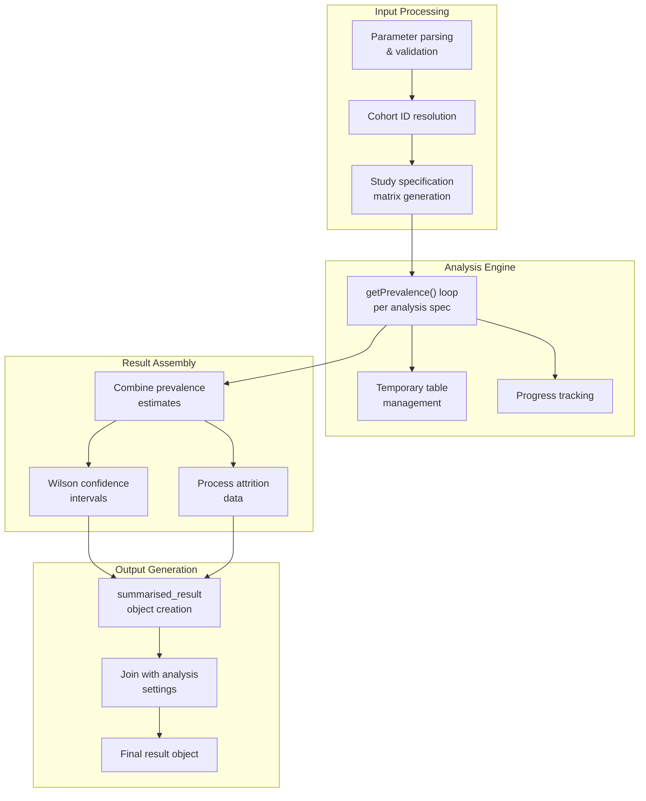
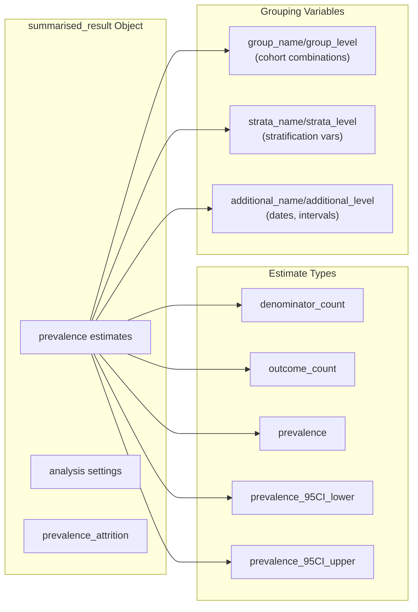

# Page: Prevalence Analysis

# Prevalence Analysis

<details>
<summary>Relevant source files</summary>

The following files were used as context for generating this wiki page:

- [R/estimatePrevalence.R](R/estimatePrevalence.R)
- [tests/testthat/test-estimatePrevalence.R](tests/testthat/test-estimatePrevalence.R)

</details>


This document covers the prevalence estimation functionality of the IncidencePrevalence package, including both point and period prevalence analysis capabilities. It explains the main API functions, configuration options, and technical implementation details for conducting prevalence studies using OMOP CDM data.

For information about creating denominator cohorts for prevalence analysis, see [Cohort Generation](#4). For visualization and reporting of prevalence results, see [Visualization and Reporting](#7).

## Overview

The prevalence analysis system provides comprehensive functionality for estimating both point and period prevalence from OMOP CDM data. The system supports multiple time intervals, stratification, confidence interval calculations, and flexible population requirements. All results are returned in the standardized `summarised_result` format compatible with the broader OMOP ecosystem.

## Prevalence Types

### Point vs Period Prevalence Analysis Flow



**Point Prevalence** estimates the proportion of individuals with the outcome at specific time points (e.g., the first day of each month). It captures the prevalence "snapshot" at discrete moments.

**Period Prevalence** estimates the proportion of individuals with the outcome at any point during a specified time period (e.g., during each calendar month). It captures the cumulative prevalence over intervals.

Sources: [R/estimatePrevalence.R:17-91](), [R/estimatePrevalence.R:94-174]()

## Main API Functions

### Function Architecture



### estimatePointPrevalence()

The `estimatePointPrevalence()` function provides a simplified interface for point prevalence estimation. It automatically sets `type = "point"`, `completeDatabaseIntervals = FALSE`, and `fullContribution = FALSE` to provide sensible defaults for point prevalence analysis.

**Key Parameters:**
- `interval`: Time intervals ("weeks", "months", "quarters", "years")
- `timePoint`: Where to compute prevalence ("start" or "end" of interval)
- `strata`: Variables for stratification
- `includeOverallStrata`: Whether to include overall results alongside strata

### estimatePeriodPrevalence()

The `estimatePeriodPrevalence()` function provides a simplified interface for period prevalence estimation. It supports the "overall" interval option and provides more control over database completeness and contribution requirements.

**Key Parameters:**
- `interval`: Time intervals including "overall" option
- `completeDatabaseIntervals`: Whether to require complete database coverage
- `fullContribution`: Whether individuals must contribute for entire intervals
- `level`: Analysis level ("person" or "record")

Sources: [R/estimatePrevalence.R:59-91](), [R/estimatePrevalence.R:148-174]()

## Configuration Options

### Parameter Flow and Validation



### Critical Configuration Parameters

| Parameter | Point Prevalence | Period Prevalence | Description |
|-----------|------------------|-------------------|-------------|
| `completeDatabaseIntervals` | FALSE (fixed) | TRUE (default) | Whether to require complete database coverage for intervals |
| `fullContribution` | FALSE (fixed) | FALSE (default) | Whether individuals must be present for entire interval |
| `interval` | weeks, months, quarters, years | + overall | Supported time intervals |
| `level` | person (fixed) | person/record | Analysis granularity |
| `timePoint` | start/end | start (fixed) | Point in interval for prevalence estimation |

### Advanced Options

**Stratification**: Variables from the denominator cohort table can be used for stratified analysis:
```r
strata = list(c("age_group"), c("sex"), c("age_group", "sex"))
```

**Database Intervals**: When `completeDatabaseIntervals = TRUE`, analysis is restricted to intervals where the database has complete coverage based on observation period boundaries.

**Full Contribution**: When `fullContribution = TRUE`, individuals must be present in the database for the entire interval to contribute to prevalence estimates.

Sources: [R/estimatePrevalence.R:202-209](), [R/estimatePrevalence.R:253-283]()

## Technical Implementation

### Core Processing Pipeline



### Key Implementation Details

**Study Specification Matrix**: The system creates a comprehensive matrix of all analysis combinations using `tidyr::expand_grid()` to ensure every combination of cohorts, parameters, and intervals is analyzed.

**Wilson Confidence Intervals**: Prevalence estimates include 95% confidence intervals calculated using the Wilson score method via `binomialCiWilson()`:
```r
binomialCiWilson(outcome_count, denominator_count, prefix = "prevalence")
```

**Temporary Table Management**: Each analysis uses a unique table prefix to prevent collisions:
```r
tablePrefix <- paste0(
  paste0(sample(x = letters, size = 5, replace = TRUE), collapse = ""),
  type, "_prev"
)
```

**Attrition Integration**: Analysis-specific attrition is combined with denominator cohort attrition to provide complete population flow tracking.

Sources: [R/estimatePrevalence.R:284-354](), [R/estimatePrevalence.R:405-412](), [R/estimatePrevalence.R:541-552]()

## Results Structure

### Output Data Architecture



### Key Result Components

**Prevalence Estimates**: Each row contains one estimate type:
- `denominator_count`: Number of individuals in denominator
- `outcome_count`: Number with outcome
- `prevalence`: Calculated prevalence proportion
- `prevalence_95CI_lower/upper`: Wilson confidence interval bounds

**Temporal Information**: Stored in `additional_level`:
- `prevalence_start_date`: Interval start date
- `prevalence_end_date`: Interval end date  
- `analysis_interval`: Interval type (months, years, etc.)

**Analysis Settings**: Comprehensive metadata including:
- `analysis_type`: "point prevalence" or "period prevalence"
- `analysis_complete_database_intervals`: Database interval requirement
- `analysis_full_contribution`: Full contribution requirement
- `analysis_level`: "person" or "record" level analysis

**Attrition Data**: Population flow tracking with exclusion reasons and counts at each step of the analysis pipeline.

Sources: [R/estimatePrevalence.R:453-496](), [R/estimatePrevalence.R:518-532]()

## Error Handling and Validation

The system includes comprehensive validation through `checkInputEstimatePrevalence()` and `checkInputEstimateAdditional()` functions that verify:

- CDM reference object validity
- Cohort table existence and structure
- Cohort ID availability and non-empty populations
- Parameter value constraints and combinations
- Required cohort attributes (cohort_set, cohort_attrition)

Empty result handling is robust, returning properly structured `summarised_result` objects even when no data meets the analysis criteria.

Sources: [R/estimatePrevalence.R:202-252](), [tests/testthat/test-estimatePrevalence.R:796-842]()