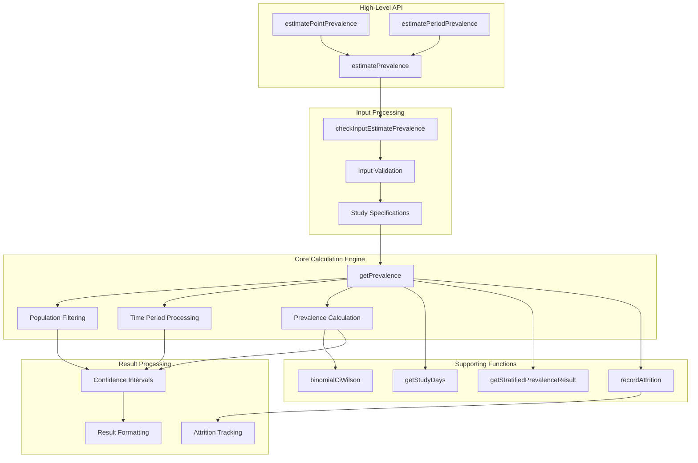
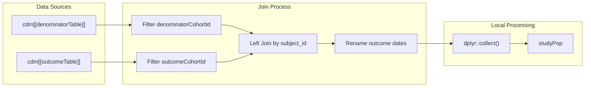
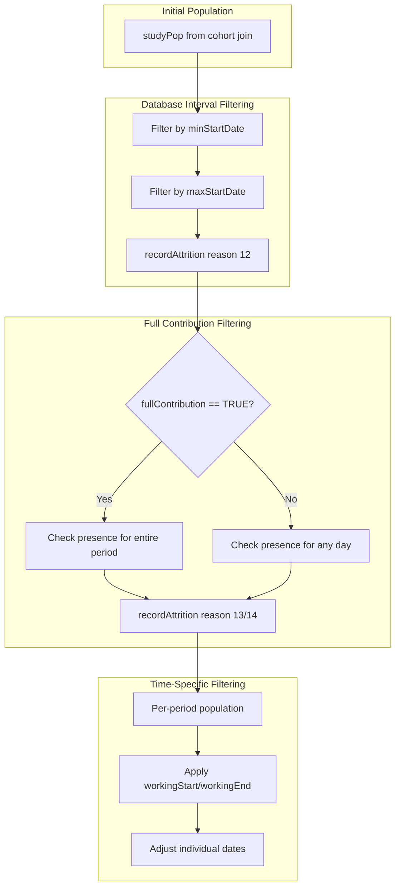
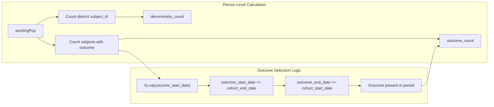
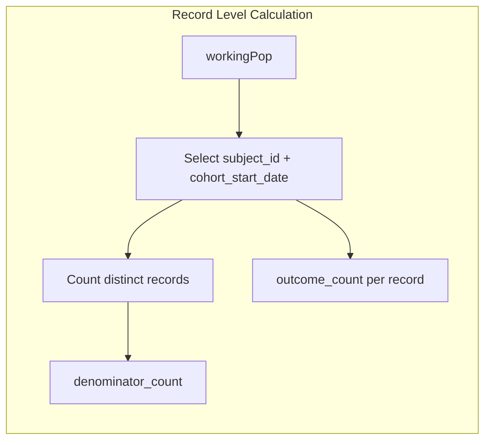
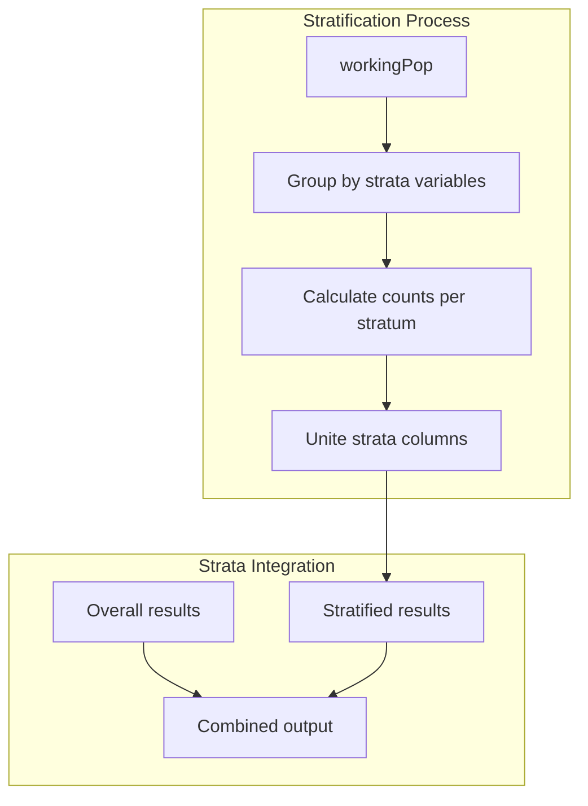
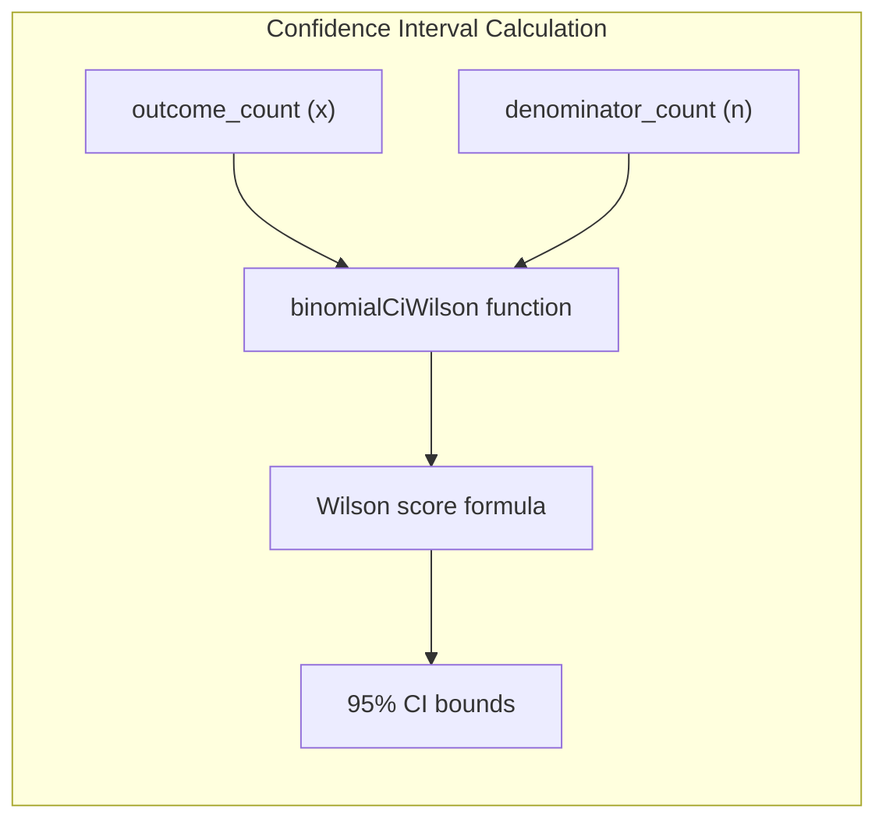

# Page: Prevalence Calculation Engine

# Prevalence Calculation Engine

Relevant source files

The following files were used as context for generating this wiki page:

- [R/estimatePrevalence.R](R/estimatePrevalence.R)
- [R/getPrevalence.R](R/getPrevalence.R)

This document covers the technical implementation of the prevalence calculation engine, specifically the `getPrevalence` function and its supporting logic. This engine performs the core computational work for both point and period prevalence estimation.

For information about the differences between point and period prevalence types, see [Point vs Period Prevalence](#6.1). For details about configuration parameters like `fullContribution` and `timePoint`, see [Configuration Options](#6.3).

## Overview

The prevalence calculation engine is the core computational component that transforms denominator and outcome cohorts into prevalence estimates across specified time intervals. The engine handles complex logic for population filtering, time period processing, stratification, and confidence interval calculation.

Sources: [R/estimatePrevalence.R:59-91](), [R/estimatePrevalence.R:148-174](), [R/estimatePrevalence.R:176-539](), [R/getPrevalence.R:17-359]()

## Core Calculation Algorithm

The `getPrevalence` function implements the main calculation algorithm through several distinct phases:

### Data Preparation Phase

The engine begins by joining denominator and outcome cohorts and collecting the data locally for processing:

The join operation creates a unified dataset where each row represents a denominator cohort entry with associated outcome information if present.

Sources: [R/getPrevalence.R:38-61]()

### Time Period Generation

The engine generates study periods based on the requested intervals using the `getStudyDays` helper function:

| Interval Type | Processing Logic | Time Point Handling |
|---------------|------------------|-------------------|
| `weeks` | ISO week boundaries | Start/end of week based on `timePoint` |
| `months` | Calendar month boundaries | Start/end of month based on `timePoint` |
| `quarters` | Calendar quarter boundaries | Start/end of quarter based on `timePoint` |
| `years` | Calendar year boundaries | Start/end of year based on `timePoint` |
| `overall` | Full study period | From min start to max end date |

Sources: [R/getPrevalence.R:77-148]()

## Population Filtering Logic

The engine applies multiple filtering steps to ensure the analysis population meets the specified criteria:

### Full Contribution Logic

The `fullContribution` parameter controls how strictly individuals must be present during time periods:

- **`fullContribution = TRUE`**: Individuals must be present for the entire time interval
- **`fullContribution = FALSE`**: Individuals need only contribute at least one day to the interval

Sources: [R/getPrevalence.R:175-231](), [R/getPrevalence.R:243-261]()

## Prevalence Calculation Process

For each time period and stratification level, the engine calculates prevalence using different logic based on the analysis level:

### Person-Level Analysis

### Record-Level Analysis

For record-level analysis, the engine counts cohort entries rather than unique individuals:

Sources: [R/getPrevalence.R:283-311]()

## Stratification Handling

The engine supports stratified analysis through the `getStratifiedPrevalenceResult` function:

The stratification logic maintains the same outcome detection criteria but applies them within each stratum group.

Sources: [R/getPrevalence.R:326-342](), [R/getPrevalence.R:361-401]()

## Result Aggregation and Confidence Intervals

After collecting prevalence estimates across all time periods, the engine aggregates results and calculates confidence intervals:

### Wilson Score Confidence Intervals

The engine uses the Wilson score method for calculating 95% confidence intervals:

The Wilson score method is preferred over normal approximation as it provides better coverage for small samples and extreme prevalence values.

Sources: [R/estimatePrevalence.R:406-412](), [R/estimatePrevalence.R:541-552]()

## Attrition Tracking

Throughout the calculation process, the engine maintains detailed attrition records using standardized reason codes:

| Reason ID | Description | Applied When |
|-----------|-------------|--------------|
| 11 | Starting analysis population | Initial population |
| 12 | Not observed during complete database interval | Database interval filtering |
| 13 | Do not satisfy full contribution requirement | `fullContribution = TRUE` |
| 14 | Do not satisfy full contribution requirement | `fullContribution = FALSE` |

The attrition tracking enables users to understand how population filters affect their analysis.

Sources: [R/getPrevalence.R:63-68](), [R/getPrevalence.R:191-231]()

## Performance Considerations

The engine includes several optimizations for handling large datasets:

1. **Local Collection**: Data is collected once and processed locally to minimize database queries
2. **Vectorized Operations**: Uses vectorized date comparisons and filtering
3. **Efficient Grouping**: Stratification uses efficient dplyr grouping operations
4. **Parallel Processing**: Multiple analysis specifications can be processed in parallel

The engine provides progress indicators for long-running analyses and reports total execution time upon completion.

Sources: [R/getPrevalence.R:60-61](), [R/estimatePrevalence.R:296-323](), [R/estimatePrevalence.R:533-536]()