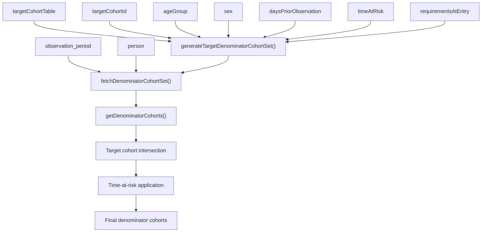
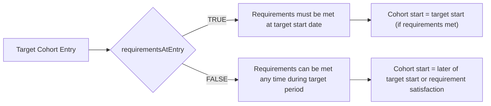
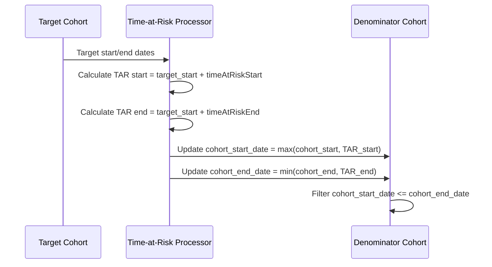
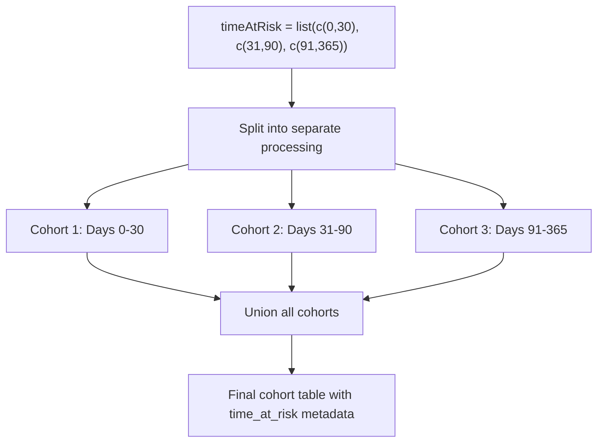
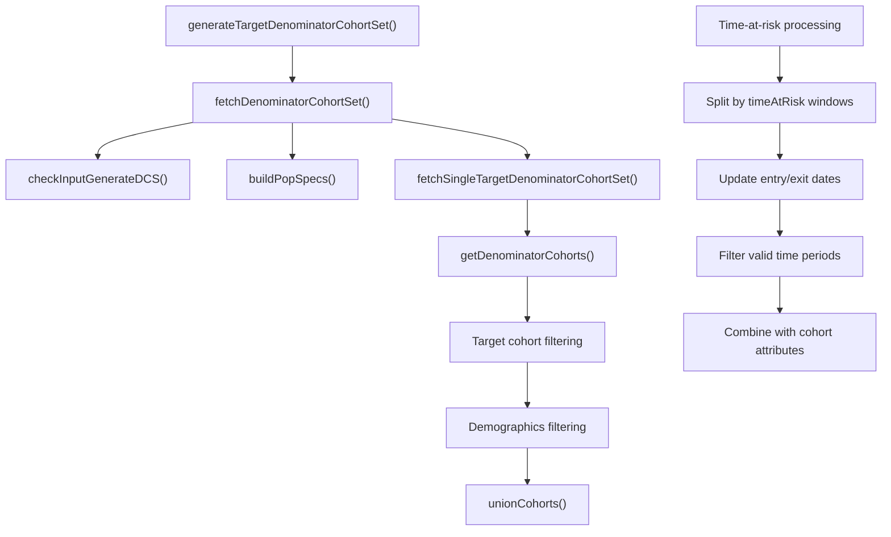
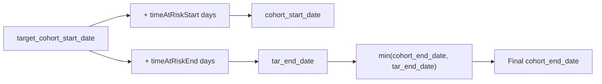

# Page: Target Cohorts and Time-at-Risk

# Target Cohorts and Time-at-Risk

<details>
<summary>Relevant source files</summary>

The following files were used as context for generating this wiki page:

- [R/generateDenominatorCohortSet.R](R/generateDenominatorCohortSet.R)
- [tests/testthat/test-generateDenominatorCohortSet.R](tests/testthat/test-generateDenominatorCohortSet.R)
- [vignettes/a02_Creating_denominator_populations.Rmd](vignettes/a02_Creating_denominator_populations.Rmd)

</details>


This document covers the creation of denominator cohorts that are constrained by existing target cohorts and the specification of time-at-risk windows. This functionality allows for more precise population definitions where individuals only contribute observation time when they are members of a specific target cohort and within defined time windows relative to their target cohort entry.

For basic denominator cohort creation without target constraints, see [Denominator Cohort Creation](#4.1). For population filtering and attrition concepts, see [Population Filtering and Attrition](#4.3).

## Target Cohort Constraints

Target cohorts provide a mechanism to restrict denominator populations to individuals who are members of pre-existing cohorts during specific time periods. This is implemented through the `generateTargetDenominatorCohortSet()` function, which constrains the standard denominator logic by requiring individuals to be present in a target cohort table.

### Target Cohort Data Flow



**Sources:** [R/generateDenominatorCohortSet.R:87-175]()

The target cohort constrains individuals in two ways:
1. **Temporal constraint**: Individuals only contribute time when they are active members of the target cohort
2. **Population constraint**: Only individuals who appear in the target cohort are considered for inclusion

### Requirements at Entry vs Any Time

The `requirementsAtEntry` parameter controls when demographic and observation requirements must be satisfied:



**Sources:** [R/generateDenominatorCohortSet.R:125-127](), [R/generateDenominatorCohortSet.R:622-652]()

## Time-at-Risk Windows

Time-at-risk windows define specific periods relative to target cohort entry during which individuals can contribute observation time. This allows for analyses focused on particular risk periods following an index event.

### Time-at-Risk Specification

The `timeAtRisk` parameter accepts either a single vector or list of vectors specifying time windows:

| Format | Example | Meaning |
|--------|---------|---------|
| `c(start, end)` | `c(0, 30)` | 0 to 30 days after target entry |
| `c(start, Inf)` | `c(365, Inf)` | 365 days after target entry onwards |
| `list(c(s1,e1), c(s2,e2))` | `list(c(0,30), c(31,90))` | Multiple non-overlapping windows |

### Time-at-Risk Processing Logic



**Sources:** [R/generateDenominatorCohortSet.R:197-252]()

### Multiple Time-at-Risk Windows

When multiple time-at-risk windows are specified, the function creates separate cohorts for each window:



**Sources:** [R/generateDenominatorCohortSet.R:177-304]()

## Technical Implementation

### Core Function Signatures

The main function signature for target-based denominator generation:

```
generateTargetDenominatorCohortSet(
  cdm,
  name,
  targetCohortTable,
  targetCohortId = NULL,
  cohortDateRange = as.Date(c(NA, NA)),
  timeAtRisk = c(0, Inf),
  ageGroup = list(c(0, 150)),
  sex = "Both",
  daysPriorObservation = 0,
  requirementsAtEntry = TRUE,
  requirementInteractions = TRUE
)
```

**Sources:** [R/generateDenominatorCohortSet.R:148-158]()

### Internal Processing Architecture



**Sources:** [R/generateDenominatorCohortSet.R:163-175](), [R/generateDenominatorCohortSet.R:309-472]()

### Date Calculation Logic

Time-at-risk dates are calculated using database-native date arithmetic:



The implementation uses `CDMConnector::dateadd()` for database-portable date arithmetic.

**Sources:** [R/generateDenominatorCohortSet.R:213-241]()

## Cohort Metadata and Attrition

### Settings and Attributes

Target denominator cohorts include additional metadata in their settings:

| Column | Description |
|--------|-------------|
| `target_cohort_definition_id` | ID from the target cohort table |
| `target_cohort_name` | Name from the target cohort table |
| `time_at_risk` | Time window specification (e.g., "0 to 30") |
| `requirements_at_entry` | Whether requirements applied at entry |

**Sources:** [R/generateDenominatorCohortSet.R:710-724]()

### Attrition Tracking

The attrition table tracks population reduction through several steps:

1. Initial database population
2. Valid observation periods  
3. Age and sex criteria
4. Prior observation requirements
5. Target cohort membership
6. Time-at-risk window constraints

**Sources:** [R/generateDenominatorCohortSet.R:294-296](), [R/generateDenominatorCohortSet.R:657-663]()

## Usage Patterns

### Basic Target Cohort Usage

```r
# Constrain to members of target cohort ID 1
cdm <- generateTargetDenominatorCohortSet(
  cdm = cdm,
  name = "denominator", 
  targetCohortTable = "drug_exposure_cohort",
  targetCohortId = 1
)
```

### Time-at-Risk Window Usage

```r
# Multiple risk windows
cdm <- generateTargetDenominatorCohortSet(
  cdm = cdm,
  name = "denominator",
  targetCohortTable = "treatment_cohort", 
  timeAtRisk = list(c(0, 30), c(31, 90), c(91, 365))
)
```

### Flexible Requirement Timing

```r
# Allow requirement satisfaction after target entry
cdm <- generateTargetDenominatorCohortSet(
  cdm = cdm,
  name = "denominator",
  targetCohortTable = "index_cohort",
  ageGroup = list(c(18, 65)),
  daysPriorObservation = 365,
  requirementsAtEntry = FALSE
)
```

**Sources:** [tests/testthat/test-generateDenominatorCohortSet.R:121-147](), [tests/testthat/test-generateDenominatorCohortSet.R:1830-1983]()