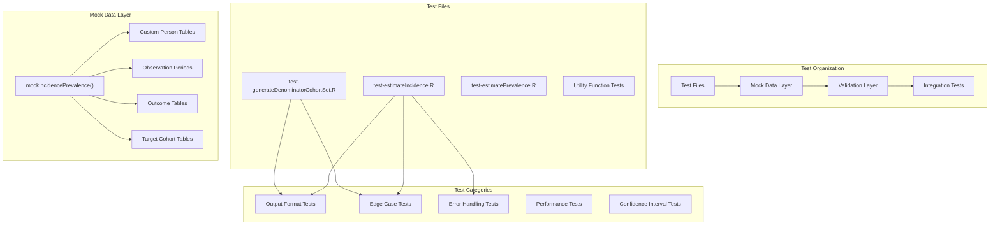
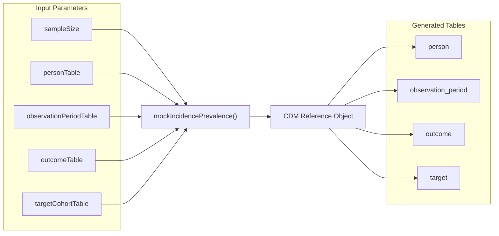
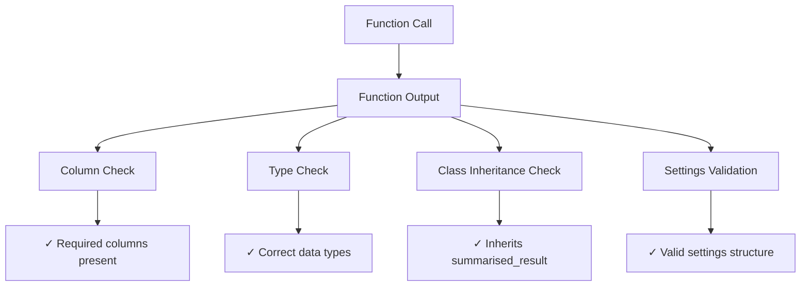
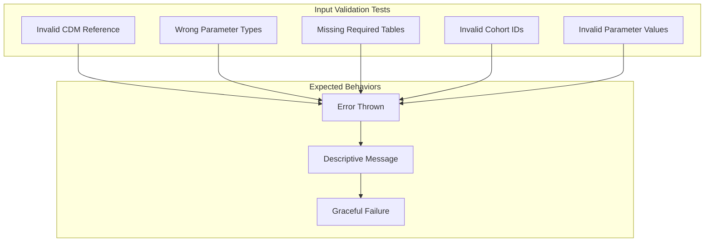
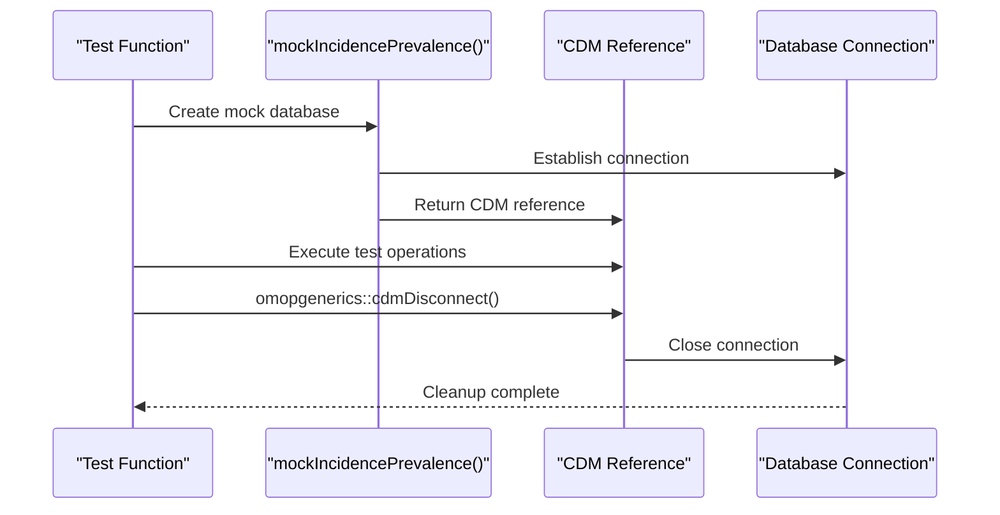

# Page: Testing Framework

# Testing Framework

Relevant source files

The following files were used as context for generating this wiki page:

- [tests/testthat/test-estimateIncidence.R](tests/testthat/test-estimateIncidence.R)
- [tests/testthat/test-generateDenominatorCohortSet.R](tests/testthat/test-generateDenominatorCohortSet.R)

This document describes the comprehensive testing infrastructure used in the IncidencePrevalence package to ensure code quality, reliability, and correctness of epidemiological calculations. The testing framework validates everything from basic function outputs to complex edge cases in incidence and prevalence estimation.

For information about mock data generation specifically, see [Mock Data Generation](#10.2).

## Testing Architecture

The IncidencePrevalence package employs a multi-layered testing strategy built on the `testthat` R testing framework. The testing architecture ensures comprehensive coverage of both core analytical functions and supporting utilities.

**Sources:** [tests/testthat/test-estimateIncidence.R:1-54](), [tests/testthat/test-generateDenominatorCohortSet.R:1-51]()

## Core Testing Functions

The testing framework centers around several key testing functions and patterns that enable comprehensive validation of package functionality.

### Mock Database Generation

The `mockIncidencePrevalence()` function serves as the foundation for creating controlled test environments:

**Sources:** [tests/testthat/test-estimateIncidence.R:2](), [tests/testthat/test-generateDenominatorCohortSet.R:68-71]()

### Test Execution Patterns

Tests follow consistent patterns for setup, execution, and validation:

| Test Pattern | Purpose | Example Usage |
|--------------|---------|---------------|
| `skip_on_cran()` | Skip expensive tests on CRAN | Long-running integration tests |
| Database connection management | Ensure proper cleanup | `omopgenerics::cdmDisconnect(cdm)` |
| Custom data scenarios | Test specific edge cases | Custom person/observation tables |
| Parameter validation | Test input checking | Error expectation tests |

**Sources:** [tests/testthat/test-estimateIncidence.R:57](), [tests/testthat/test-generateDenominatorCohortSet.R:53]()

## Test Categories and Coverage

### Output Format Validation

These tests ensure that functions return data structures conforming to the `omopgenerics` standard:

- **Column presence**: Verification that required columns exist in output tables
- **Data types**: Validation of column data types and formats  
- **Object inheritance**: Checking that results inherit from `summarised_result` class
- **Settings structure**: Validation of configuration metadata

**Sources:** [tests/testthat/test-estimateIncidence.R:13-39](), [tests/testthat/test-generateDenominatorCohortSet.R:5-49]()

### Edge Case Testing

The framework extensively tests boundary conditions and unusual scenarios:

#### Temporal Edge Cases
- Events occurring on the same day as cohort entry
- Overlapping observation periods
- Events spanning multiple time periods
- Complete database interval requirements

#### Population Edge Cases  
- Empty cohorts after filtering
- Single-person populations
- Multiple observation periods per person
- Missing demographic data

#### Parameter Edge Cases
- Zero washout periods vs. infinite washout
- Minimum and maximum age restrictions
- Date range boundaries
- Prior observation requirements

**Sources:** [tests/testthat/test-estimateIncidence.R:1062-1124](), [tests/testthat/test-generateDenominatorCohortSet.R:1315-1371]()

### Error Handling Validation

Comprehensive testing ensures appropriate error handling for invalid inputs:

**Sources:** [tests/testthat/test-estimateIncidence.R:2431-2514](), [tests/testthat/test-generateDenominatorCohortSet.R:1373-1446]()

## Specialized Testing Areas

### Confidence Interval Validation

The framework validates statistical calculations against external libraries:

- **External validation**: Comparison with `epitools::pois.exact()` for Poisson confidence intervals
- **Numerical precision**: Tolerance-based comparisons for floating-point calculations
- **Edge cases**: Testing with zero events, large populations, extreme rates

**Sources:** [tests/testthat/test-estimateIncidence.R:2942-2988]()

### Attrition Testing

Comprehensive validation of population filtering and attrition reporting:

- **Attrition counts**: Verification that exclusion counts match expected values
- **Reason tracking**: Validation that exclusion reasons are properly recorded
- **Multiple cohorts**: Testing attrition across different demographic strata
- **Minimum cell counts**: Testing suppression of small counts

**Sources:** [tests/testthat/test-estimateIncidence.R:2990-3043](), [tests/testthat/test-generateDenominatorCohortSet.R:1448-1669]()

### Multiple Observation Periods

Testing complex scenarios with fragmented observation time:

- **Washout period application**: Validation across observation period gaps
- **Event counting**: Proper handling of events across multiple periods
- **Time at risk calculation**: Accurate person-time computation
- **Cohort continuity**: Testing cohort membership across observation gaps

**Sources:** [tests/testthat/test-estimateIncidence.R:2516-2940]()

## Test Execution and Infrastructure

### Database Connection Management

All tests implement proper database lifecycle management:

**Sources:** [tests/testthat/test-estimateIncidence.R:53](), [tests/testthat/test-generateDenominatorCohortSet.R:50]()

### Performance Considerations

The framework includes several performance optimization strategies:

- **CRAN skipping**: Expensive tests are skipped on CRAN using `skip_on_cran()`
- **Sample size variation**: Tests use different sample sizes (small for speed, large for coverage)
- **Cleanup validation**: Tests verify that temporary tables are properly cleaned up
- **Resource monitoring**: Table creation and deletion tracking

**Sources:** [tests/testthat/test-estimateIncidence.R:57](), [tests/testthat/test-generateDenominatorCohortSet.R:1672-1723]()

### Test Data Scenarios

The framework supports multiple data generation patterns:

| Scenario Type | Use Case | Implementation |
|---------------|----------|----------------|
| Default mock data | Basic functionality testing | `mockIncidencePrevalence()` |
| Custom person tables | Demographic testing | Explicit `personTable` parameter |
| Custom observation periods | Temporal testing | Explicit `observationPeriodTable` parameter |
| Custom outcomes | Event pattern testing | Explicit `outcomeTable` parameter |
| Large samples | Performance testing | `sampleSize = 1000` or higher |

**Sources:** [tests/testthat/test-estimateIncidence.R:58-90](), [tests/testthat/test-generateDenominatorCohortSet.R:187-204]()