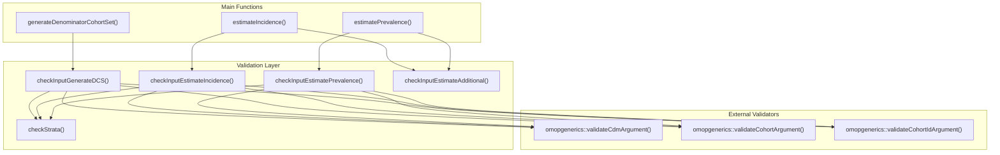
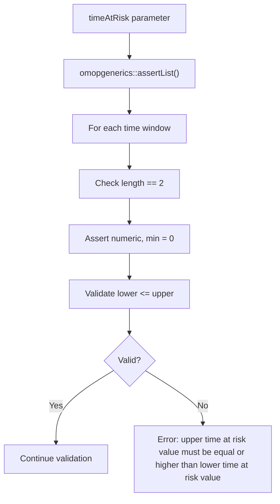
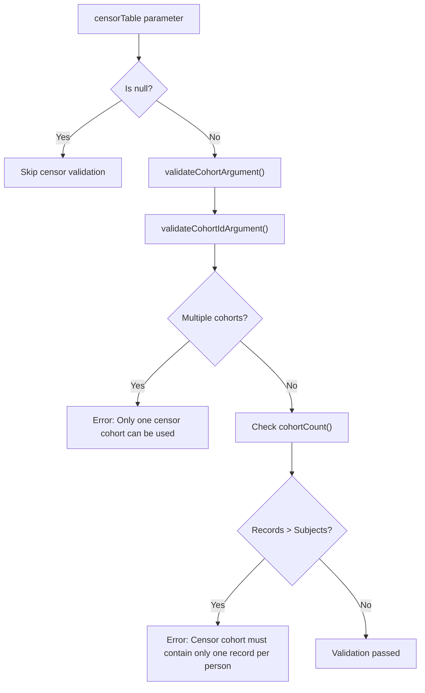
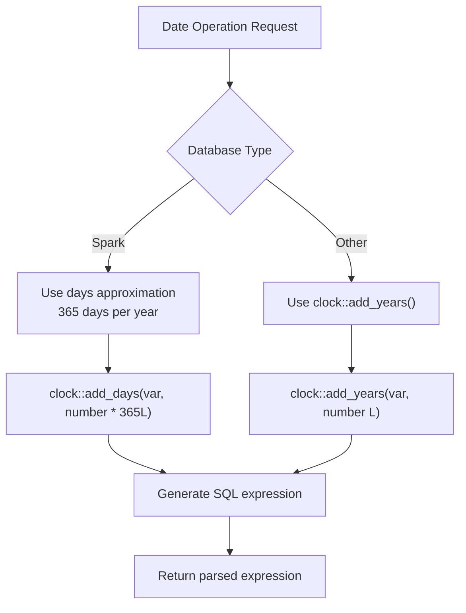
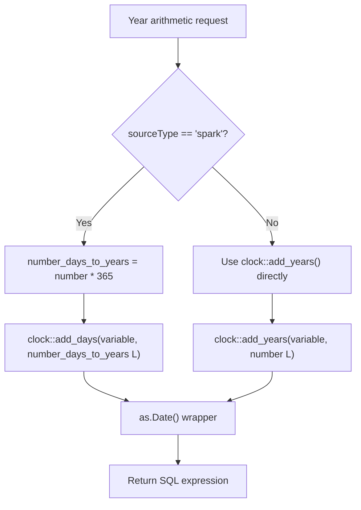
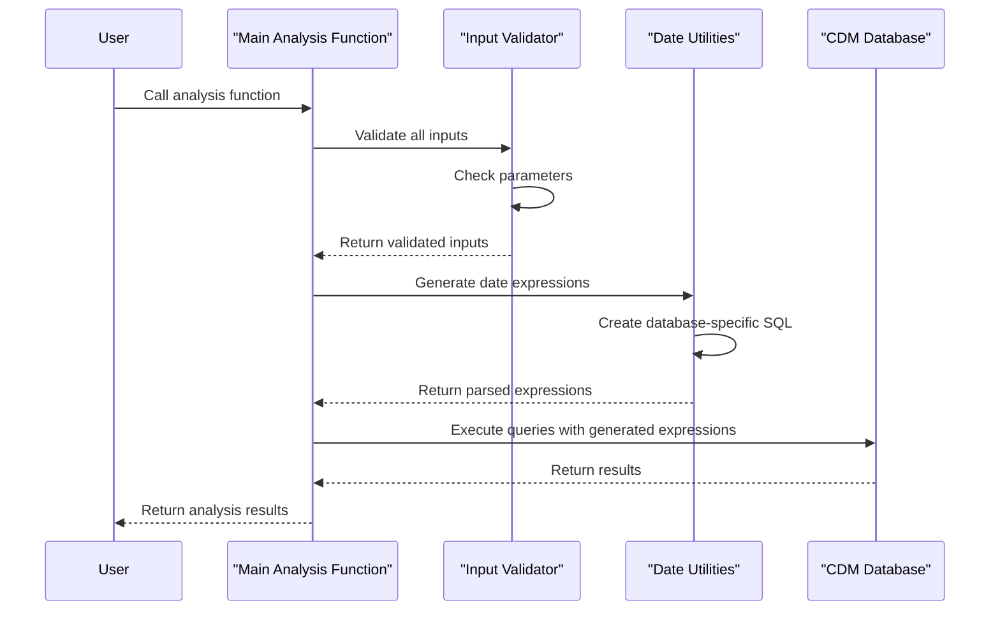

# Page: Utility and Helper Functions

# Utility and Helper Functions

Relevant source files

The following files were used as context for generating this wiki page:

- [.gitignore](.gitignore)
- [R/dateUtilities.R](R/dateUtilities.R)
- [R/inputValidation.R](R/inputValidation.R)
- [_pkgdown.yml](_pkgdown.yml)

This page documents the utility functions, validation routines, and internal helper functions that support the main analysis capabilities of the IncidencePrevalence package. These functions provide essential infrastructure for input validation, date calculations, and internal operations but are not typically called directly by end users.

For the main analysis functions like `estimateIncidence()` and `estimatePrevalence()`, see [Main Analysis Functions](#9.1). For conceptual information about the input validation system, see [Input Validation System](#8.1). For conceptual information about date and time utilities, see [Date and Time Utilities](#8.2).

## Input Validation Functions

The package implements a comprehensive input validation system through several specialized validation functions that ensure data integrity and parameter correctness before expensive computations begin.

### Core Validation Functions

The input validation system is organized around specific analysis workflows, with dedicated validation functions for each major operation:

| Function | Purpose | Key Validations |
|----------|---------|----------------|
| `checkInputGenerateDCS()` | Validates denominator cohort generation parameters | CDM reference, cohort date ranges, time-at-risk windows, age groups |
| `checkInputEstimateIncidence()` | Validates incidence analysis parameters | Cohort tables, outcome/censor cohorts, intervals, washout periods |
| `checkInputEstimatePrevalence()` | Validates prevalence analysis parameters | Analysis type, intervals, time points, contribution levels |
| `checkInputEstimateAdditional()` | Validates cohort population requirements | Non-empty denominator cohorts |
| `checkStrata()` | Validates stratification parameters | Strata list structure and column references |

**Validation Function Architecture**

Sources: [R/inputValidation.R:1-203]()

### Denominator Cohort Generation Validation

The `checkInputGenerateDCS()` function validates parameters for denominator cohort generation, ensuring proper CDM references, date ranges, and time-at-risk specifications.

Key validation features:
- **CDM Validation**: Uses `omopgenerics::validateCdmArgument()` for CDM reference integrity
- **Time-at-Risk Validation**: Ensures lower bounds ≤ upper bounds for all time-at-risk windows
- **Age Group Validation**: Supports overlapping age groups through `omopgenerics::validateAgeGroupArgument()`
- **Target Cohort Integration**: Validates target cohort tables and IDs when specified

**Time-at-Risk Validation Logic**

Sources: [R/inputValidation.R:17-62]()

### Incidence Analysis Validation

The `checkInputEstimateIncidence()` function provides specialized validation for incidence rate calculations, with particular attention to censor cohort constraints and outcome washout periods.

Critical validations include:
- **Censor Cohort Constraints**: Enforces single censor cohort and one record per person requirements
- **Interval Validation**: Supports "weeks", "months", "quarters", "years", and "overall" intervals
- **Washout Period Validation**: Validates finite washout values within reasonable ranges (0-99999 days)

**Censor Cohort Validation Flow**

Sources: [R/inputValidation.R:64-122]()

### Prevalence Analysis Validation

The `checkInputEstimatePrevalence()` function handles validation specific to prevalence calculations, including type-specific interval validation and time point specifications.

Key features:
- **Type-Specific Intervals**: Point prevalence excludes "overall" interval; period prevalence includes it
- **Time Point Validation**: Supports "start", "middle", and "end" time points
- **Contribution Level**: Validates "person" vs "record" level analysis

Sources: [R/inputValidation.R:137-184]()

## Date and Time Utilities

The package provides specialized date manipulation utilities that handle cross-database compatibility and temporal calculations for epidemiological analyses.

### Date Arithmetic Functions

Two core functions handle date arithmetic with database-specific optimizations:

| Function | Purpose | Database Support |
|----------|---------|------------------|
| `addDaysQuery()` | Add days or years to date variables | All supported databases |
| `minusDaysQuery()` | Subtract days or years from date variables | All supported databases |

Both functions support:
- **Type-specific operations**: Day-level and year-level arithmetic
- **Cross-database compatibility**: Special handling for Spark databases
- **Metaprogramming support**: Generate expressions for use in dplyr queries

**Database-Specific Date Handling**

Sources: [R/dateUtilities.R:1-96]()

### Spark Database Compatibility

The date utilities implement special handling for Spark databases due to limitations in year arithmetic support. For year-based operations on Spark:

- Converts years to days using 365-day approximation
- Uses `clock::add_days()` instead of `clock::add_years()`
- Maintains consistent API across database backends

**Year Arithmetic Implementation**

Sources: [R/dateUtilities.R:32-40](), [R/dateUtilities.R:64-72]()

### Expression Generation and Metaprogramming

The date utilities support metaprogramming patterns common in the package's internal operations:

- **Expression Parsing**: Convert glue strings to parsed R expressions using `rlang::parse_exprs()`
- **Dynamic Naming**: Support both `name_style` patterns and explicit `names` parameters
- **Query Integration**: Generate expressions suitable for use in dplyr database queries

Sources: [R/dateUtilities.R:42-44](), [R/dateUtilities.R:74-87]()

## Integration with Main Functions

The utility functions form a critical infrastructure layer that supports all main analysis operations. The validation functions are called early in each analysis workflow, while date utilities are used throughout cohort generation and temporal calculations.

**Utility Function Integration Pattern**

Sources: [R/inputValidation.R:1-203](), [R/dateUtilities.R:1-96]()

## Error Handling and User Feedback

The validation functions provide comprehensive error messages and user feedback through integration with the `omopgenerics` validation framework and `cli` package for user-friendly error reporting.

Standard error handling patterns include:
- **Descriptive Messages**: Clear explanations of validation failures
- **Parameter Context**: Specific parameter names and expected values
- **Actionable Guidance**: Suggestions for correcting invalid inputs

Sources: [R/inputValidation.R:44-45](), [R/inputValidation.R:93-94](), [R/inputValidation.R:99-100]()