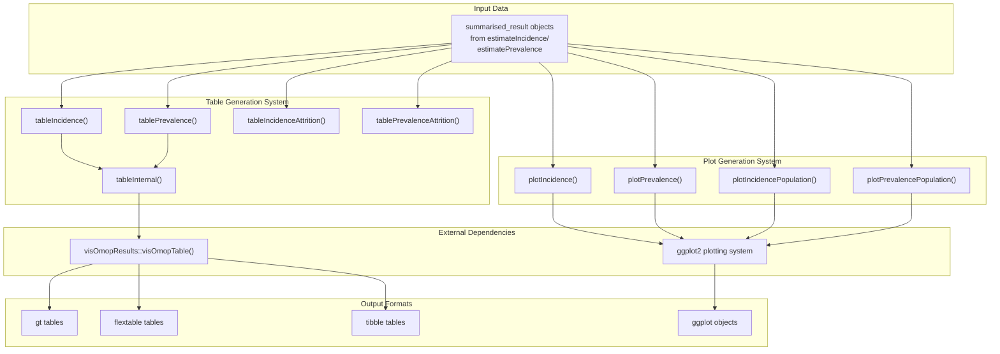
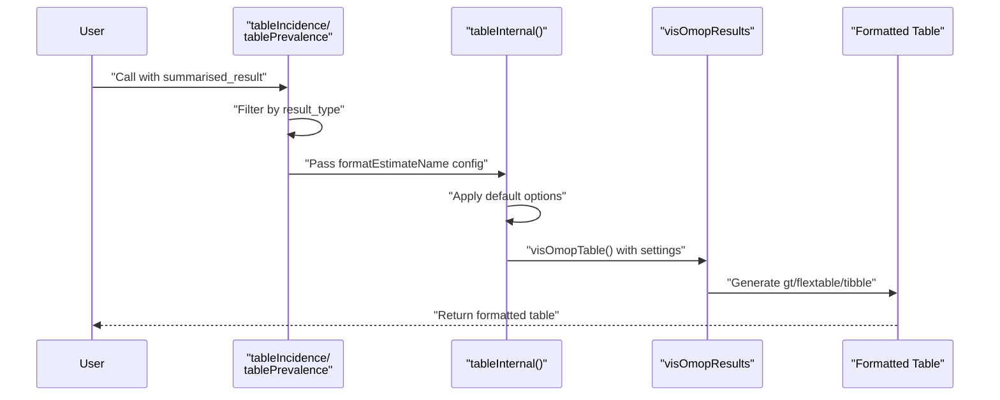
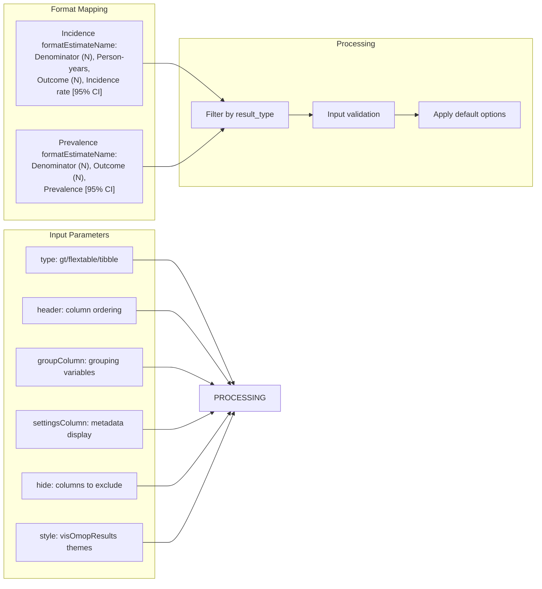
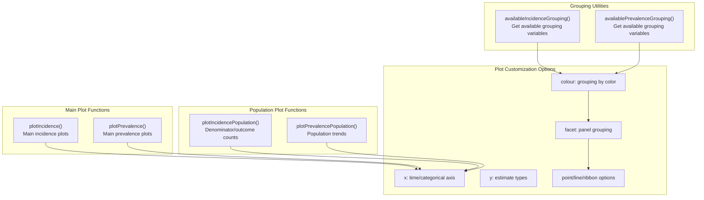
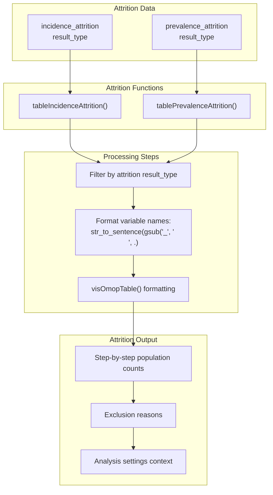
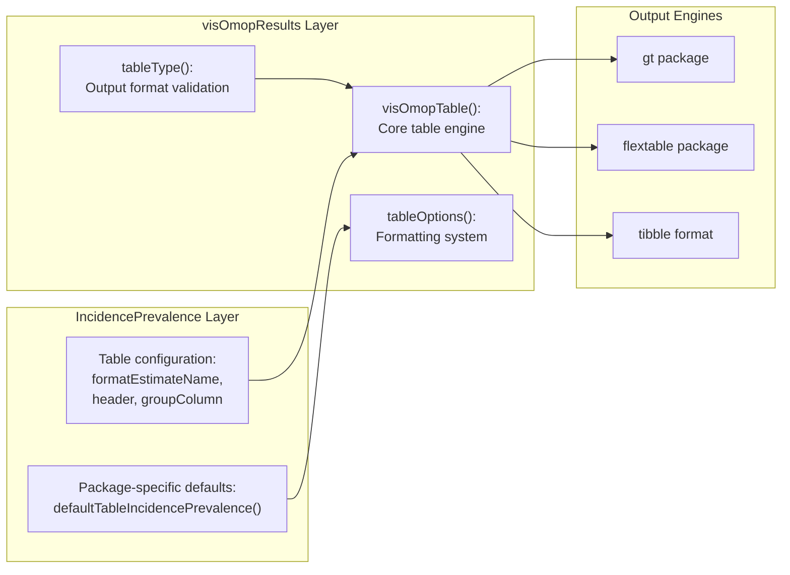

# Page: Visualization and Reporting

# Visualization and Reporting

<details>
<summary>Relevant source files</summary>

The following files were used as context for generating this wiki page:

- [R/tables.R](R/tables.R)
- [tests/testthat/test-plotting.R](tests/testthat/test-plotting.R)
- [tests/testthat/test-tables.R](tests/testthat/test-tables.R)

</details>


This page documents the visualization and reporting capabilities of the IncidencePrevalence package, covering how to create formatted tables, plots, and attrition reports from incidence and prevalence analysis results. The system transforms `summarised_result` objects into publication-ready outputs using standardized OMOP visualization patterns.

For information about generating the underlying analysis results that feed into these visualization functions, see [Incidence Analysis](#5) and [Prevalence Analysis](#6). For details about the core data structures and result formats, see [API Reference](#9).

## System Overview

The visualization and reporting system consists of three main subsystems that process `summarised_result` objects from incidence and prevalence analyses:



**Table Generation Workflow**


Sources: [R/tables.R:56-84](), [R/tables.R:124-153](), [R/tables.R:155-206](), [tests/testthat/test-tables.R:1-123]()

## Table Generation System

The table generation system provides functions to create formatted tables from analysis results, with support for multiple output formats and extensive customization options.

### Core Table Functions

**Main Analysis Tables**
- `tableIncidence()`: Creates tables for incidence analysis results [R/tables.R:124-153]()
- `tablePrevalence()`: Creates tables for prevalence analysis results [R/tables.R:56-84]()

**Attrition Reporting Tables** 
- `tableIncidenceAttrition()`: Shows population filtering steps for incidence analyses [R/tables.R:297-335]()
- `tablePrevalenceAttrition()`: Shows population filtering steps for prevalence analyses [R/tables.R:374-412]()

### Table Configuration System



**Key Configuration Options:**
- `type`: Output format (`"gt"`, `"flextable"`, `"tibble"`) [R/tables.R:57]()
- `header`: Column hierarchy for complex tables [R/tables.R:58]()
- `groupColumn`: Variables used for row grouping [R/tables.R:59]()
- `settingsColumn`: Metadata columns to display [R/tables.R:60]()
- `hide`: Columns to exclude from output [R/tables.R:61]()

Sources: [R/tables.R:155-206](), [R/tables.R:208-220](), [tests/testthat/test-tables.R:14-28]()

### Estimate Name Formatting

The system uses predefined format templates to standardize how estimates appear in tables:

| Result Type | Format Template | Example Output |
|------------|----------------|----------------|
| Incidence | `<incidence_100000_pys> (<incidence_100000_pys_95CI_lower> - <incidence_100000_pys_95CI_upper>)` | `245.3 (198.7 - 301.2)` |
| Prevalence | `<prevalence> (<prevalence_95CI_lower> - <prevalence_95CI_upper>)` | `0.0834 (0.0721 - 0.0956)` |
| Counts | `<denominator_count>`, `<outcome_count>` | `1250`, `104` |

Sources: [R/tables.R:66-70](), [R/tables.R:136-143]()

## Plot Generation System

The plotting system creates `ggplot2` visualizations for incidence and prevalence results with extensive customization capabilities.

### Core Plotting Functions



**Plot Function Capabilities:**
- **Axis Configuration**: Time series, categorical, or custom x-axis variables [tests/testthat/test-plotting.R:77-82]()
- **Visual Elements**: Points, lines, confidence interval ribbons [tests/testthat/test-plotting.R:347-360]()
- **Grouping**: Color coding and faceting by analysis strata [tests/testthat/test-plotting.R:240-246]()
- **Multiple Results**: Handle combined incidence/prevalence results [tests/testthat/test-plotting.R:152-166]()

Sources: [tests/testthat/test-plotting.R:18-46](), [tests/testthat/test-plotting.R:84-100](), [tests/testthat/test-plotting.R:129-131]()

### Plot Customization System

**Axis and Grouping Configuration**
```mermaid
graph LR
    subgraph "X_Axis_Options" ["X-Axis Options"]
        DATE_X["Date variables:<br/>incidence_start_date,<br/>prevalence_start_date"]
        CAT_X["Categorical variables:<br/>denominator_age_group,<br/>denominator_sex"]
    end
    
    subgraph "Y_Axis_Options" ["Y-Axis Options"] 
        RATE_Y["Rate estimates:<br/>incidence_100000_pys,<br/>prevalence"]
        COUNT_Y["Count variables:<br/>denominator_count,<br/>outcome_count,<br/>person_days"]
    end
    
    subgraph "Grouping_Options" ["Grouping Options"]
        COLOR_GROUP["colour: Color by variable"]
        FACET_GROUP["facet: Panel by variable(s)"]
        AVAILABLE["availableXGrouping()<br/>functions"]
    end
    
    DATE_X --> RATE_Y
    CAT_X --> COUNT_Y
    COLOR_GROUP --> FACET_GROUP
    AVAILABLE --> COLOR_GROUP
```

**Visual Element Control:**
- `point`: Toggle point markers [tests/testthat/test-plotting.R:358]()
- `line`: Toggle connecting lines [tests/testthat/test-plotting.R:348]()  
- `ribbon`: Toggle confidence interval bands [tests/testthat/test-plotting.R:357]()
- `ymin`/`ymax`: Confidence interval variables [tests/testthat/test-plotting.R:322]()

Sources: [tests/testthat/test-plotting.R:301-363](), [tests/testthat/test-plotting.R:365-399]()

## Attrition Reporting

The attrition reporting system tracks and visualizes population filtering steps throughout the analysis workflow.

### Attrition Table Functions



**Attrition Table Configuration:**
- Default hidden columns: `"reason_id"`, `"variable_level"`, `"estimate_name"` [R/tables.R:302]()
- Variable name formatting: Converts underscore_case to sentence case [R/tables.R:320]()
- Estimate formatting: Shows counts as `"N" = "<count>"` [R/tables.R:325]()

Sources: [R/tables.R:297-335](), [R/tables.R:374-412](), [tests/testthat/test-tables.R:27](), [tests/testthat/test-tables.R:46]()

## Integration with External Systems

### visOmopResults Integration

The table system heavily integrates with the `visOmopResults` package for standardized OMOP visualization:



**Integration Points:**
- Version dependency: `visOmopResults >= 1.0.2` [R/tables.R:64]()
- Options inheritance: Merges package defaults with user options [R/tables.R:215-217]()
- Type validation: Uses `visOmopResults::tableType()` for format checking [R/tables.R:182]()

### ggplot2 Integration

The plotting system builds on `ggplot2` with specialized configurations for epidemiological data:

**Plot Generation Pattern:**
1. Filter and validate input `summarised_result` objects
2. Transform date variables using `asDate()` utilities
3. Apply grouping with `availableXGrouping()` functions [tests/testthat/test-plotting.R:50-57]()
4. Generate `ggplot2` objects with OMOP-specific aesthetics
5. Handle empty results with warnings [tests/testthat/test-plotting.R:134-141]()

Sources: [R/tables.R:64](), [R/tables.R:182](), [R/tables.R:194-205](), [tests/testthat/test-plotting.R:6-10]()