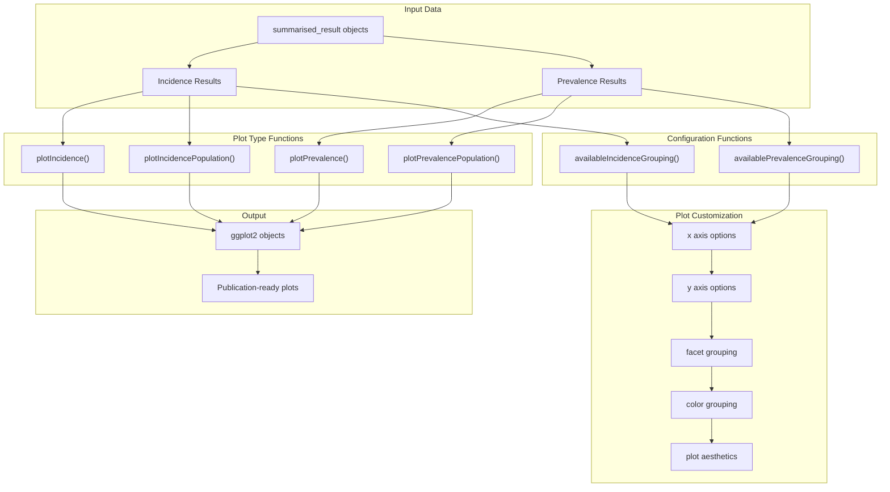
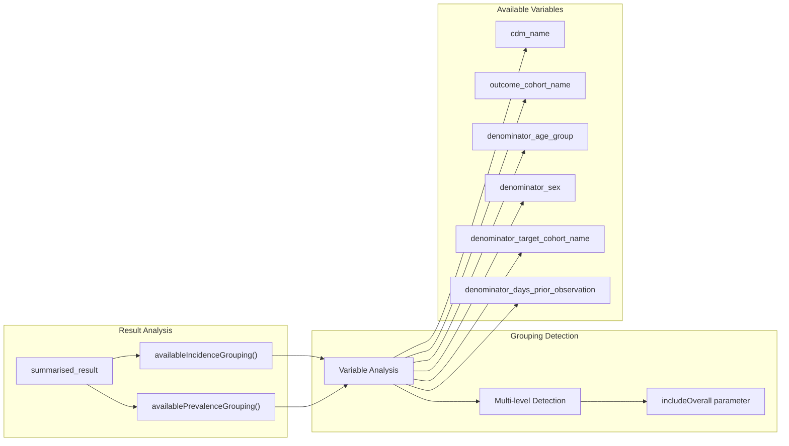
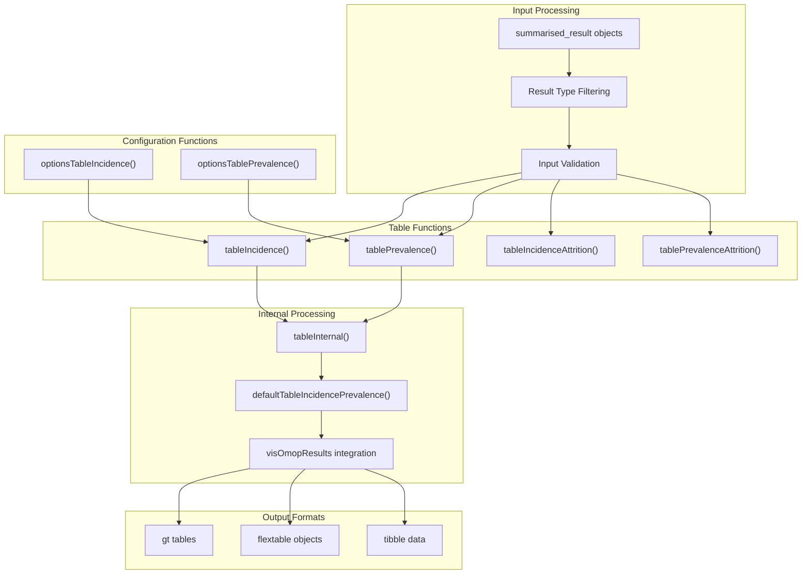
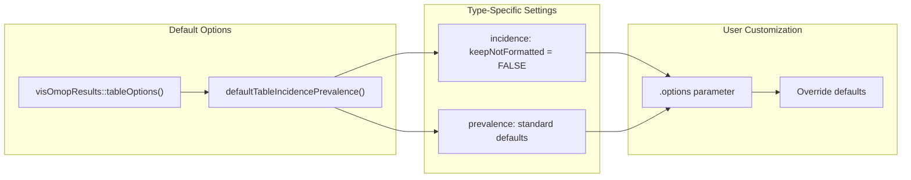

# Page: Visualization and Table Functions

# Visualization and Table Functions

Relevant source files

The following files were used as context for generating this wiki page:

- [.gitignore](.gitignore)
- [R/dateUtilities.R](R/dateUtilities.R)
- [R/tables.R](R/tables.R)
- [_pkgdown.yml](_pkgdown.yml)
- [tests/testthat/test-plotting.R](tests/testthat/test-plotting.R)

This document provides comprehensive API reference documentation for the visualization and table generation functions in the IncidencePrevalence package. These functions transform analysis results from `estimateIncidence()` and `estimatePrevalence()` into formatted plots and tables for reporting and publication.

For information about the main analysis functions that generate the data these functions visualize, see [Main Analysis Functions](#9.1). For guidance on creating and interpreting visualizations in practical workflows, see [Plotting Results](#7.1) and [Creating Tables](#7.2).

## Plotting System Overview

The plotting system provides a comprehensive set of functions for visualizing incidence and prevalence results. The system is built on `ggplot2` and integrates with the `omopgenerics` result format to provide standardized, publication-ready visualizations.

Sources: [tests/testthat/test-plotting.R:1-400](), [_pkgdown.yml:19-21]()

## Primary Plotting Functions

### plotIncidence()

The `plotIncidence()` function creates line plots of incidence rates over time with confidence intervals. It automatically detects appropriate x-axis variables and formats the plot for publication.

**Key Features:**
- Automatic date formatting for temporal x-axes
- Confidence interval ribbons and error bars
- Faceting by demographic or clinical variables
- Color grouping for stratified analyses
- Customizable plot aesthetics

**Supported Variables:**
- **x-axis**: `incidence_start_date`, `incidence_end_date`, `denominator_age_group`, or any grouping variable
- **y-axis**: `incidence_100000_pys`, `denominator_count`, `outcome_count`, `person_days`, `person_years`
- **facet**: Any available grouping variable
- **color**: Any available grouping variable

Sources: [tests/testthat/test-plotting.R:18-82](), [tests/testthat/test-plotting.R:269-296]()

### plotPrevalence()

The `plotPrevalence()` function creates line plots of prevalence estimates over time with confidence intervals. It supports both point and period prevalence visualizations.

**Key Features:**
- Support for point and period prevalence
- Flexible plot types (line, point, ribbon)
- Date-based x-axis formatting
- Multi-variable faceting and coloring
- Automatic confidence interval display

**Plot Type Options:**
- `line = TRUE/FALSE`: Enable/disable line connections
- `point = TRUE/FALSE`: Enable/disable point markers  
- `ribbon = TRUE/FALSE`: Enable/disable confidence interval ribbons

Sources: [tests/testthat/test-plotting.R:84-131](), [tests/testthat/test-plotting.R:343-361]()

### plotIncidencePopulation() and plotPrevalencePopulation()

These functions create population-focused plots showing denominator counts, outcome counts, or person-time contributions rather than rates or proportions.

**Common Use Cases:**
- Visualizing population size over time
- Showing outcome event counts
- Displaying person-time contributions
- Quality assurance of denominator cohorts

Sources: [tests/testthat/test-plotting.R:33-48](), [tests/testthat/test-plotting.R:96-100]()

## Grouping and Configuration Functions

### availableIncidenceGrouping() and availablePrevalenceGrouping()

These utility functions identify which variables in the results can be used for grouping, faceting, or coloring in plots.

**Function Behavior:**
- Returns only variables with multiple unique values by default
- `includeOverall = TRUE` returns all possible grouping variables
- Automatically detects stratification variables from analysis settings

Sources: [tests/testthat/test-plotting.R:50-61](), [tests/testthat/test-plotting.R:102-113]()

## Table Generation System

The table generation system creates formatted tables for incidence and prevalence results using the `visOmopResults` package. It supports multiple output formats and extensive customization options.

Sources: [R/tables.R:1-426](), [_pkgdown.yml:22-24]()

## Core Table Functions

### tableIncidence()

Creates formatted tables for incidence analysis results with customizable headers, grouping, and formatting options.

**Default Estimate Formatting:**
- `"Denominator (N)" = "<denominator_count>"`
- `"Person-years" = "<person_years>"`
- `"Outcome (N)" = "<outcome_count>"`
- `"Incidence 100,000 person-years [95% CI]" = "<incidence_100000_pys> (<incidence_100000_pys_95CI_lower> - <incidence_100000_pys_95CI_upper>)"`

**Parameters:**
- `type`: Output format ("gt", "flextable", "tibble")
- `header`: Variables for table headers
- `groupColumn`: Variables for row grouping
- `settingsColumn`: Analysis settings to display
- `hide`: Variables to exclude from display
- `style`: Visual styling options

Sources: [R/tables.R:87-153]()

### tablePrevalence()

Creates formatted tables for prevalence analysis results with similar customization options to `tableIncidence()`.

**Default Estimate Formatting:**
- `"Denominator (N)" = "<denominator_count>"`
- `"Outcome (N)" = "<outcome_count>"`
- `"Prevalence [95% CI]" = "<prevalence> (<prevalence_95CI_lower> - <prevalence_95CI_upper>)"`

Sources: [R/tables.R:17-84]()

### Attrition Tables

The `tableIncidenceAttrition()` and `tablePrevalenceAttrition()` functions create tables showing population filtering steps and attrition throughout the analysis process.

**Key Features:**
- Population counts at each filtering step
- Reason descriptions for exclusions
- Integration with cohort attrition tracking
- Standardized formatting across analysis types

Sources: [R/tables.R:262-335](), [R/tables.R:337-412]()

## Table Configuration and Options

### optionsTableIncidence() and optionsTablePrevalence()

These functions provide default configuration options that can be customized through the `.options` parameter in table functions.

**Common Options:**
- `keepNotFormatted`: Whether to preserve raw numeric values
- Table styling and formatting preferences
- Column visibility and ordering
- Header customization options

Sources: [R/tables.R:208-260]()

## Integration with visOmopResults

The table generation system leverages `visOmopResults` for standardized OMOP result formatting and display. This integration ensures consistency across OMOP ecosystem tools.

**Key Integration Points:**
- `visOmopResults::visOmopTable()` for core table generation
- `visOmopResults::tableType()` for supported output formats
- `visOmopResults::tableOptions()` for configuration defaults
- Standardized estimate name formatting and display

**Error Handling:**
- Automatic detection of empty results
- Graceful handling of missing result types
- Version compatibility checking for dependencies

Sources: [R/tables.R:155-206](), [R/tables.R:415-425]()

## Common Usage Patterns

Both plotting and table functions follow consistent patterns for working with IncidencePrevalence results:

1. **Result Type Detection**: Automatic filtering for incidence vs prevalence results
2. **Flexible Grouping**: Support for multiple demographic and clinical stratifications  
3. **Confidence Intervals**: Automatic inclusion of statistical uncertainty measures
4. **Publication Ready**: Professional formatting suitable for reports and manuscripts
5. **Customizable Output**: Extensive options for appearance and content customization

The functions integrate seamlessly with the broader OMOP ecosystem while providing specialized functionality for epidemiological analysis visualization and reporting.

Sources: [tests/testthat/test-plotting.R:1-400](), [R/tables.R:1-426]()