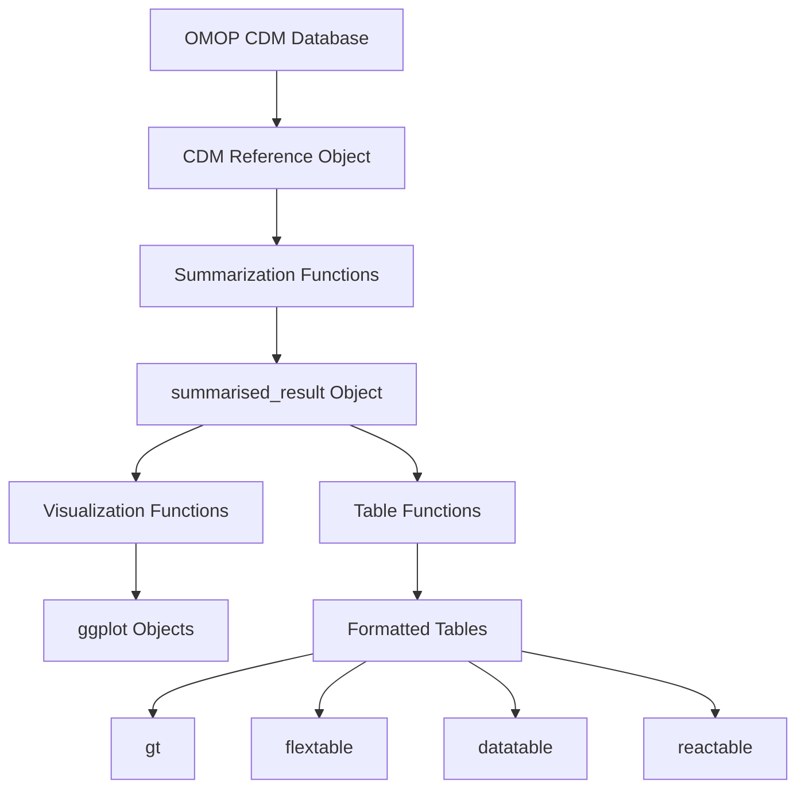
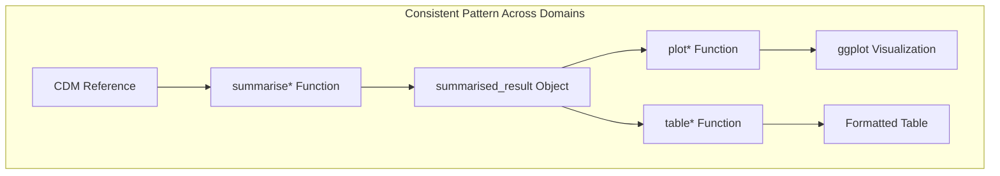
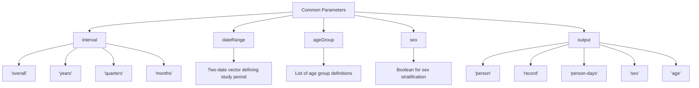
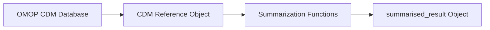
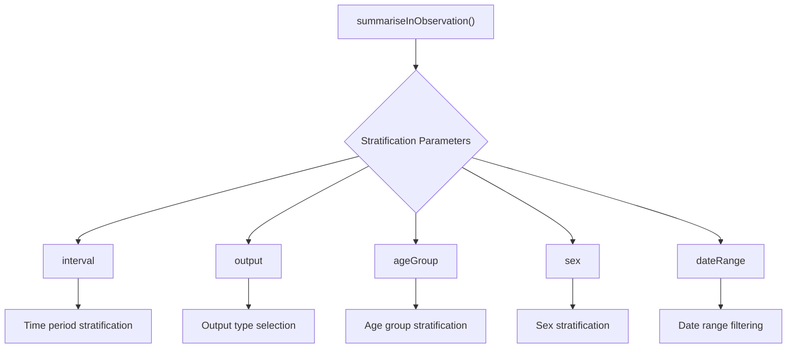
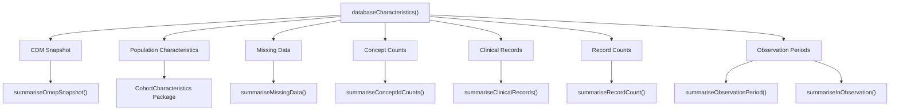
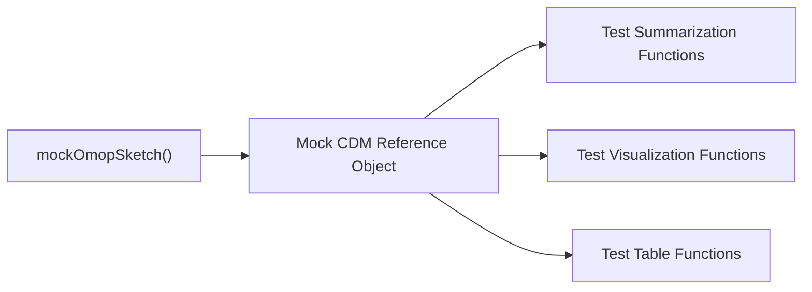

# Page: Architecture and Design

# Architecture and Design

Relevant source files

The following files were used as context for generating this wiki page:

- [DESCRIPTION](DESCRIPTION)
- [NAMESPACE](NAMESPACE)
- [NEWS.md](NEWS.md)
- [R/documentationHelper.R](R/documentationHelper.R)
- [_pkgdown.yml](_pkgdown.yml)
- [man/interval.Rd](man/interval.Rd)
- [man/summariseInObservation.Rd](man/summariseInObservation.Rd)

## Purpose and Scope

This document describes the architectural structure, design principles, and patterns of the OmopSketch package. OmopSketch provides a framework for characterizing and summarizing OMOP (Observational Medical Outcomes Partnership) Common Data Model (CDM) databases. For specific information about individual functions, see [Core Summarization Functions](#3) and related pages.

## System Architecture Overview

OmopSketch follows a consistent architectural pattern that transforms OMOP CDM database data into standardized summaries, visualizations, and tables.

### High-Level Architecture Diagram

Sources: [NAMESPACE:3-29](), [DESCRIPTION:64-78]()

## Core Components

The OmopSketch package organizes its functionality into several core components:

```mermaid
graph TD
    A["OmopSketch"] --> B["Summarization Functions"]
    A --> C["Visualization Functions"]
    A --> D["Table Generation Functions"]
    A --> E["Database Characterization"]
    A --> F["Mock Data Generation"]
    
    B --> B1["summariseOmopSnapshot()"]
    B --> B2["summariseClinicalRecords()"]
    B --> B3["summariseRecordCount()"]
    B --> B4["summariseObservationPeriod()"]
    B --> B5["summariseInObservation()"]
    B --> B6["summariseConceptCounts()"]
    B --> B7["summariseMissingData()"]
    
    C --> C1["plotRecordCount()"]
    C --> C2["plotObservationPeriod()"]
    C --> C3["plotInObservation()"]
    C --> C4["plotConceptSetCounts()"]
    
    D --> D1["tableOmopSnapshot()"]
    D --> D2["tableClinicalRecords()"]
    D --> D3["tableRecordCount()"]
    D --> D4["tableObservationPeriod()"]
    D --> D5["tableInObservation()"]
    D --> D6["tableConceptIdCounts()"]
    D --> D7["tableMissingData()"]
    
    E --> E1["databaseCharacteristics()"]
    
    F --> F1["mockOmopSketch()"]
```

Sources: [NAMESPACE:3-29](), [_pkgdown.yml:13-52]()

## Design Patterns and Principles

### Consistent Function Naming Pattern

OmopSketch implements a systematic naming convention:

| Prefix | Purpose | Examples |
|--------|---------|----------|
| `summarise` | Data extraction and processing | `summariseClinicalRecords()`, `summariseObservationPeriod()` |
| `plot` | Visualization creation | `plotRecordCount()`, `plotInObservation()` |
| `table` | Table formatting | `tableClinicalRecords()`, `tableConceptIdCounts()` |

Each function name follows the pattern: `<action><Domain>`, where domain refers to the specific OMOP CDM data area.

Sources: [NAMESPACE:3-29]()

### Standard Data Flow Pattern

For each data domain, OmopSketch implements a consistent processing pattern:

This consistent pattern enables users to quickly understand how to work with different OMOP CDM data domains.

Sources: [NAMESPACE:3-29](), [_pkgdown.yml:13-52]()

### Common Parameter System

OmopSketch functions share standardized parameters across many functions:

Sources: [man/interval.Rd:7-8](), [man/summariseInObservation.Rd:17-36](), [R/documentationHelper.R:3-22]()

## Data Flow Implementation

### Summarization Layer

The summarization functions form the core of OmopSketch's functionality. These functions extract data from OMOP CDM tables, process it according to specified parameters, and return standardized results.

The `summarised_result` object is a standardized structure from the `omopgenerics` package that serves as the common interface between summarization and presentation layers.

Sources: [NAMESPACE:30-36](), [DESCRIPTION:72]()

### Stratification System

OmopSketch provides flexible data stratification options:

This parameterization system is consistently implemented across summarization functions, allowing for flexible data exploration.

Sources: [man/summariseInObservation.Rd:8-15]()

## Integration: Database Characterization

The `databaseCharacteristics()` function brings together multiple summarization functions to provide a comprehensive database overview:

Sources: [NAMESPACE:4](), [NEWS.md:3-6](), [_pkgdown.yml:49-52]()

## Package Dependencies

OmopSketch relies on several key packages to provide its functionality:

| Dependency Type | Packages |
| --------------- | -------- |
| Core Data Handling | CDMConnector, omopgenerics, PatientProfiles, dplyr, tidyr |
| Visualization | ggplot2, visOmopResults |
| Table Generation | gt, flextable, reactable, DT |
| Database Connectivity | DBI, duckdb, odbc, RPostgres |
| Testing | omock, testthat |

Sources: [DESCRIPTION:39-78]()

## Testing Infrastructure

OmopSketch includes the `mockOmopSketch()` function for generating synthetic OMOP CDM data for testing and demonstration purposes:

Sources: [NAMESPACE:7](), [_pkgdown.yml:45-48](), [man/summariseInObservation.Rd:48]()

## Version Control and Enhancement

OmopSketch employs an iterative development approach, with version numbers following semantic versioning principles. The package is regularly updated with new features and bug fixes, as shown in the NEWS.md file.

Recent enhancements include:
- Addition of databaseCharacteristics() function
- Expanded output options in summariseInObservation()
- Table generation improvements for various data domains

Sources: [NEWS.md:1-32](), [DESCRIPTION:3]()