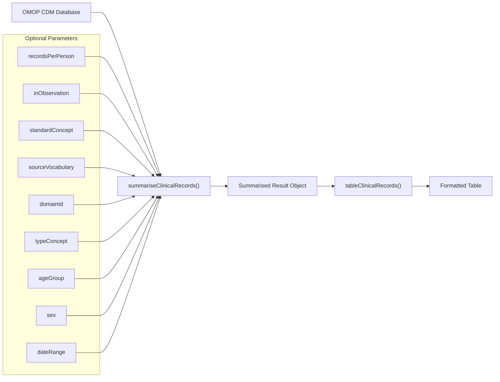
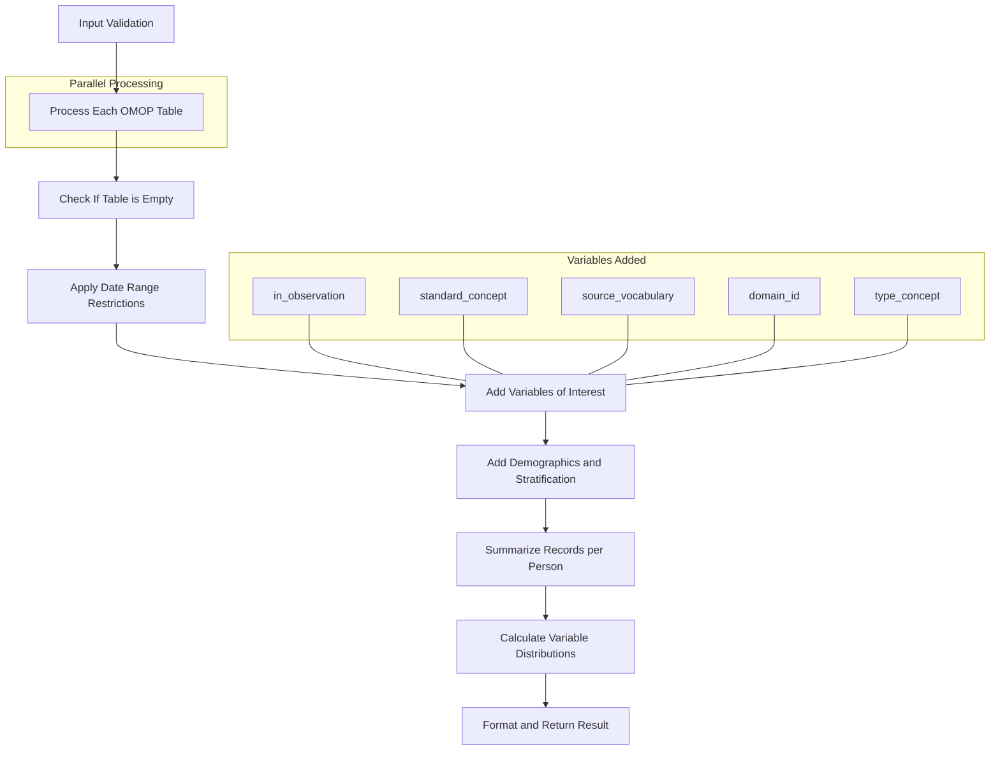
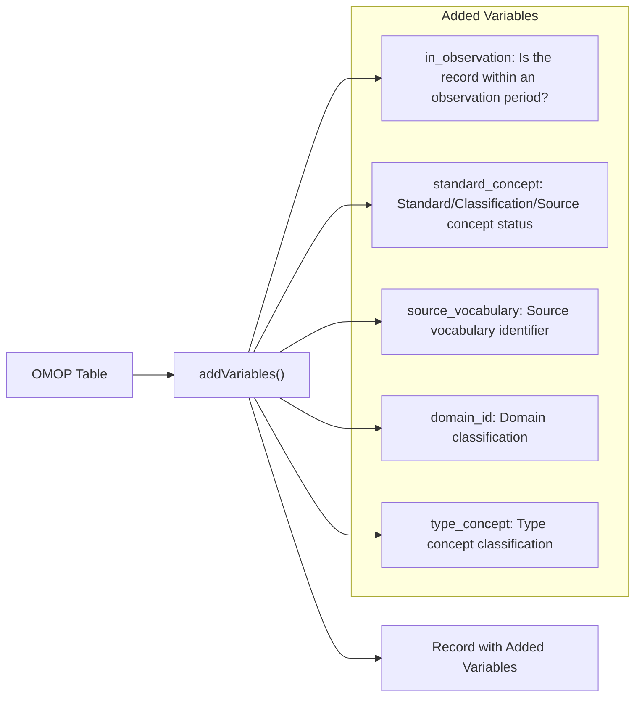
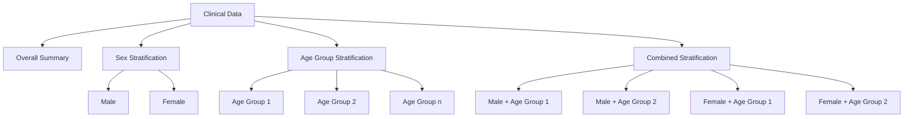

# Page: Clinical Records Summarization

# Clinical Records Summarization

<details>
<summary>Relevant source files</summary>

The following files were used as context for generating this wiki page:

- [R/summariseClinicalRecords.R](R/summariseClinicalRecords.R)
- [R/summariseRecordCount.R](R/summariseRecordCount.R)
- [tests/testthat/setup.R](tests/testthat/setup.R)
- [tests/testthat/test-summariseClinicalRecords.R](tests/testthat/test-summariseClinicalRecords.R)

</details>


## Purpose and Scope

This page documents the clinical records summarization functionality in OmopSketch. This function extracts and aggregates information from clinical data tables in an OMOP Common Data Model (CDM), allowing users to analyze the distribution and characteristics of clinical records. The summarization process provides information about record counts, patient counts, observation status, and concept classification.

For information about summarizing record counts over time periods, see [Record Count Summarization](#3.6). For details on visualizing clinical record data, see [Clinical Records Tables](#5.1).

## Overview

The clinical records summarization functionality characterizes OMOP tables by providing metrics such as:

- Number of subjects and records
- Records per person statistics (mean, median, etc.)
- Percentage of records within observation periods
- Distribution of standard concepts
- Source vocabulary distribution
- Domain classification 
- Type concept distribution

These metrics can be stratified by age group and sex to facilitate demographic analysis.



Sources: [R/summariseClinicalRecords.R:1-26]()

## Core Function: summariseClinicalRecords

The `summariseClinicalRecords` function is the primary component of the clinical records summarization system. It processes one or more OMOP tables to generate various metrics about clinical records.

### Function Signature

```
summariseClinicalRecords(
  cdm,
  omopTableName,
  recordsPerPerson = c("mean", "sd", "median", "q25", "q75", "min", "max"),
  inObservation = TRUE,
  standardConcept = TRUE,
  sourceVocabulary = TRUE,
  domainId = TRUE,
  typeConcept = TRUE,
  sex = FALSE,
  ageGroup = NULL,
  dateRange = NULL
)
```

Sources: [R/summariseClinicalRecords.R:46-56]()

### Parameters

| Parameter | Description | Default Value |
|-----------|-------------|---------------|
| `cdm` | A CDM reference object | Required |
| `omopTableName` | Character vector of OMOP table names | Required |
| `recordsPerPerson` | Statistics for records per person | `c("mean", "sd", "median", "q25", "q75", "min", "max")` |
| `inObservation` | Include % of records in observation periods | `TRUE` |
| `standardConcept` | Summarize standard concept information | `TRUE` |
| `sourceVocabulary` | Summarize source vocabulary information | `TRUE` |
| `domainId` | Summarize domain ID information | `TRUE` |
| `typeConcept` | Summarize type concept information | `TRUE` |
| `sex` | Stratify by sex | `FALSE` |
| `ageGroup` | List of age groups to stratify results | `NULL` |
| `dateRange` | Date range to filter records | `NULL` |

Sources: [R/summariseClinicalRecords.R:6-25]()

### Return Value

The function returns a `summarised_result` object containing the following information:

- Number of subjects
- Number of records
- Records per person statistics
- In-observation status distribution
- Standard concept distribution
- Source vocabulary distribution
- Domain distribution
- Type concept distribution

Each metric can be stratified by sex and age group if specified.

Sources: [R/summariseClinicalRecords.R:26]()

## Internal Workflow

The clinical records summarization process follows a defined workflow:



Sources: [R/summariseClinicalRecords.R:57-279]()

### Data Extraction and Processing

1. **Validation**: The function first validates input parameters and checks that requested tables exist
2. **Study Period Restriction**: If a date range is provided, records outside that range are excluded
3. **Variable Addition**: Variables like observation status and concept type are added to the data
4. **Demographics**: Age groups and sex are calculated if stratification is requested
5. **Summarization**: Records per person are calculated and variable distributions are determined

Sources: [R/summariseClinicalRecords.R:57-142](), [R/summariseClinicalRecords.R:143-166]()

### Variable Addition Flow

The clinical records summarization adds several key variables to the raw data:



Sources: [R/summariseClinicalRecords.R:391-479]()

## Summarization Components

The clinical records summarization consists of several key components that work together to generate comprehensive metrics:

### Records Per Person

The `summariseRecordsPerPerson` function calculates statistics about how many records each person has. It generates:

- Count of records
- Count of subjects
- Statistical measures (mean, median, etc.) of records per person

This function can stratify by demographics and preserves the strata structure for the final result.

Sources: [R/summariseClinicalRecords.R:281-340]()

### Concept Classification

When enabled, the summarization process calculates distributions of:

1. **Standard Concepts**: Categorizes concepts as Standard, Classification, or Source
2. **Source Vocabularies**: Identifies the source vocabularies used
3. **Domains**: Shows the distribution of domain classifications
4. **Type Concepts**: Summarizes the type concept IDs and their meanings

For each distribution, both counts and percentages are calculated.

Sources: [R/summariseClinicalRecords.R:166-242]()

### Observation Status

The summarization can determine which records fall within defined observation periods. This is a crucial metric for understanding data quality and coverage.

Sources: [R/summariseClinicalRecords.R:412-435]()

## Demographic Stratification

The summarization process can stratify results by:

1. **Sex**: Male and Female categories
2. **Age Groups**: User-defined age ranges

The stratification is applied to all metrics, allowing for demographic analysis of clinical data characteristics.



Sources: [R/summariseClinicalRecords.R:348-390]()

## Usage Examples

Below is a basic example of how to use the clinical records summarization function:

```r
# Create a CDM reference
cdm <- mockOmopSketch()

# Summarize clinical records for condition_occurrence
summarizedResult <- summariseClinicalRecords(
  cdm = cdm,
  omopTableName = "condition_occurrence",
  recordsPerPerson = c("mean", "sd"),
  inObservation = TRUE,
  standardConcept = TRUE,
  sourceVocabulary = TRUE,
  domainId = TRUE,
  typeConcept = TRUE
)

# View the result
summarizedResult

# Create a formatted table
tableClinicalRecords(summarizedResult)
```

A more complex example with demographic stratification:

```r
# Summarize with age and sex stratification
summarizedResult <- summariseClinicalRecords(
  cdm = cdm,
  omopTableName = "drug_exposure",
  sex = TRUE,
  ageGroup = list(
    "0-17" = c(0, 17),
    "18-65" = c(18, 65),
    "66+" = c(66, Inf)
  ),
  dateRange = as.Date(c("2012-01-01", "2018-01-01"))
)
```

Sources: [R/summariseClinicalRecords.R:27-45](), [tests/testthat/test-summariseClinicalRecords.R:1-46](), [tests/testthat/test-summariseClinicalRecords.R:88-196]()

## Related Functions

### tableClinicalRecords

The `tableClinicalRecords` function takes a summarized result object from `summariseClinicalRecords` and formats it into a readable table using the gt package. This makes the results easier to interpret and present.

```r
# Create a formatted table
tableResult <- tableClinicalRecords(summarizedResult)
```

Sources: [tests/testthat/test-summariseClinicalRecords.R:287-305]()

### summariseRecordCount

The `summariseRecordCount` function offers a complementary approach for analyzing clinical records, with a focus on time-based analysis. For more information, see [Record Count Summarization](#3.6).

Sources: [R/summariseRecordCount.R:1-33]()

## Technical Implementation

The clinical records summarization process uses a modular approach with several internal helper functions:

- `addVariables`: Adds analysis variables to the raw data
- `variablesToSummarise`: Determines which variables to include based on parameters
- `denominator`: Creates a denominator population for percentage calculations
- `summariseRecordsPerPerson`: Calculates statistics about records per person
- `restrictStudyPeriod`: Filters data based on date range parameters

These components work together to generate comprehensive clinical data summaries while maintaining performance with SQL-based computation.

Sources: [R/summariseClinicalRecords.R:341-347](), [R/summariseClinicalRecords.R:391-479](), [R/summariseClinicalRecords.R:348-390]()