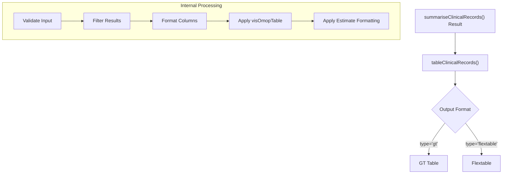
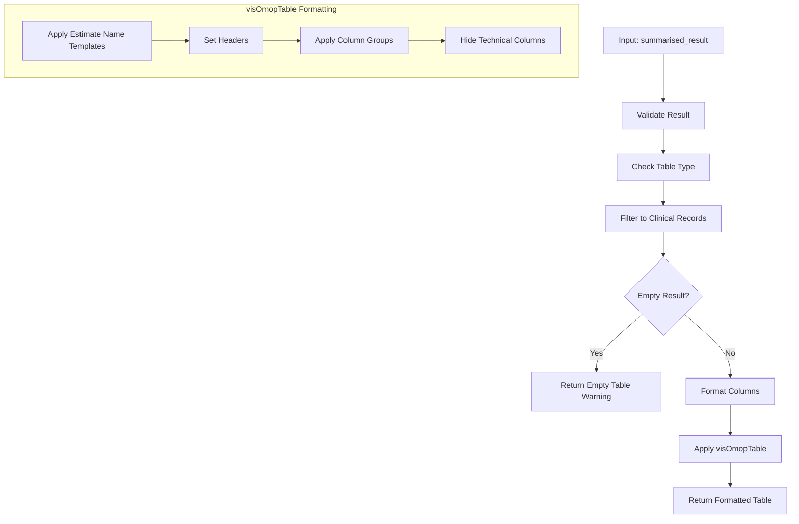
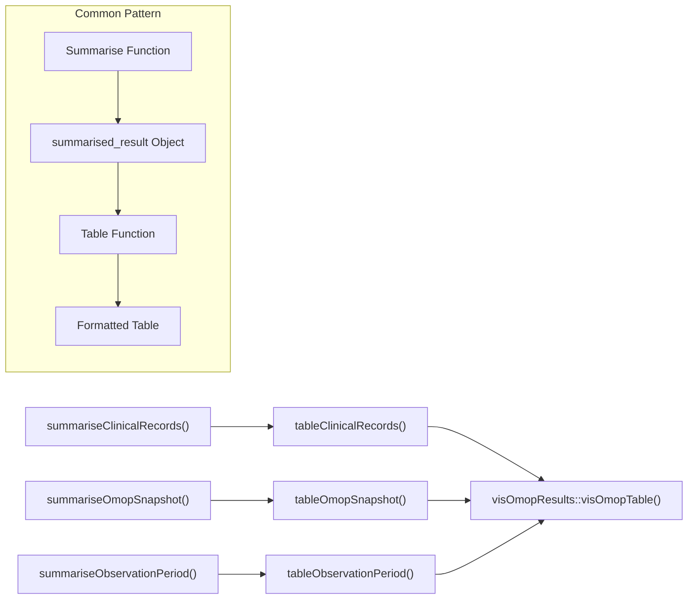

# Page: Clinical Records Tables

# Clinical Records Tables

<details>
<summary>Relevant source files</summary>

The following files were used as context for generating this wiki page:

- [R/tableClinicalRecords.R](R/tableClinicalRecords.R)
- [R/tableObservationPeriod.R](R/tableObservationPeriod.R)
- [R/tableOmopSnapshot.R](R/tableOmopSnapshot.R)
- [man/tableClinicalRecords.Rd](man/tableClinicalRecords.Rd)
- [man/tableObservationPeriod.Rd](man/tableObservationPeriod.Rd)
- [man/tableOmopSnapshot.Rd](man/tableOmopSnapshot.Rd)

</details>


## Purpose and Scope

This document describes the functionality for generating formatted tables from clinical records summaries in the OmopSketch package. The `tableClinicalRecords` function transforms summarized clinical data into readable, formatted tables for reporting and analysis. For information about generating tables for observation periods, see [Observation Period Tables](#5.2). For the underlying data summarization that feeds into these tables, see [Clinical Records Summarization](#3.1).

## Function Overview

The Clinical Records Tables system converts structured summarized clinical data from OMOP CDM tables into formatted display tables using either the `gt` or `flextable` packages. This enables researchers to quickly convert analytical results into publication-ready or report-friendly formats.



Sources: [R/tableClinicalRecords.R:1-63]()

## Function Signature and Parameters

The `tableClinicalRecords` function has a simple interface but performs complex formatting operations:

```
tableClinicalRecords(result, type = "gt")
```

**Parameters:**
- `result`: A summarized_result object from `summariseClinicalRecords()`
- `type`: Output format type, either "gt" or "flextable" (default: "gt")

**Returns:**
- A formatted table object of the specified type containing the clinical records data

Sources: [R/tableClinicalRecords.R:28-30](), [man/tableClinicalRecords.Rd:7-12]()

## Implementation Details

The function follows a consistent pattern shared across the OmopSketch table generation functions:

1. Validate the input result object
2. Check that the requested table type is valid
3. Filter to the specific result type ("summarise_clinical_records")
4. Check if the result has data
5. Format variable names and levels for better readability
6. Apply the `visOmopTable` function to create the formatted output



Sources: [R/tableClinicalRecords.R:28-63]()

## Data Formatting

The function applies specific formatting rules to make clinical records data more readable:

| Element | Transformation |
|---------|----------------|
| Variable names | Convert from snake_case to Title Case with spaces |
| Variable levels | Convert from snake_case to Title Case with spaces |
| Count values | Format as "N (%)" showing count and percentage |
| Mean values | Format as "Mean (SD)" showing mean and standard deviation |

The function arranges records by variable name and level, and groups data by OMOP table and any stratification columns.

Sources: [R/tableClinicalRecords.R:49-62]()

## Usage Example

```r
# Create mock CDM database
cdm <- mockOmopSketch()

# Generate clinical records summary
summarisedResult <- summariseClinicalRecords(
  cdm = cdm,
  omopTableName = c("condition_occurrence", "drug_exposure"),
  recordsPerPerson = c("mean", "sd"),
  inObservation = TRUE,
  standardConcept = TRUE,
  sourceVocabulary = TRUE,
  domainId = TRUE,
  typeConcept = TRUE
)

# Apply suppression for privacy (optional)
summarisedResult <- suppress(summarisedResult, minCellCount = 5)

# Generate formatted table
tableClinicalRecords(summarisedResult)
```

Sources: [man/tableClinicalRecords.Rd:20-40]()

## Error Handling

If the result object doesn't contain any clinical records data, the function provides a warning and returns an empty table:

```r
# If result has no "summarise_clinical_records" data
warnEmpty("summarise_clinical_records")  # Warns: "`result` does not contain any `summarise_clinical_records` data."
return(emptyTable(type))                 # Returns an empty table of the requested type
```

Sources: [R/tableClinicalRecords.R:41-45](), [R/tableOmopSnapshot.R:58-60]()

## Integration with Other Table Functions

The Clinical Records Tables function is part of a broader system of table generation utilities in OmopSketch:



All table functions in OmopSketch follow a similar pattern and leverage the `visOmopTable` function from the `visOmopResults` package for consistent formatting.

Sources: [R/tableClinicalRecords.R:1-63](), [R/tableOmopSnapshot.R:1-89](), [R/tableObservationPeriod.R:1-63]()

## Technical Dependencies

The function has the following dependencies:

1. `rlang` - For checking installed packages
2. `omopgenerics` - For validation and data manipulation
3. `visOmopResults` - For table formatting
4. `dplyr` - For data manipulation
5. Either `gt` or `flextable` depending on the output type selected

Sources: [R/tableClinicalRecords.R:31-33]()

## Common Patterns Across Table Functions

The `tableClinicalRecords` function follows a standard pattern used across OmopSketch table functions:

| Function | Purpose | Source Files |
|----------|---------|--------------|
| `tableClinicalRecords` | Format clinical records summaries | tableClinicalRecords.R |
| `tableOmopSnapshot` | Format database snapshot summaries | tableOmopSnapshot.R |
| `tableObservationPeriod` | Format observation period summaries | tableObservationPeriod.R |

All of these functions:
1. Take a summarized_result object as input
2. Allow formatting as "gt" or "flextable"
3. Use the same validation and filtering process
4. Apply similar column formatting
5. Use visOmopTable for consistent output

Sources: [R/tableClinicalRecords.R:1-63](), [R/tableOmopSnapshot.R:1-56](), [R/tableObservationPeriod.R:1-62]()