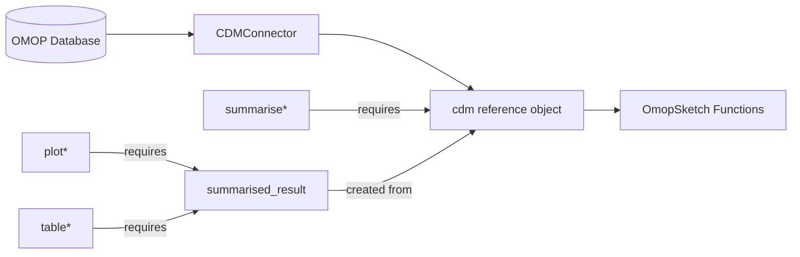
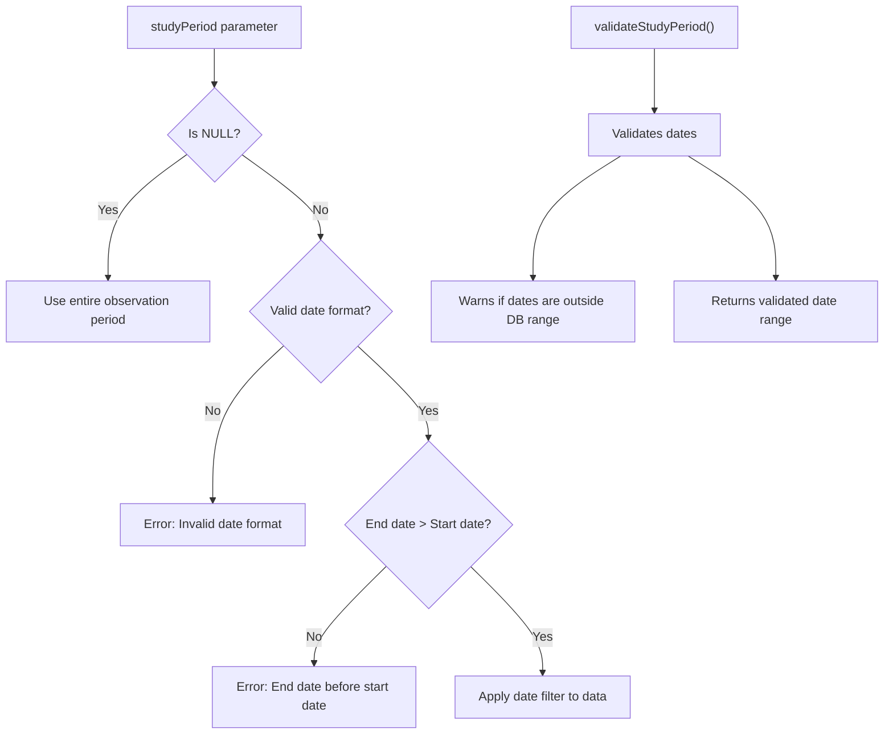
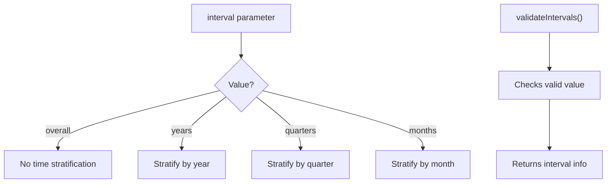
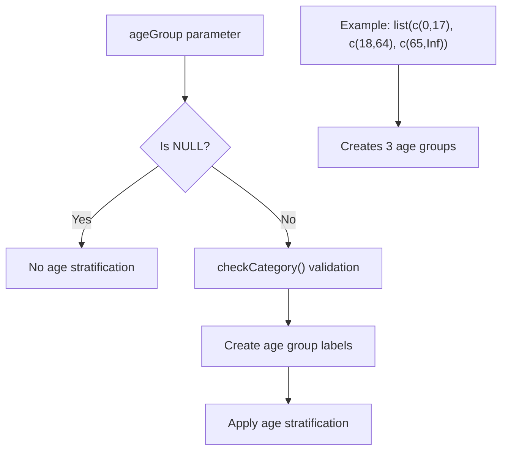
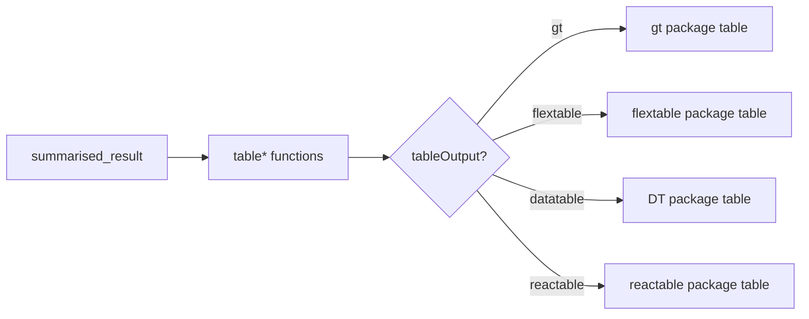
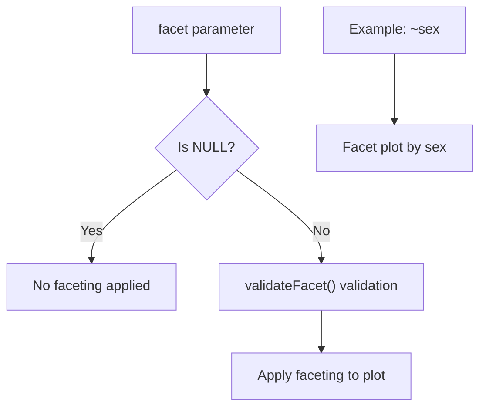
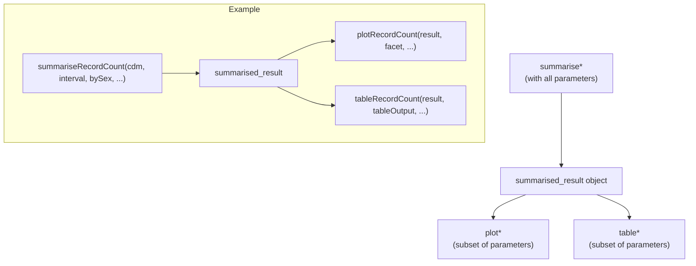
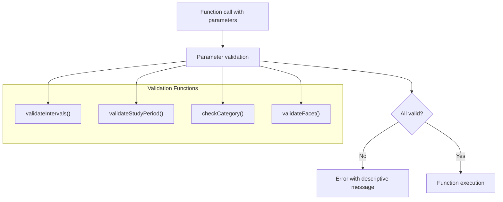

# Page: Common Parameters

# Common Parameters

<details>
<summary>Relevant source files</summary>

The following files were used as context for generating this wiki page:

- [DESCRIPTION](DESCRIPTION)
- [NAMESPACE](NAMESPACE)
- [NEWS.md](NEWS.md)
- [R/checks.R](R/checks.R)
- [R/documentationHelper.R](R/documentationHelper.R)
- [man/interval.Rd](man/interval.Rd)

</details>


## Purpose and Scope

This document provides detailed information about parameters commonly used across multiple functions in the OmopSketch package. Understanding these standard parameters is essential as they maintain consistency in behavior and output throughout the package's functions for characterizing OMOP Common Data Model (CDM) databases. For information about specific function types, please refer to [Core Summarization Functions](#3), [Visualization Functions](#4), and [Table Generation Functions](#5).

## Overview of Common Parameter Types

OmopSketch functions share parameters that serve distinct purposes within the data characterization workflow:

```mermaid
graph TD
    A["Common Parameters"] --> B["Filtering Parameters"]
    A --> C["Stratification Parameters"]
    A --> D["Output Control Parameters"]
    A --> E["Connection Parameters"]
    
    B --> B1["studyPeriod/dateRange"]
    B --> B2["conceptId"]
    B --> B3["tableName"]
    
    C --> C1["interval"]
    C --> C2["ageGroup"]
    C --> C3["bySex"]
    
    D --> D1["tableOutput"]
    D --> D2["facet"]
    D --> D3["outputType"]
    
    E --> E1["cdm"]
</mermaid>

Sources: [R/checks.R](), [R/documentationHelper.R]()

## Filtering Parameters

### 1. CDM Connection

```
cdm
```

* **Purpose**: Specifies the connection to an OMOP CDM database instance
* **Type**: CDMConnector CDM reference object
* **Required**: Yes (in all functions)
* **Usage**: This is typically the first parameter in all functions and provides the source database connection



Sources: [NAMESPACE:6-29]()

### 2. Study Period Definition

```
studyPeriod (or dateRange)
```

* **Purpose**: Defines a date range to filter data 
* **Type**: Character vector of two dates in "YYYY-MM-DD" format or NULL
* **Default**: NULL (no filtering)
* **Usage**: Restricts analyses to records that fall within the specified period
* **Validation**: The function checks that:
  - The first date precedes the second date
  - Dates are in a valid format 
  - Dates are reasonable (warns if outside of the CDM's observation period)



Sources: [R/checks.R:102-157](), [R/documentationHelper.R:3-12]()

### 3. Concept Filtering

```
conceptId
```

* **Purpose**: Specifies concept IDs for filtering or aggregation
* **Type**: Vector of integers or NULL
* **Default**: Varies by function
* **Usage**: Used to filter specific concepts or aggregate data around specified concepts

## Stratification Parameters

### 1. Time Interval

```
interval
```

* **Purpose**: Specifies how to stratify data by time periods
* **Type**: Character string, one of: "overall", "years", "quarters", "months"
* **Default**: "overall" (typically)
* **Validation**: Checks that the provided value is one of the allowed options



Sources: [R/checks.R:10-31](), [R/documentationHelper.R:14-21](), [man/interval.Rd]()

### 2. Age Stratification

```
ageGroup
```

* **Purpose**: Defines age groups for stratifying results
* **Type**: List of numeric vectors defining age ranges
* **Default**: Varies by function, typically NULL (no age stratification)
* **Usage**: Each element in the list represents an age range with lower and upper bounds
* **Validation**: Checks that:
  - Each range has a lower bound ≤ upper bound
  - Ranges don't overlap (unless overlap=TRUE is specified)



Sources: [R/checks.R:34-99]()

### 3. Sex Stratification

```
bySex
```

* **Purpose**: Controls whether to stratify results by patient sex
* **Type**: Boolean
* **Default**: FALSE (typically)
* **Usage**: When TRUE, results are stratified by sex categories

## Output Control Parameters

### 1. Table Output Format

```
tableOutput
```

* **Purpose**: Specifies the desired table output format
* **Type**: Character string, one of: "gt", "flextable", "datatable", "reactable"
* **Default**: Varies by function
* **Usage**: Determines which R package formats the output table



Sources: [NEWS.md:27]()

### 2. Visualization Faceting

```
facet
```

* **Purpose**: Controls how visualizations are faceted or grouped
* **Type**: Formula or character vector
* **Default**: NULL (no faceting)
* **Validation**: Checks that specified facet variables exist in the results
* **Usage**: Primarily used in plotting functions to create faceted visualizations



Sources: [R/checks.R:160-171]()

### 3. Output Type

```
outputType
```

* **Purpose**: Specifies the unit of measurement for results
* **Type**: Character string, one of: "person", "record", "person-days"
* **Default**: Varies by function
* **Usage**: Determines whether counts are by person, record, or person-days of observation

## Parameter Inheritance Patterns

Many OmopSketch functions follow a hierarchical pattern where visualization and table functions inherit parameters from their corresponding summarization functions:



Sources: [NAMESPACE:3-29]()

## Parameter Validation System

OmopSketch implements a robust parameter validation system to ensure parameters have valid values:



Sources: [R/checks.R]()

## Parameter Consistency Across Function Types

The following table shows how key parameters are used consistently across different function types:

| Parameter | summarise* Functions | plot* Functions | table* Functions |
|-----------|---------------------|-----------------|------------------|
| cdm | Required input | Not used (uses result) | Not used (uses result) |
| interval | Defines time stratification | Inherited from result | Inherited from result |
| bySex | Controls sex stratification | Inherited from result | Inherited from result |
| ageGroup | Defines age stratification | Inherited from result | Inherited from result |
| studyPeriod | Filters date range | Not used (applied in summarise) | Not used (applied in summarise) |
| tableOutput | Not used | Not used | Determines table format |
| facet | Not used | Controls plot faceting | Not used |

Sources: [NAMESPACE:3-29](), [R/checks.R]()