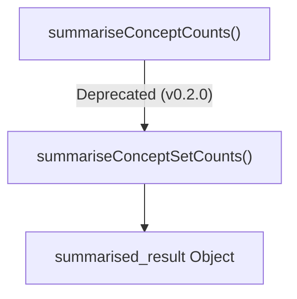
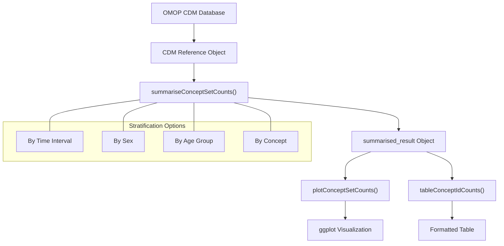
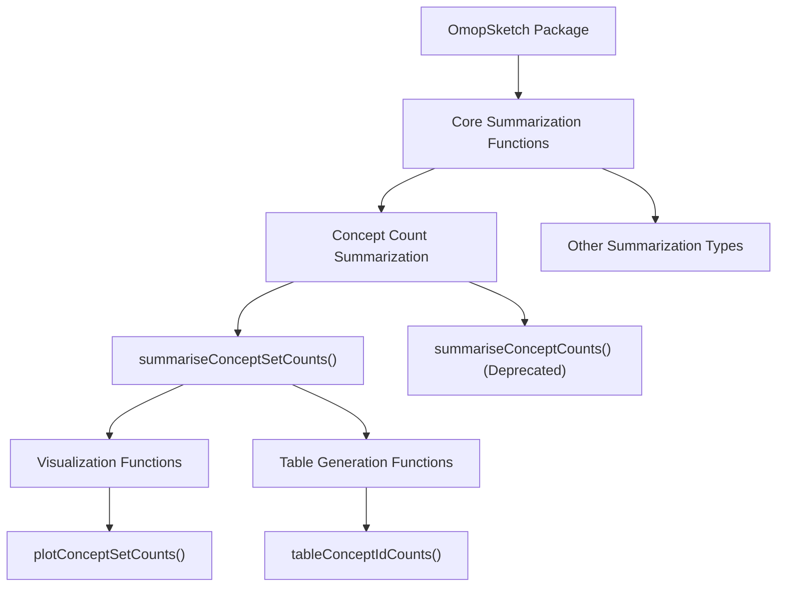

# Page: Concept Count Summarization

# Concept Count Summarization

<details>
<summary>Relevant source files</summary>

The following files were used as context for generating this wiki page:

- [R/summariseConceptCounts.R](R/summariseConceptCounts.R)
- [R/utilities.R](R/utilities.R)
- [man/summariseConceptCounts.Rd](man/summariseConceptCounts.Rd)

</details>


## Purpose and Scope
This document describes the Concept Count Summarization functionality in OmopSketch, which enables researchers to quantify and analyze the frequency of specific medical concepts within OMOP Common Data Model (CDM) databases. This functionality helps researchers understand the prevalence of conditions, treatments, and other healthcare concepts in clinical data.

For related summarization capabilities, see:
- [Clinical Records Summarization](#3.1)
- [Record Count Summarization](#3.6)

## Overview
Concept Count Summarization provides tools to count occurrences of specific medical concepts (identified by concept IDs) within an OMOP CDM database. The system supports multiple counting methods and stratification options to enable detailed analysis of concept prevalence.

Sources: [R/summariseConceptCounts.R:1-9]()

## Function Evolution

### Current Implementation
The primary function for concept count summarization is `summariseConceptSetCounts()`. This function processes concept data based on specified parameters and returns a standardized `summarised_result` object.

### Deprecated Function
The original function `summariseConceptCounts()` is deprecated as of OmopSketch version 0.2.0. It now serves as a wrapper that internally calls `summariseConceptSetCounts()` with the same parameters.



Title: Function Deprecation Flow

Sources: [R/summariseConceptCounts.R:19-43]()

## Parameters and Options

The function accepts the following parameters:

| Parameter | Description |
|-----------|-------------|
| cdm | A CDM object representing the database connection |
| conceptId/conceptSet | List of concept IDs to summarize |
| countBy | Either "record" for record-level counts or "person" for person-level counts |
| concept | Boolean to determine if results are stratified by concept |
| interval | Time interval for stratification ("years", "quarters", "months", "overall") |
| sex | Boolean to determine if results are stratified by sex |
| ageGroup | List of age group vectors for age-based stratification |
| dateRange | Optional date range to filter the study period |

Sources: [R/summariseConceptCounts.R:20-27](), [man/summariseConceptCounts.Rd:7-16](), [man/summariseConceptCounts.Rd:19-38]()

## Data Types

### Input
- **CDM Object**: Connection to an OMOP Common Data Model database
- **Concept IDs**: Numeric identifiers for medical concepts in the OMOP vocabulary

### Output
- **summarised_result Object**: Standardized structure containing the summary statistics, compatible with visualization and table generation functions

Sources: [R/summariseConceptCounts.R:16-17](), [man/summariseConceptCounts.Rd:39-42]()

## System Integration

The Concept Count Summarization functionality integrates with the broader OmopSketch architecture as shown below:



Title: Concept Count Summarization Integration

Sources: [R/summariseConceptCounts.R:20-27](), [man/summariseConceptCounts.Rd:19-38]()

## Functional Architecture

Concept Count Summarization fits into the OmopSketch package architecture as follows:



Title: Concept Count Summarization in OmopSketch Architecture

Sources: [R/summariseConceptCounts.R:19-43]()

## Usage Workflow

The typical workflow for concept count summarization is:

1. Identify concepts of interest by their concept IDs
2. Call the summarization function with appropriate parameters
3. Process the resulting `summarised_result` object
4. Generate visualizations or tables as needed

### Function Migration
Users should migrate from the deprecated `summariseConceptCounts()` to `summariseConceptSetCounts()`:

```
# Old approach (deprecated)
result <- summariseConceptCounts(cdm, conceptId = conceptsOfInterest, ...)

# New approach
result <- summariseConceptSetCounts(cdm, conceptSet = conceptsOfInterest, ...)
```

Sources: [R/summariseConceptCounts.R:27-42]()

## Stratification Options

### Time Intervals
Results can be stratified by these time periods:
- Overall (no time stratification)
- Years
- Quarters
- Months

### Demographic Stratification
- Sex: Male/Female grouping when `sex = TRUE`
- Age Groups: Custom-defined age ranges provided as a list of vectors

### Concept-Based Stratification
When the `concept` parameter is set to TRUE, results are summarized by individual concept ID.

Sources: [R/summariseConceptCounts.R:22-26](), [man/summariseConceptCounts.Rd:23-33]()

## Counting Methods

The `countBy` parameter determines how concepts are counted:

1. **Record-level counting** (`countBy = "record"`): Counts the total number of occurrences of each concept
2. **Person-level counting** (`countBy = "person"`): Counts the number of unique individuals with each concept

This flexibility allows researchers to analyze both the overall prevalence of concepts and their distribution across the patient population.

Sources: [R/summariseConceptCounts.R:22](), [man/summariseConceptCounts.Rd:23-24]()