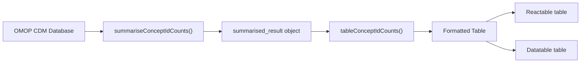
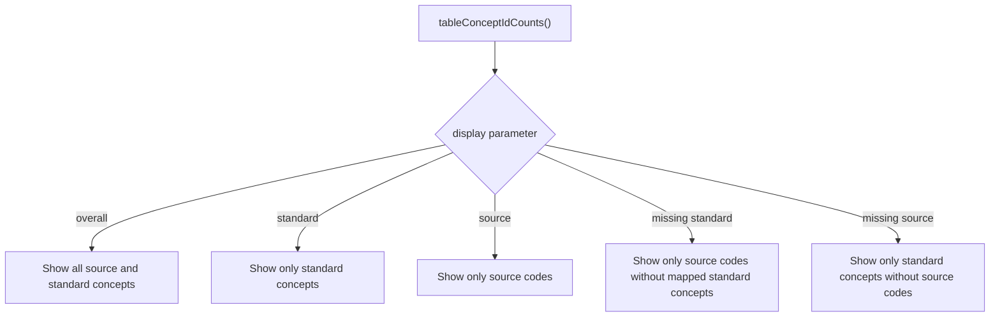
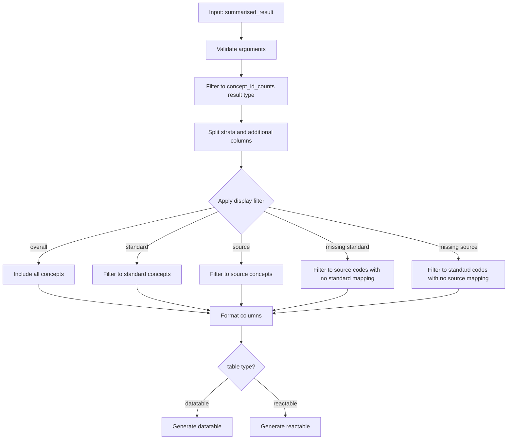
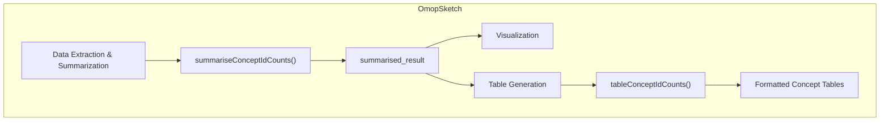

# Page: Concept Count Tables

# Concept Count Tables

<details>
<summary>Relevant source files</summary>

The following files were used as context for generating this wiki page:

- [R/summariseConceptIdCounts.R](R/summariseConceptIdCounts.R)
- [R/tableConceptIdCounts.R](R/tableConceptIdCounts.R)
- [man/summariseConceptIdCounts.Rd](man/summariseConceptIdCounts.Rd)
- [man/summariseMissingData.Rd](man/summariseMissingData.Rd)
- [man/tableConceptIdCounts.Rd](man/tableConceptIdCounts.Rd)
- [man/tableMissingData.Rd](man/tableMissingData.Rd)
- [tests/testthat/test-summariseConceptIdCounts.R](tests/testthat/test-summariseConceptIdCounts.R)

</details>


## Purpose and Scope

This document describes the Concept Count Tables functionality in OmopSketch, which provides tabular representations of concept usage data from OMOP Common Data Model (CDM) databases. Concept Count Tables transform the summarized concept count data into formatted, interactive tables that display standard concepts, source concepts, and their usage counts. 

For information about generating the underlying concept count summaries, see [Concept Count Summarization](#3.4).

Sources: [R/tableConceptIdCounts.R:1-10]()

## Workflow Overview

The Concept Count Tables functionality is part of a two-step process in OmopSketch:

1. First, concepts are summarized using `summariseConceptIdCounts()`
2. Then, the summarized data is formatted into tables using `tableConceptIdCounts()`



Sources: [R/tableConceptIdCounts.R:1-26](), [R/summariseConceptIdCounts.R:1-34]()

## The `tableConceptIdCounts()` Function

The `tableConceptIdCounts()` function transforms a `summarised_result` object from `summariseConceptIdCounts()` into a formatted, interactive table. It offers various display options and output formats.

### Function Signature

```
tableConceptIdCounts(result, display = "overall", type = "reactable")
```

### Parameters

| Parameter | Description | Options |
|-----------|-------------|---------|
| `result` | A `summarised_result` object from `summariseConceptIdCounts()` | |
| `display` | Determines which subset of concept data to display | "overall", "standard", "source", "missing standard", "missing source" |
| `type` | The output table format | "reactable", "datatable" |

Sources: [R/tableConceptIdCounts.R:1-26]()

### Display Options

The `display` parameter controls which concepts are shown in the table:



Sources: [R/tableConceptIdCounts.R:3-7](), [R/tableConceptIdCounts.R:44-66]()

## Data Flow and Processing

The internal processing of the `tableConceptIdCounts()` function follows these steps:



Sources: [R/tableConceptIdCounts.R:27-164]()

## Table Output Formats

The `tableConceptIdCounts()` function supports two output formats:

### 1. Reactable

When `type = "reactable"`, the function generates an interactive JavaScript table with:
- Sortable columns
- Filtering capability
- Resizable columns
- Grouping by database, OMOP table, and any stratification
- Pagination
- Search functionality

### 2. Datatable

When `type = "datatable"`, the function generates a different style of interactive table with similar capabilities but different default styling and behavior.

Sources: [R/tableConceptIdCounts.R:98-162]()

## Column Structure

The resulting tables display the following information:

| Standard Table Columns | Source Table Columns | Description |
|------------------------|----------------------|-------------|
| Database name | Database name | Name of the CDM database |
| OMOP table | OMOP table | The OMOP table from which concepts were counted |
| Standard concept name | Source concept name | Human-readable concept name |
| Standard concept id | Source concept id | Numerical concept identifier |
| N subjects | N subjects | Count of unique subjects with this concept |
| N records | N records | Count of total records with this concept |

Additional columns may be present if stratifications (sex, age group, time interval) were specified in the original `summariseConceptIdCounts()` call.

Sources: [R/tableConceptIdCounts.R:85-96](), [R/tableConceptIdCounts.R:102-162]()

## Integration with OmopSketch Architecture

The Concept Count Tables functionality is part of the broader data visualization and table generation features in OmopSketch.



Sources: [R/tableConceptIdCounts.R:1-164](), [R/summariseConceptIdCounts.R:1-177]()

## Example Usage

Here's a typical usage pattern for creating concept count tables:

```r
# Connect to a CDM database
library(OmopSketch)
library(CDMConnector)
library(duckdb)

# Create a connection to your CDM
cdm <- cdmFromCon(con, cdmSchema = "main", writeSchema = "main")

# Generate concept count summaries
result <- summariseConceptIdCounts(cdm, "condition_occurrence")

# Create a table with all concepts
result |> tableConceptIdCounts()

# Create a table with only standard concepts
result |> tableConceptIdCounts(display = "standard")

# Create a table with only source concepts
result |> tableConceptIdCounts(display = "source")

# Output as a datatable instead of reactable
result |> tableConceptIdCounts(type = "datatable")
```

Sources: [R/tableConceptIdCounts.R:11-23](), [R/summariseConceptIdCounts.R:22-33]()

## Technical Implementation Details

The `tableConceptIdCounts()` function performs several key operations:

1. **Input validation**: Checks that parameters are valid, the required packages are installed, and the input is a valid `summarised_result` object.
2. **Data filtering**: Restricts the result to the `summarise_concept_id_counts` result type.
3. **Display filtering**: Further filters the data based on the `display` parameter.
4. **Column formatting**: Formats the concept identifiers and names for display.
5. **Table transformation**: Depending on the output type, formats the data for either reactable or datatable.
6. **Empty handling**: Returns an empty table with appropriate warnings if no data is available.

The function builds on the `visOmopResults` package for final formatting, depending on the chosen output type.

Sources: [R/tableConceptIdCounts.R:27-164]()