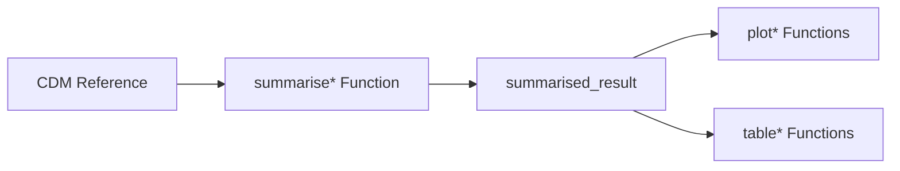
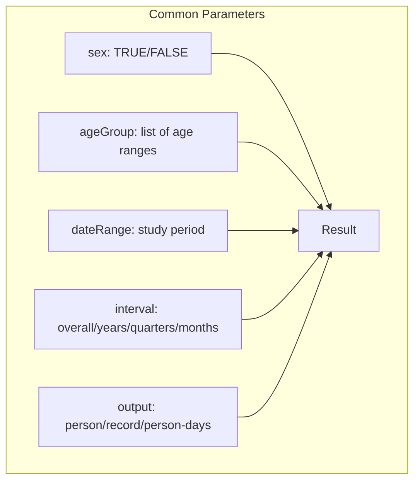
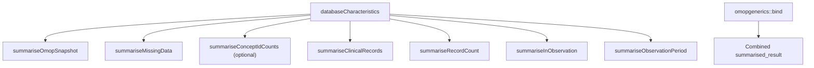
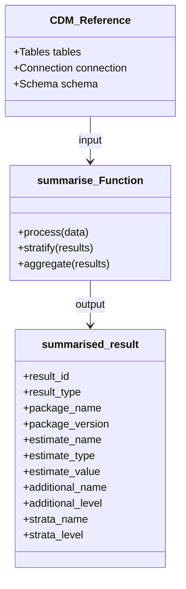
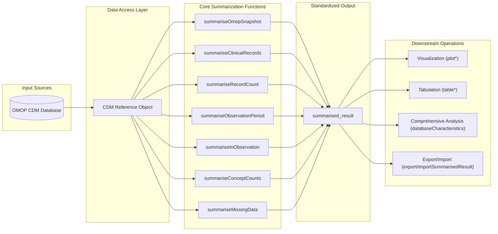
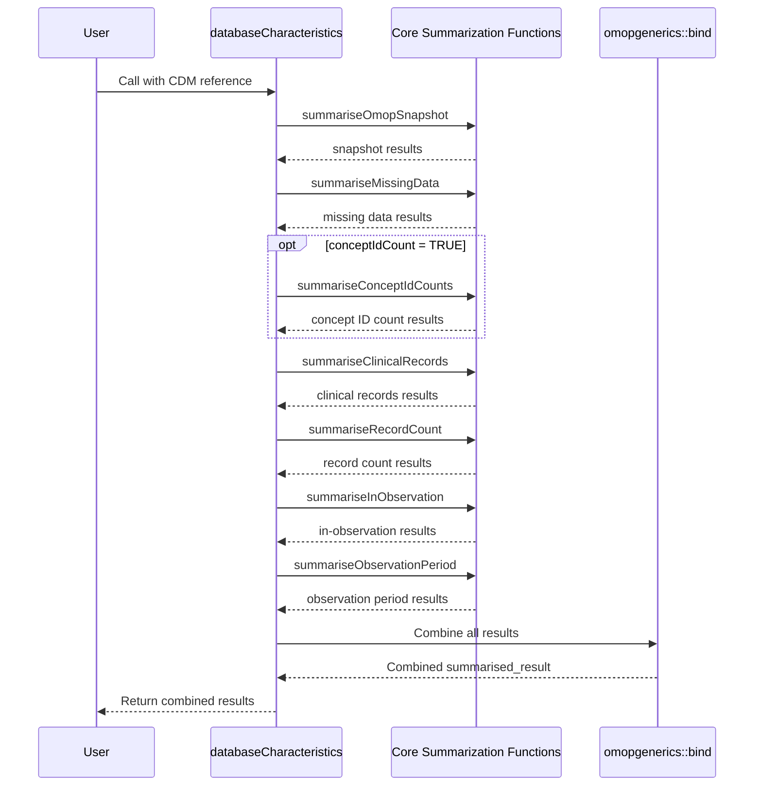

# Page: Core Summarization Functions

# Core Summarization Functions

<details>
<summary>Relevant source files</summary>

The following files were used as context for generating this wiki page:

- [DESCRIPTION](DESCRIPTION)
- [NAMESPACE](NAMESPACE)
- [R/databaseCharacteristics.R](R/databaseCharacteristics.R)
- [man/databaseCharacteristics.Rd](man/databaseCharacteristics.Rd)
- [tests/testthat/test-databaseCharacteristics.R](tests/testthat/test-databaseCharacteristics.R)

</details>


## Purpose and Scope

This document provides a technical overview of the core summarization functions in the OmopSketch package. These functions extract and analyze data from Observational Medical Outcomes Partnership (OMOP) Common Data Model (CDM) databases, producing standardized outputs that can be used for visualization, tabulation, and comprehensive database characterization.

The core summarization functions serve as the foundation of the OmopSketch package, providing the raw data that visualization functions ([Visualization Functions](#4)) and table generation functions ([Table Generation Functions](#5)) use. For specific implementations of these functions focused on particular domains, see the detailed documentation in sections [3.1](#3.1) through [3.6](#3.6).

Sources: [NAMESPACE:12-21](), [DESCRIPTION:31-34]()

## Common Design Pattern

All core summarization functions follow a consistent design pattern:



Each function accepts a CDM reference (or a specific table from the CDM) as input, extracts and processes relevant data, and returns a standardized `summarised_result` object that can be used by downstream visualization and table functions.

Sources: [NAMESPACE:12-21](), [NAMESPACE:7-11](), [NAMESPACE:22-29]()

## Core Function Overview

The OmopSketch package provides the following core summarization functions:

| Function | Purpose | Primary Input |
|---|---|---|
| `summariseOmopSnapshot` | Provides basic database overview | CDM reference |
| `summariseClinicalRecords` | Summarizes clinical records across tables | CDM reference |
| `summariseRecordCount` | Counts records by various dimensions | CDM reference |
| `summariseObservationPeriod` | Analyzes observation period patterns | observation_period table |
| `summariseInObservation` | Analyzes data captured during observation | observation_period table |
| `summariseConceptCounts` | Summarizes concept usage (including ID counts and set counts) | CDM reference |
| `summariseMissingData` | Identifies missing data patterns | CDM reference |

Sources: [NAMESPACE:12-21]()

## Common Parameters

Most core summarization functions accept a common set of parameters for stratification and filtering:



These parameters enable consistent filtering and stratification of results across different summarization functions.

Sources: [R/databaseCharacteristics.R:26-32]()

## Function Integration

The core summarization functions are designed to work both independently and together. The `databaseCharacteristics` function demonstrates how these functions can be combined to create a comprehensive database characterization:



The results from each function are combined using the `bind` function to create a comprehensive `summarised_result` object.

Sources: [R/databaseCharacteristics.R:53-195]()

## Input and Output Types



Each summarization function processes the input CDM data and generates a standardized `summarised_result` object that follows the structure defined in the `omopgenerics` package.

Sources: [NAMESPACE:12-21](), [NAMESPACE:30-40]()

## Data Flow

The following diagram illustrates the data flow through the core summarization functions:



The core summarization functions extract data from the OMOP CDM database via the CDM reference object, process it according to their specific purposes, and produce standardized outputs that can be used by various downstream functions.

Sources: [R/databaseCharacteristics.R:34-216]()

## Usage in Database Characterization

The `databaseCharacteristics` function demonstrates how the core summarization functions can be used together to create a comprehensive database characterization:



This function provides a comprehensive characterization of the database by combining the results of multiple core summarization functions.

Sources: [R/databaseCharacteristics.R:22-218](), [tests/testthat/test-databaseCharacteristics.R:1-23]()

## Example Usage

Here's a simple example of how to use the core summarization functions:

```
# Connect to an OMOP CDM database
cdm <- connect_to_cdm_database()

# Get a snapshot of the database
snapshot <- summariseOmopSnapshot(cdm)

# Summarize clinical records with stratification
clinical_records <- summariseClinicalRecords(
  cdm,
  omopTableName = c("condition_occurrence", "drug_exposure"),
  sex = TRUE,
  ageGroup = list(c(0, 40), c(41, 65), c(66, Inf))
)

# Combine results
combined_results <- omopgenerics::bind(snapshot, clinical_records)

# Create tables and visualizations
tables <- tableClinicalRecords(clinical_records)
plots <- plotRecordCount(summariseRecordCount(cdm))
```

The core summarization functions can be used individually for targeted analysis or combined for comprehensive database characterization.

Sources: [tests/testthat/test-databaseCharacteristics.R:1-23]()