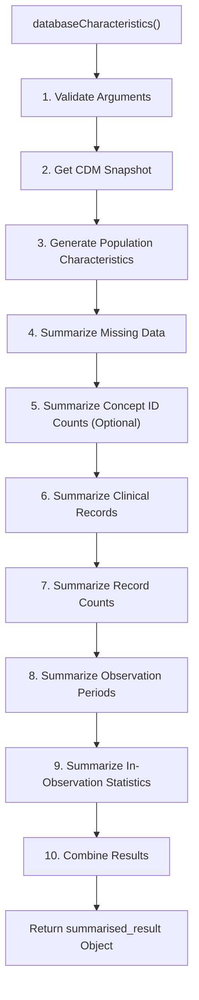
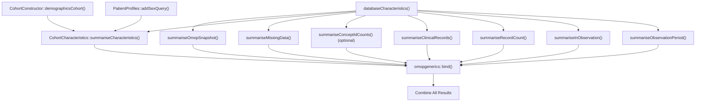
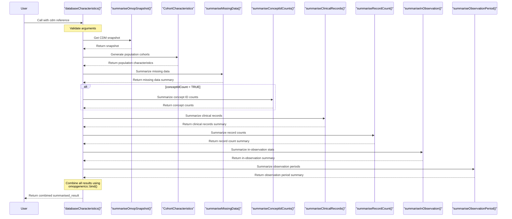
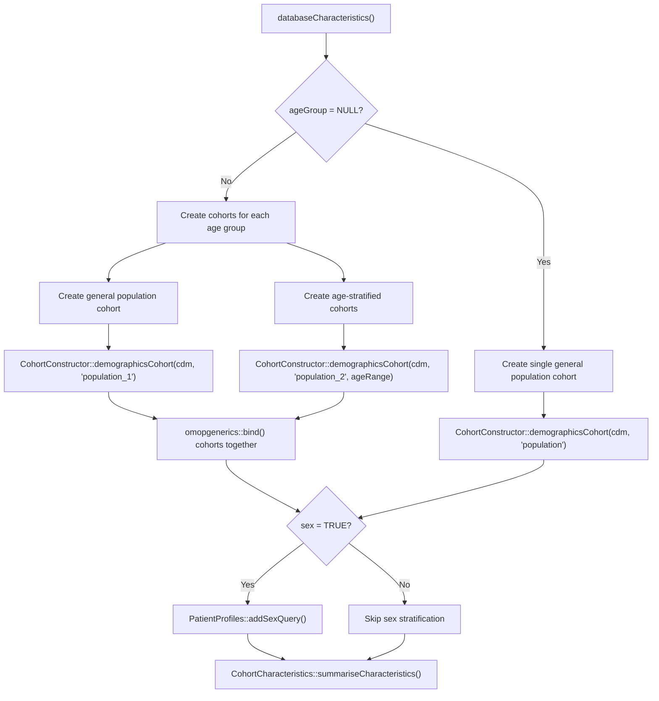

# Page: Database Characterization

# Database Characterization

<details>
<summary>Relevant source files</summary>

The following files were used as context for generating this wiki page:

- [DESCRIPTION](DESCRIPTION)
- [NAMESPACE](NAMESPACE)
- [R/databaseCharacteristics.R](R/databaseCharacteristics.R)
- [man/databaseCharacteristics.Rd](man/databaseCharacteristics.Rd)
- [tests/testthat/test-databaseCharacteristics.R](tests/testthat/test-databaseCharacteristics.R)

</details>


## Purpose and Scope

The Database Characterization system provides a comprehensive framework for analyzing and summarizing OMOP Common Data Model (CDM) databases. It integrates multiple specialized summarization functions into a single, unified process to generate a complete overview of a database's structure, content, and quality.

This page documents the `databaseCharacteristics()` function, which orchestrates this comprehensive characterization process. For documentation on individual summarization components used by this function, see [Core Summarization Functions](#3).

Sources: [R/databaseCharacteristics.R:1-22]()

## Overview

The `databaseCharacteristics()` function provides a single entry point to characterize an OMOP CDM database by combining multiple specialized summarization functions. It generates a comprehensive summary that includes:

1. Database snapshot information
2. Population characteristics
3. Missing data analysis
4. Concept counts (optional)
5. Clinical records summary
6. Record counts
7. Observation period statistics
8. In-observation statistics

### Function Signature

```r
databaseCharacteristics(
  cdm,
  omopTableName = c("person", "observation_period", "visit_occurrence", 
                    "condition_occurrence", "drug_exposure", "procedure_occurrence", 
                    "device_exposure", "measurement", "observation", "death"),
  sex = FALSE,
  ageGroup = NULL,
  dateRange = NULL,
  interval = "overall",
  conceptIdCount = FALSE,
  ...
)
```

Sources: [R/databaseCharacteristics.R:23-33]()

## Workflow Diagram



Sources: [R/databaseCharacteristics.R:34-218]()

## Function Components and Dependencies



Sources: [R/databaseCharacteristics.R:46-196]()

## Input Parameters

The function accepts the following parameters:

| Parameter | Type | Description | Default |
|-----------|------|-------------|---------|
| `cdm` | `cdm_reference` | OMOP CDM reference object | Required |
| `omopTableName` | character vector | OMOP tables to include in analysis | All clinical tables |
| `sex` | logical | Whether to stratify by sex | `FALSE` |
| `ageGroup` | list | Age groups to stratify results by | `NULL` |
| `dateRange` | Date vector | Study period date range | `NULL` |
| `interval` | character | Time interval for stratification | `"overall"` |
| `conceptIdCount` | logical | Whether to include concept ID counts | `FALSE` |
| `...` | any | Additional arguments passed to internal functions | None |

Sources: [R/databaseCharacteristics.R:1-22](), [man/databaseCharacteristics.Rd:20-38]()

### Important Implementation Details

1. If `"person"` is included in `omopTableName`, it will only be used for missing value summarization.
2. Age groups can be specified as a list of numeric vectors, each defining an age range.
3. The time interval can be one of: `"overall"`, `"years"`, `"quarters"`, or `"months"`.
4. Any additional parameters (`...`) are passed to the appropriate internal summarization functions.

## Execution Process



Sources: [R/databaseCharacteristics.R:46-196]()

## Code Flow Details

The function executes the following steps:

1. **Input Validation**: Validates the CDM reference and all input parameters
2. **CDM Snapshot**: Calls `summariseOmopSnapshot()` to get basic information about the database
3. **Population Characteristics**: 
   - Creates cohorts based on the specified age groups
   - Uses `CohortCharacteristics::summariseCharacteristics()` to analyze the population
4. **Missing Data**: Calls `summariseMissingData()` to analyze null values in specified tables
5. **Concept ID Counts** (optional): Calls `summariseConceptIdCounts()` if `conceptIdCount = TRUE`
6. **Clinical Records**: Calls `summariseClinicalRecords()` to summarize clinical data tables
7. **Record Counts**: Calls `summariseRecordCount()` to count records by time period
8. **In-Observation Statistics**: Calls `summariseInObservation()` to analyze observation-related metrics
9. **Observation Periods**: Calls `summariseObservationPeriod()` to analyze observation periods
10. **Result Combination**: Combines all results using `omopgenerics::bind()`

Sources: [R/databaseCharacteristics.R:46-217]()

## Output Structure

The function returns a `summarised_result` object containing all the combined results from the various summarization functions. This object follows the structure defined by the `omopgenerics` package and contains:

1. A result table with various estimates
2. A settings table that documents the parameters used
3. Attributes that provide additional metadata

The result can be filtered by `result_type` to access specific components of the summary:

| `result_type` | Description |
|---------------|-------------|
| `summarise_omop_snapshot` | Basic CDM database information |
| `clinical_records` | Clinical records summary |
| `record_count` | Record counts by time period |
| `observation_period` | Observation period statistics |
| `in_observation` | In-observation statistics |
| `summarise_missing_data` | Missing data analysis |
| `concept_id_count` | Concept ID counts (if included) |

Sources: [R/databaseCharacteristics.R:194-217]()

## Example Usage

Basic usage with default parameters:

```r
# Connect to CDM database
cdm <- CDMConnector::connect(...)

# Run database characterization
result <- databaseCharacteristics(cdm)

# Disconnect from database
CDMConnector::disconnect(cdm)
```

Advanced usage with stratification and filtering:

```r
# Connect to CDM database
cdm <- CDMConnector::connect(...)

# Run database characterization with stratification
result <- databaseCharacteristics(
  cdm,
  omopTableName = c("observation_period", "condition_occurrence", "drug_exposure"),
  sex = TRUE,
  ageGroup = list(c(0, 18), c(19, 64), c(65, Inf)),
  interval = "years",
  conceptIdCount = TRUE
)

# Filter results to view only concept counts
concept_counts <- result %>%
  omopgenerics::filterSettings(result_type == "concept_id_count")

# Disconnect from database
CDMConnector::disconnect(cdm)
```

Using with mock data for testing:

```r
# Create mock CDM data
cdm <- mockOmopSketch(numberIndividuals = 100)

# Run database characterization
result <- databaseCharacteristics(cdm)

# Clean up
PatientProfiles::mockDisconnect(cdm)
```

Sources: [R/databaseCharacteristics.R:14-21](), [tests/testthat/test-databaseCharacteristics.R:1-23]()

## Cohort Generation for Population Characteristics



Sources: [R/databaseCharacteristics.R:59-104]()

## Performance Considerations

The function tracks execution time and provides a summary of:
- Total execution time
- New tables created during processing

This information is displayed to the user via the `cli` package for convenient monitoring of resource usage.

For large databases, consider:
1. Limiting the `omopTableName` to include only relevant tables
2. Setting `conceptIdCount = FALSE` unless specifically needed
3. Using broader time intervals (e.g., `"years"` instead of `"months"`)

Sources: [R/databaseCharacteristics.R:196-217]()

## Related Functions

The `databaseCharacteristics()` function relies on several core summarization functions from the OmopSketch package:

| Function | Purpose | Additional Documentation |
|----------|---------|--------------------------|
| `summariseOmopSnapshot()` | Get basic CDM information | [Core Summarization Functions](#3) |
| `summariseMissingData()` | Analyze null values | [Missing Data Summarization](#3.5) |
| `summariseConceptIdCounts()` | Count concept IDs | [Concept Count Summarization](#3.4) |
| `summariseClinicalRecords()` | Summarize clinical data | [Clinical Records Summarization](#3.1) |
| `summariseRecordCount()` | Count records by time | [Record Count Summarization](#3.6) |
| `summariseInObservation()` | Analyze observation data | [In-Observation Summarization](#3.3) |
| `summariseObservationPeriod()` | Analyze observation periods | [Observation Period Summarization](#3.2) |

Sources: [NAMESPACE:3-37]()