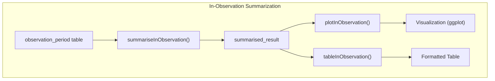
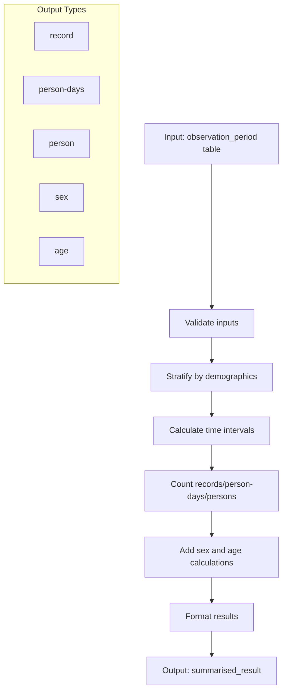
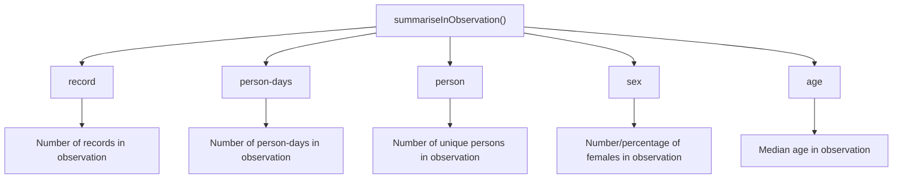
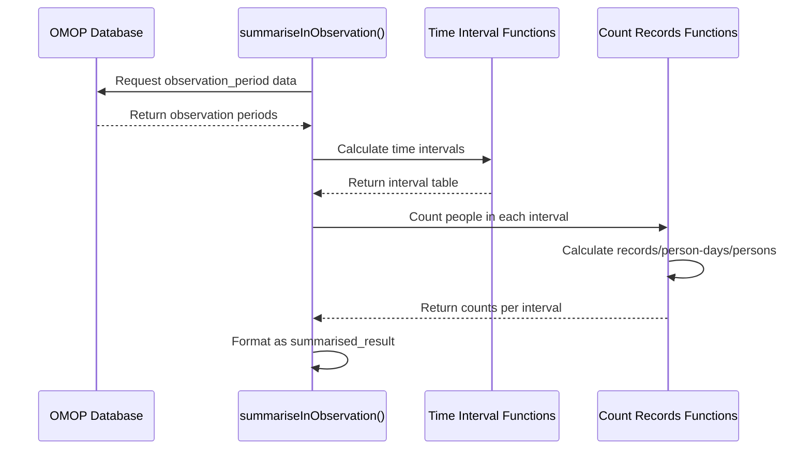
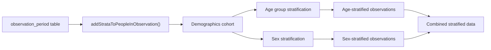
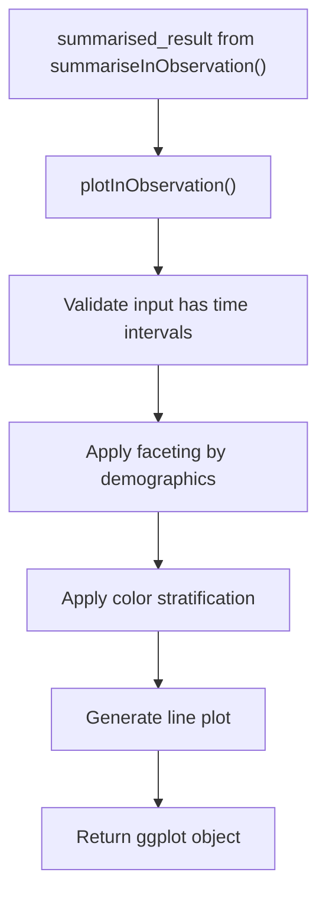
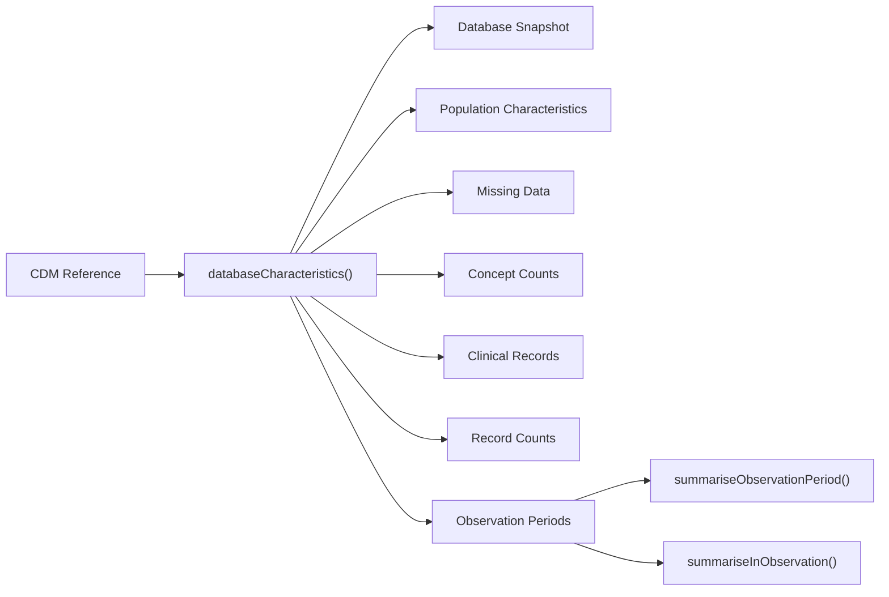

# Page: In-Observation Summarization

# In-Observation Summarization

<details>
<summary>Relevant source files</summary>

The following files were used as context for generating this wiki page:

- [R/summariseInObservation.R](R/summariseInObservation.R)
- [tests/testthat/test-plotInObservation.R](tests/testthat/test-plotInObservation.R)
- [tests/testthat/test-summariseInObservation.R](tests/testthat/test-summariseInObservation.R)

</details>


This page documents the In-Observation Summarization functionality in OmopSketch, which allows users to analyze and characterize how many individuals are under observation during specific time intervals in an OMOP Common Data Model (CDM) database. This functionality helps answer questions like: "How many patients were under observation in a given month or year?" or "What is the demographic composition of patients in observation during a specific time period?"

For information on general observation period characteristics (like duration and distribution), see [Observation Period Summarization](#3.2).

## Purpose and Functionality

The in-observation summarization functions quantify patient presence within the database over time. Unlike record counts or observation period summarization that focus on when periods begin and end, in-observation summarization analyzes who is actively under observation at specific points in time, allowing for temporal analysis of database coverage.



Sources: [R/summariseInObservation.R:1-16]()

## Core Function: summariseInObservation

The main function `summariseInObservation()` takes an observation_period table and provides detailed summaries of patients in observation during specified time intervals, with options to stratify by demographic characteristics.



Sources: [R/summariseInObservation.R:36-112]()

### Function Parameters

| Parameter | Description | Default | Options |
|-----------|-------------|---------|---------|
| `observationPeriod` | Observation period table from a CDM reference | (required) | An observation_period OMOP table |
| `interval` | Time interval for aggregation | `"overall"` | `"overall"`, `"years"`, `"quarters"`, `"months"` |
| `output` | Metrics to calculate | `"record"` | `"record"`, `"person-days"`, `"person"`, `"sex"`, `"age"` |
| `ageGroup` | Age groups for stratification | `NULL` | List of age ranges (e.g., `list("<=60" = c(0, 60), ">60" = c(61, Inf))`) |
| `sex` | Whether to stratify by sex | `FALSE` | `TRUE`, `FALSE` |
| `dateRange` | Date range for filtering observation periods | `NULL` | Two-element vector of dates |

Sources: [R/summariseInObservation.R:1-16](), [R/summariseInObservation.R:36-112]()

### Output Types

The function supports multiple output types that can be calculated separately or together:



Sources: [R/summariseInObservation.R:52-112](), [R/summariseInObservation.R:115-171]()

## Internal Processing Details

### Time Interval Handling

When an interval is specified (years, quarters, or months), the function creates time intervals spanning the entire range of observation periods, then calculates how many patients were observed in each interval.



Sources: [R/summariseInObservation.R:173-206](), [R/summariseInObservation.R:209-361]()

### Age and Sex Stratification

The implementation adds demographic stratifiers to the observation data by:

1. Creating a temporary demographics cohort
2. Applying age group stratification if specified
3. Adding sex information if requested
4. Combining with the observation period data



Sources: [R/summariseInObservation.R:442-512]()

## Record Counting Methods

The function employs different counting methods depending on the output type:

1. **Record counts**: Counts observation records that overlap with each time interval
2. **Person counts**: Counts unique persons with observation periods that overlap with each time interval
3. **Person-days**: Calculates the total number of days that individuals were under observation within each time interval
4. **Sex distribution**: Calculates the number/percentage of females in observation during each interval
5. **Age distribution**: Calculates the median age of individuals in observation during each interval

Sources: [R/summariseInObservation.R:209-361](), [R/summariseInObservation.R:389-439]()

## Visualization with plotInObservation

The `plotInObservation()` function creates visualizations from the output of `summariseInObservation()`. It supports:

- Line plots showing trends over time intervals
- Faceting by demographic variables (age groups, sex)
- Color coding by various strata



Sources: [tests/testthat/test-plotInObservation.R:1-69]()

## Table Generation with tableInObservation

The `tableInObservation()` function generates formatted tables from summarized in-observation data. It supports various output formats including gt, datatable, and reactable.

Sources: [tests/testthat/test-summariseInObservation.R:475-489]()

## Example Usage

```r
# Basic usage
result <- summariseInObservation(cdm$observation_period)

# Monthly counts with demographic stratification
result <- summariseInObservation(
  cdm$observation_period,
  interval = "months",
  output = c("person-days", "record"),
  ageGroup = list("<=60" = c(0, 60), ">60" = c(61, Inf)),
  sex = TRUE
)

# Visualization
plotInObservation(result)

# Filtered visualization with stratification
result |>
  visOmopResults::filterStrata(sex != "overall", age_group != "overall") |>
  plotInObservation(facet = "sex", colour = "age_group")

# Table generation
tableInObservation(result)
```

Sources: [R/summariseInObservation.R:17-35](), [tests/testthat/test-summariseInObservation.R:1-474]()

## Integration with Database Characterization

In-Observation Summarization is a core component of the broader database characterization workflow in OmopSketch. The `summariseInObservation()` function is typically used by the `databaseCharacteristics()` function to provide a comprehensive view of database utilization and coverage over time.



Sources: [R/summariseInObservation.R:36-112]()