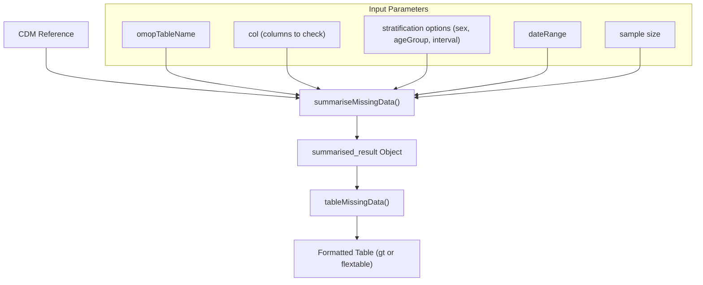
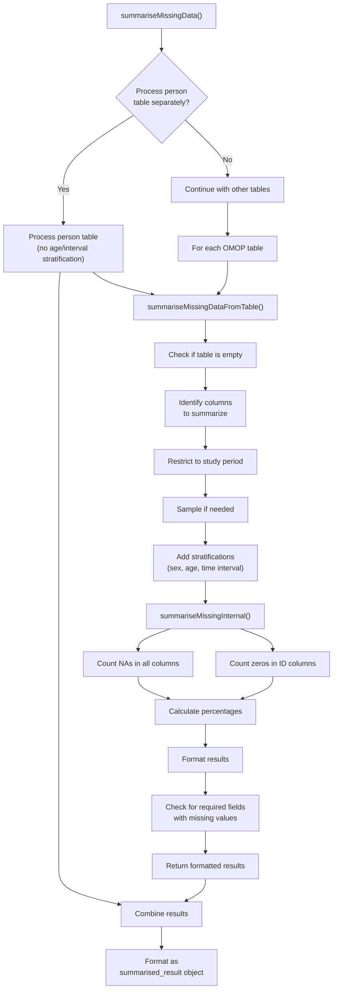
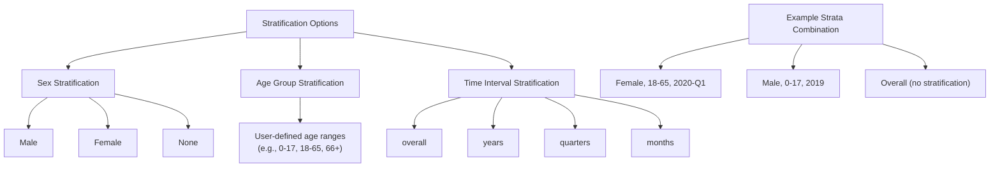
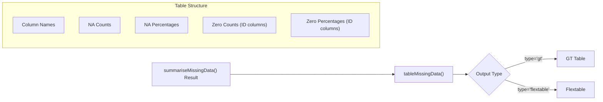
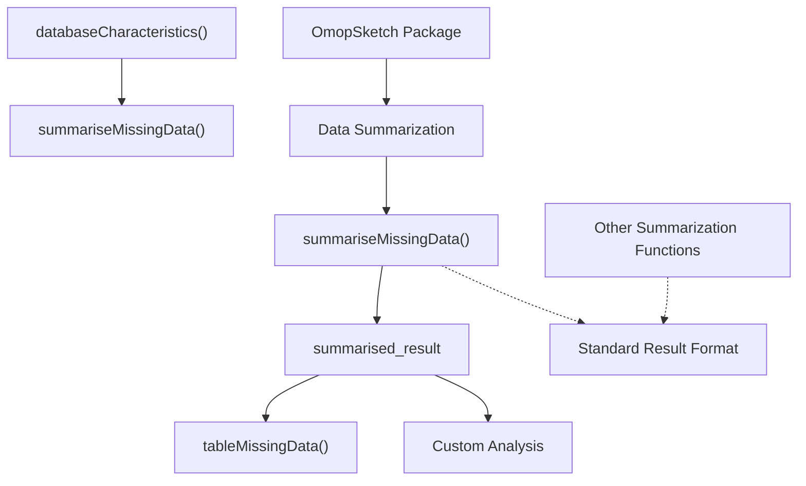

# Page: Missing Data Summarization

# Missing Data Summarization

<details>
<summary>Relevant source files</summary>

The following files were used as context for generating this wiki page:

- [R/summariseInternal.R](R/summariseInternal.R)
- [R/summariseMissingData.R](R/summariseMissingData.R)
- [man/summariseConceptIdCounts.Rd](man/summariseConceptIdCounts.Rd)
- [man/summariseMissingData.Rd](man/summariseMissingData.Rd)
- [man/tableMissingData.Rd](man/tableMissingData.Rd)
- [tests/testthat/test-summariseMissingData.R](tests/testthat/test-summariseMissingData.R)

</details>


## Purpose and Scope

This page documents the missing data summarization functionality within OmopSketch. The system identifies and quantifies missing (NULL) and zero values in OMOP CDM tables, providing a comprehensive overview of data quality and completeness. For information about other types of summarization, see [Core Summarization Functions](#3).

The missing data summarization functions detect:
1. NULL values in any column of specified OMOP tables
2. Zero values in ID columns (which typically should be non-zero)

Results can be stratified by sex, age groups, and time intervals to identify patterns in data quality across different segments of the database.

Sources: [R/summariseMissingData.R:1-15]()

## System Overview

The missing data summarization system follows the consistent pattern used throughout OmopSketch, with specialized functions for analyzing data quality across OMOP tables.



Sources: [R/summariseMissingData.R:28-107](), [man/summariseMissingData.Rd:6-17]()

## Internal Workflow

The missing data summarization process involves several steps to analyze and quantify NULL and zero values while supporting flexible stratification options.



Sources: [R/summariseMissingData.R:147-205](), [R/summariseInternal.R:31-124]()

## Key Components

### Main Function: summariseMissingData

The `summariseMissingData()` function identifies and quantifies missing values in one or more OMOP tables. It accepts the following parameters:

| Parameter | Description | Default |
|-|-|-|
| cdm | A CDM reference object | Required |
| omopTableName | Character vector of table names to analyze | Required |
| col | Columns to check for missing values (NULL = all columns) | NULL |
| sex | Whether to stratify by sex | FALSE |
| interval | Time interval for stratification ("overall", "years", "quarters", "months") | "overall" |
| ageGroup | Age group ranges for stratification | NULL |
| sample | Maximum number of records to process | 1,000,000 |
| dateRange | Study period restriction (vector of start and end dates) | NULL |

Special processing applies to the person table, as it cannot be stratified by age groups or time intervals.

Sources: [R/summariseMissingData.R:28-48](), [man/summariseMissingData.Rd:19-43]()

### Internal Processing Functions

The system uses several internal functions to process the data:

1. `summariseMissingDataFromTable()`: Processes a single OMOP table
   - Identifies columns to analyze
   - Applies date range restrictions
   - Samples if needed
   - Adds stratifications
   - Calls internal summarization functions

2. `summariseMissingInternal()`: Performs the actual summarization
   - Counts NULL values in all specified columns
   - Counts zero values in ID columns
   - Calculates percentages of missing/zero values
   - Formats results consistently

3. `warningDataRequire()`: Checks for missing values in required fields
   - Validates if mandatory columns contain NULL values
   - Issues warnings for fields that should not be NULL

Sources: [R/summariseMissingData.R:109-131](), [R/summariseMissingData.R:132-142](), [R/summariseMissingData.R:147-205](), [R/summariseInternal.R:31-124]()

## Stratification System

The missing data summarization supports flexible stratification to analyze data completeness patterns across different dimensions:



Stratification is applied by joining with the person table to retrieve demographic information and calculating the appropriate interval based on dates.

Sources: [R/summariseInternal.R:142-206](), [R/summariseInternal.R:248-250]()

## Output Structure

The function returns a `summarised_result` object with the following structure:

| Column | Description |
|-|-|
| group_name | Name of the OMOP table |
| group_level | The specific OMOP table name |
| strata_name | Stratification variables used (sex, age_group) |
| strata_level | Specific strata values (e.g., "Female; 18-65") |
| variable_name | Column name being analyzed |
| variable_level | Always NA for missing data summarization |
| estimate_name | Type of estimate (na_count, na_percentage, zero_count, zero_percentage) |
| estimate_type | Data type of the estimate (integer or percentage) |
| estimate_value | The actual value |
| additional_name | Additional stratification (time_interval) |
| additional_level | Specific time interval value |

The results include both counts and percentages of NULL values for each column, as well as counts and percentages of zero values for ID columns.

Sources: [R/summariseMissingData.R:89-106]()

## Table Generation

The `tableMissingData()` function converts the summarized result into a formatted table:



The table displays the percentage of missing values for each column, with separate sections for each OMOP table analyzed. Stratification variables (if used) organize the data into subgroups.

Sources: [man/tableMissingData.Rd:1-20]()

## Usage Examples

Basic usage to check missing data in condition and visit occurrence tables:

```r
cdm <- mockOmopSketch(numberIndividuals = 100)
result <- summariseMissingData(cdm = cdm, 
                              omopTableName = c("condition_occurrence", "visit_occurrence"))
```

Example with stratification by sex, age groups, and years:

```r
result <- summariseMissingData(
  cdm = cdm,
  omopTableName = c("drug_exposure", "condition_occurrence"),
  interval = "years",
  sex = TRUE,
  ageGroup = list(c(0, 17), c(18, 65), c(66, 100)),
  dateRange = as.Date(c("2012-01-01", "2018-01-01")),
  sample = 100000
)
```

Creating a formatted table from the results:

```r
table <- tableMissingData(result)
```

Sources: [R/summariseMissingData.R:20-27](), [tests/testthat/test-summariseMissingData.R:434-461]()

## Integration with Other Components

The missing data summarization functionality integrates with the broader OmopSketch framework:



The missing data summarization is typically one component of a comprehensive database characterization, often used alongside other summarization functions to provide a complete picture of data quality and completeness.

Sources: [tests/testthat/test-summariseMissingData.R:1-19]()

## Performance Considerations

For large databases, the sample parameter is important to limit processing time and memory usage. The default sample size of 1,000,000 records provides a balance between accuracy and performance.

The function uses database-side processing where possible, minimizing data transfer between the database and R. Temporary tables are created during processing but are properly cleaned up when the function completes.

Sources: [R/summariseMissingData.R:125-141](), [tests/testthat/test-summariseMissingData.R:428-456]()