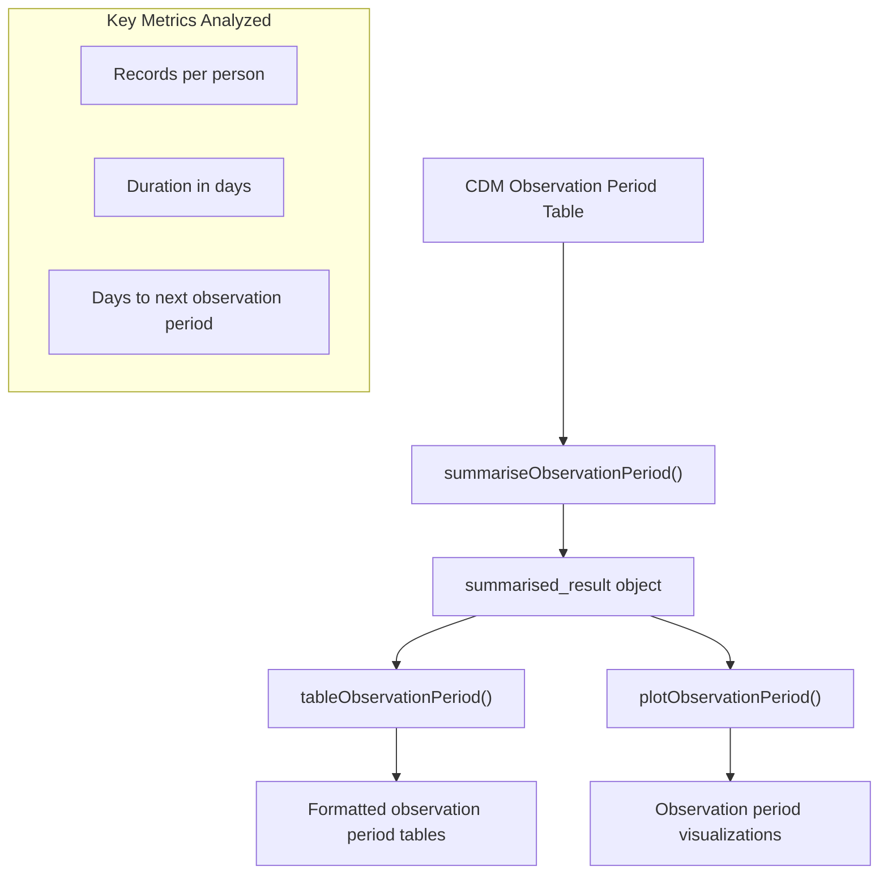
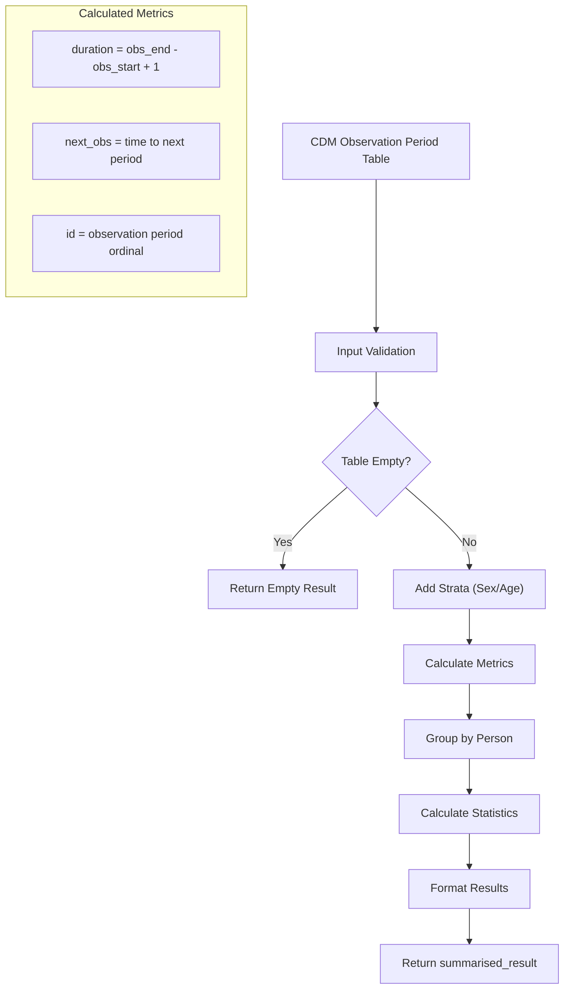
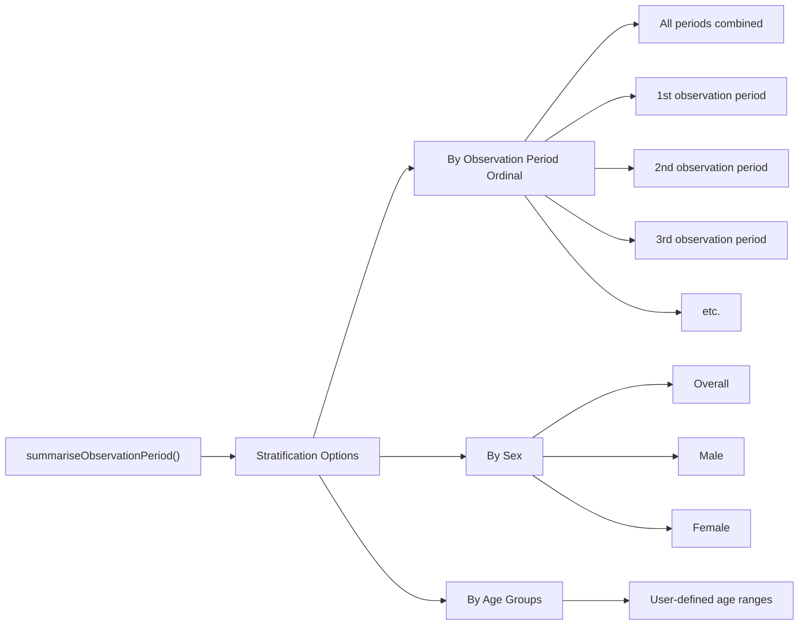
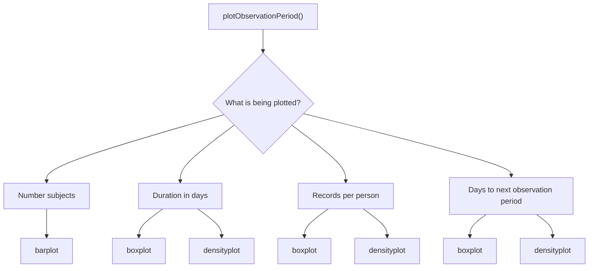
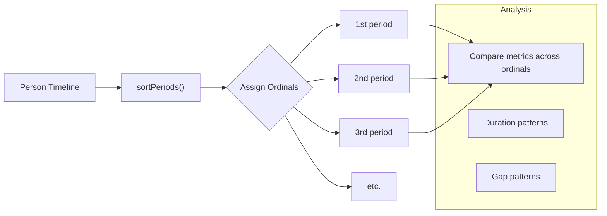
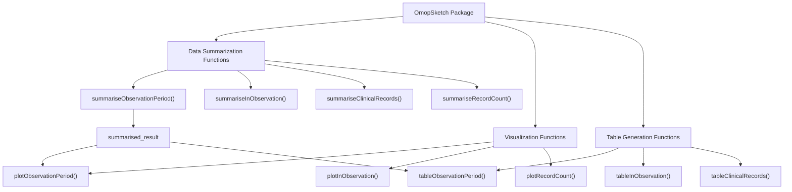

# Page: Observation Period Summarization

# Observation Period Summarization

<details>
<summary>Relevant source files</summary>

The following files were used as context for generating this wiki page:

- [R/summariseObservationPeriod.R](R/summariseObservationPeriod.R)
- [man/summariseObservationPeriod.Rd](man/summariseObservationPeriod.Rd)
- [tests/testthat/test-plotInObservation.R](tests/testthat/test-plotInObservation.R)
- [tests/testthat/test-summariseInObservation.R](tests/testthat/test-summariseInObservation.R)
- [tests/testthat/test-summariseObservationPeriod.R](tests/testthat/test-summariseObservationPeriod.R)

</details>


## Purpose and Scope

This document describes the functionality for summarizing observation period data in the OmopSketch package. Observation periods in OMOP CDM represent the time spans during which a patient is observed in the database. The summarization functions covered here provide statistical analyses of observation period characteristics, such as duration, gaps between periods, and distribution across the patient population.

For information about analyzing data within observation periods, see [In-Observation Summarization](#3.3).

## Overview

The Observation Period Summarization system provides functions to analyze and visualize key characteristics of observation periods in an OMOP CDM database. These functions help researchers understand the temporal scope of their data and identify patterns in data collection.



Sources: [R/summariseObservationPeriod.R:1-34]()

## Core Function: summariseObservationPeriod

The `summariseObservationPeriod` function calculates statistics about observation periods from an OMOP CDM database. It processes the observation_period table to extract insights about duration patterns, gaps between periods, and other temporal characteristics.

### Function Signature

```
summariseObservationPeriod(
  observationPeriod,
  estimates = c("mean", "sd", "min", "q05", "q25", "median", "q75", "q95", "max", "density"),
  byOrdinal = TRUE,
  ageGroup = NULL,
  sex = FALSE,
  dateRange = NULL
)
```

### Parameters

| Parameter | Type | Description |
|-----------|------|-------------|
| `observationPeriod` | OMOP table | The observation_period table from an OMOP CDM database |
| `estimates` | character vector | Statistical estimates to calculate (e.g., mean, median, min, max) |
| `byOrdinal` | boolean | Whether to stratify by observation period order (1st, 2nd, etc.) |
| `ageGroup` | list | Age groups to stratify results by |
| `sex` | boolean | Whether to stratify by sex |
| `dateRange` | Date vector | Study period date range to filter observations |

Sources: [R/summariseObservationPeriod.R:31-40](), [man/summariseObservationPeriod.Rd:8-16]()

## Internal Workflow

The observation period summarization process involves several steps to transform raw observation period data into meaningful statistics.



Sources: [R/summariseObservationPeriod.R:62-78]()

## Analyzed Metrics

The summarization function calculates three primary metrics:

1. **Records per person**: The number of observation periods per individual
2. **Duration in days**: The length of each observation period
3. **Days to next observation period**: The gap between consecutive observation periods

For each metric, the system can calculate various statistical estimates, including:
- Central tendency (mean, median)
- Dispersion (standard deviation)
- Range (min, max)
- Quantiles (q05, q25, q75, q95)
- Density distribution

Sources: [R/summariseObservationPeriod.R:94-113]()

## Stratification Options

Results can be stratified along multiple dimensions:



Sources: [R/summariseObservationPeriod.R:54-55](), [R/summariseObservationPeriod.R:136-164]()

## Result Processing

The function returns a `summarised_result` object that contains the calculated statistics organized by variable, group, and strata. This result can be further processed by:

1. `tableObservationPeriod()`: Creates formatted tables for presentation
2. `plotObservationPeriod()`: Generates visualizations of the results

### Result Structure

The `summarised_result` object has a standardized structure that includes:

- **variable_name**: The analyzed metric (e.g., "Duration in days")
- **estimate_name**: The statistical estimate (e.g., "mean", "median")
- **estimate_value**: The calculated value
- **group_name**: "observation_period_ordinal"
- **group_level**: The ordinal period identifier (e.g., "1st", "2nd")
- **strata_name/strata_level**: Stratification variables and values

Sources: [R/summariseObservationPeriod.R:119-129]()

## Plot Types

The `plotObservationPeriod` function supports different visualization types depending on the variable being plotted:



Sources: [tests/testthat/test-summariseObservationPeriod.R:186-299]()

## Example Usage

A typical usage pattern for observation period summarization:

1. Start with an OMOP CDM reference
2. Call `summariseObservationPeriod` on the observation_period table
3. Visualize with `plotObservationPeriod` or tabulate with `tableObservationPeriod`

```
# Summarize observation periods
result <- summariseObservationPeriod(
  cdm$observation_period,
  ageGroup = list("0-17" = c(0, 17), "18-64" = c(18, 64), "65+" = c(65, Inf)),
  sex = TRUE
)

# Create visualization
plotObservationPeriod(
  result,
  variableName = "Duration in days", 
  plotType = "boxplot"
)

# Generate table
tableObservationPeriod(result)
```

Sources: [man/summariseObservationPeriod.Rd:44-55]()

## Ordinal Period Analysis

The `byOrdinal` parameter allows analysis of observation periods by their ordinal position (1st, 2nd, 3rd, etc.). This helps understand patterns in follow-up observation periods and differences between initial and subsequent observation periods.



Sources: [R/summariseObservationPeriod.R:70-74](), [R/summariseObservationPeriod.R:136-166](), [tests/testthat/test-summariseObservationPeriod.R:576-618]()

## Connection to Other Package Components

Observation Period Summarization functions within the broader context of the OmopSketch package:



Sources: [R/summariseObservationPeriod.R:14-17]()

## Technical Implementation Details

The `summariseObservationPeriod` function calculates metrics using several internal steps:

1. **Validation**: Checks input arguments and validates the observation_period table
2. **Data Extraction**: Retrieves and processes observation periods from the CDM
3. **Metric Calculation**: Computes duration and gaps between periods
4. **Stratification**: Groups results by specified dimensions (age, sex, ordinal)
5. **Statistics**: Calculates requested statistics for each metric
6. **Formatting**: Arranges results in a standardized structure

The function implements ordinal labeling using the `addOrdinalLevels` helper function, which properly formats ordinal numbers (1st, 2nd, 3rd, etc.).

Sources: [R/summariseObservationPeriod.R:41-55](), [R/summariseObservationPeriod.R:136-166]()

## Error Handling and Edge Cases

The function includes handling for:

- Empty observation period tables
- Missing demographic data
- Absence of subsequent observation periods
- Date range filtering
- Validation of input parameters

When an empty or filtered table results in no data, the function returns an empty `summarised_result` object with appropriate metadata.

Sources: [R/summariseObservationPeriod.R:58-61](), [R/summariseObservationPeriod.R:79-86]()