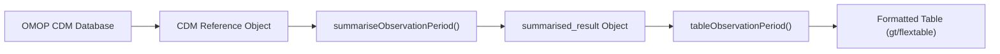
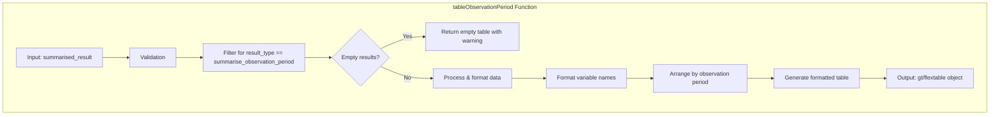
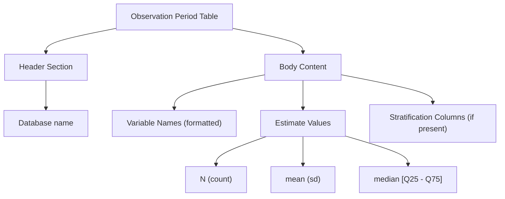
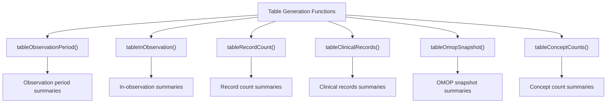

# Page: Observation Period Tables

# Observation Period Tables

<details>
<summary>Relevant source files</summary>

The following files were used as context for generating this wiki page:

- [R/tableClinicalRecords.R](R/tableClinicalRecords.R)
- [R/tableInObservation.R](R/tableInObservation.R)
- [R/tableObservationPeriod.R](R/tableObservationPeriod.R)
- [R/tableOmopSnapshot.R](R/tableOmopSnapshot.R)
- [R/tableRecordCount.R](R/tableRecordCount.R)
- [man/tableInObservation.Rd](man/tableInObservation.Rd)
- [man/tableRecordCount.Rd](man/tableRecordCount.Rd)

</details>


## Purpose and Scope

This page documents the functionality for generating formatted tables from observation period summary data in the OmopSketch package. The primary function `tableObservationPeriod()` transforms the output from `summariseObservationPeriod()` into structured, human-readable tables for reporting and analysis. For information about how to generate the observation period summary data itself, see [Observation Period Summarization](#3.2).

## Function Overview

The `tableObservationPeriod()` function converts summarized observation period data into formatted tables that can be used in reports, dashboards, or other documentation. It's part of the table generation component in OmopSketch, which follows a consistent pattern where summarization results are transformed into visualization-ready formats.



Sources: [R/tableObservationPeriod.R:1-62]()

## Function Structure and Parameters

`tableObservationPeriod()` accepts two parameters:

1. `result`: A required `summarised_result` object containing data produced by `summariseObservationPeriod()`
2. `type`: An optional parameter specifying the output format (default is "gt")



Sources: [R/tableObservationPeriod.R:16-62]()

## Implementation Details

The function processes data through several key steps:

1. **Input validation**: Verifies that `result` is a valid `summarised_result` object and `type` is a supported table format
2. **Filtering**: Selects only records with `result_type` equal to "summarise_observation_period"
3. **Empty check**: Returns an empty table with a warning if no results match the filter
4. **Header configuration**: Sets appropriate table headers based on the output type
5. **Data preparation**: 
   - Removes density data (rows where `variable_level` is NA)
   - Formats variable names for readability (converts underscores to spaces, capitalizes)
   - Arranges results by observation period ordinal
6. **Table generation**: Uses `visOmopResults::visOmopTable()` to create the formatted output table

Sources: [R/tableObservationPeriod.R:20-62]()

## Output Format

The table produced by `tableObservationPeriod()` has a standardized structure with these elements:



The function supports specific estimate naming patterns:
- "N" for count values
- "mean (sd)" for mean values with standard deviations
- "median [Q25 - Q75]" for median values with quartiles

Sources: [R/tableObservationPeriod.R:46-53]()

## Usage Example

Here's a basic example of how to use the function:

```r
# Create a mock CDM database
cdm <- mockOmopSketch(numberIndividuals = 100)

# Summarize observation periods
result <- summariseObservationPeriod(cdm$observation_period)

# Create a formatted table with default settings (gt table)
tableObservationPeriod(result)

# Create a table with alternative format
tableObservationPeriod(result, type = "flextable")
```

Sources: [R/tableObservationPeriod.R:6-15]()

## Related Table Generation Functions

`tableObservationPeriod()` is part of a family of table generation functions in OmopSketch, each focused on a specific data domain:



All these functions share a similar structure and logic of accepting a `summarised_result` object from their corresponding summarization function and converting it to a formatted table. For more information about related table functions, see:

- [Clinical Records Tables](#5.1)
- [Concept Count Tables](#5.3)

Sources: [R/tableObservationPeriod.R:1-62](), [R/tableInObservation.R:1-142](), [R/tableRecordCount.R:1-116](), [R/tableClinicalRecords.R:1-64](), [R/tableOmopSnapshot.R:1-89]()