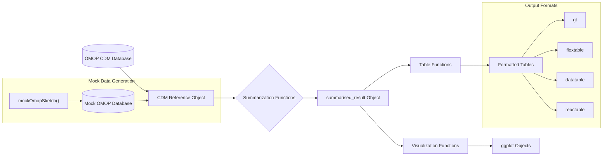
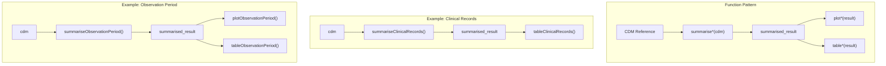
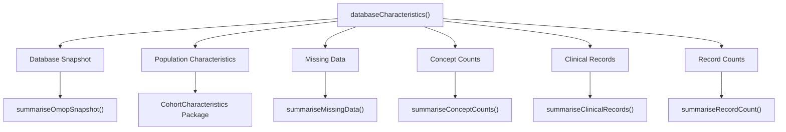

# Page: Overview

# Overview

<details>
<summary>Relevant source files</summary>

The following files were used as context for generating this wiki page:

- [DESCRIPTION](DESCRIPTION)
- [NAMESPACE](NAMESPACE)
- [README.Rmd](README.Rmd)
- [README.md](README.md)
- [man/OmopSketch-package.Rd](man/OmopSketch-package.Rd)

</details>


## Purpose and Scope

OmopSketch is an R package designed to characterize and visualize data within OMOP Common Data Model (CDM) databases. Its primary purpose is to provide comprehensive summaries of OMOP CDM instances to assess their suitability for specific epidemiological studies and to explore data domains for feasibility counts and trends. This package helps researchers understand the structure, completeness, and temporal characteristics of their OMOP CDM data before conducting full-scale studies.

For detailed information about the architecture and design principles, see [Architecture and Design](#2).

Sources: [DESCRIPTION:31-34](), [README.md:18-20]()

## Core Functionality

OmopSketch consists of four main functional areas:

```mermaid
graph TD
    A["OmopSketch Package"] --> B["Data Summarization"]
    A --> C["Data Visualization"]
    A --> D["Table Generation"]
    A --> E["Database Characterization"]

    B --> B1["summariseOmopSnapshot()"]
    B --> B2["summariseClinicalRecords()"]
    B --> B3["summariseObservationPeriod()"]
    B --> B4["summariseRecordCount()"]
    B --> B5["summariseConceptCounts()"]
    
    C --> C1["plotRecordCount()"]
    C --> C2["plotObservationPeriod()"] 
    C --> C3["plotConceptSetCounts()"]
    C --> C4["plotInObservation()"]
    
    D --> D1["tableOmopSnapshot()"]
    D --> D2["tableClinicalRecords()"]
    D --> D3["tableObservationPeriod()"]
    D --> D4["tableRecordCount()"]
    
    E --> E1["databaseCharacteristics()"]
```



Sources: [NAMESPACE:3-29](), [README.md:63-168]()

## Data Flow Architecture

OmopSketch follows a consistent architectural pattern that processes data from an OMOP CDM database through summarization, to visualization or tabular output:



Sources: [NAMESPACE:7-29](), [README.md:33-168]()

## Function Pattern Relationships

OmopSketch implements a consistent pattern across different data domains:



Sources: [README.md:63-144](), [NAMESPACE:8-28]()

## Core Components

### 1. Data Summarization Functions

OmopSketch provides a comprehensive set of summarization functions that analyze different aspects of an OMOP CDM database:

| Function | Purpose |
|----------|---------|
| `summariseOmopSnapshot` | Creates a snapshot with metadata about the database |
| `summariseClinicalRecords` | Summarizes clinical tables (e.g., condition_occurrence, drug_exposure) |
| `summariseObservationPeriod` | Analyzes patient observation periods |
| `summariseInObservation` | Examines records within observation periods |
| `summariseRecordCount` | Counts records across specified tables |
| `summariseConceptCounts` | Analyzes concept usage in the database |
| `summariseMissingData` | Identifies and quantifies missing data |

For detailed information about all summarization functions, see [Core Summarization Functions](#3).

Sources: [NAMESPACE:12-21](), [README.md:63-168]()

### 2. Visualization Functions

The package offers visualization functions that convert summarized results into informative plots:

| Function | Purpose |
|----------|---------|
| `plotRecordCount` | Visualizes record counts over time |
| `plotObservationPeriod` | Creates histograms of observation period characteristics |
| `plotInObservation` | Shows patterns of data within observation periods |
| `plotConceptSetCounts` | Visualizes concept usage |

For detailed information about visualization capabilities, see [Visualization Functions](#4).

Sources: [NAMESPACE:8-11](), [README.md:100-109]()

### 3. Table Generation Functions

Table functions format the summarized results into readable tables with various output formats:

| Function | Purpose |
|----------|---------|
| `tableOmopSnapshot` | Formats database snapshot information |
| `tableClinicalRecords` | Creates tables for clinical records summaries |
| `tableObservationPeriod` | Formats observation period data |
| `tableRecordCount` | Creates tables showing record counts |
| `tableMissingData` | Formats missing data summaries |

For detailed information about table generation, see [Table Generation Functions](#5).

Sources: [NAMESPACE:22-28](), [README.md:63-95]()

### 4. Database Characterization

The `databaseCharacteristics` function integrates multiple summarization functions to provide a comprehensive overview of a database:



For more detailed information about the database characterization functionality, see [Database Characterization](#6).

Sources: [NAMESPACE:4]()

### 5. Testing and Mock Data

OmopSketch includes functionality for generating mock data for testing purposes:

- `mockOmopSketch()`: Creates a mock OMOP CDM database for testing and development

For more information about testing and mock data generation, see [Testing and Mock Data](#7).

Sources: [NAMESPACE:7]()

## Usage Example

A typical workflow using OmopSketch involves:

1. Connecting to an OMOP CDM database using CDMConnector
2. Creating a snapshot of the database
3. Characterizing relevant clinical tables
4. Exploring observation periods and temporal trends
5. Visualizing or tabulating results

```
# Connect to database
cdm <- cdmFromCon(con, cdmSchema = "main", writeSchema = "main")

# Create snapshot
snapshot <- summariseOmopSnapshot(cdm)
tableOmopSnapshot(snapshot)

# Characterize clinical tables
clinical <- summariseClinicalRecords(cdm, c("condition_occurrence", "drug_exposure"))
tableClinicalRecords(clinical)

# Explore observation periods
periods <- summariseObservationPeriod(cdm$observation_period)
plotObservationPeriod(periods)
```

For more detailed examples, including parameter configurations and additional functions, see the documentation for each specific component.

Sources: [README.md:35-109]()

## Dependencies and Integration

OmopSketch integrates with the broader OHDSI ecosystem, leveraging packages like:

- CDMConnector: For connecting to OMOP CDM databases
- omopgenerics: For generic data structures and functions
- PatientProfiles: For patient-level analysis
- CohortCharacteristics: For cohort-level characterization

The package supports multiple database backends (PostgreSQL, DuckDB, etc.) through the CDMConnector interface.

Sources: [DESCRIPTION:64-78]()