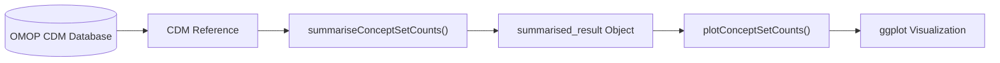
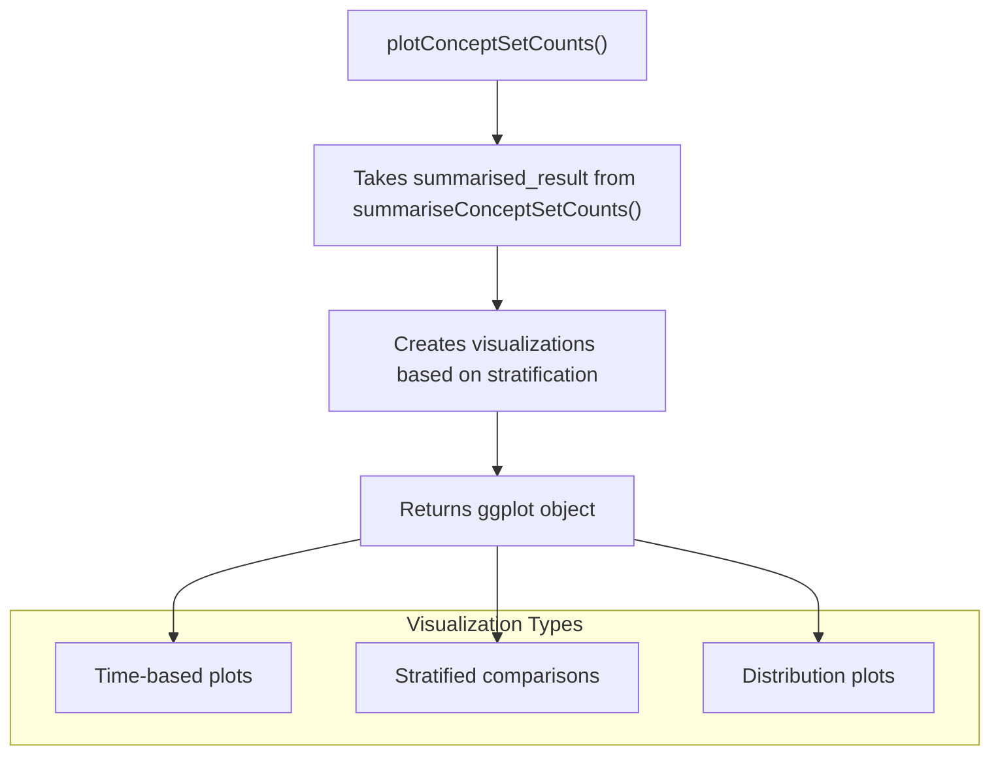
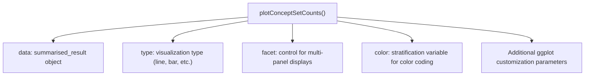
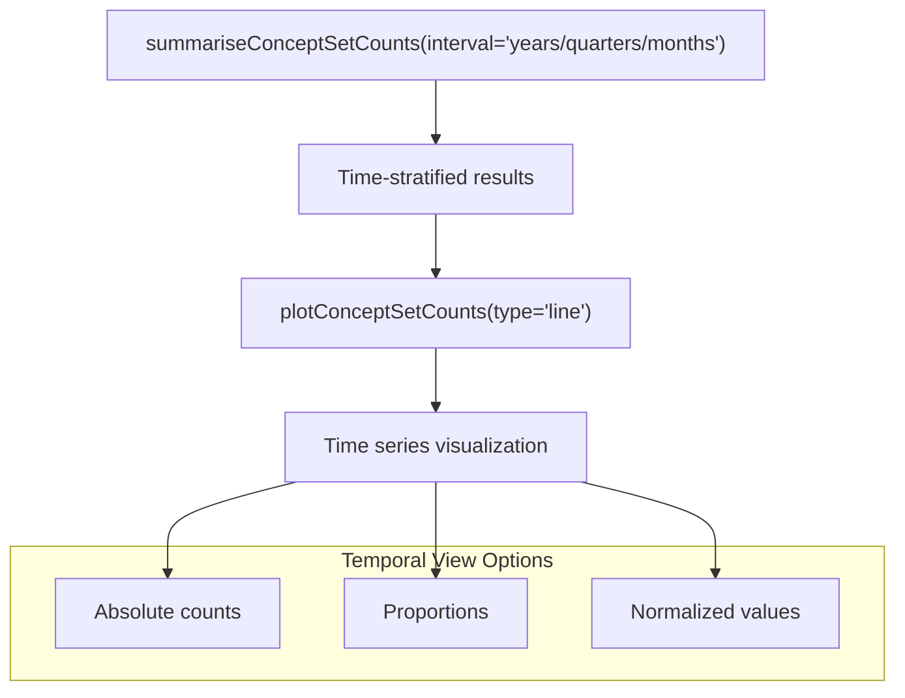
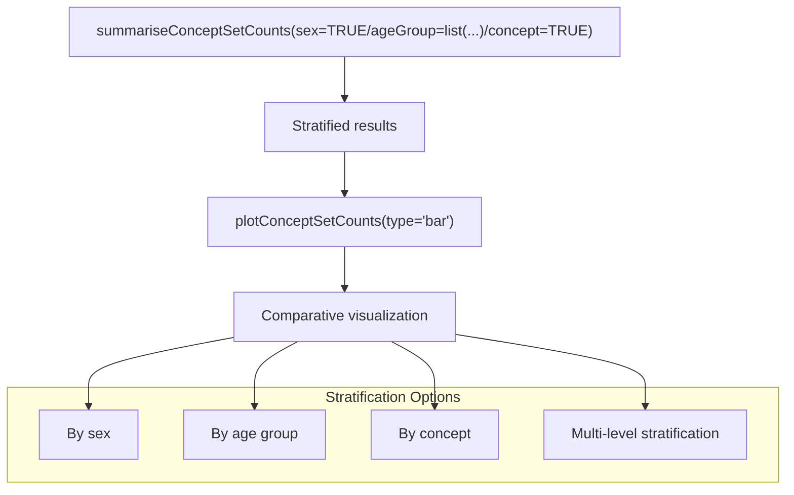
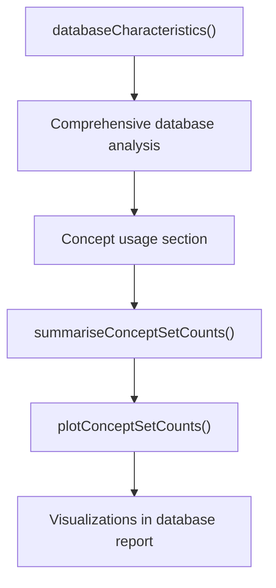

# Page: Plotting Concept Counts

# Plotting Concept Counts

<details>
<summary>Relevant source files</summary>

The following files were used as context for generating this wiki page:

- [R/summariseConceptCounts.R](R/summariseConceptCounts.R)
- [man/OmopSketch-package.Rd](man/OmopSketch-package.Rd)
- [man/summariseConceptCounts.Rd](man/summariseConceptCounts.Rd)

</details>


## Purpose and Scope

This document details the functionality for visualizing concept counts in OMOP Common Data Model (CDM) databases using the OmopSketch package. These visualization functions create graphical representations of concept usage patterns based on summarized concept count data. For information about generating the underlying summarized data, see [Concept Count Summarization](#3.4). For information about creating tabular presentations of this data, see [Concept Count Tables](#5.3).

## Overview of Concept Count Visualization

The OmopSketch package follows a consistent workflow pattern for visualizing concept counts, where summarized data is transformed into meaningful visualizations using dedicated plotting functions.



Sources: [R/summariseConceptCounts.R:1-43]()

## Visualization Functions

The plotting functionality for concept counts revolves around converting the standardized output from summarization functions into visual representations. Note that the original `summariseConceptCounts()` function has been deprecated in favor of `summariseConceptSetCounts()`, as indicated in the source code.



Sources: [R/summariseConceptCounts.R:27-42]()

## Key Parameters and Options

The `plotConceptSetCounts()` function accepts a variety of parameters that control the visualization output, allowing for flexible and customized representations of concept data.



Sources: [R/summariseConceptCounts.R:19-26]()

## Common Visualization Scenarios

### Temporal Analysis of Concept Usage

When analyzing concept usage over time, the plotting functions create time series visualizations that reveal trends, seasonality, and changes in concept prevalence:



Sources: [R/summariseConceptCounts.R:24-25]()

### Comparative Analysis Across Strata

For comparing concept usage across different patient groups or categories:



Sources: [R/summariseConceptCounts.R:23-26]()

## Integration with Database Characterization

The concept count visualization functions are designed to integrate seamlessly with the broader database characterization capabilities of OmopSketch:



Sources: [man/OmopSketch-package.Rd:7-12]()

## Usage Examples

### Basic Concept Count Visualization

```r
# First, summarize concept counts for specific concepts
result <- summariseConceptSetCounts(
  cdm = cdm,
  conceptSet = c(1125315, 1516976, 1557272),  # Example concept IDs
  countBy = "person",
  interval = "years"
)

# Generate a line plot showing trends over years
plot <- plotConceptSetCounts(result, type = "line")
```

### Multi-stratified Visualization

```r
# Summarize with multiple stratification factors
result <- summariseConceptSetCounts(
  cdm = cdm,
  conceptSet = c(1125315, 1516976, 1557272),
  countBy = "person",
  interval = "quarters",
  sex = TRUE,
  ageGroup = list(c(0, 17), c(18, 64), c(65, 100))
)

# Generate faceted plots showing multiple dimensions
plot <- plotConceptSetCounts(
  data = result,
  type = "line",
  facet = "sex + ageGroup"
)
```

## Technical Implementation Notes

- The plotting functions return standard ggplot2 objects, which can be further customized using ggplot2 syntax
- For large concept sets, visualizations may automatically implement sampling or aggregation strategies to maintain performance
- Interactive versions of these visualizations may be available when using OmopSketch within Shiny applications

Sources: [man/summariseConceptCounts.Rd:39-42]()

## Related Functions

While the primary focus of this page is on visualizing concept counts, several closely related functions enhance these capabilities:

| Function | Purpose | Related Page |
|----------|---------|--------------|
| `summariseConceptSetCounts()` | Generate summarized concept count data | [Concept Count Summarization](#3.4) |
| `tableConceptSetCounts()` | Create tabular representations of concept counts | [Concept Count Tables](#5.3) |
| `plotRecordCount()` | Visualize overall record counts across domains | [Plotting Record Counts](#4.1) |

Sources: [man/summariseConceptCounts.Rd:5-17]()