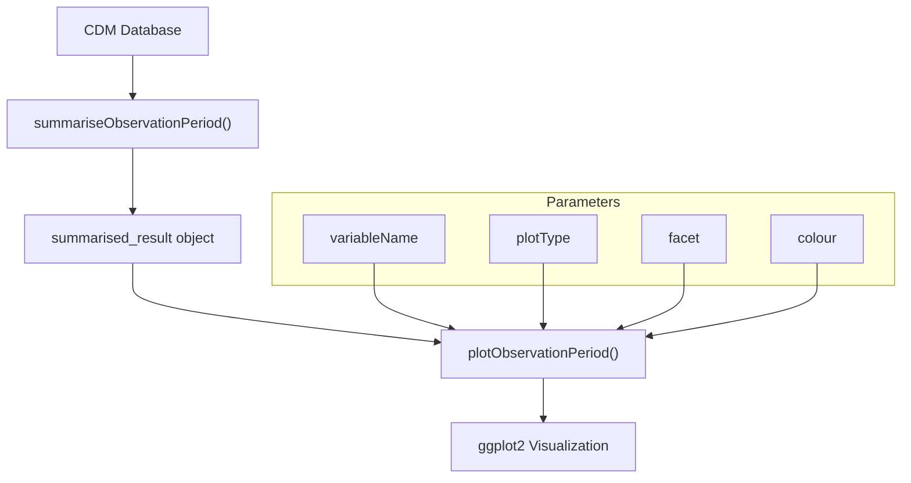
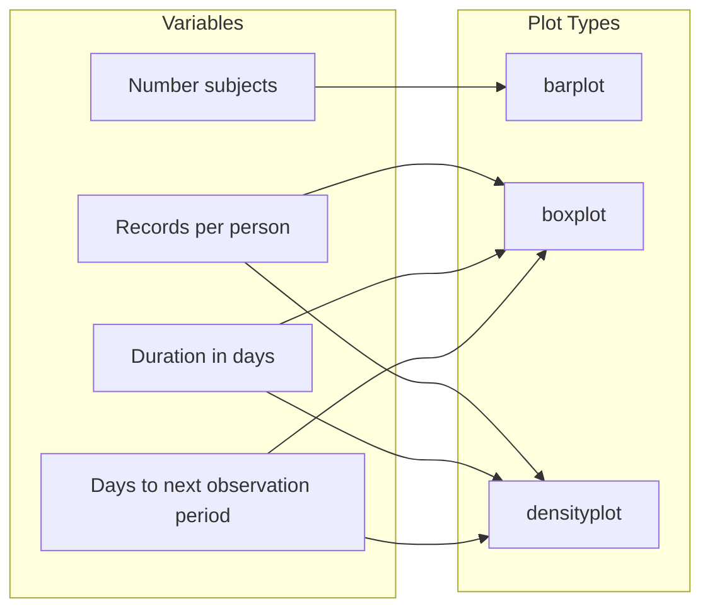
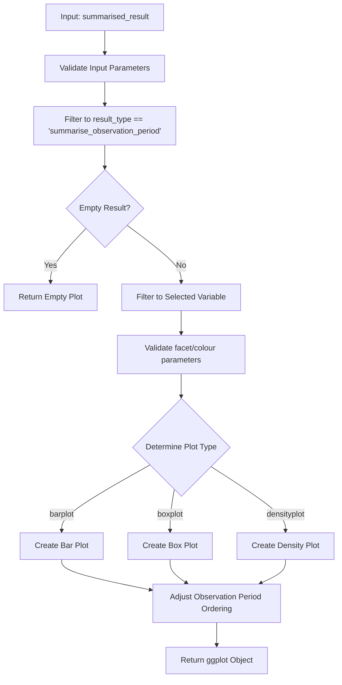
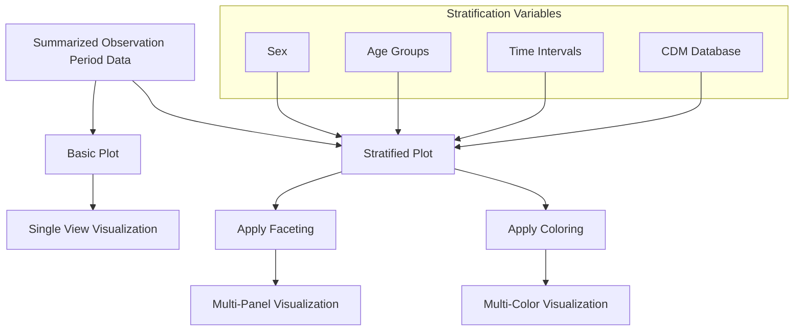

# Page: Plotting Observation Periods

# Plotting Observation Periods

<details>
<summary>Relevant source files</summary>

The following files were used as context for generating this wiki page:

- [R/plotObservationPeriod.R](R/plotObservationPeriod.R)
- [man/plotObservationPeriod.Rd](man/plotObservationPeriod.Rd)
- [tests/testthat/test-plotInObservation.R](tests/testthat/test-plotInObservation.R)
- [tests/testthat/test-summariseInObservation.R](tests/testthat/test-summariseInObservation.R)

</details>


This page documents the visualization capabilities for observation periods in the OmopSketch package. Observation period plots help researchers understand temporal patterns of patient data within the database, including duration, frequency, and distribution of observation periods. For information about summarizing observation periods, see [Observation Period Summarization](#3.2) or [In-Observation Summarization](#3.3).

## Overview

The OmopSketch package provides specialized functions for visualizing observation period data through the `plotObservationPeriod()` function. This function converts summarized observation period data into various plot types to facilitate data exploration and analysis.



Sources: [R/plotObservationPeriod.R:1-28]()

## Function Signature and Parameters

The `plotObservationPeriod()` function transforms a `summarised_result` object (from `summariseObservationPeriod()`) into a ggplot2 visualization:

```
plotObservationPeriod(
  result,
  variableName = "Number subjects",
  plotType = "barplot",
  facet = NULL,
  colour = NULL
)
```

### Parameters:

| Parameter | Description | Default | Available Options |
|-----------|-------------|---------|-------------------|
| result | A summarised_result object from summariseObservationPeriod() | (required) | - |
| variableName | The variable to visualize | "Number subjects" | "Number subjects", "Records per person", "Duration in days", "Days to next observation period" |
| plotType | Type of visualization | "barplot" | "barplot", "boxplot", "densityplot" |
| facet | Columns to use for faceting the plot | NULL | "cdm_name", "observation_period_ordinal", or any strata columns |
| colour | Columns to use for coloring plot elements | NULL | Any valid column from the result |

Sources: [R/plotObservationPeriod.R:28-35](), [man/plotObservationPeriod.Rd:6-13]()

## Available Plot Types and Variables

Not all combinations of variables and plot types are valid. The function supports specific pairings based on the nature of the data being visualized:



Valid combinations are determined by the `availablePlotObservationPeriod()` function, which defines the appropriate plot types for each variable.

Sources: [R/plotObservationPeriod.R:126-137]()

## Internal Workflow

The function processes and transforms the input data in several steps before generating the visualization:



Sources: [R/plotObservationPeriod.R:32-124]()

## Plot Types and Their Uses

### Barplot
Used primarily for count data, especially for visualizing the number of subjects in each observation period. This plot type helps understand the distribution of patients across different observation periods.

### Boxplot
Used for visualizing the distribution of continuous variables like duration or days between observation periods. Boxplots show the median, quartiles, and outliers, making them ideal for understanding the central tendency and spread of these variables.

### Density Plot
Useful for visualizing the distribution of continuous variables across the entire range of values. Density plots show the probability density of a variable, making them valuable for understanding the shape of distributions.

Sources: [R/plotObservationPeriod.R:78-108]()

## Example Usage

Here's a typical usage pattern for creating observation period plots:

1. Connect to a CDM database
2. Generate summarized observation period data
3. Create plots from the summarized data

```r
# Connect to database (or use mock data)
cdm <- mockOmopSketch(numberIndividuals = 100)

# Generate summary data
result <- summariseObservationPeriod(cdm$observation_period)

# Create visualization
plot <- result |>
  plotObservationPeriod(
    variableName = "Duration in days",
    plotType = "boxplot"
  )

# Display the plot
print(plot)
```

Sources: [man/plotObservationPeriod.Rd:36-50]()

## Customization and Stratification

The function allows for extensive customization through faceting and coloring, which is especially useful when data is stratified by demographic factors:



Sources: [R/plotObservationPeriod.R:60-66](), [tests/testthat/test-plotInObservation.R:34-66]()

## Integration with visOmopResults

The `plotObservationPeriod()` function leverages the `visOmopResults` package for the actual plotting. It prepares and transforms the data, then delegates the creation of the plot to specialized functions in visOmopResults:

- `barPlot()` for creating bar plots
- `boxPlot()` for creating box plots
- `scatterPlot()` for creating density plots (with line=TRUE and point=FALSE)

This integration allows for consistent visualization across the OmopSketch package while maintaining a simple interface for users.

Sources: [R/plotObservationPeriod.R:78-108]()

## Special Handling of Observation Period Ordinals

The function includes special logic to handle observation period ordinals, ensuring that they are displayed in the correct order in plots:

1. Extracts numeric values from the ordinal strings
2. Treats "all" as a special case (assigned order 0)
3. Creates a factor with levels ordered by the numeric values
4. Applies this ordering to the plot data

This ensures that observation periods are displayed in a logical sequence (e.g., first, second, third) rather than alphabetically.

Sources: [R/plotObservationPeriod.R:109-122]()

## Related Functions

### plotInObservation()

While `plotObservationPeriod()` visualizes the characteristics of observation periods themselves, the related `plotInObservation()` function visualizes data about subjects within observation periods. This includes metrics like:

- Number of records in observation
- Number of person-days in observation

Sources: [tests/testthat/test-plotInObservation.R:1-69]()

### tableObservationPeriod()

For tabular presentation of observation period data rather than graphical visualization, the `tableObservationPeriod()` function can be used. See [Observation Period Tables](#5.2) for more information.

## Error Handling and Edge Cases

The function includes comprehensive error handling:

1. Validates input parameters against allowed values
2. Checks if the result is empty and returns an empty plot with a warning
3. Handles special cases like missing group columns

This robust error handling ensures that the function behaves predictably even with unexpected inputs.

Sources: [R/plotObservationPeriod.R:36-48](), [R/plotObservationPeriod.R:73-76]()