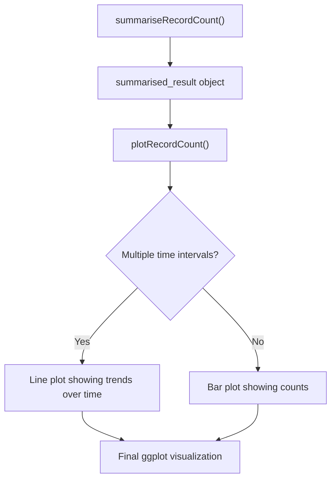
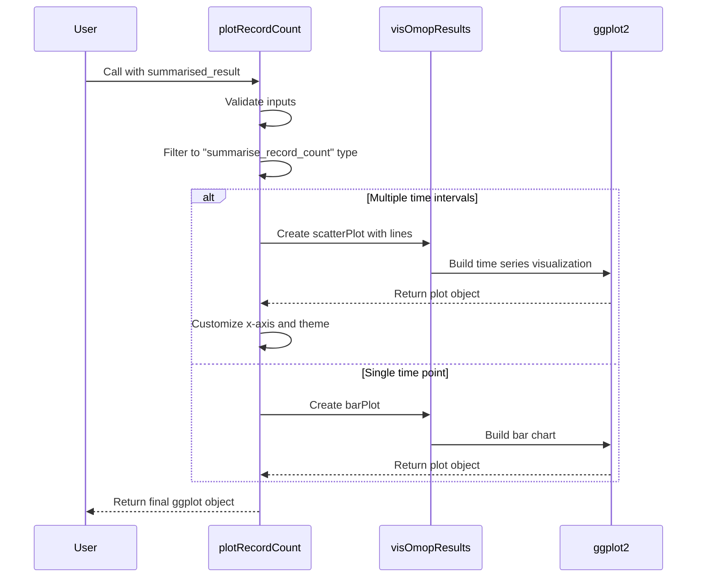
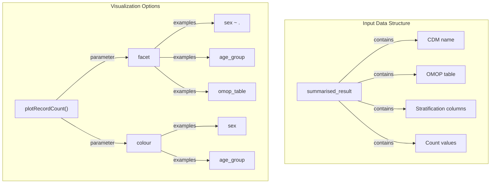
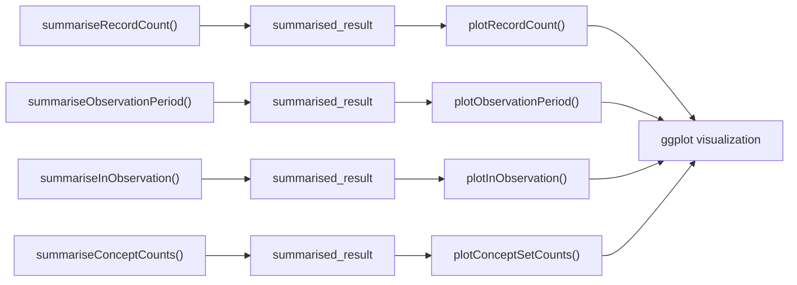

# Page: Plotting Record Counts

# Plotting Record Counts

<details>
<summary>Relevant source files</summary>

The following files were used as context for generating this wiki page:

- [R/plotInObservation.R](R/plotInObservation.R)
- [R/plotRecordCount.R](R/plotRecordCount.R)
- [tests/testthat/test-summariseRecordCount.R](tests/testthat/test-summariseRecordCount.R)

</details>


## Overview

This page documents the `plotRecordCount()` function, which creates visualizations of record counts from OMOP CDM tables. This function works with the output of `summariseRecordCount()` to generate time series plots or bar charts that display the frequency of records across different OMOP tables.

For information about summarizing record counts, see [Record Count Summarization](#3.6).

Sources: [R/plotRecordCount.R:1-101]()

## Function Purpose and Workflow

The `plotRecordCount()` function is part of OmopSketch's visualization layer, taking summarized record count data and converting it into standardized visual representations. The function automatically determines whether to create a time series line plot or a bar chart based on the structure of the input data.



Sources: [R/plotRecordCount.R:25-101](), [tests/testthat/test-summariseRecordCount.R:100-118]()

## Function Signature and Parameters

```
plotRecordCount(result, facet = NULL, colour = NULL)
```

| Parameter | Type | Description |
|-----------|------|-------------|
| `result` | object | Required. A summarised_result object from `summariseRecordCount()` |
| `facet` | formula or character | Optional. Column names to facet by |
| `colour` | character | Optional. Column name to color by |

Sources: [R/plotRecordCount.R:25-27]()

## Implementation Details

The function follows a consistent pattern:

1. Validate input parameters
2. Filter for records with `result_type` equal to "summarise_record_count"
3. Determine if there are multiple time intervals in the data
4. Generate appropriate visualization based on time interval presence



Sources: [R/plotRecordCount.R:32-100]()

## Visualization Types

### Time Series Plot

When the summarized data contains multiple time intervals (specified via the `interval` parameter in `summariseRecordCount()`), the function creates a line plot with the following characteristics:

- X-axis: Time intervals
- Y-axis: Record counts
- Points and connecting lines for visual clarity
- Customizable faceting and coloring
- Automatic date label optimization to prevent overcrowding

The time series visualization is particularly useful for identifying trends in data recording patterns over time.

Sources: [R/plotRecordCount.R:45-85]()

### Bar Chart

For data with a single time point, the function creates a simple bar chart:

- X-axis: Variable name ("Number records")
- Y-axis: Count values
- Customizable faceting and coloring

This visualization is ideal for comparing record counts across different groups at a single point in time.

Sources: [R/plotRecordCount.R:87-97]()

## Customization with Facets and Colors

The function supports visualization customization through faceting and coloring:



Common stratification columns that can be used for faceting or coloring include:
- `sex`: Male/Female stratification
- `age_group`: Age group stratification (if provided to `summariseRecordCount()`)
- `omop_table`: Different OMOP tables being compared

Sources: [R/plotRecordCount.R:54-58](), [tests/testthat/test-summariseRecordCount.R:110-112]()

## Error Handling

The function has the following error checks:

1. Validates that the `result` argument is a proper summarised_result object
2. Ensures that the facet parameter is valid for the given data
3. Aborts with a helpful error message if no records with "summarise_record_count" type are found

Sources: [R/plotRecordCount.R:32-42]()

## Examples

The function can be used to visualize record counts with various customizations:

1. Basic plot of record counts over time:
```r
result <- summariseRecordCount(cdm, "drug_exposure", interval = "years")
plotRecordCount(result)
```

2. Comparing multiple OMOP tables with faceting:
```r
result <- summariseRecordCount(cdm, c("condition_occurrence", "drug_exposure"), interval = "years")
plotRecordCount(result, facet = "omop_table")
```

3. Stratified visualization by demographic characteristics:
```r
result <- summariseRecordCount(
  cdm, 
  "condition_occurrence",
  ageGroup = list("<=20" = c(0, 20), ">20" = c(21, Inf)),
  sex = TRUE
)
plotRecordCount(result, colour = "age_group", facet = sex ~ .)
```

Sources: [tests/testthat/test-summariseRecordCount.R:104-115](), [R/plotRecordCount.R:11-24]()

## Related Functions

The `plotRecordCount()` function is part of a family of visualization functions in OmopSketch:



For related visualization functions, see:
- [Plotting Observation Periods](#4.2)
- [Plotting Concept Counts](#4.3)

Sources: [R/plotRecordCount.R:1-101](), [R/plotInObservation.R:1-106]()