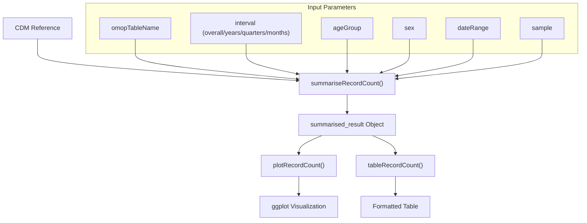
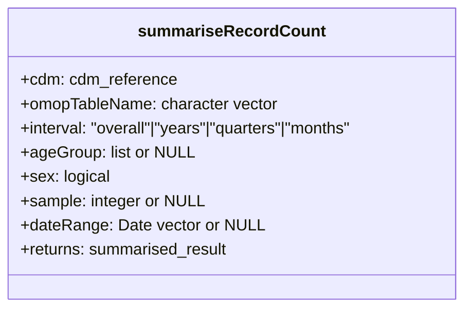
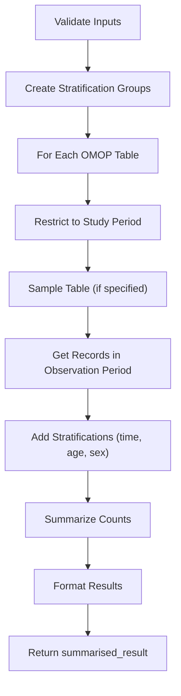
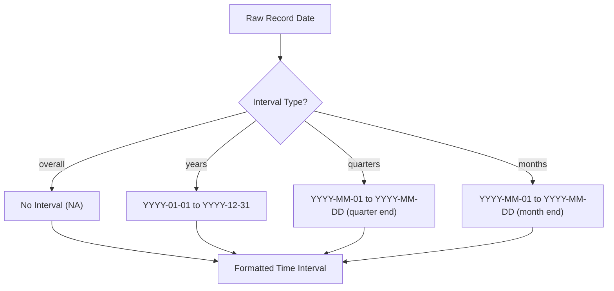
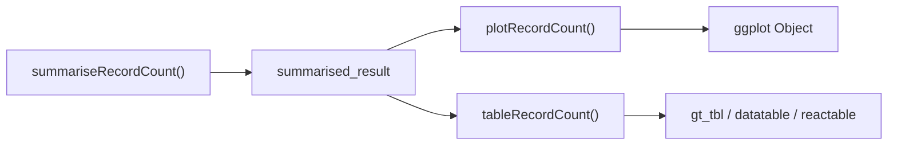
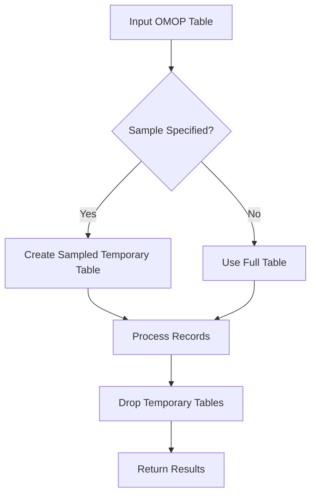

# Page: Record Count Summarization

# Record Count Summarization

<details>
<summary>Relevant source files</summary>

The following files were used as context for generating this wiki page:

- [R/summariseClinicalRecords.R](R/summariseClinicalRecords.R)
- [R/summariseRecordCount.R](R/summariseRecordCount.R)
- [tests/testthat/test-summariseRecordCount.R](tests/testthat/test-summariseRecordCount.R)

</details>


## Purpose and Scope

The Record Count Summarization system provides functions for counting and analyzing the temporal distribution of records across OMOP Common Data Model (CDM) tables. This system focuses specifically on quantifying record counts over different time intervals, with optional demographic stratification. Unlike the more detailed Clinical Records Summarization (see [Clinical Records Summarization](#3.1)), which provides comprehensive information about record contents, this system emphasizes temporal patterns and volume of records across the database.

## Overview and Architecture

The Record Count Summarization system takes an OMOP CDM database as input, counts records in specified tables, stratifies them by time intervals, and returns the results in a standardized format that can be visualized or tabulated.



Sources: [R/summariseRecordCount.R:33-132]()

## Core Function

The main function `summariseRecordCount()` processes OMOP tables to count records, filtered by the observation period and optionally stratified by time intervals, age groups, and sex.

### Function Signature and Parameters



- **cdm**: A validated CDM reference object
- **omopTableName**: One or more OMOP table names to analyze (e.g., "condition_occurrence", "drug_exposure")
- **interval**: Time granularity for stratification ("overall", "years", "quarters", "months")
- **ageGroup**: Optional list of age ranges for stratification
- **sex**: Boolean flag to enable stratification by sex
- **sample**: Optional integer to limit analysis to a sample of records
- **dateRange**: Optional date range to restrict the analysis period

Sources: [R/summariseRecordCount.R:33-39]()

## Processing Workflow

The `summariseRecordCount()` function follows this workflow:



Sources: [R/summariseRecordCount.R:33-132]()

## Time Interval Processing

The system handles different time intervals through the `addTimeInterval()` function, which formats dates according to the specified interval:



Sources: [R/summariseRecordCount.R:134-166]()

## Key Internal Components

The record count summarization relies on several supporting functions:

1. **addTimeInterval()**: Formats time intervals into human-readable ranges
2. **getVariableLevel()**: Extracts variable levels from time intervals
3. **strataCols()**: Creates stratification configurations
4. **summariseCountsInternal()**: Performs the actual counting and summarization

Sources: [R/summariseRecordCount.R:134-171]()

## Output Format

The function returns a standardized `summarised_result` object with the following structure:

| Column | Description |
|--------|-------------|
| group_name | Identifies the table being summarized |
| group_level | The specific OMOP table name |
| strata_name | Type of stratification ("overall", age and/or sex) |
| strata_level | Value for the stratification |
| additional_name | Indicates presence of additional stratification |
| additional_level | The time interval value (when applicable) |
| variable_name | Always "Number records" for this function |
| variable_level | Typically not used for record counts |
| estimate_name | Always "count" for this function |
| estimate_value | The numeric count value |
| estimate_type | The data type of the estimate ("integer") |

Sources: [R/summariseRecordCount.R:116-124]()

## Integration with Visualization and Tables

The returned `summarised_result` object can be directly passed to:

1. **plotRecordCount()**: Creates temporal visualizations of record counts
2. **tableRecordCount()**: Generates formatted tables with the record counts



Sources: [tests/testthat/test-summariseRecordCount.R:100-118](), [tests/testthat/test-summariseRecordCount.R:373-387]()

## Usage Examples

### Basic Record Count by Year

```r
summarisedResult <- summariseRecordCount(
  cdm = cdm,
  omopTableName = "condition_occurrence",
  interval = "years"
)
```

### Record Count with Demographic Stratification

```r
summarisedResult <- summariseRecordCount(
  cdm = cdm,
  omopTableName = c("condition_occurrence", "drug_exposure"),
  interval = "months",
  ageGroup = list("<=20" = c(0, 20), ">20" = c(21, Inf)),
  sex = TRUE
)
```

Sources: [tests/testthat/test-summariseRecordCount.R:20-26](), [tests/testthat/test-summariseRecordCount.R:164-167]()

## Technical Implementation Details

### Record Filtering Process

The system follows these steps to ensure accurate record counts:

1. Validates the CDM reference and parameters
2. For each specified table, applies any date range restrictions
3. Samples the table if a sample size is specified
4. Joins with observation_period to ensure records are within valid observation periods
5. Adds demographic stratifications as requested (age and sex)
6. Aggregates counts by the specified time interval and stratifications

Sources: [R/summariseRecordCount.R:60-128]()

### Performance Considerations

For large databases, the system includes two optimization features:

1. **Sample parameter**: Allows analyzing only a subset of records to improve performance
2. **Temporary table management**: Creates and drops temporary tables efficiently



Sources: [R/summariseRecordCount.R:74-75](), [R/summariseRecordCount.R:126-131]()

## Related Functions

The Record Count Summarization system works alongside these related OmopSketch functions:

| Function | Relationship |
|----------|--------------|
| plotRecordCount() | Visualizes the results of summariseRecordCount() |
| tableRecordCount() | Creates formatted tables from summariseRecordCount() results |
| summariseClinicalRecords() | Provides more detailed analysis of clinical record content |
| summariseObservationPeriod() | Analyzes observation periods rather than specific records |

Sources: [tests/testthat/test-summariseRecordCount.R:100-118](), [tests/testthat/test-summariseRecordCount.R:373-387]()