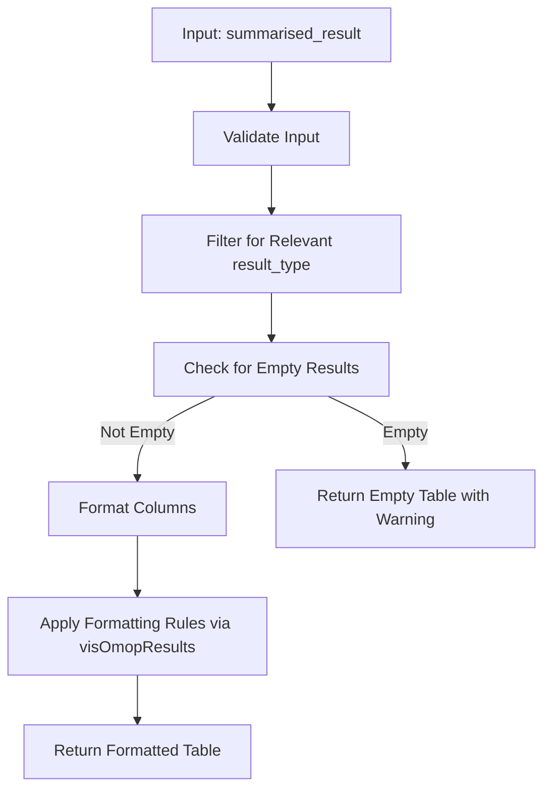
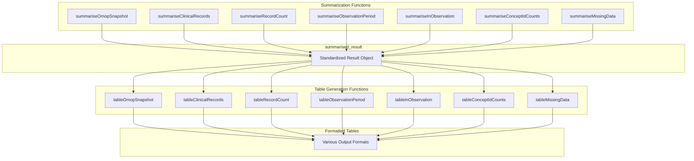
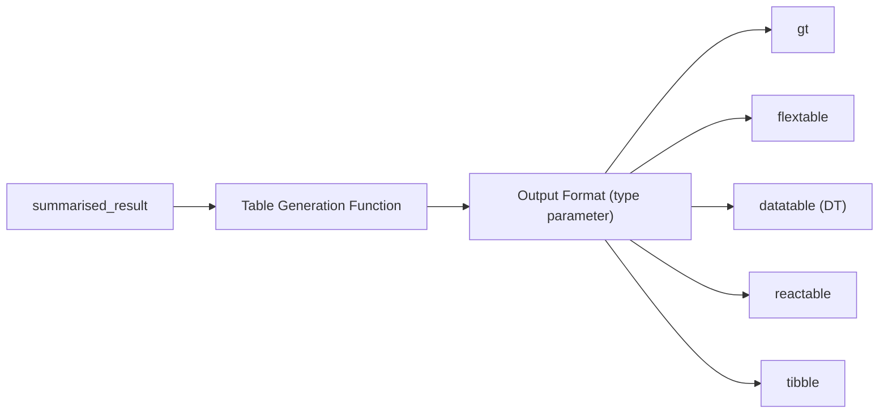
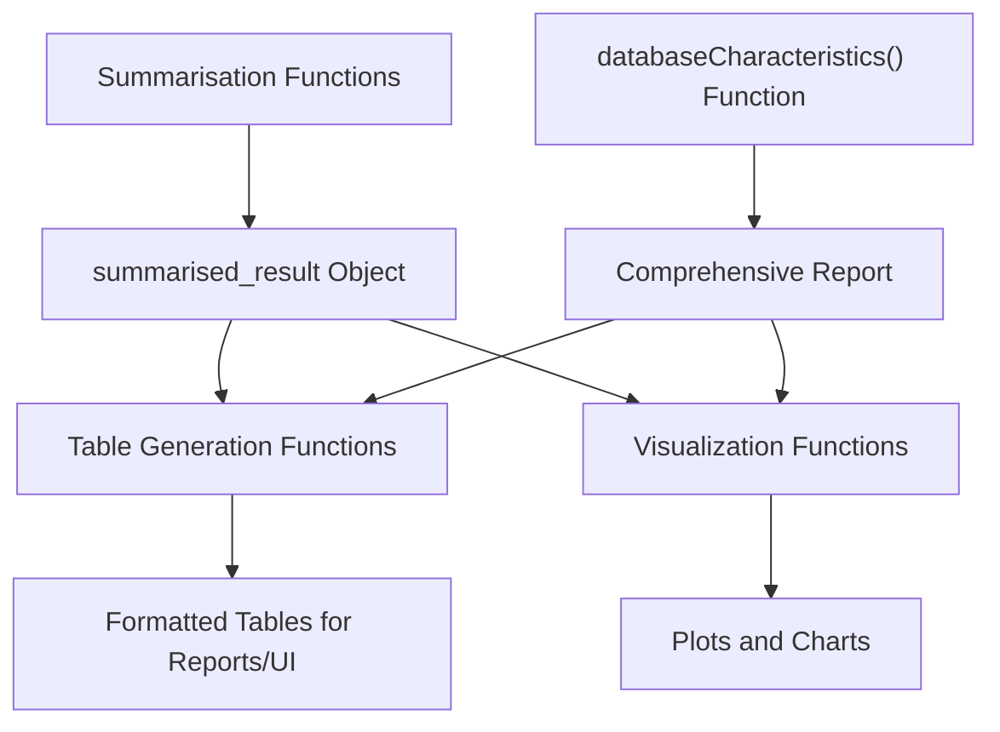

# Page: Table Generation Functions

# Table Generation Functions

<details>
<summary>Relevant source files</summary>

The following files were used as context for generating this wiki page:

- [DESCRIPTION](DESCRIPTION)
- [NAMESPACE](NAMESPACE)
- [R/tableClinicalRecords.R](R/tableClinicalRecords.R)
- [R/tableObservationPeriod.R](R/tableObservationPeriod.R)
- [R/tableOmopSnapshot.R](R/tableOmopSnapshot.R)

</details>


## Introduction

Table generation functions in OmopSketch transform summarized OMOP CDM data into formatted tables for reports, dashboards, and data exploration. These functions serve as the final step in the data-to-visualization pipeline, taking standardized `summarised_result` objects produced by summarization functions and converting them into formatted tables.

For visualization of the same data in graphical form, see [Visualization Functions](#4).

## Function Pattern and Data Flow

All table generation functions in OmopSketch follow a consistent implementation pattern:



Sources: [R/tableOmopSnapshot.R:17-56](), [R/tableClinicalRecords.R:28-63](), [R/tableObservationPeriod.R:16-62]()

## Available Functions

The package includes table generation functions corresponding to each type of data summarization:

| Table Function | Description | Corresponding Summarization Function |
|----------------|-------------|--------------------------------------|
| `tableOmopSnapshot` | Tables from database snapshot summaries | `summariseOmopSnapshot` |
| `tableClinicalRecords` | Tables from clinical records summaries | `summariseClinicalRecords` |
| `tableRecordCount` | Tables from record count summaries | `summariseRecordCount` |
| `tableObservationPeriod` | Tables from observation period summaries | `summariseObservationPeriod` |
| `tableInObservation` | Tables from in-observation summaries | `summariseInObservation` |
| `tableConceptIdCounts` | Tables from concept ID count summaries | `summariseConceptIdCounts` |
| `tableMissingData` | Tables from missing data summaries | `summariseMissingData` |

For detailed documentation of specific table functions, see:
- [Clinical Records Tables](#5.1)
- [Observation Period Tables](#5.2)
- [Concept Count Tables](#5.3)

Sources: [NAMESPACE:23-29]()

## Relationship Between Summarization and Table Functions

The following diagram illustrates the relationship between summarization functions and their corresponding table generation functions:



Sources: [NAMESPACE:13-29]()

## Output Formats

Each table function supports multiple output formats through the `type` parameter:



The supported output formats include:

| Format | Package | Type | Description |
|--------|---------|------|-------------|
| `"gt"` | gt | Static | Grammar of tables for publication-ready tables |
| `"flextable"` | flextable | Static | Formatting tables for reporting and publication |
| `"datatable"` | DT | Interactive | Interactive HTML tables with sorting, filtering |
| `"reactable"` | reactable | Interactive | Interactive React-based data tables |
| `"tibble"` | tibble | Data | Plain tibble output for further processing |

Sources: [R/tableOmopSnapshot.R:17-56](), [R/tableObservationPeriod.R:16-62](), [DESCRIPTION:40-53]()

## Implementation Details

The table generation functions share several common implementation features:

1. **Input Validation**: Each function validates the input is a proper `summarised_result` object using `omopgenerics::validateResultArgument(result)` and that the requested output format is supported through `omopgenerics::assertChoice(type, visOmopResults::tableType())`.

2. **Result Filtering**: Functions filter the input data to include only results of the appropriate type using `omopgenerics::filterSettings()`. For example, `tableObservationPeriod` filters for `result_type == "summarise_observation_period"`.

3. **Empty Result Handling**: Functions check if results are empty after filtering and return an empty table with an appropriate warning using the `emptyTable()` and `warnEmpty()` helper functions.

4. **Column Formatting**: Text in columns is formatted for readability (e.g., converting snake_case to Title Case) using the `formatColumn()` helper function.

5. **Table Generation**: The functions leverage `visOmopResults::visOmopTable()` for consistent table formatting across different output types.

Sources: [R/tableOmopSnapshot.R:17-82](), [R/tableClinicalRecords.R:28-63](), [R/tableObservationPeriod.R:16-62]()

## Common Parameters

All table generation functions share two primary parameters:

| Parameter | Description | Default |
|-----------|-------------|---------|
| `result` | A `summarised_result` object from a summarization function | Required |
| `type` | Output table format (`"gt"`, `"flextable"`, `"datatable"`, `"reactable"`, `"tibble"`) | `"gt"` |

Sources: [R/tableOmopSnapshot.R:1-16](), [R/tableClinicalRecords.R:1-27](), [R/tableObservationPeriod.R:1-15]()

## Helper Functions

The table generation functions use several common helper functions:

1. **`warnEmpty(resultType)`** - Issues a warning when a result does not contain any data of the specified result type

2. **`emptyTable(type)`** - Creates an empty table of the requested output format when no data is available

3. **`formatColumn(result, col)`** - Formats column text by converting snake_case to Title Case for better readability

Sources: [R/tableOmopSnapshot.R:58-82]()

## Usage Examples

Basic example of the table generation workflow:

```r
# Create a mock CDM reference
cdm <- mockOmopSketch()

# Generate a summarized result
result <- summariseOmopSnapshot(cdm)

# Create a formatted table
table <- tableOmopSnapshot(result, type = "gt")
```

For clinical records with privacy suppression:

```r
# Summarize clinical records
result <- summariseClinicalRecords(
  cdm = cdm,
  omopTableName = c("condition_occurrence", "drug_exposure"),
  recordsPerPerson = c("mean", "sd"),
  inObservation = TRUE,
  standardConcept = TRUE
)

# Apply suppression for privacy
suppressed_result <- suppress(result, minCellCount = 5)

# Create a formatted table
table <- tableClinicalRecords(suppressed_result, type = "flextable")
```

Sources: [R/tableOmopSnapshot.R:6-16](), [R/tableClinicalRecords.R:7-27]()

## Relationship to Other Components

Table generation functions serve as one of two primary output channels for summarized data in OmopSketch:



While [Visualization Functions](#4) create graphical representations of the data, table functions provide structured tabular views of the same information, offering complementary ways to explore and present OMOP CDM data characteristics.

Sources: [NAMESPACE:4-29]()