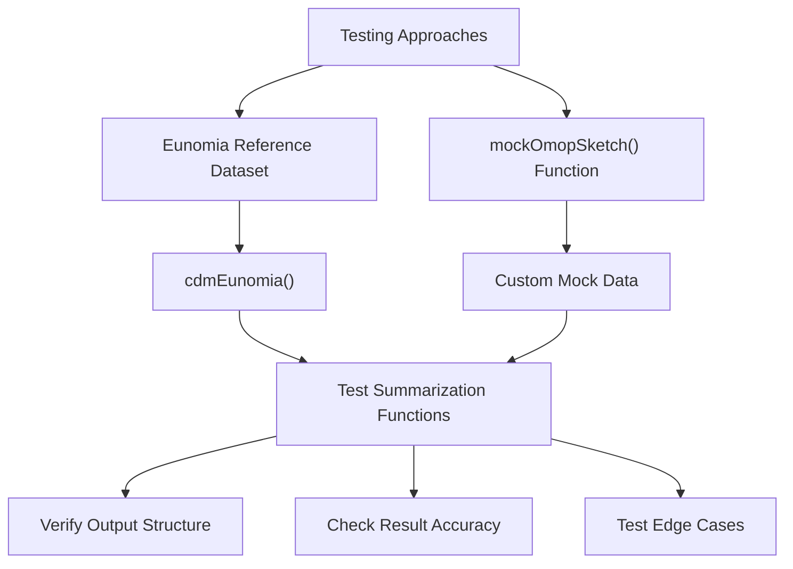
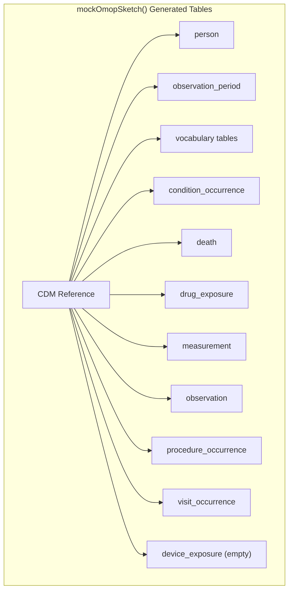
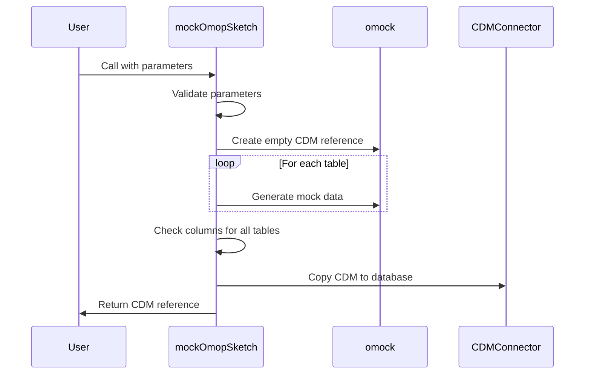
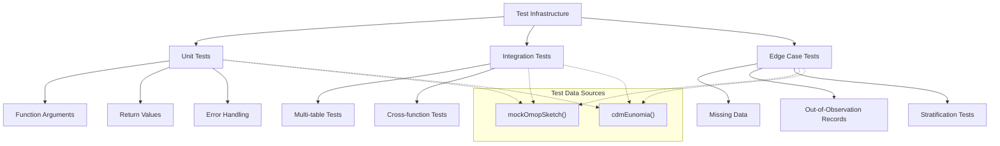
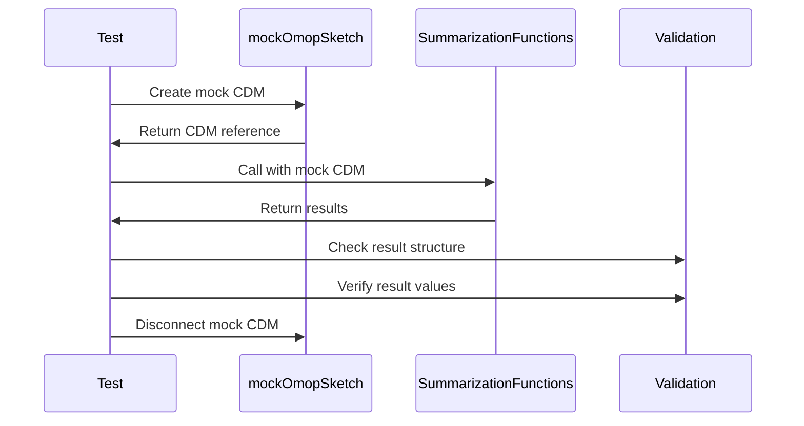
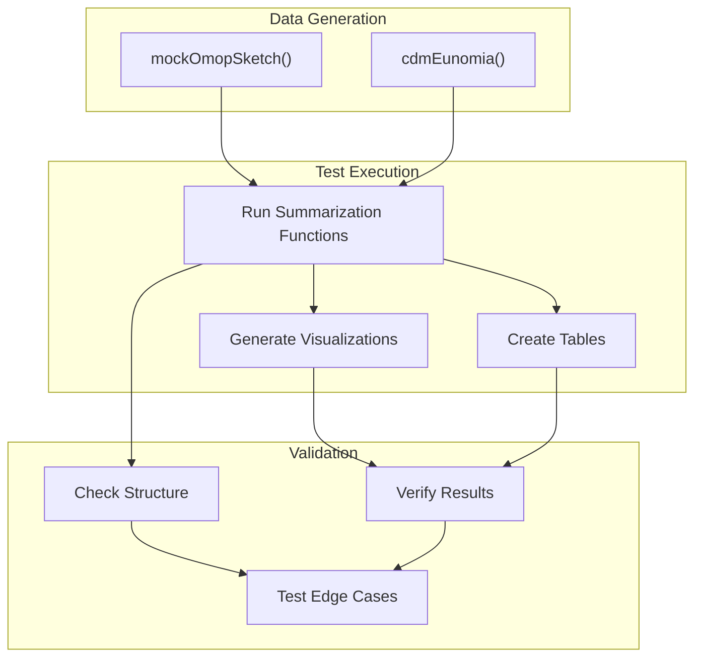

# Page: Testing and Mock Data

# Testing and Mock Data

<details>
<summary>Relevant source files</summary>

The following files were used as context for generating this wiki page:

- [.Rbuildignore](.Rbuildignore)
- [.gitignore](.gitignore)
- [R/mockOmopSketch.R](R/mockOmopSketch.R)
- [cran-comments.md](cran-comments.md)
- [extras/summariseBenchmark.R](extras/summariseBenchmark.R)
- [man/mockOmopSketch.Rd](man/mockOmopSketch.Rd)
- [tests/testthat/setup.R](tests/testthat/setup.R)
- [tests/testthat/test-summariseClinicalRecords.R](tests/testthat/test-summariseClinicalRecords.R)

</details>


This page documents the testing infrastructure and mock data generation capabilities in the OmopSketch package. Understanding how testing is implemented and how to generate mock data is critical for developers contributing to the package and users who need to verify functionality without access to real OMOP CDM databases.

## Overview

OmopSketch includes a robust testing framework and mock data generation system to facilitate:

1. Unit testing of package functions
2. Validation of results against expected outputs
3. Development without requiring connection to real OMOP CDM databases
4. Examples and demonstrations of package capabilities

The testing infrastructure primarily relies on two approaches for test data:
- Using the Eunomia reference dataset
- Generating custom mock OMOP CDM data via the `mockOmopSketch()` function



Sources: [tests/testthat/setup.R:18-48](), [R/mockOmopSketch.R:1-60]()

## Mock Data Generation with `mockOmopSketch()`

The `mockOmopSketch()` function creates a complete mock OMOP CDM database for testing and demonstration purposes. This function generates synthetic patient data with realistic patterns to test OmopSketch functions.

### Function Parameters

| Parameter | Description | Default |
|-----------|-------------|---------|
| `con` | A DBI connection object | In-memory duckdb connection |
| `writeSchema` | Schema name with writing permissions | "main" for duckdb connections |
| `numberIndividuals` | Number of individuals to create | 100 |
| `seed` | Optional seed for reproducible data generation | NULL |

### Generated Tables

The function creates a comprehensive set of OMOP CDM tables:



Sources: [R/mockOmopSketch.R:20-60]()

### Implementation Details

The `mockOmopSketch()` function builds a mock CDM reference by:

1. Creating an in-memory database connection (if not provided)
2. Using the `omock` package to generate mock tables with synthetic data
3. Ensuring all tables have the correct OMOP CDM column structure
4. Copying the data to the specified database connection and schema



Sources: [R/mockOmopSketch.R:20-60]()

## Using Eunomia for Testing

The package also uses the Eunomia dataset, a standardized reference dataset for the OMOP CDM format. The `cdmEunomia()` function in the test setup creates a test CDM reference based on Eunomia data.

### Eunomia Setup Process

1. Download Eunomia data if needed
2. Create a database connection
3. Load the Eunomia data into the connection
4. Fix any data inconsistencies
5. Return a CDM reference object for testing

Sources: [tests/testthat/setup.R:18-48]()

## Test Infrastructure

The test infrastructure employs the `testthat` framework to systematically test package functionality. Tests are organized to verify that each summarization function works correctly with different data sources.

### Key Testing Strategies



Sources: [tests/testthat/test-summariseClinicalRecords.R:1-400]()

### Helper Functions

Several helper functions facilitate testing:

| Function | Purpose |
|----------|---------|
| `checkResultType()` | Verifies the result type of summarization functions |
| `sortTibble()` | Sorts a tibble for consistent comparison |
| `connection()` | Creates a database connection for testing |
| `copyCdm()` | Copies a CDM reference to a test database |

Sources: [tests/testthat/setup.R:85-95]()

## Example Test Cases

The test files demonstrate a range of test cases:

1. **Basic functionality tests**: Verify that functions work with various OMOP tables
2. **Stratification tests**: Check that stratification by sex and age groups works correctly
3. **Date range tests**: Ensure that filtering by date ranges functions as expected
4. **Edge cases**: Test handling of missing data, out-of-observation records, etc.
5. **Table generation**: Verify that table generation functions produce the expected output

### Testing with Mock Data

Here's an example of how mock data is used in tests:



Sources: [tests/testthat/test-summariseClinicalRecords.R:307-319]()

## Creating Custom Mock Data for Development

Developers and users can create customized mock data for their own testing needs. The `mockOmopSketch()` function is exported and documented, making it available for general use.

### Example Usage

```r
# Create a basic mock CDM with 100 patients
cdm <- mockOmopSketch(numberIndividuals = 100)

# Create a mock CDM with reproducible data
cdm <- mockOmopSketch(numberIndividuals = 500, seed = 123)

# Create a mock CDM in a specific database
cdm <- mockOmopSketch(
  con = DBI::dbConnect(duckdb::duckdb(), "my_database.duckdb"),
  writeSchema = "cdm",
  numberIndividuals = 1000
)

# Run a summarization function on mock data
result <- summariseClinicalRecords(cdm, "condition_occurrence")
```

Sources: [R/mockOmopSketch.R:16-19]()

## Data Flow in Testing

The following diagram illustrates the flow of mock data through the testing infrastructure:



Sources: [tests/testthat/test-summariseClinicalRecords.R:1-400](), [R/mockOmopSketch.R:1-92]()

## Conclusion

The testing and mock data generation infrastructure in OmopSketch enables thorough testing of package functionality and provides developers and users with tools to create synthetic OMOP CDM data for development and testing purposes. This system is crucial for maintaining the reliability and quality of the package.

For information on how the data summarization functions work, see [Core Summarization Functions](#3).