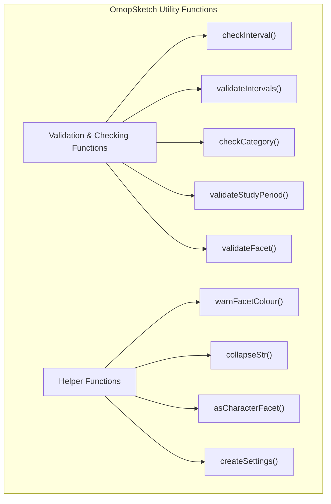
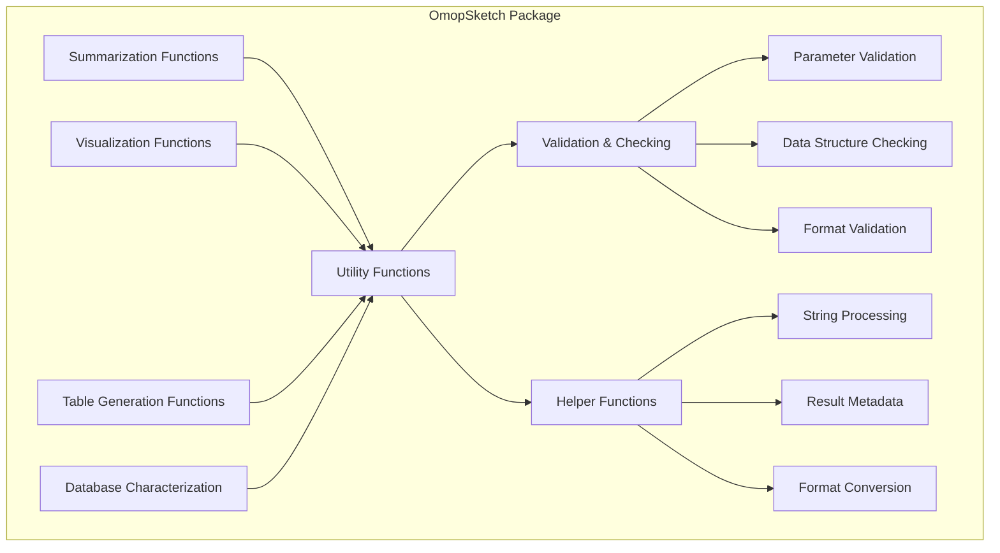
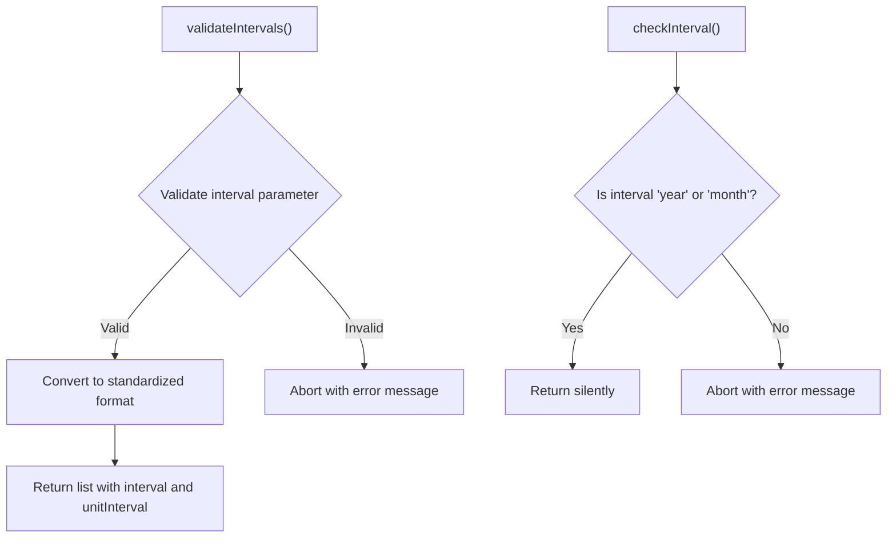
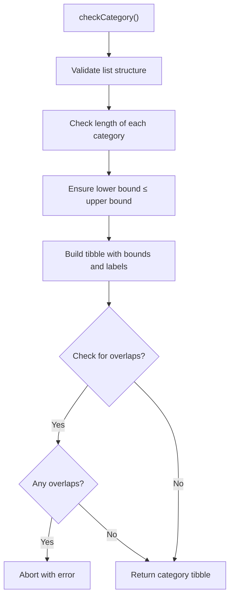
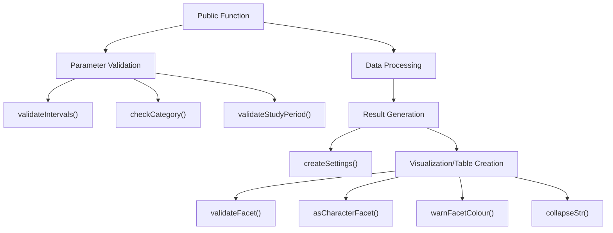

# Page: Utility Functions

# Utility Functions

<details>
<summary>Relevant source files</summary>

The following files were used as context for generating this wiki page:

- [R/checks.R](R/checks.R)
- [R/utilities.R](R/utilities.R)

</details>


This page documents the utility functions in OmopSketch that provide essential validation, checking, and helper capabilities used throughout the package. These functions are not meant to be called directly by end users but serve as internal infrastructure to ensure proper function operation, validate inputs, and streamline common tasks.

For information about the core summarization functions these utilities support, see [Core Summarization Functions](#3).

## Function Categories

The utility functions in OmopSketch can be divided into two main categories:

1. **Validation and checking functions** - Ensure parameters and inputs meet expected requirements
2. **Helper functions** - Provide common operations for string manipulation, settings creation, and other support tasks



Sources: [R/checks.R:1-171](), [R/utilities.R:1-62]()

## Integration with Package Architecture

Utility functions provide foundational support across all major components of OmopSketch. They are the "behind-the-scenes" functions that handle parameter validation, ensure data consistency, and manage common operations.



Sources: [R/checks.R:1-171](), [R/utilities.R:1-62]()

## Validation and Checking Functions

These functions ensure that parameters and inputs meet the required specifications before being processed by the main package functions.

### Interval Validation

Two complementary functions handle interval validation:

- `checkInterval()` - Validates simple interval specifications ("year" or "month")
- `validateIntervals()` - Handles more complex interval specifications with unit conversion



Sources: [R/checks.R:2-31]()

### Category Validation

The `checkCategory()` function validates category specifications, typically used for age groups or other numerical ranges.

Key features:
- Validates input list structure
- Ensures lower bounds are smaller than upper bounds
- Creates appropriate category labels
- Can check for category overlaps



Sources: [R/checks.R:34-99]()

### Study Period Validation

The `validateStudyPeriod()` function validates and processes study period date ranges:

- Validates date format
- Ensures start date is before end date
- Compares with observation period in the CDM
- Handles NA values by using database observation periods

Sources: [R/checks.R:102-157]()

### Facet Validation

The `validateFacet()` function validates facet specifications for visualization:

- Handles formula input by converting to character
- Validates against available columns in the result
- Used to ensure proper faceting in visualization functions

Sources: [R/checks.R:160-171]()

## Helper Functions

### String Processing

The `collapseStr()` function provides a standardized way to collapse strings with separators, particularly useful for generating warning and error messages.

```
Input: c("age", "gender", "year"), "or"
Output: "age, gender or year"
```

Sources: [R/utilities.R:21-28]()

### Facet Handling

Two functions work together to process faceting specifications:

- `asCharacterFacet()` - Converts facet formulas to character vectors
- `warnFacetColour()` - Warns about columns with multiple values that aren't included in faceting

Sources: [R/utilities.R:1-40]()

### Results Metadata

The `createSettings()` function creates standardized metadata for result objects:

| Parameter | Description |
|-----------|-------------|
| result_type | The type of result being created |
| result_id | Numeric identifier for the result (default: 1) |
| study_period | Optional date range for the study period |

The function generates a tibble containing:
- result_id
- result_type
- package_name
- package_version
- study_period_start (optional)
- study_period_end (optional)

Sources: [R/utilities.R:43-62]()

## Function Usage Patterns

The utility functions follow consistent patterns in how they're used within the package:



Sources: [R/checks.R:1-171](), [R/utilities.R:1-62]()

## Error Handling

Most utility functions use a consistent error handling approach:

1. Accept a `call` parameter (usually defaulting to `parent.frame()`)
2. Use `cli::cli_abort()` or `cli::cli_warn()` for error/warning messages
3. Include specific error messages with context about the failure

This provides a consistent user experience with clear error messages that help diagnose issues.

Sources: [R/checks.R:1-171](), [R/utilities.R:1-62]()

## Summary

The utility functions in OmopSketch provide critical infrastructure that ensures:

1. Consistent parameter validation across all package functions
2. Standardized error and warning messages
3. Common operations for string and data manipulation
4. Uniform metadata for result objects

While these functions are not intended to be called directly by end users, they are essential to the proper functioning of the package and provide a foundation for the higher-level summarization, visualization, and table generation functions.