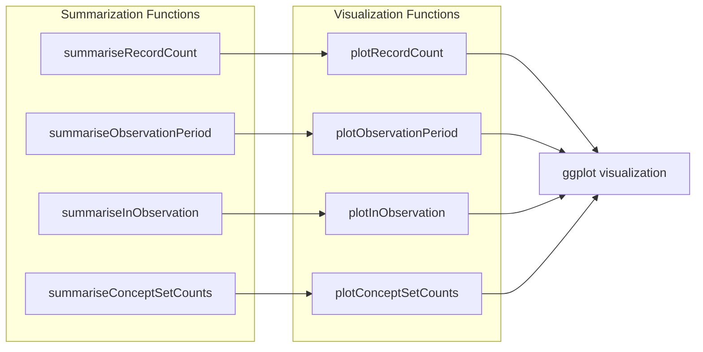
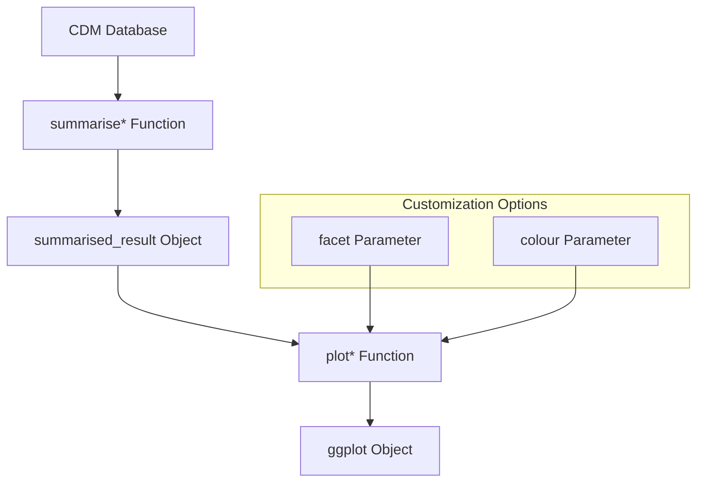
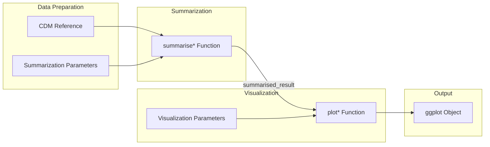
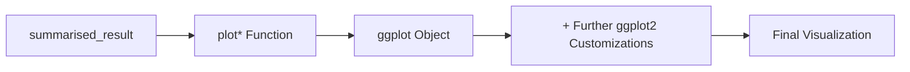
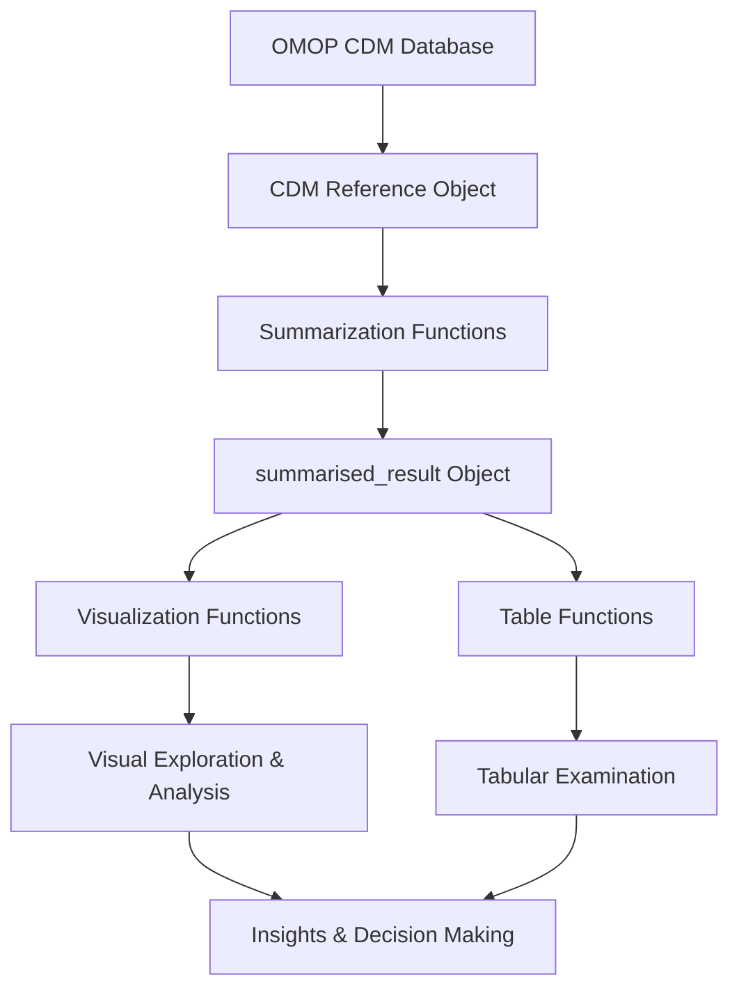

# Page: Visualization Functions

# Visualization Functions

<details>
<summary>Relevant source files</summary>

The following files were used as context for generating this wiki page:

- [DESCRIPTION](DESCRIPTION)
- [NAMESPACE](NAMESPACE)
- [man/plotRecordCount.Rd](man/plotRecordCount.Rd)
- [man/summariseClinicalRecords.Rd](man/summariseClinicalRecords.Rd)
- [man/summariseRecordCount.Rd](man/summariseRecordCount.Rd)

</details>


## Purpose and Scope

This document describes the visualization capabilities provided by OmopSketch for creating graphical representations of OMOP Common Data Model (CDM) data. These functions transform summarized data into informative plots that help analyze trends, distributions, and patterns in healthcare data. Visualization functions work seamlessly with the summarization functions documented in [Core Summarization Functions](#3) to provide a complete data analysis workflow.

## Overview of Visualization Functions

OmopSketch offers a set of specialized plotting functions designed to visualize different aspects of OMOP data. Each visualization function accepts output from its corresponding summarization function and generates a ggplot object that can be further customized.



Sources: [NAMESPACE:8-11](), [man/plotRecordCount.Rd:1-40]()

## Function Pattern and Design

All visualization functions in OmopSketch follow a consistent design pattern:

1. They accept a `summarised_result` object created by the corresponding summarization function
2. They transform this data into a ggplot visualization
3. They provide options for customizing the visualization through parameters like `facet` and `colour`



Sources: [man/plotRecordCount.Rd:6-17]()

## Available Visualization Functions

OmopSketch provides the following visualization functions, each designed for specific aspects of OMOP data:

| Function | Description | Source |
|----------|-------------|--------|
| `plotRecordCount` | Visualizes the trend of record counts over time, potentially stratified by demographic factors | [man/plotRecordCount.Rd:5-23]() |
| `plotObservationPeriod` | Visualizes observation period data, showing how patient observation periods are distributed | [NAMESPACE:10]() |
| `plotInObservation` | Visualizes the proportion of patients or records that fall within observation periods | [NAMESPACE:9]() |
| `plotConceptSetCounts` | Visualizes counts of concept sets, allowing comparison between different medical concepts | [NAMESPACE:8]() |

Sources: [NAMESPACE:8-11]()

## Visualization Input-Output Flow

The visualization functions in OmopSketch are designed to work with the output from summarization functions, creating a seamless data analysis workflow:



Sources: [man/plotRecordCount.Rd:6-17](), [man/summariseRecordCount.Rd:8-16]()

## Detailed Function Descriptions

### plotRecordCount

`plotRecordCount` creates a visualization of record counts over time based on the output from `summariseRecordCount`. It allows for stratification by demographic factors such as age group and sex.

#### Parameters:
- `result`: Output from `summariseRecordCount()`
- `facet`: Columns to facet by, can be provided in formula format
- `colour`: Columns to color by

#### Example Usage:
```r
cdm <- mockOmopSketch()

summarisedResult <- summariseRecordCount(
  cdm = cdm,
  omopTableName = "condition_occurrence",
  ageGroup = list("<=20" = c(0, 20), ">20" = c(21, Inf)),
  sex = TRUE
)

plotRecordCount(summarisedResult, colour = "age_group", facet = sex ~ .)
```

Sources: [man/plotRecordCount.Rd:6-39]()

### plotObservationPeriod

`plotObservationPeriod` visualizes observation period data from the output of `summariseObservationPeriod`. It can display trends in observation coverage over time and patient enrollment patterns.

#### Parameters:
- `result`: Output from `summariseObservationPeriod()`
- `facet`: Columns to facet by
- `colour`: Columns to color by

Sources: [NAMESPACE:10]()

### plotInObservation

`plotInObservation` creates visualizations based on the output from `summariseInObservation`. It shows the proportion of patients or records that fall within observation periods, helping to assess data quality and coverage.

#### Parameters:
- `result`: Output from `summariseInObservation()`
- `facet`: Columns to facet by
- `colour`: Columns to color by

Sources: [NAMESPACE:9]()

### plotConceptSetCounts

`plotConceptSetCounts` visualizes the counts of concept sets based on the output from `summariseConceptSetCounts`. This function is particularly useful for comparing the prevalence of different medical concepts across time or patient subgroups.

#### Parameters:
- `result`: Output from `summariseConceptSetCounts()`
- `facet`: Columns to facet by
- `colour`: Columns to color by

Sources: [NAMESPACE:8]()

## Common Visualization Parameters

All visualization functions in OmopSketch share common parameters for customization:

1. **facet**: Controls how the plot is divided into subplots (facets). Can be provided as a formula (e.g., `sex ~ age_group`) to create a grid of plots.

2. **colour**: Determines which variable is used to color the plot elements. This helps distinguish between different groups or categories in the data.

These parameters leverage the tidying functionality from `visOmopResults`, which standardizes how data is prepared for visualization.

Sources: [man/plotRecordCount.Rd:10-16]()

## Integration with ggplot2

All visualization functions in OmopSketch return ggplot objects, which means they can be further customized using standard ggplot2 syntax:



For example, a basic plot can be extended with additional ggplot2 layers:

```r
plotRecordCount(summarisedResult) +
  ggplot2::labs(title = "Custom Title") +
  ggplot2::theme_minimal() +
  ggplot2::scale_y_log10()
```

Sources: [man/plotRecordCount.Rd:18-20](), [DESCRIPTION:60]()

## Visualization in the Overall OmopSketch Workflow

Visualization functions form a key component of the OmopSketch workflow, allowing users to quickly identify patterns and trends in their OMOP data:



Sources: [NAMESPACE:3-29]()

## Dependencies

OmopSketch visualization functions rely on the ggplot2 package, which is listed as a suggested dependency in the package description. The visOmopResults package (version 0.5.0 or higher) is also used for the underlying data manipulation required for visualization.

Sources: [DESCRIPTION:60-61]()