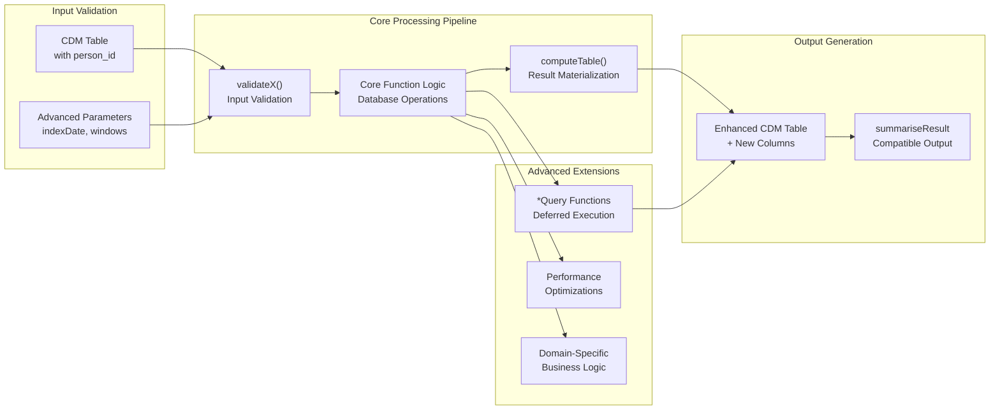
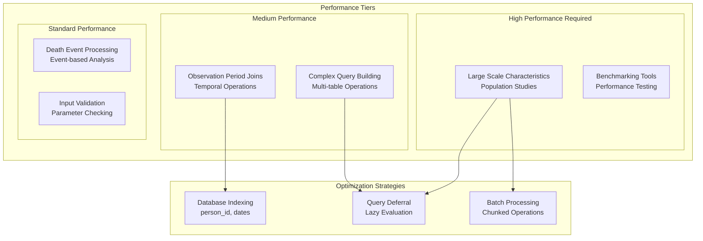

# Page: Advanced Features

# Advanced Features

<details>
<summary>Relevant source files</summary>

The following files were used as context for generating this wiki page:

- [R/addObservationPeriodId.R](R/addObservationPeriodId.R)
- [extras/benchmark.R](extras/benchmark.R)
- [man/addObservationPeriodId.Rd](man/addObservationPeriodId.Rd)
- [man/addObservationPeriodIdQuery.Rd](man/addObservationPeriodIdQuery.Rd)
- [tests/testthat/test-addObservationPeriodId.R](tests/testthat/test-addObservationPeriodId.R)

</details>


This section covers specialized functions for complex analyses and specific use cases in PatientProfiles. These features are designed for advanced users working with large-scale studies, complex temporal constraints, and sophisticated patient characterization workflows.

The advanced features include tools for benchmarking large-scale patient characteristics, managing observation period complexities, and incorporating death information into analyses. For basic patient profiling functionality, see [Getting Started](#2). For core intersection and summarization features, see [Core Features](#3).

## Architecture Overview

The advanced features extend PatientProfiles' core intersection system to handle specialized analytical scenarios that require additional computational considerations or domain-specific logic.

```mermaid
graph TB
    subgraph "Core System"
        INTERSECT_CORE["`.addIntersect`<br/>Core Logic Engine"]
        DEMOGRAPHICS["addDemographics<br/>Basic Demographics"]
        SUMMARIZATION["summariseResult<br/>Statistical Analysis"]
    end
    
    subgraph "Advanced Features Layer"
        subgraph "Performance & Scale"
            LSC["summariseLargeScaleCharacteristics<br/>Benchmarking Engine"]
            BENCHMARK_TOOLS["Benchmark Utilities<br/>Performance Testing"]
        end
        
        subgraph "Temporal Complexity"
            OBS_PERIOD_ID["addObservationPeriodId<br/>Ordinal Period Assignment"]
            OBS_PERIOD_QUERY["addObservationPeriodIdQuery<br/>Deferred Computation"]
            OBS_MANAGEMENT["Observation Period<br/>Complex Logic"]
        end
        
        subgraph "Clinical Events"
            DEATH_ANALYSIS["Death Information<br/>Integration"]
            SURVIVAL_LOGIC["Survival Analysis<br/>Support"]
        end
    end
    
    subgraph "OMOP CDM Integration"
        OBS_PERIOD_TABLE["observation_period<br/>Table"]
        DEATH_TABLE["death<br/>Table"]
        PERSON_TABLE["person<br/>Table"]
    end
    
    INTERSECT_CORE --> LSC
    INTERSECT_CORE --> OBS_PERIOD_ID
    DEMOGRAPHICS --> DEATH_ANALYSIS
    
    OBS_PERIOD_ID --> OBS_PERIOD_QUERY
    OBS_MANAGEMENT --> OBS_PERIOD_ID
    
    LSC --> BENCHMARK_TOOLS
    
    OBS_PERIOD_TABLE --> OBS_MANAGEMENT
    DEATH_TABLE --> DEATH_ANALYSIS
    PERSON_TABLE --> SURVIVAL_LOGIC
```

Sources: [R/addObservationPeriodId.R:1-142](), [extras/benchmark.R:1-49]()

## Feature Categories

The advanced features are organized into three main categories based on their computational and analytical complexity:

| Category | Primary Use Case | Key Functions | Computational Impact |
|----------|------------------|---------------|---------------------|
| **Large Scale Characteristics** | Population-level studies with millions of patients | `summariseLargeScaleCharacteristics` | High - requires optimization |
| **Observation Period Management** | Complex temporal constraints and period tracking | `addObservationPeriodId`, `addObservationPeriodIdQuery` | Medium - database joins |
| **Death Analysis** | Survival analysis and mortality incorporation | Death-related functions | Low-Medium - event processing |

## Function Integration Patterns

Advanced features follow specific integration patterns that extend the core PatientProfiles architecture:



Sources: [R/addObservationPeriodId.R:42-56](), [R/addObservationPeriodId.R:79-88]()

## Query Optimization Strategy

Advanced features implement a dual-function pattern for computational efficiency:

### Immediate Execution Functions
Functions like `addObservationPeriodId()` immediately compute and materialize results using `computeTable()` [R/addObservationPeriodId.R:55]().

### Deferred Execution Functions  
Functions like `addObservationPeriodIdQuery()` build SQL queries without immediate execution [R/addObservationPeriodId.R:82-87](), allowing for:
- Query optimization in complex pipelines
- Reduced database roundtrips
- Memory efficiency in large-scale analyses

## Performance Considerations

Advanced features are designed with specific performance characteristics:



Sources: [extras/benchmark.R:34-48]()

The following subsections provide detailed coverage of each advanced feature category:

- [Large Scale Characteristics](#4.1) - Performance benchmarking and population-level analysis tools
- [Observation Period Management](#4.2) - Complex temporal constraint handling and period tracking
- [Death Analysis](#4.3) - Mortality data integration and survival analysis support

Each subsection includes specific function documentation, usage patterns, and performance considerations relevant to that feature category.

Sources: [R/addObservationPeriodId.R:1-142](), [tests/testthat/test-addObservationPeriodId.R:1-247](), [man/addObservationPeriodId.Rd:1-43](), [man/addObservationPeriodIdQuery.Rd:1-40](), [extras/benchmark.R:1-49]()