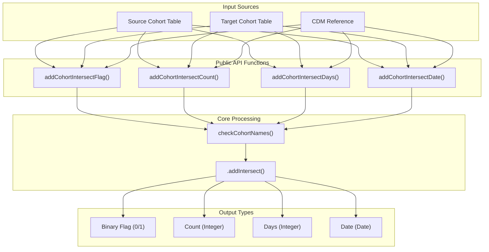
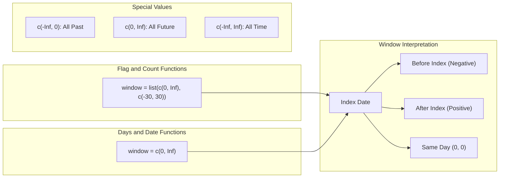
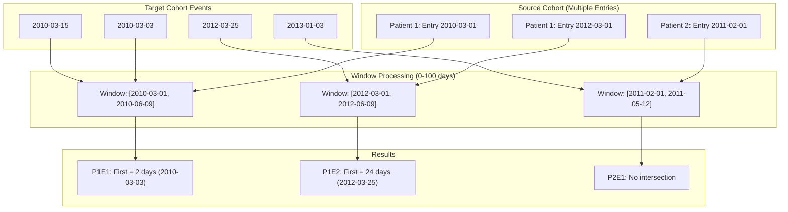
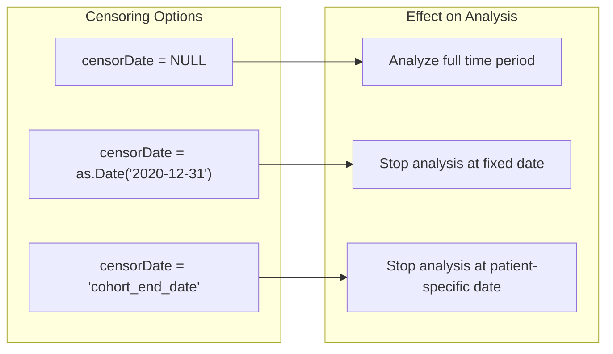

# Page: Cohort Intersection

# Cohort Intersection

Relevant source files

The following files were used as context for generating this wiki page:

- [R/addCohortIntersect.R](R/addCohortIntersect.R)
- [man/addCohortIntersectCount.Rd](man/addCohortIntersectCount.Rd)
- [man/addCohortIntersectDate.Rd](man/addCohortIntersectDate.Rd)
- [man/addCohortIntersectDays.Rd](man/addCohortIntersectDays.Rd)
- [man/addCohortIntersectFlag.Rd](man/addCohortIntersectFlag.Rd)
- [tests/testthat/test-addCohortIntersect.R](tests/testthat/test-addCohortIntersect.R)

The Cohort Intersection system enables analysis of temporal relationships and overlaps between different patient cohorts in OMOP CDM data. This functionality allows researchers to identify when patients from one cohort appear in another cohort, count occurrences, and calculate temporal distances between cohort entries.

For concept-based intersections with OMOP vocabularies, see [Concept Intersection](#3.1.2). For intersections with standard OMOP tables like drug_exposure or condition_occurrence, see [Table Intersection](#3.1.3).

## Function Architecture

The cohort intersection system provides four primary functions that share a common underlying architecture through the core `.addIntersect` function.

Sources: [R/addCohortIntersect.R:49-294](), [tests/testthat/test-addCohortIntersect.R:1-1011]()

## Core Functions

### addCohortIntersectFlag

Creates binary columns (0/1) indicating whether patients from the source cohort intersect with target cohorts within specified time windows. Supports overlap detection using both `targetStartDate` and `targetEndDate` parameters.

**Key Parameters:**
- `targetCohortTable`: Name of the cohort table to check for intersections
- `targetCohortId`: Vector of cohort definition IDs to include (NULL for all)
- `window`: Time windows as list of vectors, e.g., `list(c(0, Inf))`
- `targetStartDate` / `targetEndDate`: Define overlap periods in target cohort

Sources: [R/addCohortIntersect.R:49-82](), [tests/testthat/test-addCohortIntersect.R:508-597]()

### addCohortIntersectCount

Returns integer counts of how many target cohort entries intersect within each time window. Useful for analyzing frequency of co-occurring conditions or treatments.

Sources: [R/addCohortIntersect.R:118-151](), [tests/testthat/test-addCohortIntersect.R:397-506]()

### addCohortIntersectDays

Calculates the number of days between the `indexDate` in the source table and the `targetDate` in the target cohort. Supports `order` parameter to select "first" or "last" occurrence when multiple records exist.

**Distinct Parameters:**
- `targetDate`: Single date column (either "cohort_start_date" or "cohort_end_date")
- `order`: "first" or "last" when multiple records exist in time window
- `window`: Single time window as vector, e.g., `c(0, Inf)`

Sources: [R/addCohortIntersect.R:188-222](), [tests/testthat/test-addCohortIntersect.R:73-182]()

### addCohortIntersectDate

Returns the actual dates of target cohort entries that intersect within the specified time windows. Like `addCohortIntersectDays`, supports `order` parameter for selecting specific occurrences.

Sources: [R/addCohortIntersect.R:259-293](), [tests/testthat/test-addCohortIntersect.R:73-182]()

## Temporal Window System

The cohort intersection functions use different window specifications depending on the type of analysis:

**Window Examples:**
- `c(0, Inf)`: From index date to future
- `c(-30, 30)`: 30 days before to 30 days after index
- `c(-Inf, 0)`: All time before index date
- `list(c(0, 0), c(1, 30))`: Same day AND 1-30 days after

Sources: [tests/testthat/test-addCohortIntersect.R:34-68](), [tests/testthat/test-addCohortIntersect.R:786-835]()

## Multiple Cohort Entries Handling

When patients have multiple entries in either source or target cohorts, each record is processed independently:

Sources: [tests/testthat/test-addCohortIntersect.R:184-274]()

## Output Naming System

Column names are generated using the `nameStyle` parameter with template variables:

**Default Pattern:** `{cohort_name}_{window_name}`

**Template Variables:**
- `{cohort_name}`: Target cohort name or "cohort_X" format
- `{window_name}`: Formatted window like "0_to_inf" or "minf_to_0"
- `{value}`: Function type ("flag", "count", "days", "date")

**Examples:**
- `"cohort_1_0_to_inf"` (default)
- `"study_{cohort_name}"` (custom)
- `"{value}_{cohort_name}_{window_name}"` (detailed)

Sources: [tests/testthat/test-addCohortIntersect.R:276-350](), [R/addCohortIntersect.R:57-58]()

## Censoring Functionality

The `censorDate` parameter allows limiting intersection detection to specific time periods:

When censoring is applied, events occurring after the censor date are ignored, and results may be `NA` if no valid intersections exist within the censored period.

Sources: [tests/testthat/test-addCohortIntersect.R:659-731](), [R/addCohortIntersect.R:24-25]()

## Error Handling

The system validates inputs and provides specific error messages for common issues:

**Validation Checks:**
- Target cohort table must exist in CDM
- Window start must be ≤ window end
- `censorDate` must be date type or valid column name
- `nameStyle` must include required template variables

**Edge Cases:**
- Empty intersections return appropriate defaults (0, NA, etc.)
- Multiple measurement results trigger duplicate detection warnings
- Non-existent cohort IDs are handled gracefully

Sources: [tests/testthat/test-addCohortIntersect.R:352-395](), [tests/testthat/test-addCohortIntersect.R:953-1010]()