# Page: Concept Intersection

# Concept Intersection

Relevant source files

The following files were used as context for generating this wiki page:

- [R/addConceptIntersect.R](R/addConceptIntersect.R)
- [R/addDemographicsQuery.R](R/addDemographicsQuery.R)
- [R/utilities.R](R/utilities.R)
- [tests/testthat/test-addConceptIntersect.R](tests/testthat/test-addConceptIntersect.R)

This document covers the concept intersection functionality within the PatientProfiles package, which enables finding intersections between patient records and OMOP concept sets across different clinical domains. For information about cohort-based intersections, see [Cohort Intersection](#3.1.1). For table-based intersections, see [Table Intersection](#3.1.3).

## Purpose and Scope

The concept intersection system allows users to identify when patients have clinical events (conditions, drugs, procedures, etc.) that match specific OMOP concept sets within defined time windows. Unlike direct table intersections, concept intersections automatically handle the complexity of mapping OMOP concepts to their appropriate clinical domain tables and standardizing the intersection logic across different event types.

## System Architecture

The concept intersection system operates through a hierarchical structure where public functions delegate to a core intersection engine that handles domain mapping and standardization.

### Core Function Hierarchy

Sources: [R/addConceptIntersect.R:17-82](), [R/addConceptIntersect.R:293-617]()

### Domain to Table Mapping System

The concept intersection system automatically maps OMOP concept domains to their corresponding clinical tables:

Sources: [R/addConceptIntersect.R:109-119]()

## Core Functions

The concept intersection system provides five primary functions, each returning different types of intersection information:

| Function | Return Type | Purpose | Value Parameter |
|----------|-------------|---------|-----------------|
| `addConceptIntersectFlag` | Integer (0/1) | Binary presence indicator | `"flag"` |
| `addConceptIntersectCount` | Integer | Count of matching events | `"count"` |
| `addConceptIntersectDate` | Date | Date of matching event | `"date"` |
| `addConceptIntersectDays` | Integer | Days difference from index | `"days"` |
| `addConceptIntersectField` | Various | Custom field value | User-specified |

Sources: [R/addConceptIntersect.R:293-617]()

### Common Parameters

All concept intersection functions share these core parameters:

- `conceptSet`: Named list of concept ID vectors defining the clinical concepts of interest
- `indexDate`: Reference date column for temporal calculations (default: `"cohort_start_date"`)
- `window`: Temporal window relative to index date (default: `list(c(0, Inf))`)
- `targetStartDate`/`targetEndDate`: Event date columns to use for intersection logic
- `inObservation`: Whether to restrict to observation period coverage
- `nameStyle`: Template for generated column names

Sources: [R/addConceptIntersect.R:17-29]()

## Data Processing Workflow

### Concept Set Processing

The system converts user-provided concept sets into a standardized format for database operations:

Sources: [R/addConceptIntersect.R:83-93]()

### Domain-Based Table Subsetting

The `subsetTable` function performs the complex logic of mapping concepts to clinical tables:

Sources: [R/addConceptIntersect.R:95-205](), [R/addConceptIntersect.R:206-246]()

### Column Standardization

The system standardizes column names across different OMOP tables to enable unified processing:

| Domain Table | Start Date Column | End Date Column | Concept ID Column |
|--------------|-------------------|------------------|-------------------|
| `condition_occurrence` | `condition_start_date` | `condition_end_date` | `condition_concept_id` |
| `drug_exposure` | `drug_exposure_start_date` | `drug_exposure_end_date` | `drug_concept_id` |
| `procedure_occurrence` | `procedure_date` | `procedure_date` | `procedure_concept_id` |
| `measurement` | `measurement_date` | `measurement_date` | `measurement_concept_id` |

All are mapped to standardized names: `event_start_date`, `event_end_date`, `concept_id`.

Sources: [R/addConceptIntersect.R:182-204]()

## Integration with Core Intersection System

After domain processing, concept intersections delegate to the shared `.addIntersect` function, which handles:

- Temporal window calculations
- Event ordering (`first`/`last`)
- Observation period filtering
- Result column naming
- Duplicate handling

```mermaid
graph TD
    conceptIntersect[".addConceptIntersect"]
    coreIntersect[".addIntersect"]
    
    subgraph "Intersection Parameters"
        tableName["tableName: temporary concept table"]
        filterVariable["filterVariable: 'concept_set_id'"]
        filterId["filterId: concept set identifiers"]
        idName["idName: concept set names"]
        value["value: 'flag'/'count'/'date'/'days'/field"]
    end
    
    conceptIntersect --> tableName
    conceptIntersect --> filterVariable  
    conceptIntersect --> filterId
    conceptIntersect --> idName
    conceptIntersect --> value
    conceptIntersect --> coreIntersect
    
    coreIntersect --> result["Enhanced patient table with<br/>concept intersection columns"]
```

Sources: [R/addConceptIntersect.R:59-76]()

## Error Handling and Validation

The system includes comprehensive validation and graceful error handling:

### Domain Validation

- **Unsupported domains**: Concepts from unsupported domains are filtered out with informative messages
- **Missing tables**: Concepts requiring tables not present in the CDM are excluded
- **Empty results**: Returns appropriately typed empty columns when no matching concepts exist

Sources: [R/addConceptIntersect.R:206-246]()

### Type Safety

The system handles field type consistency across different domain tables:

Sources: [R/addConceptIntersect.R:143-177]()

## Testing and Validation

The concept intersection system includes comprehensive test coverage ensuring proper behavior across different scenarios:

- **Multi-domain concept sets**: Testing concepts spanning multiple clinical domains
- **Missing tables**: Graceful handling when expected OMOP tables are absent
- **Observation period filtering**: Validation of `inObservation` parameter behavior  
- **Temporal windows**: Testing various window configurations including infinite bounds
- **Custom fields**: Validation of field extraction across domain tables

Sources: [tests/testthat/test-addConceptIntersect.R:1-420]()