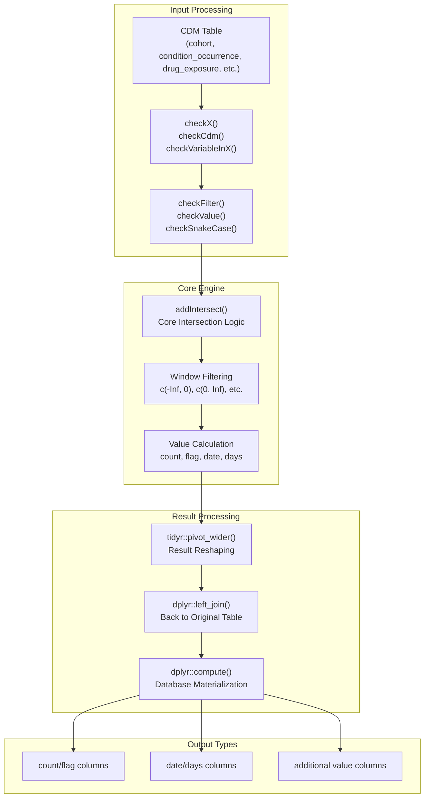
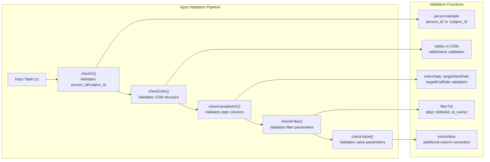
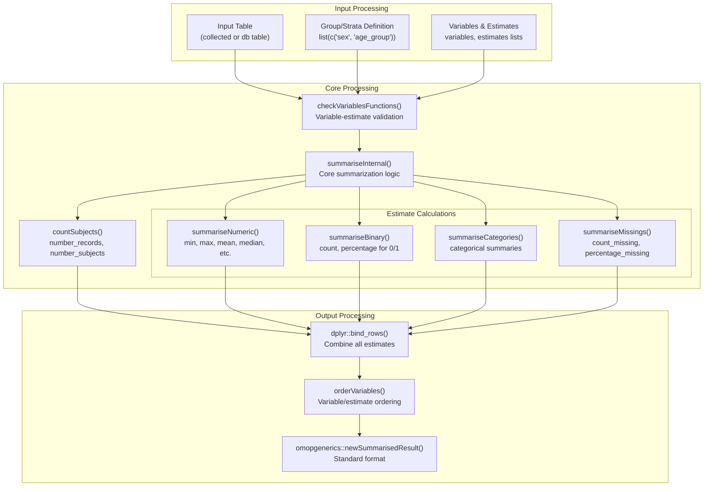
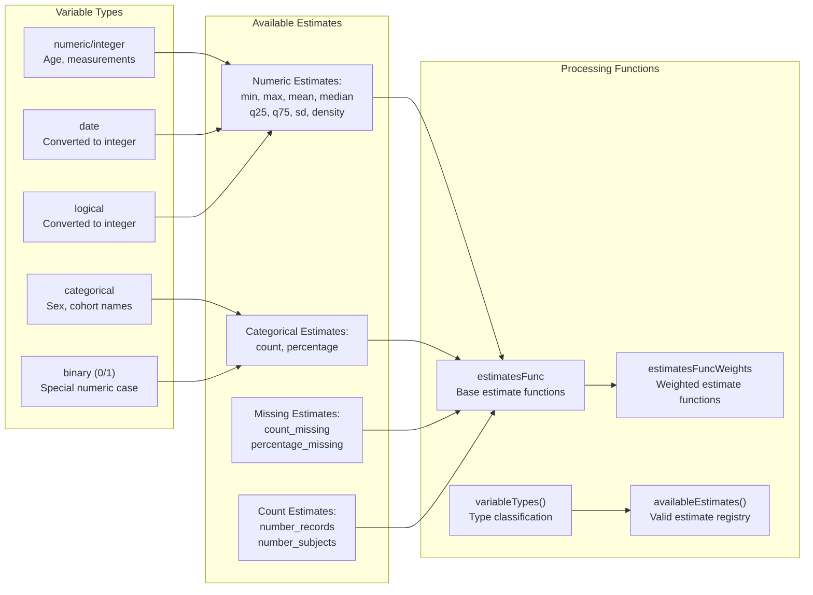
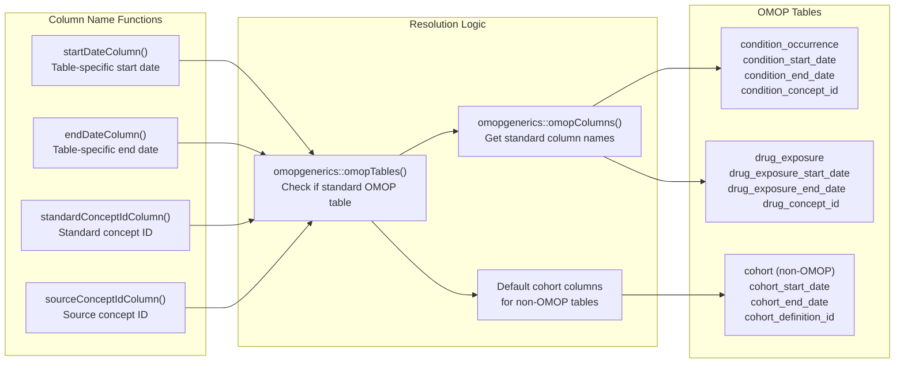

# Page: Core Features

# Core Features

Relevant source files

The following files were used as context for generating this wiki page:

- [R/addIntersect.R](R/addIntersect.R)
- [R/checks.R](R/checks.R)
- [R/summariseResult.R](R/summariseResult.R)
- [tests/testthat/test-addIntersect.R](tests/testthat/test-addIntersect.R)
- [tests/testthat/test-checks.R](tests/testthat/test-checks.R)
- [tests/testthat/test-summariseResult.R](tests/testthat/test-summariseResult.R)

This document covers the main functional capabilities of the PatientProfiles package for analyzing OMOP CDM data. These core features provide the foundation for patient profiling and cohort characterization through data intersection, statistical summarization, and categorization operations.

For information about getting started with basic demographics and mock data, see [Getting Started](#2). For advanced specialized functions, see [Advanced Features](#4).

## Data Intersection Architecture

The PatientProfiles package centers around a unified intersection system that enables temporal analysis between different clinical data sources. The core architecture processes OMOP CDM tables through a common pipeline that handles validation, temporal filtering, and result aggregation.

### Core Intersection Engine

The `.addIntersect()` function serves as the universal intersection engine, processing temporal relationships between any two OMOP CDM tables. It supports multiple value types (`count`, `flag`, `date`, `days`) and flexible time windows.

Sources: [R/addIntersect.R:17-442](), [R/checks.R:18-462]()

### Validation and Input Processing

The validation system ensures data integrity before intersection operations. Key validation functions include `checkX()` for person identifiers, `checkCdm()` for CDM structure, and specialized checks for temporal columns and filter parameters.

Sources: [R/checks.R:18-38](), [R/checks.R:41-56](), [R/checks.R:59-65](), [R/checks.R:68-91](), [R/checks.R:94-112]()

## Statistical Summarization System

The `summariseResult()` function provides comprehensive statistical analysis capabilities with support for grouping, stratification, and various statistical estimates.

### Summarization Processing Flow

The summarization system processes data through specialized functions for different variable types. Each estimate type (numeric, binary, categorical, missing) has dedicated processing logic that handles database-specific optimizations.

Sources: [R/summariseResult.R:52-237](), [R/summariseResult.R:239-307]()

### Variable Type Classification and Estimates

The system automatically classifies variables into appropriate types and applies compatible statistical estimates. Binary variables (containing only 0/1 values) are treated specially to enable count/percentage calculations.

Sources: [R/summariseResult.R:366-448](), [R/summariseResult.R:517-612](), [R/summariseResult.R:614-662](), [R/checks.R:207-277]()

## Integration with OMOP CDM Standards

The core features integrate deeply with OMOP CDM conventions through standardized column name functions and table structure expectations.

### OMOP Table Column Resolution

These helper functions automatically resolve appropriate column names based on table type, enabling consistent intersection operations across different OMOP CDM tables without manual column specification.

Sources: [R/addIntersect.R:461-537]()

## Error Handling and Data Quality

The package implements comprehensive error handling and data quality checks throughout the core processing pipeline.

### Validation Error Patterns

| Validation Type | Function | Error Conditions | File Location |
|-----------------|----------|------------------|---------------|
| Table Structure | `checkX()` | Missing person_id/subject_id, both present | [R/checks.R:18-38]() |
| CDM Reference | `checkCdm()` | Invalid CDM object, missing tables | [R/checks.R:41-56]() |
| Variable Presence | `checkVariableInX()` | Column not in table | [R/checks.R:59-65]() |
| Filter Parameters | `checkFilter()` | Invalid filter variable/ID combinations | [R/checks.R:68-91]() |
| Value Specifications | `checkValue()` | Invalid value types for table | [R/checks.R:94-112]() |
| Statistical Functions | `checkVariablesFunctions()` | Incompatible variable-estimate pairs | [R/checks.R:207-277]() |

The validation system provides clear error messages and handles edge cases like empty tables, missing data, and incompatible parameter combinations.

Sources: [R/checks.R:1-462]()

---

This core features system provides the foundation for all patient profiling operations in the package, with robust validation, flexible intersection capabilities, and comprehensive statistical summarization. The modular design allows for extension while maintaining consistency with OMOP CDM standards.