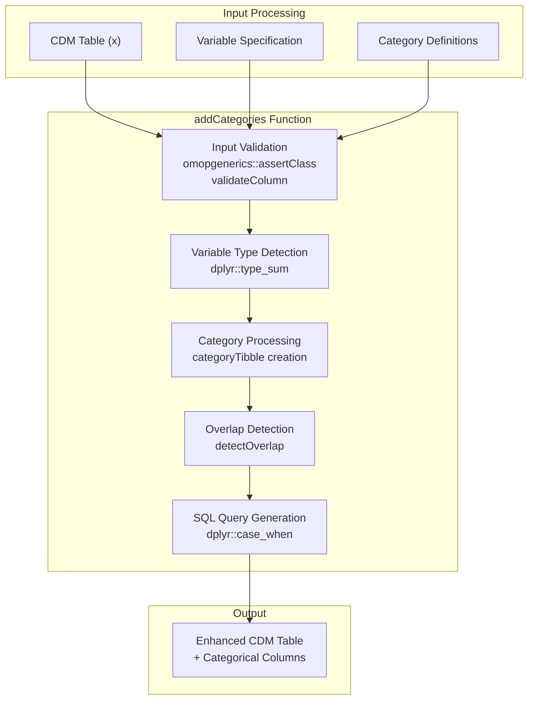
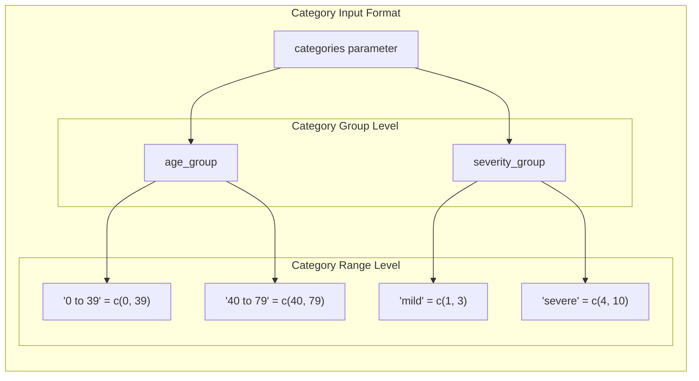
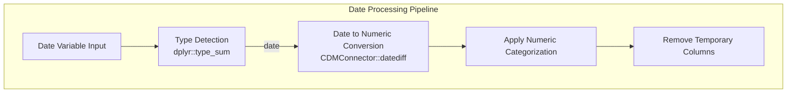
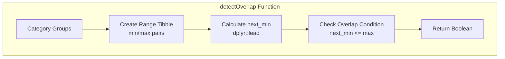
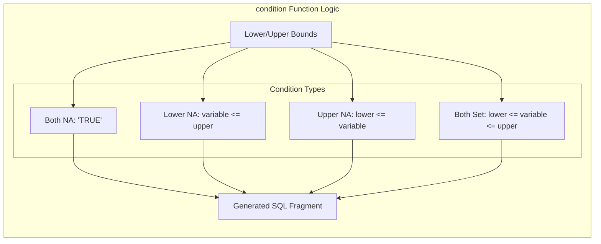
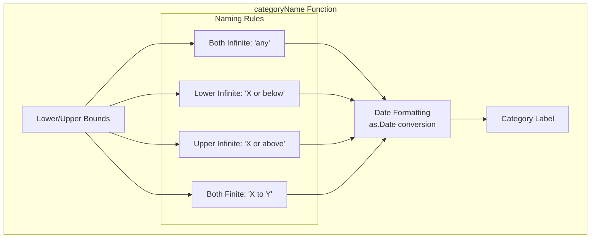

# Page: Data Categorization

# Data Categorization

Relevant source files

The following files were used as context for generating this wiki page:

- [R/addCategories.R](R/addCategories.R)
- [man/addCategories.Rd](man/addCategories.Rd)
- [tests/testthat/test-addCategories.R](tests/testthat/test-addCategories.R)

## Purpose and Scope

The Data Categorization system provides functionality for converting continuous numeric and date variables into discrete categorical variables for analysis within OMOP CDM tables. This system is primarily implemented through the `addCategories` function, which transforms quantitative data into meaningful groups based on user-defined ranges and criteria.

This page covers the categorization of variables into predefined groups. For statistical summarization of categorized data, see [Data Summarization](#3.2). For demographic-specific categorization like age groups, see [Patient Demographics](#2.1).

## Core Architecture

The data categorization system is built around a single primary function that handles multiple data types and configuration options through a unified interface.

### System Components

Sources: [R/addCategories.R:48-174]()

## Category Definition System

Categories are defined using a hierarchical list structure where each category group contains named ranges with lower and upper bounds.

### Category Structure

### Category Validation and Processing

The system performs comprehensive validation of category definitions:

| Validation Check | Function | Purpose |
|------------------|----------|---------|
| Duplicate Names | [R/addCategories.R:65-68]() | Prevents naming conflicts |
| Bound Consistency | [R/addCategories.R:115-117]() | Ensures lower ≤ upper |
| Range Length | [R/addCategories.R:109-112]() | Validates two-element ranges |
| Column Conflicts | [R/addCategories.R:74]() | Prevents overwriting existing columns |

Sources: [R/addCategories.R:103-139]()

## Variable Type Handling

The system supports both numeric and date variables with specialized processing for each type.

### Date Variable Processing

The date processing mechanism converts dates to numeric values representing days since a reference date, applies numeric categorization logic, then cleans up temporary columns.

Sources: [R/addCategories.R:85-100](), [R/addCategories.R:165-168]()

## Overlap Management

The system provides sophisticated handling of overlapping category ranges through automatic detection and resolution.

### Overlap Detection Algorithm

### Overlap Resolution Strategies

| Strategy | Parameter | Behavior |
|----------|-----------|----------|
| Strict Non-Overlap | `overlap = FALSE` | Error on detection |
| Automatic Resolution | `overlap = TRUE` | Create combined categories |
| Boundary Inclusion | `includeLowerBound`, `includeUpperBound` | Control boundary handling |

Sources: [R/addCategories.R:175-185](), [R/addCategories.R:202-223]()

## Query Generation and Execution

The categorization logic is implemented through dynamic SQL query generation using `dplyr::case_when` statements.

### Condition Generation

The `condition` function handles various boundary scenarios including infinite values and missing bounds, generating appropriate SQL conditions for each case.

Sources: [R/addCategories.R:186-201](), [R/addCategories.R:142-164]()

## Missing Value Handling

The system provides flexible handling of values that don't fall into any defined category.

### Missing Value Options

| Parameter Value | Behavior | Use Case |
|-----------------|----------|----------|
| `"None"` (default) | Assign string "None" | Standard categorical analysis |
| `NA_character_` | Preserve as missing | Statistical procedures requiring NA |
| Custom string | User-defined label | Domain-specific labeling |

Sources: [R/addCategories.R:79-83](), [R/addCategories.R:154-156]()

## Category Name Generation

The system automatically generates descriptive names for categories when not explicitly provided.

### Automatic Naming Logic

Sources: [R/addCategories.R:224-244](), [R/addCategories.R:124-127]()

## Integration Points

The categorization system integrates with other PatientProfiles components through standardized interfaces.

### System Dependencies

| Component | Relationship | Purpose |
|-----------|--------------|---------|
| `omopgenerics` | Input validation | CDM table validation and column checks |
| `CDMConnector` | Date processing | Database-specific date operations |
| `dplyr` | Query execution | SQL generation and table manipulation |
| Demographics functions | Data pipeline | Provides variables for categorization |

### Testing Infrastructure

The system includes comprehensive test coverage for various scenarios:

- Basic categorization functionality
- Overlap detection and resolution
- Infinite bound handling
- Date variable processing
- Missing value management
- Category naming

Sources: [tests/testthat/test-addCategories.R:1-171]()