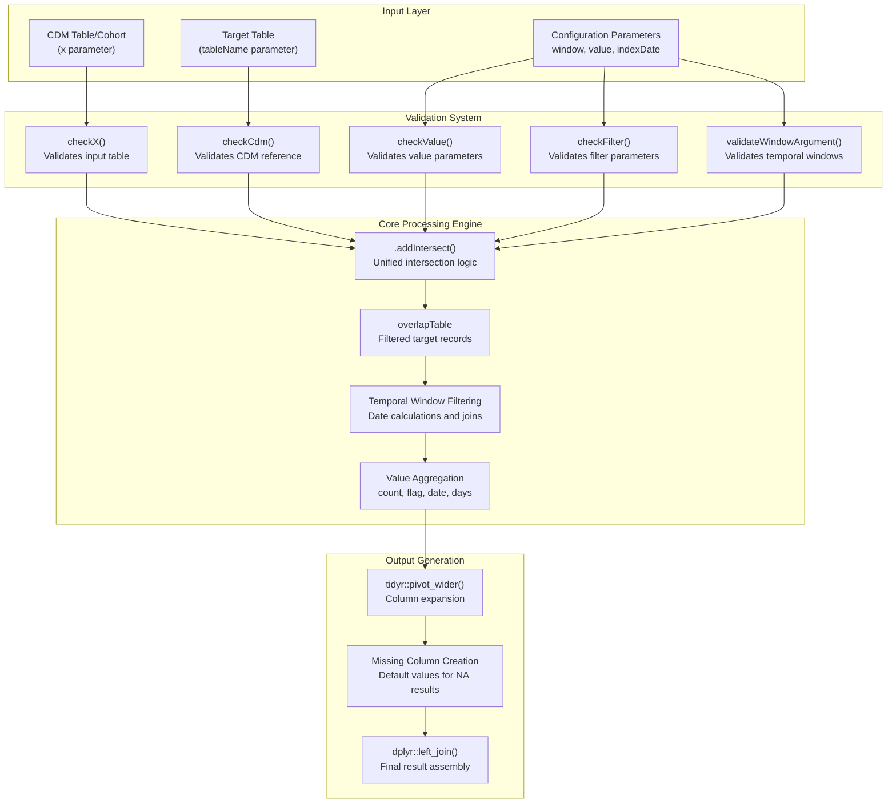
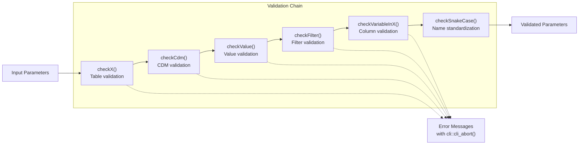
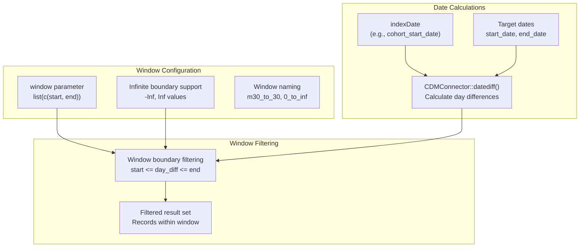
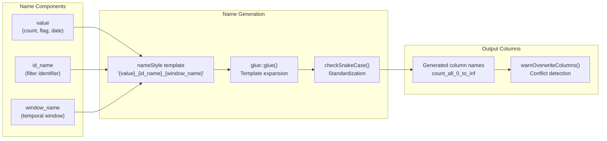
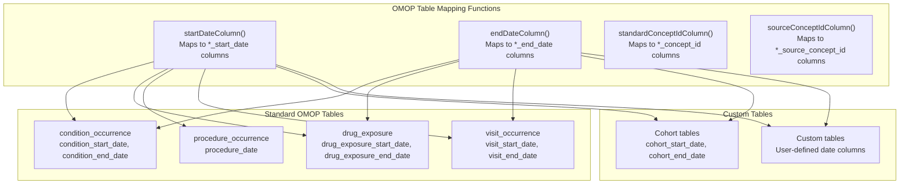

# Page: Data Intersection System

# Data Intersection System

Relevant source files

The following files were used as context for generating this wiki page:

- [R/addIntersect.R](R/addIntersect.R)
- [R/checks.R](R/checks.R)
- [tests/testthat/test-addIntersect.R](tests/testthat/test-addIntersect.R)
- [tests/testthat/test-checks.R](tests/testthat/test-checks.R)

The Data Intersection System is the foundational architecture that powers all intersection functions in PatientProfiles. This system provides a unified interface for finding temporal relationships between patient records and various OMOP CDM tables, cohorts, or concept sets. It handles complex temporal windowing, data validation, and result aggregation through a single core engine.

For specific intersection implementations, see [Cohort Intersection](#3.1.1), [Concept Intersection](#3.1.2), and [Table Intersection](#3.1.3). For statistical analysis of intersection results, see [Data Summarization](#3.2).

## System Architecture

The Data Intersection System is built around the `.addIntersect()` function, which serves as the unified processing engine for all intersection operations. This architecture ensures consistency across different intersection types while supporting flexible configuration for various analytical needs.

Sources: [R/addIntersect.R:17-442](), [R/checks.R:18-462]()

## Core Validation Framework

The intersection system implements comprehensive input validation through a series of specialized check functions. This validation layer ensures data integrity and provides clear error messages for invalid configurations.

| Validation Function | Purpose | Key Checks |
|---------------------|---------|------------|
| `checkX()` | Validates input table | Person identifier presence, table structure |
| `checkCdm()` | Validates CDM reference | CDM object type, required tables availability |
| `checkValue()` | Validates value parameters | Valid value types, column name conflicts |
| `checkFilter()` | Validates filtering parameters | Filter variable existence, ID compatibility |
| `checkVariableInX()` | Validates column references | Column existence in specified tables |
| `checkSnakeCase()` | Standardizes naming | Snake case conversion, special character handling |

Sources: [R/checks.R:18-91](), [R/checks.R:94-112](), [R/checks.R:133-161]()

## Processing Pipeline

The `.addIntersect()` function implements a sophisticated processing pipeline that handles temporal windowing, data joining, and result aggregation. The pipeline supports multiple value types and complex filtering scenarios.

### Temporal Window Processing

The system processes temporal windows by calculating date differences and applying filters based on configurable window boundaries:

Sources: [R/addIntersect.R:224-325](), [R/addIntersect.R:210-218]()

### Value Type Processing

The system supports multiple value types, each with specific aggregation logic:

| Value Type | Processing Logic | Output Format |
|------------|------------------|---------------|
| `count` | `dplyr::n()` per group | Numeric count |
| `flag` | Binary presence indicator | 0/1 integer |
| `date` | First/last occurrence date | Date format |
| `days` | Days from index date | Numeric days |
| Custom columns | Direct column values | Original data type |

Sources: [R/addIntersect.R:245-325](), [R/addIntersect.R:327-402]()

## Column Name Generation System

The intersection system implements a flexible naming system using glue templates and automated snake_case conversion:

Sources: [R/addIntersect.R:92-104](), [R/checks.R:133-161](), [R/checks.R:330-350]()

## Integration with OMOP CDM

The intersection system provides specialized functions for working with standard OMOP CDM table structures:

Sources: [R/addIntersect.R:461-537](), [R/addIntersect.R:26-27](), [R/addIntersect.R:38-39]()

## Error Handling and User Feedback

The system implements comprehensive error handling with informative messages using the `cli` package:

- **Input validation errors**: Clear messages about invalid parameters or missing data
- **Column overwrite warnings**: Notifications when existing columns will be replaced
- **Data integrity checks**: Validation of duplicates and data consistency
- **Performance considerations**: Warnings about potentially expensive operations

Sources: [R/checks.R:19-65](), [R/addIntersect.R:374-381](), [R/checks.R:330-350]()