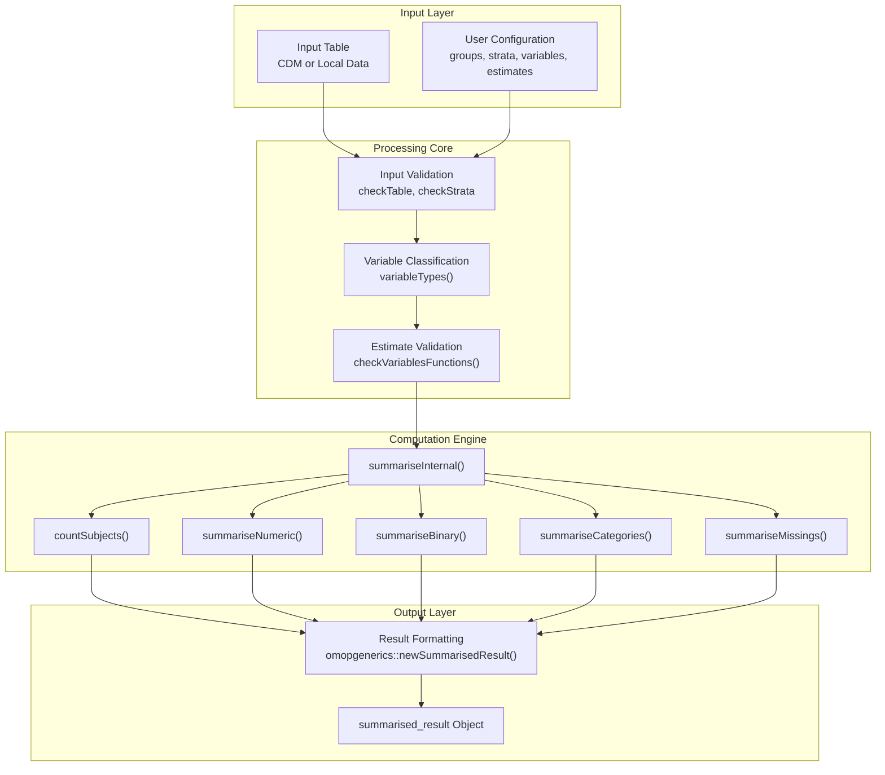
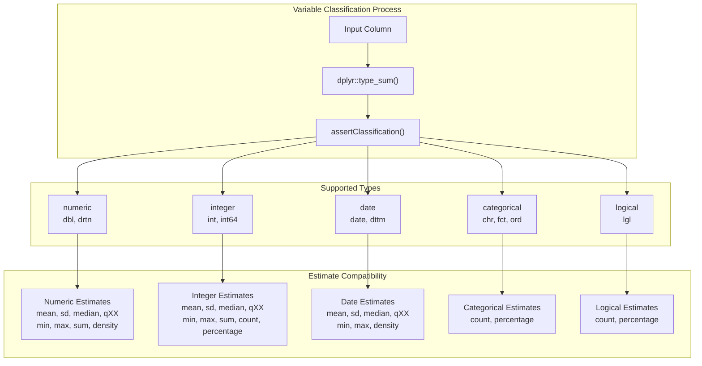
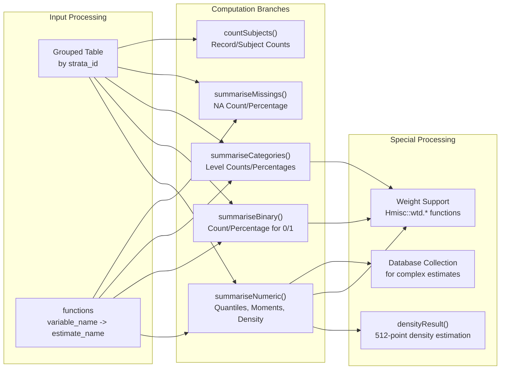
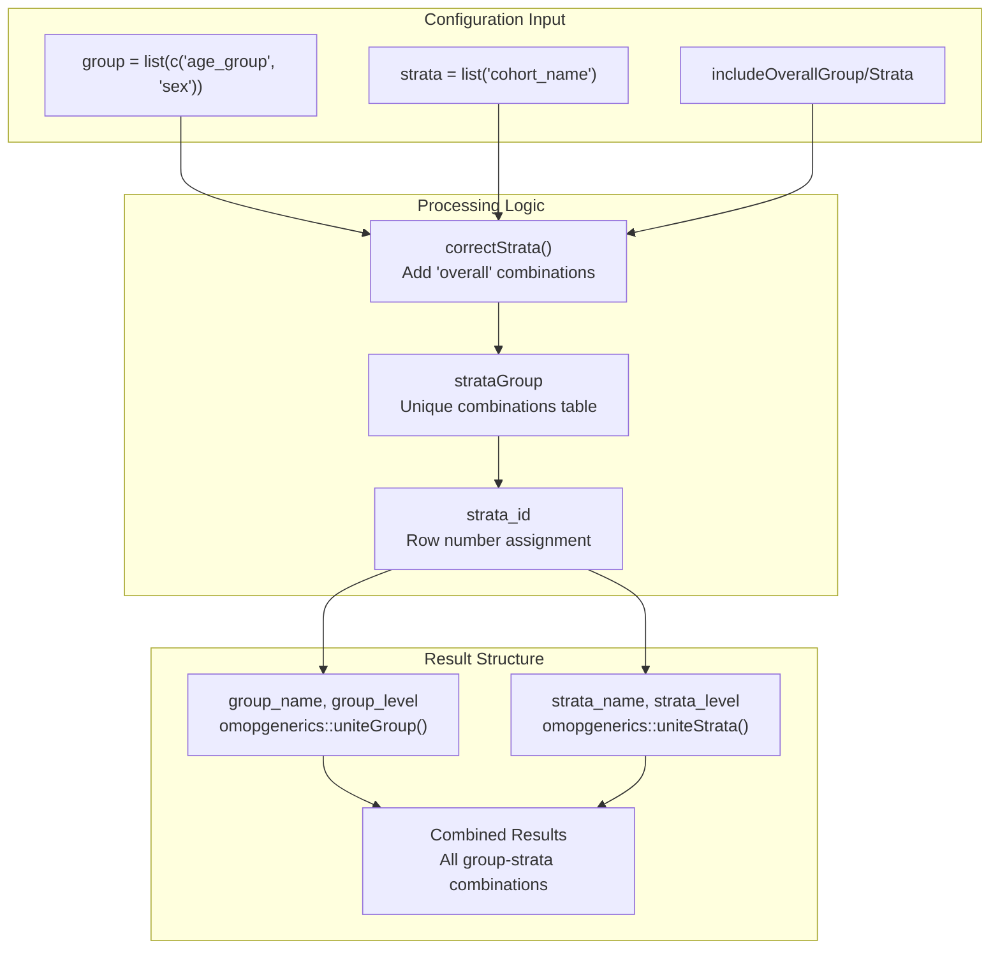
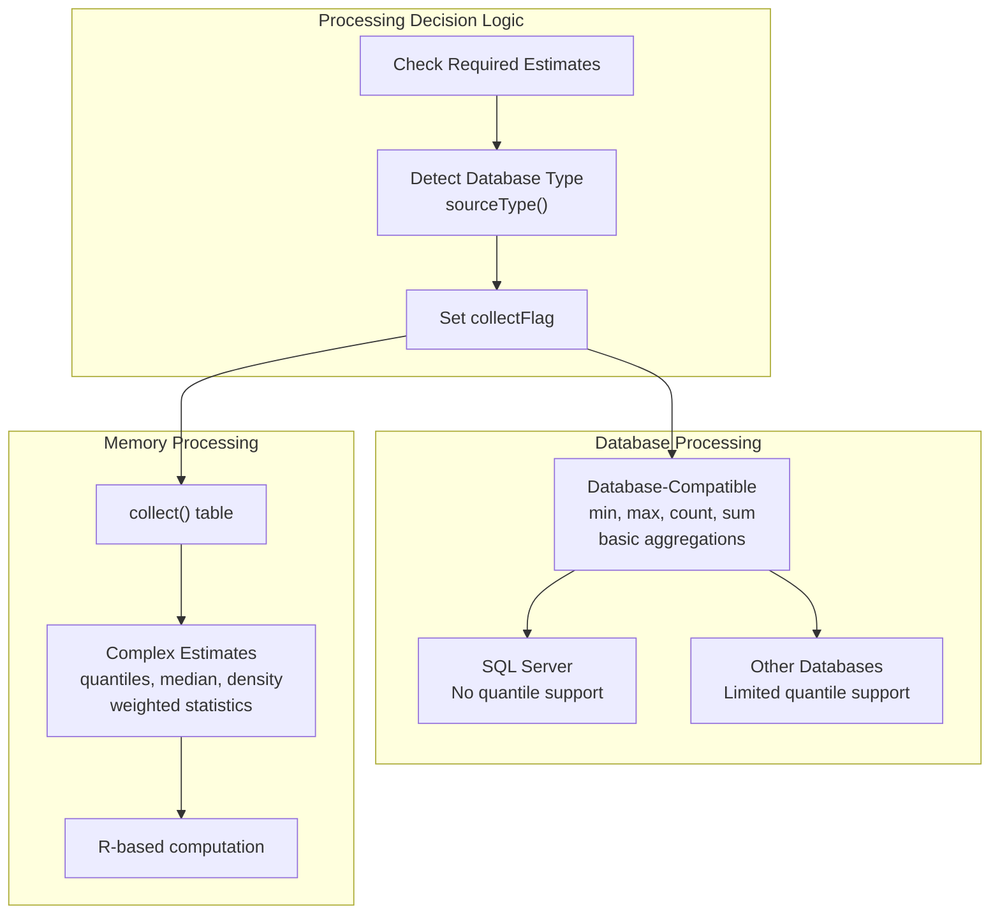
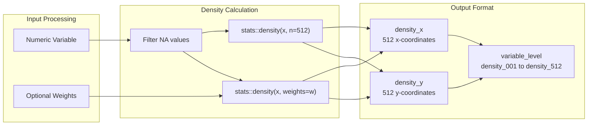

# Page: Data Summarization

# Data Summarization

<details>
<summary>Relevant source files</summary>

The following files were used as context for generating this wiki page:

- [R/formats.R](R/formats.R)
- [R/summariseResult.R](R/summariseResult.R)
- [R/sysdata.rda](R/sysdata.rda)
- [extras/addData.R](extras/addData.R)
- [extras/formats.csv](extras/formats.csv)
- [extras/formats_old.csv](extras/formats_old.csv)
- [tests/testthat/test-format.R](tests/testthat/test-format.R)
- [tests/testthat/test-summariseResult.R](tests/testthat/test-summariseResult.R)

</details>


The Data Summarization system provides comprehensive statistical analysis capabilities for patient data within the OMOP CDM framework. This system transforms raw patient tables into structured statistical summaries with support for grouping, stratification, and multiple estimate types. The core functionality centers around the `summariseResult()` function, which produces standardized `summarised_result` objects containing statistical estimates across different variable types.

For data categorization functionality, see [Data Categorization](#3.3). For intersection-based analysis, see [Data Intersection System](#3.1). For variable type definitions used in development, see [Variable Types and Statistical Estimates](#5.1).

## Core Architecture

The summarization system follows a multi-layered architecture that processes input tables through variable classification, statistical computation, and result formatting stages.

### System Overview



Sources: [R/summariseResult.R:52-237](), [R/summariseResult.R:239-307]()

### Main Function Signature

The primary interface is the `summariseResult()` function with comprehensive configuration options:

| Parameter | Type | Description |
|-----------|------|-------------|
| `table` | Table | Input data (CDM table or local data frame) |
| `group` | List | Grouping variables for analysis |
| `includeOverallGroup` | Boolean | Include overall group results |
| `strata` | List | Stratification variables |
| `includeOverallStrata` | Boolean | Include overall strata results |
| `variables` | List/NULL | Variables to summarize (NULL = all non-ID columns) |
| `estimates` | List | Statistical estimates to compute |
| `counts` | Boolean | Whether to compute record/subject counts |
| `weights` | String/NULL | Column name for weighted estimates |

Sources: [R/summariseResult.R:52-60]()

## Variable Type Classification System

The summarization system uses a sophisticated variable type classification to determine appropriate statistical estimates for each column.

### Variable Type Hierarchy



Sources: [R/formats.R:37-58](), [R/formats.R:61-75]()

### Available Estimates by Type

The system maintains a comprehensive mapping of valid estimates for each variable type through the `availableEstimates()` function:

| Variable Type | Core Estimates | Special Features |
|---------------|----------------|------------------|
| **numeric** | mean, sd, median, qXX, min, max, sum | density plots, missing counts |
| **integer** | mean, sd, median, qXX, min, max, sum | binary detection (0/1), count/percentage |
| **date** | mean, sd, median, qXX, min, max | density plots, date formatting |
| **categorical** | count, percentage | level-wise statistics |
| **logical** | count, percentage | TRUE/FALSE counting |

Sources: [R/formats.R:97-146](), [extras/addData.R:9-15]()

## Statistical Computation Engine

The system processes different variable types through specialized computation functions, each optimized for specific statistical patterns.

### Computation Flow by Variable Type



Sources: [R/summariseResult.R:366-448](), [R/summariseResult.R:517-612](), [R/summariseResult.R:614-662]()

### Numeric Estimation Functions

The system uses predefined function mappings for statistical estimates, supporting both standard and weighted computations:

| Estimate | Standard Function | Weighted Function |
|----------|-------------------|-------------------|
| `mean` | `base::mean(x, na.rm = TRUE)` | `Hmisc::wtd.mean(x, weights, na.rm = TRUE)` |
| `median` | `stats::median(x, na.rm = TRUE)` | `Hmisc::wtd.quantile(x, weights, probs = 0.5)` |
| `sd` | `stats::sd(x, na.rm = TRUE)` | `sqrt(Hmisc::wtd.var(x, weights))` |
| `qXX` | `stats::quantile(x, 0.XX)` | `Hmisc::wtd.quantile(x, weights, probs = 0.XX)` |

Sources: [extras/addData.R:55-76]()

## Grouping and Stratification

The system supports hierarchical analysis through group and strata specifications, enabling complex multi-dimensional statistical breakdowns.

### Group-Strata Processing Architecture



Sources: [R/summariseResult.R:245-276](), [R/summariseResult.R:168-169]()

### Processing Loop Structure

The system processes all group-strata combinations systematically with progress tracking:

```mermaid
sequenceDiagram
    participant Main as summariseResult()
    participant Loop as Processing Loop
    participant Internal as summariseInternal()
    participant Progress as Progress Bar
    
    Main->>Progress: Initialize progress bar (nt combinations)
    Main->>Loop: For each group in groups
    Loop->>Loop: For each strata in stratas
    Loop->>Internal: Call summariseInternal(table, groupk, stratak)
    Internal-->>Loop: Return results for combination
    Loop->>Progress: Update progress (+1)
    Loop-->>Main: Accumulate results
    Main->>Main: Bind all results
```

Sources: [R/summariseResult.R:172-211]()

## Output Format and Structure

The system produces standardized `summarised_result` objects conforming to the `omopgenerics` package specifications.

### Result Schema

| Column | Description | Example Values |
|--------|-------------|----------------|
| `result_id` | Analysis identifier | `1` |
| `cdm_name` | CDM database name | `"mock"`, `"unknown"` |
| `group_name` | Grouping variable name | `"overall"`, `"age_group &&& sex"` |
| `group_level` | Grouping variable level | `"overall"`, `"18 to 65 &&& Female"` |
| `strata_name` | Stratification variable name | `"overall"`, `"cohort_name"` |
| `strata_level` | Stratification variable level | `"overall"`, `"cases"` |
| `variable_name` | Statistical variable name | `"age"`, `"number_records"` |
| `variable_level` | Variable level (categories) | `NA`, `"Male"`, `"density_001"` |
| `estimate_name` | Statistical estimate type | `"mean"`, `"count"`, `"percentage"` |
| `estimate_type` | Result data type | `"numeric"`, `"integer"`, `"percentage"` |
| `estimate_value` | Statistical result | `"45.2"`, `"150"`, `"23.5"` |
| `additional_name` | Additional grouping | `"overall"` |
| `additional_level` | Additional level | `"overall"` |

Sources: [R/summariseResult.R:218-234]()

### Settings Metadata

Each result includes comprehensive metadata about the analysis configuration:

| Setting | Description |
|---------|-------------|
| `result_type` | Always `"summarise_table"` |
| `package_name` | Always `"PatientProfiles"` |
| `package_version` | Version of PatientProfiles used |
| `weights` | Weight column name or `NULL` |

Sources: [R/summariseResult.R:227-233]()

## Performance and Database Optimization

The system includes sophisticated performance optimizations for both database and memory-based processing.

### Database vs Memory Processing



Sources: [R/summariseResult.R:136-154]()

### Optimization Strategies

The system employs several optimization techniques:

1. **Selective Column Processing**: Only required columns are selected for processing
2. **Progressive Collection**: Tables are collected only when necessary for complex estimates
3. **Batch Processing**: Multiple estimates computed in single database queries
4. **Type Conversion**: Dates and logicals converted to integers for database compatibility
5. **Memory Management**: Large tables processed in chunks when possible

Sources: [R/summariseResult.R:128-134](), [R/summariseResult.R:157-165]()

## Density Estimation

The system includes specialized functionality for generating density distributions of numeric variables.

### Density Computation Process



Sources: [R/summariseResult.R:478-515](), [R/summariseResult.R:419-445]()

The density estimation produces 512 coordinate pairs representing the probability density function, enabling detailed distribution analysis and visualization of patient characteristics.