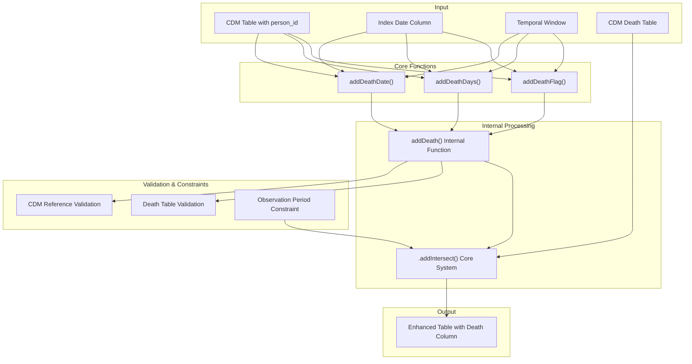
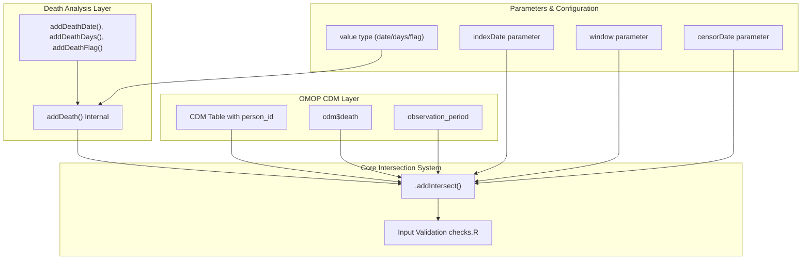
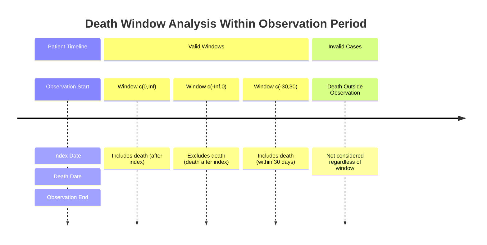

# Page: Death Analysis

# Death Analysis

<details>
<summary>Relevant source files</summary>

The following files were used as context for generating this wiki page:

- [R/addDeath.R](R/addDeath.R)
- [man/addDeathDate.Rd](man/addDeathDate.Rd)
- [man/addDeathDays.Rd](man/addDeathDays.Rd)
- [man/addDeathFlag.Rd](man/addDeathFlag.Rd)
- [tests/testthat/test-addDeath.R](tests/testthat/test-addDeath.R)

</details>


## Purpose and Scope

This page documents the death analysis functionality in PatientProfiles, which enables incorporation of mortality information into patient profiles and clinical analyses. The death analysis system provides functions to add death-related variables to CDM tables, including death dates, time-to-death calculations, and death flags.

For information about general data intersection patterns, see [Data Intersection System](#3.1). For broader demographic analysis capabilities, see [Patient Demographics](#2.1).

## Overview

The death analysis system consists of three main public functions that provide different views of mortality data from the OMOP CDM death table. All death functions respect observation period boundaries and use temporal windows to control the scope of death information retrieval.

### Core Death Functions

| Function | Purpose | Output Type | Default Column Name |
|----------|---------|-------------|-------------------|
| `addDeathDate` | Add actual death date | Date | `date_of_death` |
| `addDeathDays` | Add days from index to death | Integer | `days_to_death` |
| `addDeathFlag` | Add binary death indicator | Integer (0/1) | `death` |

Sources: [R/addDeath.R:40-95]()

## System Architecture

### Death Analysis Workflow



Sources: [R/addDeath.R:140-177](), [R/addDeath.R:17-55]()

### Integration with Core Systems



Sources: [R/addDeath.R:140-177](), [R/addDeath.R:162-176]()

## Function Specifications

### addDeathDate

Adds the actual death date as a new column to the input table.

**Key Parameters:**
- `indexDate`: Reference date column (default: `"cohort_start_date"`)
- `window`: Temporal window around index date (default: `c(0, Inf)`)
- `deathDateName`: Output column name (default: `"date_of_death"`)
- `censorDate`: Optional censoring date column

**Behavior:**
- Returns actual death date from the CDM death table
- Only considers deaths within the same observation period as the index date
- Uses temporal windows to control which deaths are included
- Returns `NA` for individuals with no qualifying death

Sources: [R/addDeath.R:17-55]()

### addDeathDays

Calculates and adds the number of days from the index date to death.

**Key Parameters:**
- `indexDate`: Reference date column (default: `"cohort_start_date"`)
- `window`: Temporal window around index date (default: `c(0, Inf)`)  
- `deathDaysName`: Output column name (default: `"days_to_death"`)
- `censorDate`: Optional censoring date column

**Calculation Logic:**
- Positive values indicate death after the index date
- Zero indicates death on the same day as index date
- Negative values indicate death before the index date (when window allows)
- Returns `NA` for individuals with no qualifying death

Sources: [R/addDeath.R:57-95]()

### addDeathFlag

Adds a binary indicator (0/1) for whether death occurred within the specified window.

**Key Parameters:**
- `indexDate`: Reference date column (default: `"cohort_start_date"`)
- `window`: Temporal window around index date (default: `c(0, Inf)`)
- `deathFlagName`: Output column name (default: `"death"`)
- `censorDate`: Optional censoring date column

**Output Values:**
- `1`: Death occurred within the specified window
- `0`: No death occurred within the specified window

Sources: [R/addDeath.R:98-136]()

## Temporal Window Logic

### Window Parameter Behavior

The `window` parameter controls which deaths are considered based on their temporal relationship to the index date:

| Window | Interpretation | Example Use Case |
|--------|---------------|------------------|
| `c(0, Inf)` | Deaths on or after index date | Mortality follow-up |
| `c(-Inf, 0)` | Deaths on or before index date | Prior mortality |
| `c(0, 30)` | Deaths within 30 days after index | 30-day mortality |
| `c(-30, 30)` | Deaths within ±30 days of index | Perioperative mortality |

### Observation Period Constraints

Death information is only retrieved for deaths occurring within the same observation period as the index date. This ensures temporal validity of the death information relative to the patient's observable time in the database.



Sources: [tests/testthat/test-addDeath.R:148-244]()

## Integration with CDM Architecture

### Required CDM Components

The death analysis system requires the following CDM components:

1. **Death Table**: Standard OMOP CDM death table with `person_id` and `death_date`
2. **Observation Period Table**: To constrain temporal validity
3. **Input Table**: Any CDM table containing `person_id` and the specified index date column

### Validation and Error Handling

The system performs comprehensive validation:

- **CDM Reference Validation**: Ensures valid CDM connection and death table presence
- **Column Validation**: Verifies index date column exists in input table
- **Window Validation**: Validates window parameter format and logical consistency  
- **Name Validation**: Warns about non-snake_case column names

Sources: [R/addDeath.R:149-161](), [tests/testthat/test-addDeath.R:38-99]()

## Usage Patterns

### Multiple Death Records

When multiple death records exist for the same person, the system uses the "first" ordering strategy, returning the earliest death date that falls within the specified window and observation period constraints.

### Column Overwriting

If the target column name already exists in the input table, the system issues a warning and overwrites the existing column.

### Integration with Other Functions

Death functions can be chained with other PatientProfiles functions:

```r
# Example workflow combining demographics and death analysis
cdm$cohort1 |>
  addAge() |>
  addSex() |>
  addDeathFlag(window = c(0, 365)) |>
  addDeathDays()
```

Sources: [tests/testthat/test-addDeath.R:289-368](), [R/addDeath.R:156-160]()