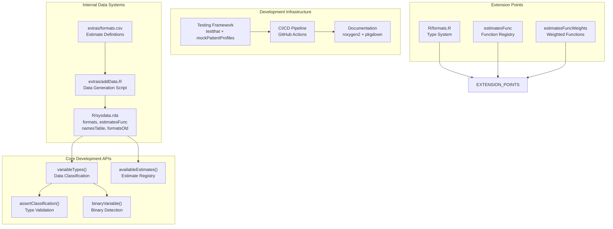
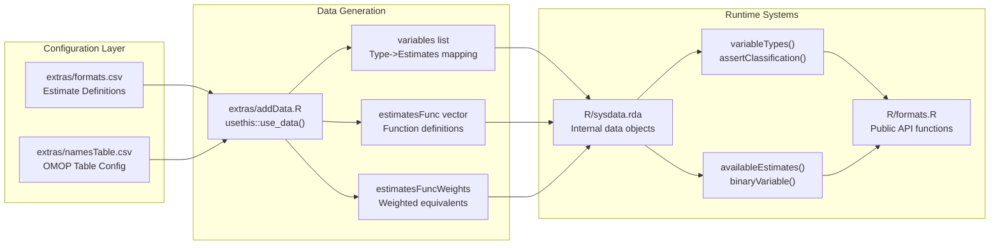
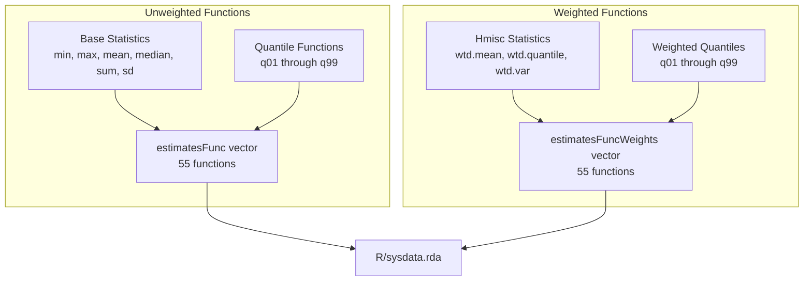
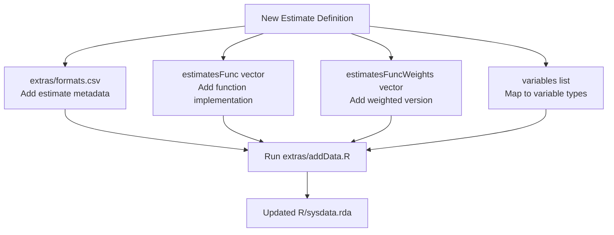
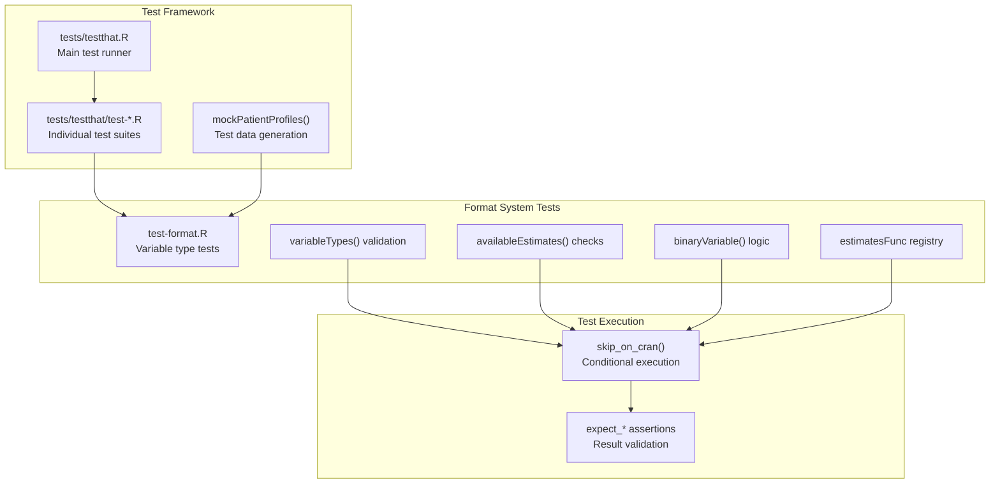
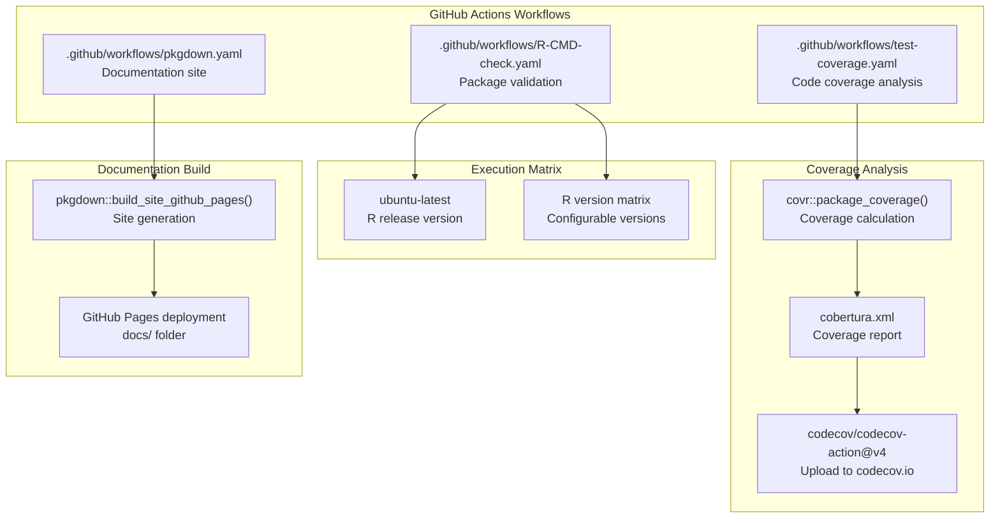

# Page: Development Guide

# Development Guide

Relevant source files

The following files were used as context for generating this wiki page:

- [.github/.gitignore](.github/.gitignore)
- [.github/workflows/R-CMD-check.yaml](.github/workflows/R-CMD-check.yaml)
- [.github/workflows/pkgdown.yaml](.github/workflows/pkgdown.yaml)
- [.github/workflows/test-coverage.yaml](.github/workflows/test-coverage.yaml)
- [R/formats.R](R/formats.R)
- [R/sysdata.rda](R/sysdata.rda)
- [codecov.yml](codecov.yml)
- [extras/addData.R](extras/addData.R)
- [extras/formats.csv](extras/formats.csv)
- [extras/formats_old.csv](extras/formats_old.csv)
- [man/mockPatientProfiles.Rd](man/mockPatientProfiles.Rd)
- [tests/testthat.R](tests/testthat.R)
- [tests/testthat/test-format.R](tests/testthat/test-format.R)

This document provides essential resources for developers working on or extending the PatientProfiles package. It covers the internal architecture, development workflows, testing frameworks, and quality assurance processes that maintain the package's reliability and performance.

For information about variable type classification and statistical estimates, see [Variable Types and Statistical Estimates](#5.1). For CI/CD pipeline details, see [Quality Assurance and CI/CD](#5.2). For package build configuration, see [Package Configuration](#5.4).

## Development Architecture Overview

The PatientProfiles package follows a modular architecture designed for maintainability and extensibility. The core systems are organized into several key layers that developers need to understand.

### Core Development Systems

Sources: [R/formats.R](), [R/sysdata.rda](), [extras/addData.R](), [extras/formats.csv](), [tests/testthat.R]()

### Development Data Flow

Sources: [extras/addData.R:7-77](), [R/formats.R:37-75](), [R/sysdata.rda]()

## Variable Type Classification System

The package implements a sophisticated variable type classification system that automatically categorizes data columns into analysis-appropriate types. This system is central to the package's functionality and provides extension points for developers.

### Type Classification Architecture

| Variable Type | R Class Mapping | Estimate Support |
|---------------|-----------------|------------------|
| `categorical` | `chr`, `fct`, `ord` | `count`, `percentage` |
| `date` | `date`, `dttm` | `mean`, `sd`, `median`, `qXX`, `min`, `max` |
| `logical` | `lgl` | `count`, `percentage` |
| `numeric` | `drtn`, `dbl` | Full statistical suite |
| `integer` | `int`, `int64` | Full statistical suite |

The classification logic is implemented in `assertClassification()` function at [R/formats.R:61-75](), which uses a switch statement to map R's `type_sum()` output to PatientProfiles variable types.

### Estimate Function Registry

The package maintains two parallel function registries for statistical estimates:

Sources: [extras/addData.R:55-76](), [tests/testthat/test-format.R:138-146]()

## Development Workflows

### Adding New Variable Types

To extend the package with new variable types, developers must modify several interconnected components:

1. **Update Type Classification**: Modify `assertClassification()` in [R/formats.R:61-75]() to handle the new R class
2. **Define Available Estimates**: Add entries to the `variables` list in [extras/addData.R:9-15]()
3. **Update Configuration**: Add estimate definitions to [extras/formats.csv]()
4. **Regenerate Internal Data**: Run [extras/addData.R:77]() to update `sysdata.rda`
5. **Add Tests**: Create test cases in [tests/testthat/test-format.R]()

### Adding Statistical Estimates

New statistical estimates require updates to multiple function registries:

Sources: [extras/addData.R:55-76](), [extras/formats.csv:1-13]()

## Testing Infrastructure

The package employs a comprehensive testing strategy built on the `testthat` framework with specialized mock data capabilities.

### Testing Architecture

Sources: [tests/testthat.R:9-12](), [tests/testthat/test-format.R:1-146]()

### Mock Data System

The `mockPatientProfiles()` function provides a complete CDM environment for testing, documented in [man/mockPatientProfiles.Rd:6-13]().

## Quality Assurance Pipeline

The package implements automated quality assurance through GitHub Actions workflows that ensure code quality and reliability.

### CI/CD Workflow Architecture

Sources: [.github/workflows/R-CMD-check.yaml:11-46](), [.github/workflows/test-coverage.yaml:14-63](), [.github/workflows/pkgdown.yaml:16-49]()

### Coverage Configuration

The package maintains strict code coverage standards through [codecov.yml:3-14](), with auto-targeting and 1% threshold tolerance for both project and patch coverage.

## Package Data Management

### Internal Data Objects

The package stores critical configuration data in `R/sysdata.rda`, which contains:

| Object | Type | Purpose |
|--------|------|---------|
| `formats` | `tibble` | Variable type to estimate mappings |
| `estimatesFunc` | `character vector` | Unweighted statistical functions |
| `estimatesFuncWeights` | `character vector` | Weighted statistical functions |
| `namesTable` | `tibble` | OMOP CDM table configurations |
| `formatsOld` | `tibble` | Legacy format definitions |

### Data Generation Process

The [extras/addData.R]() script orchestrates the creation of internal data objects:

1. **Configuration Loading**: Reads CSV files from `extras/` directory
2. **Data Transformation**: Processes raw configurations into runtime objects
3. **Function Registry Creation**: Builds statistical function mappings
4. **Internal Data Export**: Uses `usethis::use_data()` to create `sysdata.rda`

Sources: [extras/addData.R:1-78](), [R/sysdata.rda]()