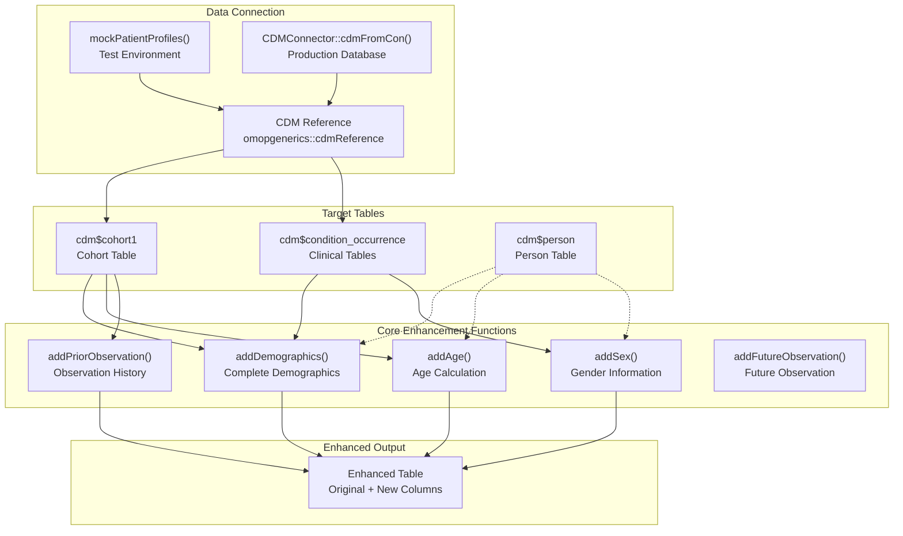
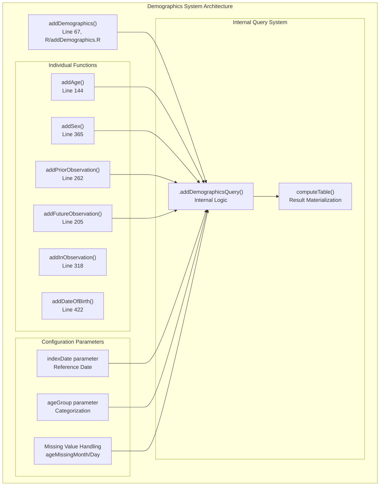
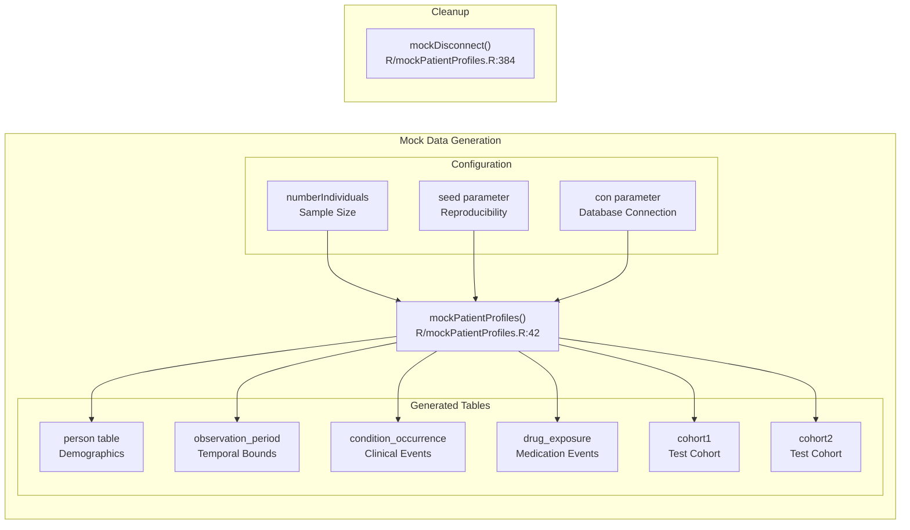
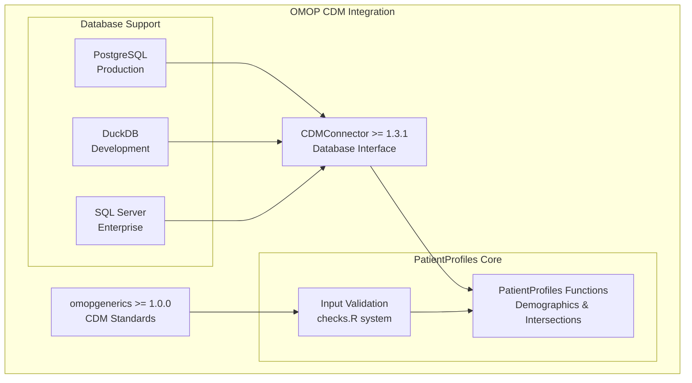

# Page: Getting Started

# Getting Started

<details>
<summary>Relevant source files</summary>

The following files were used as context for generating this wiki page:

- [DESCRIPTION](DESCRIPTION)
- [NAMESPACE](NAMESPACE)
- [NEWS.md](NEWS.md)
- [R/addDemographics.R](R/addDemographics.R)
- [R/mockPatientProfiles.R](R/mockPatientProfiles.R)
- [README.Rmd](README.Rmd)
- [README.md](README.md)
- [_pkgdown.yml](_pkgdown.yml)
- [tests/testthat/test-addDemographics.R](tests/testthat/test-addDemographics.R)

</details>


This section provides essential information for new users to begin working with PatientProfiles. The focus is on the most commonly used functions for adding patient characteristics to OMOP CDM tables and creating test environments for development and examples.

For information about advanced intersection operations between cohorts and clinical concepts, see [Core Features](#3). For performance optimization and large-scale studies, see [Large Scale Characteristics](#4.1).

## Essential Workflow Overview

The typical PatientProfiles workflow involves connecting to an OMOP CDM database, selecting a table containing patient data, and enriching it with demographic or temporal characteristics. For development and testing, mock data can be generated to simulate this process.



Sources: [README.md:56-95](), [R/addDemographics.R:17-114](), [R/mockPatientProfiles.R:17-41]()

## Core Demographics Functions

PatientProfiles provides both individual and comprehensive functions for adding patient characteristics. The main entry point is `addDemographics()`, which can add multiple characteristics in a single operation.



Sources: [R/addDemographics.R:67-114](), [R/addDemographics.R:144-179](), [R/addDemographics.R:365-394]()

## Key Function Parameters

The demographics functions share common parameters that control their behavior:

| Parameter | Purpose | Default | Example |
|-----------|---------|---------|---------|
| `indexDate` | Reference date for calculations | `"cohort_start_date"` | `"condition_start_date"` |
| `ageName` | Output column name for age | `"age"` | `"age_at_diagnosis"` |
| `ageGroup` | Age categorization ranges | `NULL` | `list(c(0,18), c(19,65))` |
| `sexName` | Output column name for sex | `"sex"` | `"gender"` |
| `priorObservationType` | Return format for prior observation | `"days"` | `"date"` |
| `name` | Result table name | `NULL` (temporary) | `"enriched_cohort"` |

Sources: [R/addDemographics.R:67-88](), [R/addDemographics.R:144-153]()

## Mock Data Environment

For development and testing, PatientProfiles provides `mockPatientProfiles()` to create simulated OMOP CDM databases. This function generates realistic test data following OMOP CDM structure.



Sources: [R/mockPatientProfiles.R:42-340](), [R/mockPatientProfiles.R:384-391]()

## Essential Usage Patterns

### Basic Demographics Addition

The most common pattern is using `addDemographics()` to add comprehensive patient information:

```r
# Complete demographics package
cdm$cohort1 |>
  addDemographics(
    indexDate = "cohort_start_date",
    ageGroup = list(c(0, 18), c(19, 65), c(66, 100))
  )
```

### Individual Characteristic Functions

For specific needs, individual functions provide focused functionality:

```r
# Age only
cdm$condition_occurrence |>
  addAge(indexDate = "condition_start_date")

# Sex information
cdm$cohort1 |>
  addSex()

# Observation periods
cdm$cohort1 |>
  addPriorObservation() |>
  addFutureObservation()
```

Sources: [README.md:183-191](), [README.md:105-122](), [tests/testthat/test-addDemographics.R:157-179]()

### Test Environment Setup

Creating and managing mock data environments follows this pattern:

```r
# Create test environment
cdm <- mockPatientProfiles(
  numberIndividuals = 100,
  seed = 123
)

# Use the mock data
result <- cdm$cohort1 |>
  addDemographics()

# Clean up
mockDisconnect(cdm)
```

Sources: [R/mockPatientProfiles.R:32-41](), [tests/testthat/test-addDemographics.R:25-30]()

## Function Name Mapping

PatientProfiles exports 57 functions organized into logical groups. The essential functions for getting started are:

| Function Category | Core Functions | Purpose |
|-------------------|----------------|---------|
| Complete Demographics | `addDemographics` | Add multiple characteristics |
| Individual Age | `addAge` | Age calculation only |
| Individual Sex | `addSex` | Gender information only |
| Observation Periods | `addPriorObservation`, `addFutureObservation` | Temporal constraints |
| Test Environment | `mockPatientProfiles`, `mockDisconnect` | Development support |

Sources: [NAMESPACE:3-53](), [_pkgdown.yml:16-28]()

## Integration with OMOP CDM

PatientProfiles integrates with the broader OMOP ecosystem through standardized interfaces. The package depends on `CDMConnector` for database connections and `omopgenerics` for CDM standards compliance.



Sources: [DESCRIPTION:53-62](), [README.md:68-85]()

This Getting Started guide covers the essential functions needed to begin using PatientProfiles effectively. For more complex intersection operations with cohorts and concepts, proceed to [Core Features](#3). For specialized analysis patterns, see [Data Summarization](#3.2) and [Advanced Features](#4).