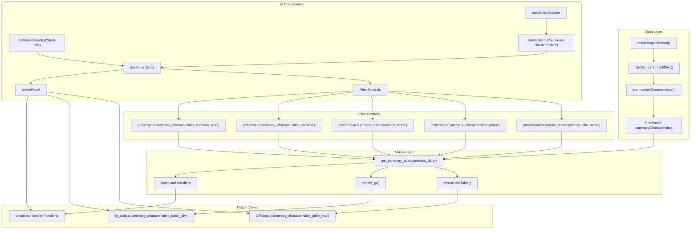
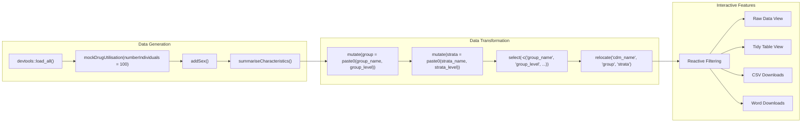

# Page: Interactive Tools

# Interactive Tools

<details>
<summary>Relevant source files</summary>

The following files were used as context for generating this wiki page:

- [extras/shinysummary.R](extras/shinysummary.R)

</details>


## Purpose and Scope

This document covers the interactive tools available for exploring and visualizing patient characteristics data generated by the PatientProfiles package. The primary interactive tool is a Shiny application that provides a web-based dashboard for filtering, viewing, and downloading summary characteristics results.

For information about generating the underlying summary data that powers these interactive tools, see [Data Summarization](#3.2).

## Shiny Application Overview

The PatientProfiles package includes a comprehensive Shiny application located in [extras/shinysummary.R:1-209]() that provides an interactive dashboard for exploring patient characteristics. The application is built using the `shinydashboard` framework and integrates multiple visualization and data manipulation packages including `gt`, `DT`, and `shinyWidgets`.

### Application Architecture



**Sources:** [extras/shinysummary.R:35-195]()

### Data Processing Pipeline

The application demonstrates a complete workflow for generating and displaying patient characteristics:



**Sources:** [extras/shinysummary.R:10-33](), [extras/shinysummary.R:138-191]()

## Key Features

### Interactive Filtering System

The application provides comprehensive filtering capabilities through five main filter controls:

| Filter Control | Input ID | Purpose |
|----------------|----------|---------|
| CDM Name | `summary_characteristics_cdm_name` | Filter by database source |
| Group | `summary_characteristics_group` | Filter by patient groups |
| Strata | `summary_characteristics_strata` | Filter by stratification variables |
| Variables | `summary_characteristics_variable` | Select specific characteristics |
| Estimate Type | `summary_characteristics_estimate_type` | Choose statistical measures |

Each filter uses `pickerInput()` widgets with multi-select capabilities and action boxes for bulk selection operations.

**Sources:** [extras/shinysummary.R:56-109]()

### Data Visualization Options

The application provides two distinct views of the data:

1. **Raw Data View**: Uses `DTOutput()` with `renderDataTable()` to display filterable, sortable tabular data with horizontal scrolling capabilities
2. **Tidy Table View**: Uses `gt_output()` with `render_gt()` to create publication-ready formatted tables using the `pivotSettings()` function

**Sources:** [extras/shinysummary.R:112-128](), [extras/shinysummary.R:147-163]()

### Download Functionality

The application includes three download handlers:

| Download Type | Output File | Content |
|---------------|-------------|---------|
| Raw Complete | `summaryCharacteristicsTable.csv` | Full unfiltered dataset |
| Raw Filtered | `summaryCharacteristicsTableFiltered.csv` | Current filtered view |
| Tidy Word | `summaryCharacteristicsTable.docx` | Formatted table document |

**Sources:** [extras/shinysummary.R:164-191]()

### Server-Side Reactivity

The core reactive function `get_summary_characteristics_data()` implements the filtering logic by chaining `filter()` operations for each filter input:

```r
get_summary_characteristics_data <- reactive({
  summaryCharacteristics |>
    filter(variable %in% input$summary_characteristics_variable) |>
    filter(cdm_name %in% input$summary_characteristics_cdm_name) |>
    filter(estimate_type %in% input$summary_characteristics_estimate_type) |>
    filter(group %in% input$summary_characteristics_group) |>
    filter(strata %in% input$summary_characteristics_strata)
})
```

**Sources:** [extras/shinysummary.R:138-145]()

## Example Data Configuration

The application demonstrates a realistic patient characteristics analysis setup:

- **Population**: 100 individuals from mock drug utilization study
- **Demographics**: Sex stratification using `addSex()`
- **Age Groups**: Categorized into 5 age bands (0-19, 20-39, 40-59, 60-79, 80-150)
- **Clinical Intersections**: 
  - Visit counts from `visit_occurrence` table over previous 365 days
  - Medication flags from cohort intersections
- **Statistical Parameters**: Minimum cell count threshold of 1

**Sources:** [extras/shinysummary.R:12-33]()

## Deployment and Usage

The application is launched using the standard Shiny pattern with `shinyApp(ui, server)` at [extras/shinysummary.R:195](). The file also includes commented CSS customization options for styling the dashboard header and sidebar with custom colors.

**Sources:** [extras/shinysummary.R:195](), [extras/shinysummary.R:197-209]()