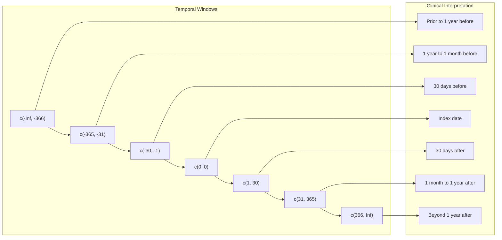
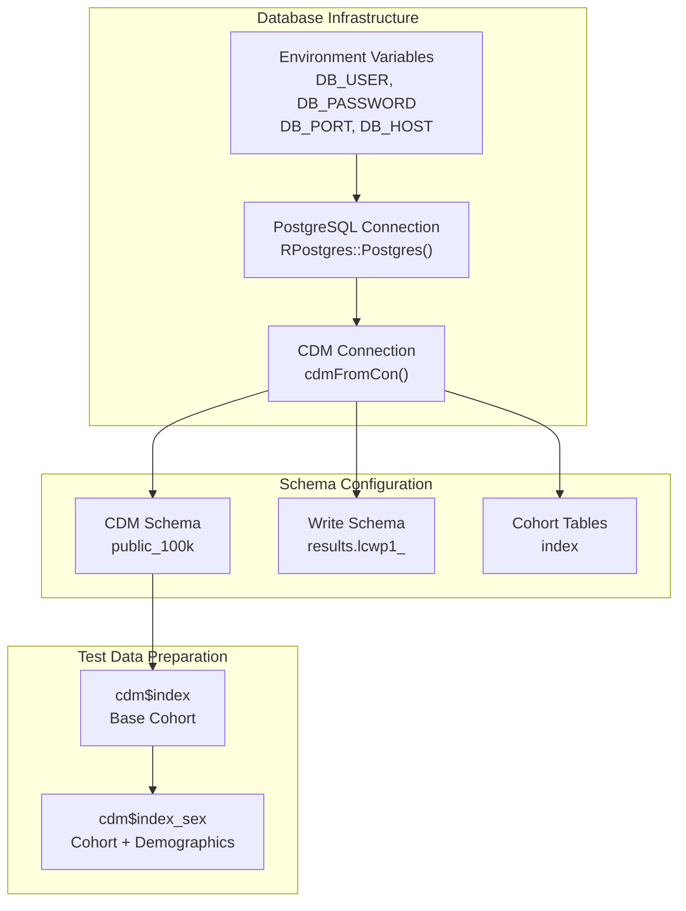
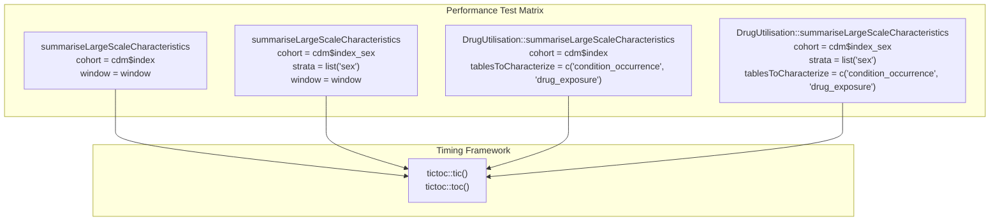
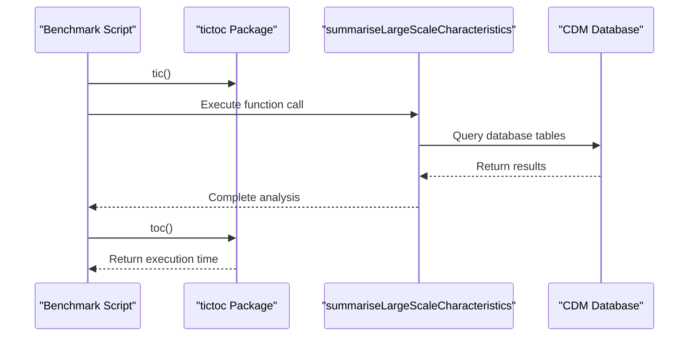
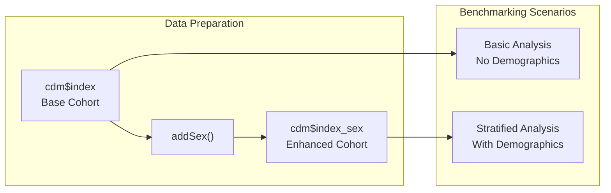
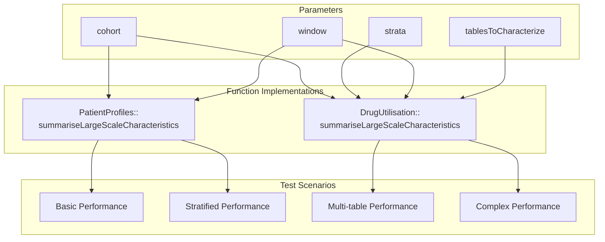
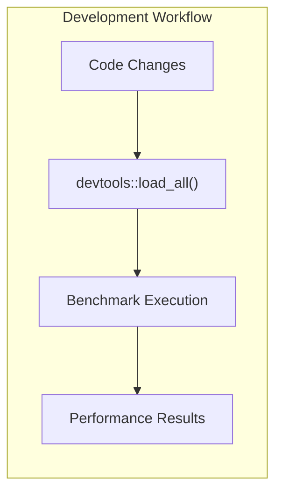

# Page: Large Scale Characteristics

# Large Scale Characteristics

Relevant source files

The following files were used as context for generating this wiki page:

- [extras/benchmark.R](extras/benchmark.R)

## Purpose and Scope

The Large Scale Characteristics system provides benchmarking and performance testing capabilities for patient characterization studies at scale within OMOP CDM databases. This module focuses on measuring execution performance and resource utilization when running characterization analyses across large patient cohorts with multiple temporal windows and stratification variables.

For basic patient characterization functions, see [Data Summarization](#3.2). For information about the underlying intersection system that powers these analyses, see [Data Intersection System](#3.1).

## Core Concepts

Large scale characteristics analysis involves systematically profiling patient cohorts across multiple clinical domains with temporal constraints. The system provides dedicated benchmarking infrastructure to measure performance characteristics of the `summariseLargeScaleCharacteristics` function under various computational loads.

### Temporal Window Analysis

The benchmarking framework tests performance across predefined temporal windows that represent clinically meaningful periods relative to an index event:

Sources: [extras/benchmark.R:25-28]()

## Benchmarking Architecture

The benchmarking system is designed to measure performance across different analytical scenarios, from simple cohort characterization to complex stratified analyses.

### Database Connection Framework

Sources: [extras/benchmark.R:5-23]()

### Performance Testing Scenarios

The benchmarking framework tests four distinct scenarios to measure computational complexity:

| Scenario | Cohort Type | Stratification | Tables | Purpose |
|----------|-------------|----------------|--------|---------|
| Basic | `cdm$index` | None | Default | Baseline performance |
| Stratified | `cdm$index_sex` | `list("sex")` | Default | Impact of stratification |
| Multi-table | `cdm$index` | None | `condition_occurrence`, `drug_exposure` | Table-specific analysis |
| Complex | `cdm$index_sex` | `list("sex")` | `condition_occurrence`, `drug_exposure` | Full complexity |

Sources: [extras/benchmark.R:34-48]()

## Performance Measurement Framework

The benchmarking implementation uses the `tictoc` package for precise execution timing across different analytical scenarios.

### Timing Implementation Pattern

Each performance test follows a consistent pattern:
1. Initialize timing with `tictoc::tic()`
2. Execute the `summariseLargeScaleCharacteristics` function
3. Capture execution time with `tictoc::toc()`

Sources: [extras/benchmark.R:34-48]()

## Data Preparation Workflow

### Demographics Enhancement

The benchmark script includes demographic enhancement as a preprocessing step:

Sources: [extras/benchmark.R:32]()

## Function Integration

The benchmarking framework integrates with two implementations of large scale characteristics:

### PatientProfiles Implementation
- Direct function call: `summariseLargeScaleCharacteristics()`
- Focuses on core functionality performance

### DrugUtilisation Package Implementation  
- Namespaced call: `DrugUtilisation::summariseLargeScaleCharacteristics()`
- Includes additional `tablesToCharacterize` parameter
- Tests performance with specific OMOP tables: `condition_occurrence`, `drug_exposure`

Sources: [extras/benchmark.R:35-47]()

## Development Environment Integration

The benchmarking script integrates with the development environment through `devtools::load_all()`, enabling testing of the latest code changes without package reinstallation.

Sources: [extras/benchmark.R:30]()