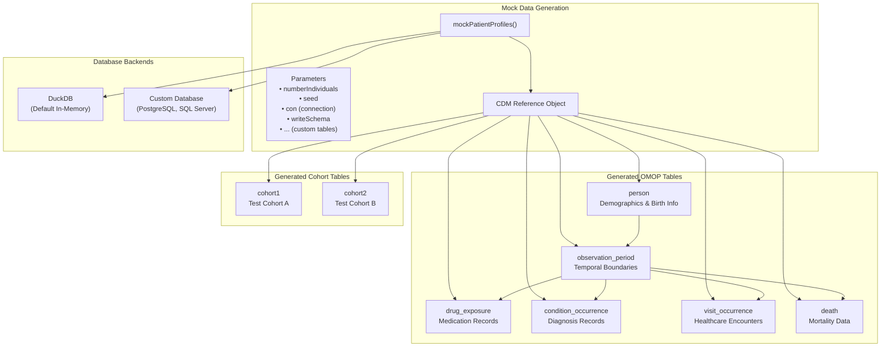
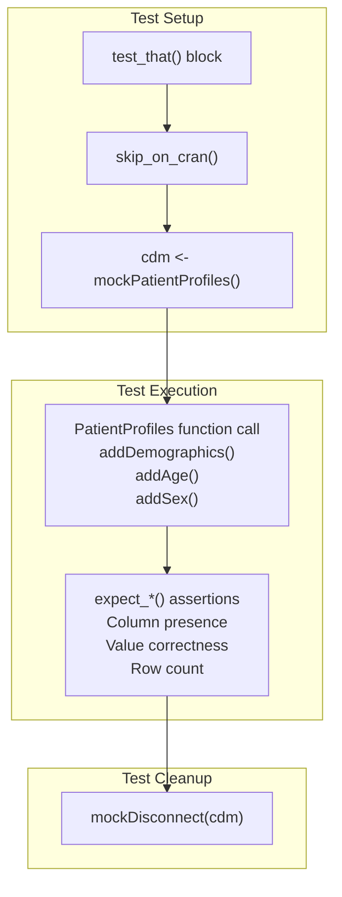
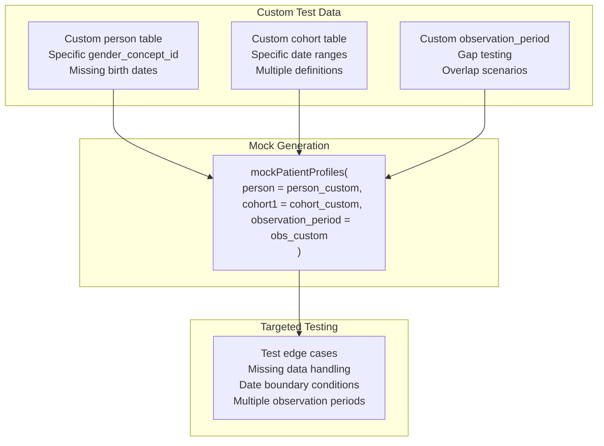
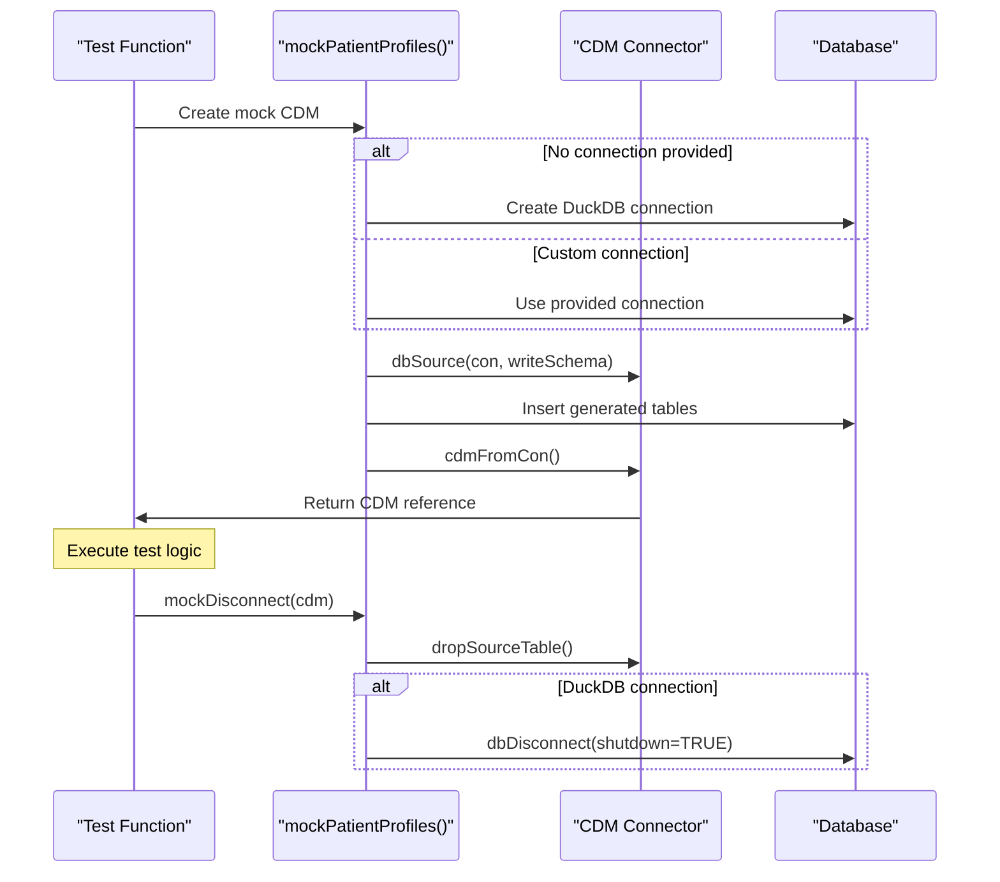

# Page: Mock Data and Testing

# Mock Data and Testing

Relevant source files

The following files were used as context for generating this wiki page:

- [R/addDemographics.R](R/addDemographics.R)
- [R/mockPatientProfiles.R](R/mockPatientProfiles.R)
- [tests/testthat/test-addAttributes.R](tests/testthat/test-addAttributes.R)
- [tests/testthat/test-addDemographics.R](tests/testthat/test-addDemographics.R)
- [tests/testthat/test-addFutureObservation.R](tests/testthat/test-addFutureObservation.R)
- [tests/testthat/test-addInObservation.R](tests/testthat/test-addInObservation.R)
- [tests/testthat/test-addPriorObservation.R](tests/testthat/test-addPriorObservation.R)
- [tests/testthat/test-addSex.R](tests/testthat/test-addSex.R)

This section covers the mock data generation system and testing infrastructure used to develop and validate PatientProfiles functionality. The `mockPatientProfiles()` function creates synthetic OMOP CDM databases for testing without requiring access to real patient data.

For information about the core demographic functions being tested, see [Patient Demographics](#2.1). For details about the broader development and quality assurance processes, see [Quality Assurance and CI/CD](#5.2).

## Mock CDM Database Generation

The mock data system centers around the `mockPatientProfiles()` function, which generates a complete OMOP CDM reference object with synthetic data. This function creates all standard OMOP tables required for testing PatientProfiles functionality.

**Mock Data Generation Architecture**

Sources: [R/mockPatientProfiles.R:42-340](), [tests/testthat/test-addDemographics.R:25-30]()

## Core Mock Data Functions

| Function | Purpose | Key Parameters |
|----------|---------|----------------|
| `mockPatientProfiles()` | Creates complete mock CDM | `numberIndividuals`, `seed`, `con`, `writeSchema`, custom tables |
| `mockDisconnect()` | Cleans up database connections | `cdm` object |
| `addDate()` | Internal function for date generation | `x`, `cols` |

The system supports both automatic table generation and custom table injection through the `...` parameter, allowing tests to specify exact data scenarios.

```mermaid
flowchart LR
    subgraph "Input Processing"
        CUSTOM_TABLES["Custom Tables<br/>(... parameter)"]
        DEFAULT_PARAMS["Default Parameters<br/>numberIndividuals: 10<br/>seed: NULL"]
    end
    
    subgraph "Person ID Resolution"
        PERSON_EXTRACT["Extract person_id/subject_id<br/>from custom tables"]
        PERSON_LIST["persons <- unique(ids)"]
    end
    
    subgraph "Table Generation Pipeline"
        PERSON_TABLE["Generate person table<br/>gender_concept_id<br/>year_of_birth"]
        DATE_COLLECT["Collect all dates<br/>from custom tables"]
        OBS_PERIOD_GEN["Generate observation_period<br/>based on date ranges"]
        OMOP_TABLES_GEN["Generate OMOP tables<br/>drug_exposure<br/>condition_occurrence<br/>visit_occurrence<br/>death"]
        COHORT_GEN["Generate cohort tables<br/>cohort1, cohort2"]
    end
    
    subgraph "Database Integration"
        DB_INSERT["Insert tables into database<br/>CDMConnector::dbSource()"]
        CDM_CREATE["Create CDM object<br/>CDMConnector::cdmFromCon()"]
    end
    
    CUSTOM_TABLES --> PERSON_EXTRACT
    DEFAULT_PARAMS --> PERSON_EXTRACT
    PERSON_EXTRACT --> PERSON_LIST
    PERSON_LIST --> PERSON_TABLE
    CUSTOM_TABLES --> DATE_COLLECT
    DATE_COLLECT --> OBS_PERIOD_GEN
    PERSON_TABLE --> OBS_PERIOD_GEN
    OBS_PERIOD_GEN --> OMOP_TABLES_GEN
    OMOP_TABLES_GEN --> COHORT_GEN
    COHORT_GEN --> DB_INSERT
    DB_INSERT --> CDM_CREATE
```

**Mock Data Generation Flow**

Sources: [R/mockPatientProfiles.R:62-340](), [R/mockPatientProfiles.R:342-376]()

## Testing Integration Patterns

The mock system integrates seamlessly with the testthat framework, providing consistent test environments across all PatientProfiles functions.

### Standard Testing Pattern

**Standard Test Pattern**

### Custom Data Testing Pattern

For specific test scenarios, the system allows injection of custom tables to test edge cases and specific data configurations.

**Custom Data Testing Pattern**

Sources: [tests/testthat/test-addDemographics.R:84-146](), [tests/testthat/test-addDemographics.R:514-574]()

## Database Connection Management

The mock system supports multiple database backends and handles connection lifecycle management automatically.

| Connection Type | Usage | Configuration |
|----------------|--------|---------------|
| DuckDB (Default) | In-memory testing | `con = NULL`, `writeSchema = "main"` |
| Custom PostgreSQL | Integration testing | `con = postgres_connection`, `writeSchema = schema_name` |
| Custom SQL Server | Production-like testing | `con = sqlserver_connection`, `writeSchema = schema_name` |

### Connection Lifecycle

**Database Connection Lifecycle**

Sources: [R/mockPatientProfiles.R:47-56](), [R/mockPatientProfiles.R:384-391]()

## Mock Data Characteristics

The generated mock data follows specific patterns to ensure realistic testing scenarios:

### Demographic Distribution
- Gender: Random assignment between Male (8507) and Female (8532) concept IDs
- Birth years: 1900 + random integers up to 80 years
- Missing data: Configurable through custom tables

### Temporal Relationships
- Observation periods: Automatically calculated from provided dates or randomly generated
- Drug exposures: Random within observation periods, 0 to 2×numberIndividuals records
- Condition occurrences: Random within observation periods, 0 to 2×numberIndividuals records
- Death records: ~20% of individuals, at end of final observation period

### Cohort Generation
- Two cohort tables (`cohort1`, `cohort2`) generated by default
- Random cohort definition IDs (1-3)
- Start/end dates within observation periods
- Configurable through custom table injection

Sources: [R/mockPatientProfiles.R:82-309](), [R/mockPatientProfiles.R:230-249]()