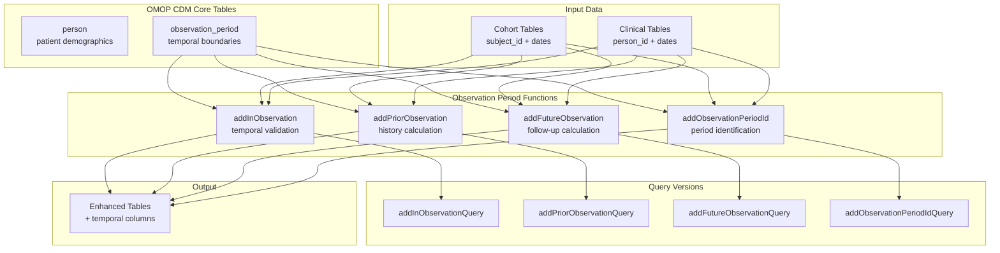
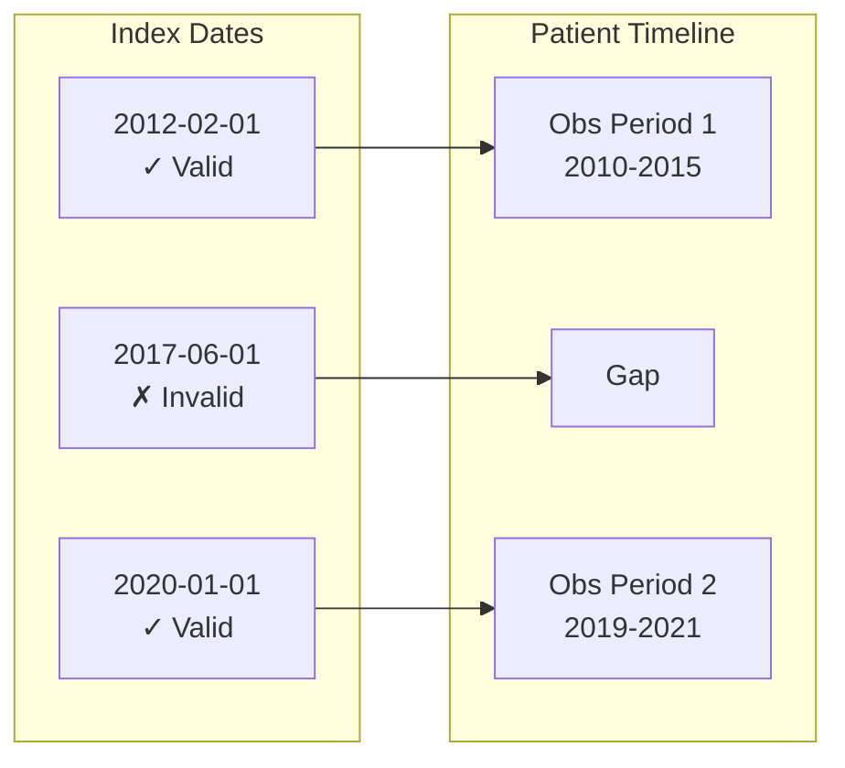
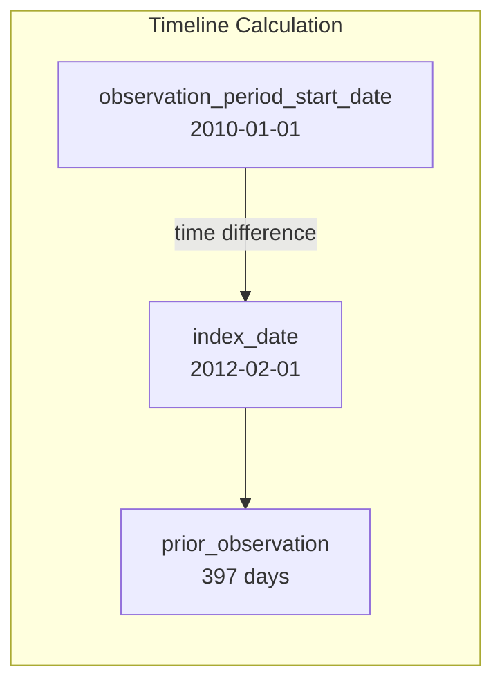
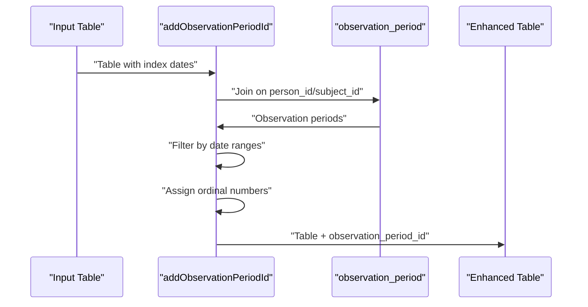
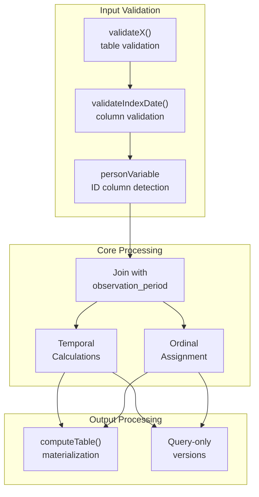

# Page: Observation Period Management

# Observation Period Management

Relevant source files

The following files were used as context for generating this wiki page:

- [R/addObservationPeriodId.R](R/addObservationPeriodId.R)
- [man/addObservationPeriodId.Rd](man/addObservationPeriodId.Rd)
- [man/addObservationPeriodIdQuery.Rd](man/addObservationPeriodIdQuery.Rd)
- [tests/testthat/test-addAttributes.R](tests/testthat/test-addAttributes.R)
- [tests/testthat/test-addFutureObservation.R](tests/testthat/test-addFutureObservation.R)
- [tests/testthat/test-addInObservation.R](tests/testthat/test-addInObservation.R)
- [tests/testthat/test-addObservationPeriodId.R](tests/testthat/test-addObservationPeriodId.R)
- [tests/testthat/test-addPriorObservation.R](tests/testthat/test-addPriorObservation.R)
- [tests/testthat/test-addSex.R](tests/testthat/test-addSex.R)

This document covers the specialized functions in PatientProfiles for working with observation periods and temporal constraints within OMOP CDM data. Observation periods define the time windows during which patients have data available in the database, and these functions provide tools for temporal calculations, validation, and constraints based on those periods.

For general demographic information including age calculation, see [Patient Demographics](#2.1). For broader temporal analysis using cohort intersections, see [Cohort Intersection](#3.1.1).

## Core Concepts

Observation periods in OMOP CDM represent time intervals during which a patient is actively observed and data is expected to be captured. Each person can have multiple, potentially overlapping observation periods. The observation period management functions in PatientProfiles provide four key capabilities:

- **Temporal validation**: Checking if events occur within observation periods
- **Prior observation calculation**: Computing time from observation start to an index date  
- **Future observation calculation**: Computing time from an index date to observation end
- **Period identification**: Determining which observation period contains a given date

## Function Overview

The observation period management system consists of four primary functions, each with corresponding query versions:

| Function | Purpose | Returns |
|----------|---------|---------|
| `addInObservation` | Validates if index date is within observation | Binary flag (0/1) |
| `addPriorObservation` | Calculates time before index date | Days or start date |
| `addFutureObservation` | Calculates time after index date | Days or end date |
| `addObservationPeriodId` | Identifies containing observation period | Ordinal period number |

## System Architecture

Sources: [tests/testthat/test-addInObservation.R](), [tests/testthat/test-addFutureObservation.R](), [tests/testthat/test-addPriorObservation.R](), [R/addObservationPeriodId.R]()

## Temporal Validation with addInObservation

The `addInObservation` function determines whether an index date falls within an observation period, returning a binary flag. This is essential for ensuring temporal validity of analyses.

### Core Parameters

- `indexDate`: Column containing the date to validate (default: `"cohort_start_date"`)
- `window`: Time window around index date as `c(start, end)` in days
- `completeInterval`: Whether the entire window must be within observation period
- `nameStyle`: Custom name for output column (default: `"in_observation"`)

### Multiple Observation Periods

When patients have multiple observation periods, the function checks each period to find valid overlaps. The algorithm considers a date valid if it falls within any observation period that satisfies the window requirements.

Sources: [tests/testthat/test-addInObservation.R:59-167]()

## Prior Observation Calculation

The `addPriorObservation` function calculates the time between the start of the relevant observation period and the index date. This is crucial for understanding patient history and ensuring sufficient baseline periods.

### Key Features

- **Multi-period handling**: Uses the observation period containing the index date
- **Return types**: Days (numeric) or start date
- **Custom naming**: Configurable output column names

The function handles complex scenarios where patients have multiple observation periods by selecting the period that contains the index date.

Sources: [tests/testthat/test-addPriorObservation.R:179-232]()

## Future Observation Calculation

The `addFutureObservation` function calculates available follow-up time from an index date to the end of the observation period. This is essential for survival analyses and ensuring adequate follow-up periods.

### Return Options

- `futureObservationType = "days"`: Numeric days until observation end
- `futureObservationType = "date"`: Actual observation period end date
- Custom column names via `futureObservationName` parameter

### Handling Edge Cases

The function returns `NA` when the index date falls outside any observation period, ensuring robust handling of temporal inconsistencies.

Sources: [tests/testthat/test-addFutureObservation.R:208-250](), [tests/testthat/test-addFutureObservation.R:252-315]()

## Observation Period Identification

The `addObservationPeriodId` function assigns ordinal numbers to observation periods and identifies which period contains a given date. This is particularly valuable when patients have multiple observation periods.

### Implementation Details

The function implements the core logic in `.addObservationPeriodIdQuery()` which:

1. Joins input table with `observation_period` table on person/subject ID
2. Filters to periods containing the index date
3. Assigns ordinal numbers using `row_number()` ordered by period start date
4. Returns `NA` for dates outside any observation period

Sources: [R/addObservationPeriodId.R:90-141](), [tests/testthat/test-addObservationPeriodId.R:172-244]()

## Data Flow and Integration

The observation period management functions integrate seamlessly with the broader PatientProfiles ecosystem, supporting both cohort tables (with `subject_id`) and standard OMOP clinical tables (with `person_id`).

Sources: [R/addObservationPeriodId.R:39-55](), [tests/testthat/test-addInObservation.R:169-195]()

## Performance and Query Optimization

Each observation period function provides a corresponding `*Query()` version that constructs the query without immediate computation, enabling:

- **Deferred execution**: Query building without table creation
- **Pipeline optimization**: Chaining multiple operations before materialization  
- **Resource management**: Avoiding intermediate table creation

The query versions maintain identical functionality while providing greater control over when computations are executed.

Sources: [tests/testthat/test-addInObservation.R:169-195](), [tests/testthat/test-addObservationPeriodId.R:156-167]()