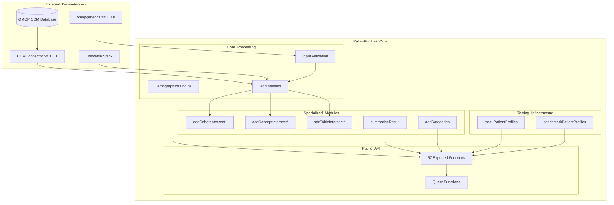
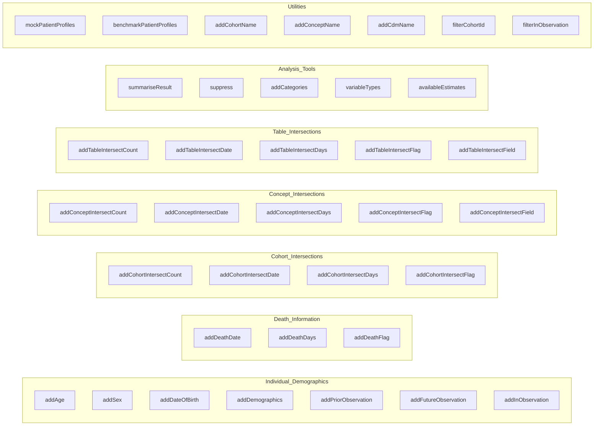
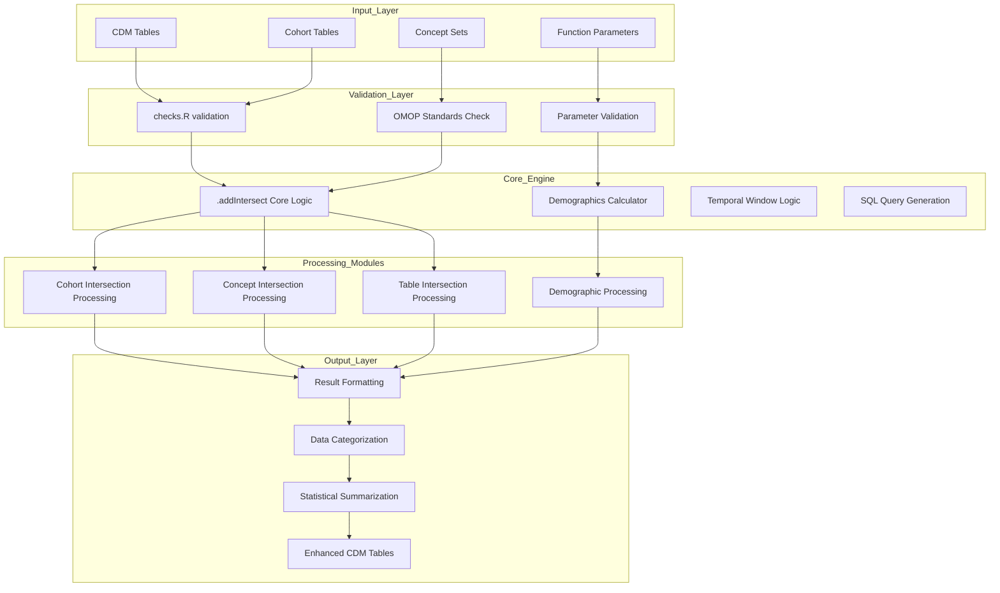
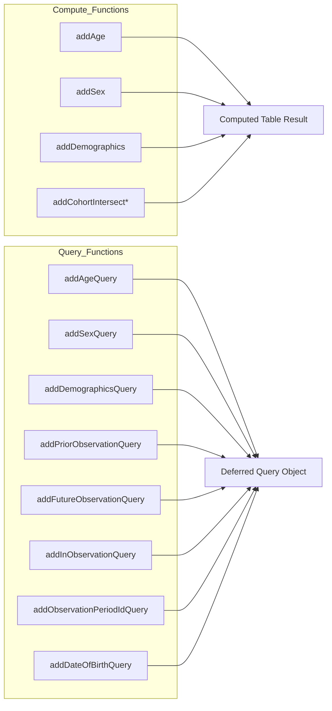

# Page: Overview

# Overview

Relevant source files

The following files were used as context for generating this wiki page:

- [DESCRIPTION](DESCRIPTION)
- [NAMESPACE](NAMESPACE)
- [NEWS.md](NEWS.md)
- [README.Rmd](README.Rmd)
- [README.md](README.md)
- [_pkgdown.yml](_pkgdown.yml)

This document provides a comprehensive overview of the PatientProfiles R package, its architecture, and core functionality for working with OMOP Common Data Model (CDM) data. PatientProfiles enables researchers to identify and add patient characteristics to OMOP CDM tables and perform complex data intersections for patient profiling and cohort analysis.

For specific implementation details about demographics functions, see [Patient Demographics](#2.1). For intersection system internals, see [Data Intersection System](#3.1). For summarization capabilities, see [Data Summarization](#3.2).

## Purpose and Scope

PatientProfiles is designed to identify characteristics of patients in data mapped to the Observational Medical Outcomes Partnership (OMOP) common data model. The package provides 57 exported functions that enable users to add demographic information, perform temporal intersections between different data sources, and summarize patient characteristics for research and analysis.

**Sources:** [DESCRIPTION:24](), [NAMESPACE:1-61](), [README.md:23-25]()

## System Architecture

The PatientProfiles package operates within the broader OMOP CDM ecosystem and follows a layered architecture with core processing engines, specialized function modules, and external integrations.

**Sources:** [DESCRIPTION:53-62](), [NAMESPACE:3-53](), [_pkgdown.yml:16-80]()

## Core Function Categories

The package organizes its functionality into distinct categories, each serving specific aspects of patient profiling and data analysis within the OMOP CDM framework.

**Sources:** [NAMESPACE:3-53](), [_pkgdown.yml:18-80]()

## Data Processing Architecture

The package implements a unified data processing pipeline that handles validation, intersection logic, and result formatting across all function categories.

**Sources:** [README.md:42-95](), [_pkgdown.yml:35-47]()

## External Integration Points

PatientProfiles integrates with several external systems and packages to provide seamless OMOP CDM data analysis capabilities.

| Integration Point | Purpose | Key Functions |
|-------------------|---------|---------------|
| **CDMConnector >= 1.3.1** | Database connectivity and CDM reference management | `cdmFromCon()`, table references |
| **omopgenerics >= 1.0.0** | OMOP CDM standards and validation | `settings()`, `suppress()` |
| **DBI/dbplyr** | Database query translation and execution | SQL generation, lazy evaluation |
| **Tidyverse Stack** | Data manipulation and pipeline operations | `dplyr`, `tidyr`, `purrr`, `stringr` |
| **Database Backends** | Data storage (PostgreSQL, SQL Server, DuckDB) | Connection management |

**Sources:** [DESCRIPTION:53-62](), [README.md:51-95]()

## Query vs Compute Functions

The package provides both immediate computation and deferred query functions for performance optimization in large datasets.

**Sources:** [NAMESPACE:4-34](), [_pkgdown.yml:47-50]()

## Package Distribution and Quality Assurance

The package follows modern R development practices with comprehensive testing, documentation, and distribution infrastructure.

| Component | Implementation | Purpose |
|-----------|---------------|---------|
| **Version Management** | Semantic versioning (1.4.2) | Release tracking |
| **Testing Framework** | `testthat >= 3.1.5` with parallel execution | Quality assurance |
| **Documentation** | `pkgdown` website, comprehensive vignettes | User guidance |
| **Distribution** | CRAN + GitHub releases | Package availability |
| **CI/CD Pipeline** | GitHub Actions with R-CMD-check | Automated quality control |
| **License** | Apache License >= 2 | Open source compliance |

**Sources:** [DESCRIPTION:1-71](), [README.md:4-11]()