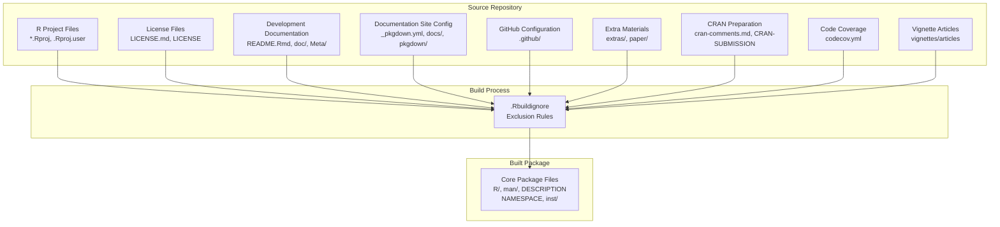
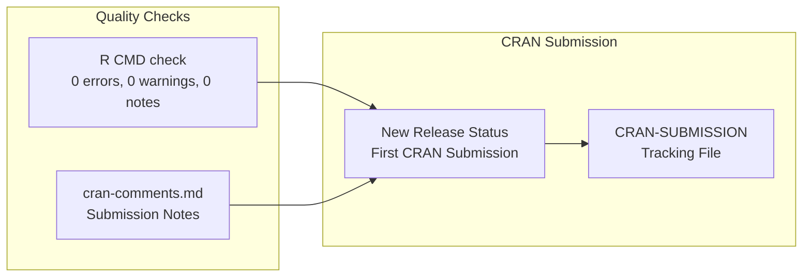
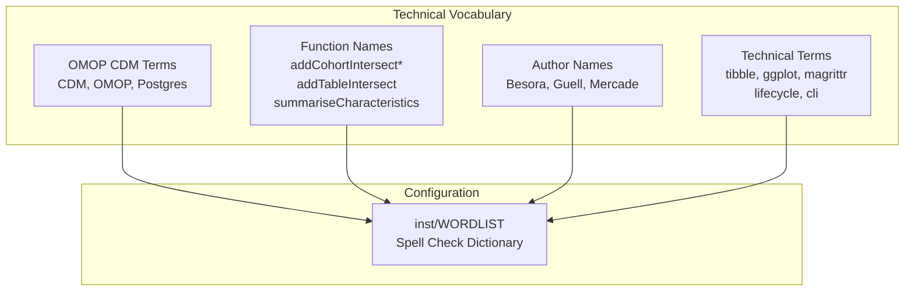
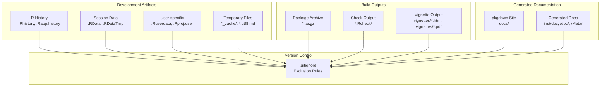
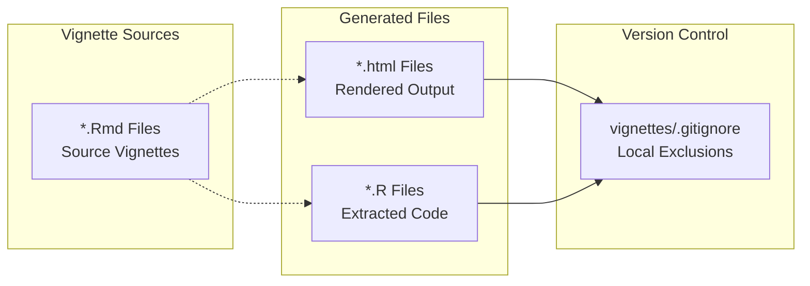

# Page: Package Configuration

# Package Configuration

Relevant source files

The following files were used as context for generating this wiki page:

- [.Rbuildignore](.Rbuildignore)
- [.gitignore](.gitignore)
- [cran-comments.md](cran-comments.md)
- [inst/WORDLIST](inst/WORDLIST)
- [man/PatientProfiles-package.Rd](man/PatientProfiles-package.Rd)
- [vignettes/.gitignore](vignettes/.gitignore)

This section covers the build configuration, package structure, and distribution setup for the PatientProfiles R package. It includes details about how the package is structured, what files are included or excluded during build processes, and how the package is configured for distribution through CRAN and other channels.

For information about the continuous integration and testing framework, see [Quality Assurance and CI/CD](#5.2). For details about the internal variable type system, see [Variable Types and Statistical Estimates](#5.1).

## Package Structure and Build System

The PatientProfiles package follows standard R package conventions with additional configuration for modern development workflows. The build system is configured to exclude development artifacts while preserving essential package components.

### Build Exclusions

The `.Rbuildignore` file defines which files and directories are excluded from the package build:

**Sources:** [.Rbuildignore:1-18]()

### Package Metadata Configuration

The package is configured with comprehensive metadata including author information, maintainer details, and links to documentation and issue tracking:

| Field | Configuration |
|-------|--------------|
| Maintainer | Marti Catala (marti.catalasabate@ndorms.ox.ac.uk) |
| Primary Authors | Yuchen Guo, Mike Du, Kim Lopez-Guell, Edward Burn, Nuria Mercade-Besora |
| Contributors | Xintong Li, Xihang Chen |
| Documentation | https://darwin-eu.github.io/PatientProfiles/ |
| Issue Tracker | https://github.com/darwin-eu/PatientProfiles/issues |
| Package Logo | Configured for HTML documentation display |

**Sources:** [man/PatientProfiles-package.Rd:7-41]()

## Distribution Configuration

### CRAN Preparation

The package is configured for CRAN distribution with standard quality checks:

**Sources:** [cran-comments.md:1-6](), [.Rbuildignore:16]()

## Documentation Configuration

### Spell Checking

The package includes a comprehensive wordlist for spell checking technical terms and domain-specific vocabulary:

The wordlist contains 64 approved terms covering OMOP CDM vocabulary, function names, author names, and R ecosystem packages.

**Sources:** [inst/WORDLIST:1-65]()

## Version Control Configuration

### Git Exclusions

The `.gitignore` configuration excludes build artifacts, temporary files, and generated documentation:

**Sources:** [.gitignore:1-59]()

### Vignette Management

Vignettes have additional version control configuration to exclude generated HTML and R files:

**Sources:** [vignettes/.gitignore:1-3]()

## Quality Assurance Integration

The package configuration integrates with multiple quality assurance systems:

| System | Configuration | Purpose |
|--------|---------------|---------|
| `codecov.yml` | Code coverage reporting | Excluded from package build |
| GitHub Actions | CI/CD workflows in `.github/` | Excluded from package build |
| R CMD check | Standard package validation | Documented in `cran-comments.md` |
| Spell checking | Custom wordlist in `inst/WORDLIST` | Domain-specific vocabulary |

The configuration ensures that quality assurance infrastructure remains available for development while being excluded from the distributed package to minimize size and complexity.

**Sources:** [.Rbuildignore:11](), [.Rbuildignore:15](), [cran-comments.md:1-6](), [inst/WORDLIST:1-65]()