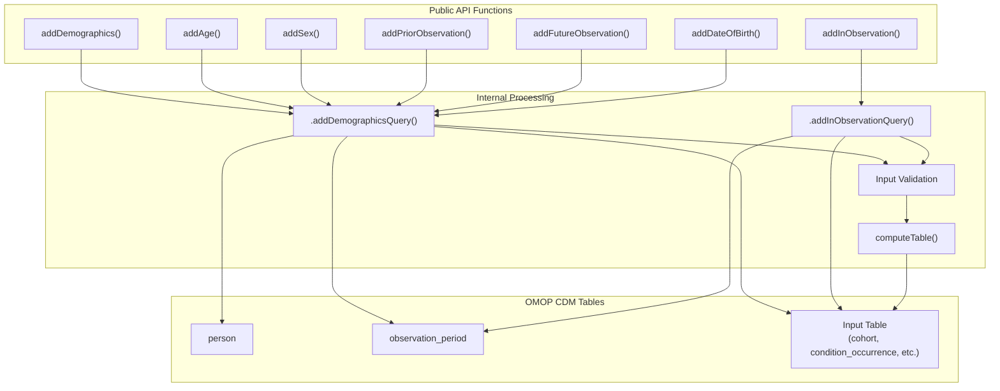
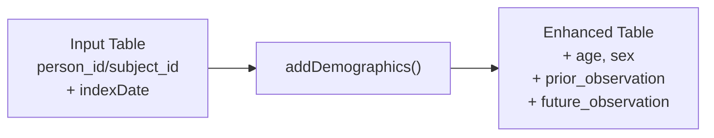
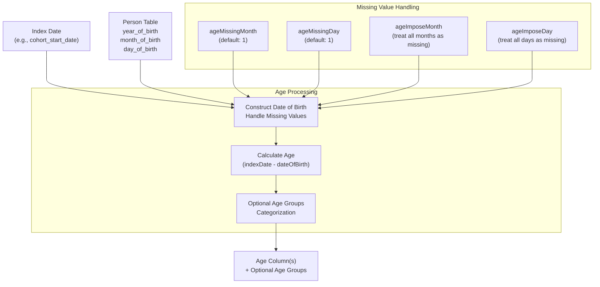
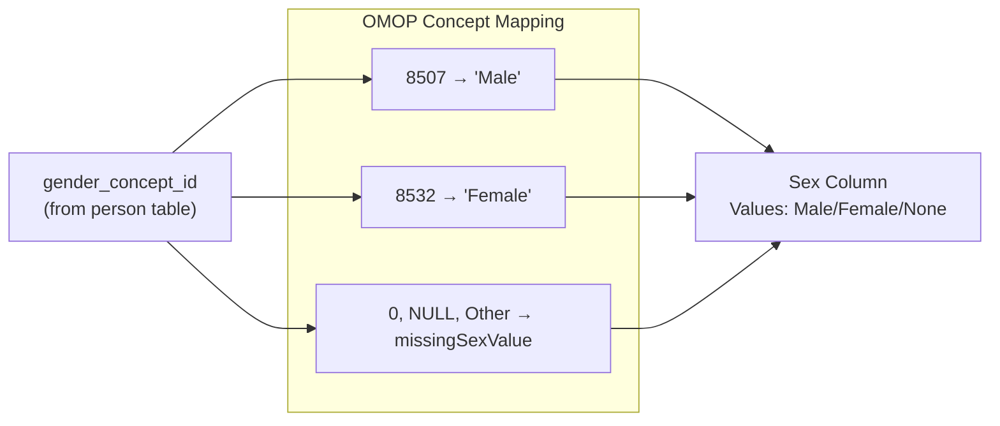
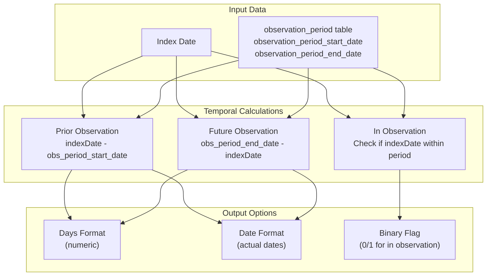
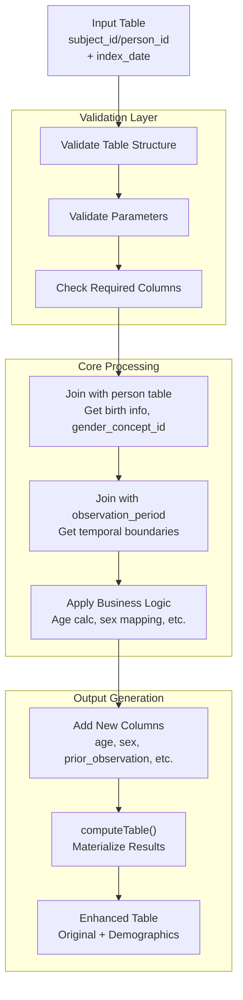

# Page: Patient Demographics

# Patient Demographics

<details>
<summary>Relevant source files</summary>

The following files were used as context for generating this wiki page:

- [R/addDemographics.R](R/addDemographics.R)
- [R/mockPatientProfiles.R](R/mockPatientProfiles.R)
- [man/addAge.Rd](man/addAge.Rd)
- [man/addDemographics.Rd](man/addDemographics.Rd)
- [man/addFutureObservation.Rd](man/addFutureObservation.Rd)
- [man/addInObservation.Rd](man/addInObservation.Rd)
- [man/addPriorObservation.Rd](man/addPriorObservation.Rd)
- [man/addSex.Rd](man/addSex.Rd)
- [tests/testthat/test-addAttributes.R](tests/testthat/test-addAttributes.R)
- [tests/testthat/test-addDemographics.R](tests/testthat/test-addDemographics.R)
- [tests/testthat/test-addFutureObservation.R](tests/testthat/test-addFutureObservation.R)
- [tests/testthat/test-addInObservation.R](tests/testthat/test-addInObservation.R)
- [tests/testthat/test-addPriorObservation.R](tests/testthat/test-addPriorObservation.R)
- [tests/testthat/test-addSex.R](tests/testthat/test-addSex.R)

</details>


This document covers the functions and systems for adding demographic information to OMOP CDM tables, including age, sex, and observation period characteristics. These functions enrich patient data with essential demographic context needed for clinical analyses.

For data intersection and temporal analysis capabilities, see [Data Intersection System](#3.1). For statistical summarization of demographic characteristics, see [Data Summarization](#3.2).

## Purpose and Scope

The Patient Demographics system provides a comprehensive set of functions to calculate and add demographic characteristics to any CDM table containing patient identifiers. The system handles:

- Age calculation at specific index dates with missing birth date imputation
- Sex determination from OMOP gender concepts  
- Observation period analysis (prior and future observation time)
- Date of birth extraction with flexible missing value handling
- Age group categorization for analysis stratification

## Core Function Architecture



Sources: [R/addDemographics.R:67-114](), [R/addDemographics.R:144-179]()

## Primary Functions

### addDemographics()

The comprehensive function for adding multiple demographic characteristics simultaneously. It serves as the main entry point and can selectively enable/disable specific demographic calculations.

**Key Parameters:**
- `indexDate`: Date column for calculations (default: `"cohort_start_date"`)
- `age`: Boolean to include age calculation
- `sex`: Boolean to include sex determination  
- `priorObservation`: Boolean to include prior observation days
- `futureObservation`: Boolean to include future observation days
- `ageGroup`: List of age ranges for categorization



Sources: [R/addDemographics.R:17-114](), [man/addDemographics.Rd:6-30]()

### Individual Demographic Functions

Each demographic aspect can be added independently:

| Function | Purpose | Default Column | Key Features |
|----------|---------|---------------|--------------|
| `addAge()` | Age calculation | `"age"` | Missing date imputation, age groups |
| `addSex()` | Sex determination | `"sex"` | OMOP concept mapping, missing value handling |
| `addPriorObservation()` | Prior observation time | `"prior_observation"` | Days or date format options |
| `addFutureObservation()` | Future observation time | `"future_observation"` | Days or date format options |
| `addInObservation()` | Observation status flag | `"in_observation"` | Window-based assessment |
| `addDateOfBirth()` | Date of birth | `"date_of_birth"` | Missing month/day imputation |

Sources: [R/addDemographics.R:116-179](), [R/addDemographics.R:344-394](), [R/addDemographics.R:422-454]()

## Age Calculation System



**Age Imputation Logic:**
- Missing months default to January (1)  
- Missing days default to 1st of month
- `ageImposeMonth`/`ageImposeDay` force all births to use default values for consistency
- Age groups automatically categorize ages into ranges like `"0 to 40"`, `"41 or above"`

Sources: [R/addDemographics.R:116-179](), [tests/testthat/test-addDemographics.R:514-574]()

## Sex Determination System



The system maps OMOP standard gender concept IDs to human-readable sex values, with configurable handling for missing or non-standard values.

Sources: [R/addDemographics.R:344-394](), [tests/testthat/test-addSex.R:24-63]()

## Observation Period Analysis



**Key Behaviors:**
- Multiple observation periods: Uses the most relevant period containing the index date
- Outside observation periods: Returns `NA` for prior/future calculations
- Window support: `addInObservation()` supports time windows around index dates

Sources: [R/addDemographics.R:181-342](), [tests/testthat/test-addDemographics.R:351-416]()

## Data Processing Pipeline



The system uses lazy evaluation through database queries until `computeTable()` materializes the results, enabling efficient processing of large datasets.

Sources: [R/addDemographics.R:89-113](), [tests/testthat/test-addDemographics.R:23-42]()

## Integration Patterns

### Cohort Table Enhancement
```r
# Basic demographic enrichment
cdm$cohort1 |> addDemographics()

# Selective demographics with custom parameters  
cdm$cohort1 |>
  addDemographics(
    indexDate = "cohort_end_date",
    ageGroup = list("adult" = list(c(18, 64), c(65, Inf))),
    sex = TRUE,
    priorObservation = FALSE
  )
```

### Clinical Table Enhancement  
```r
# Add demographics to condition occurrences
cdm$condition_occurrence |>
  addDemographics(indexDate = "condition_start_date")

# Chain with other PatientProfiles functions
cdm$drug_exposure |>
  addAge(indexDate = "drug_exposure_start_date") |>
  addTableIntersectCount(tableName = "condition_occurrence")
```

Sources: [tests/testthat/test-addDemographics.R:44-81](), [tests/testthat/test-addDemographics.R:148-249]()

## Testing Infrastructure

The system includes comprehensive testing through `mockPatientProfiles()` which creates realistic test data:

- **Mock CDM Generation**: Creates person, observation_period, and clinical tables
- **Edge Case Testing**: Missing values, multiple observation periods, date boundaries  
- **Integration Testing**: Verification with different CDM table types
- **Performance Testing**: Large dataset handling validation

Sources: [R/mockPatientProfiles.R:17-41](), [tests/testthat/test-addDemographics.R:1-22]()