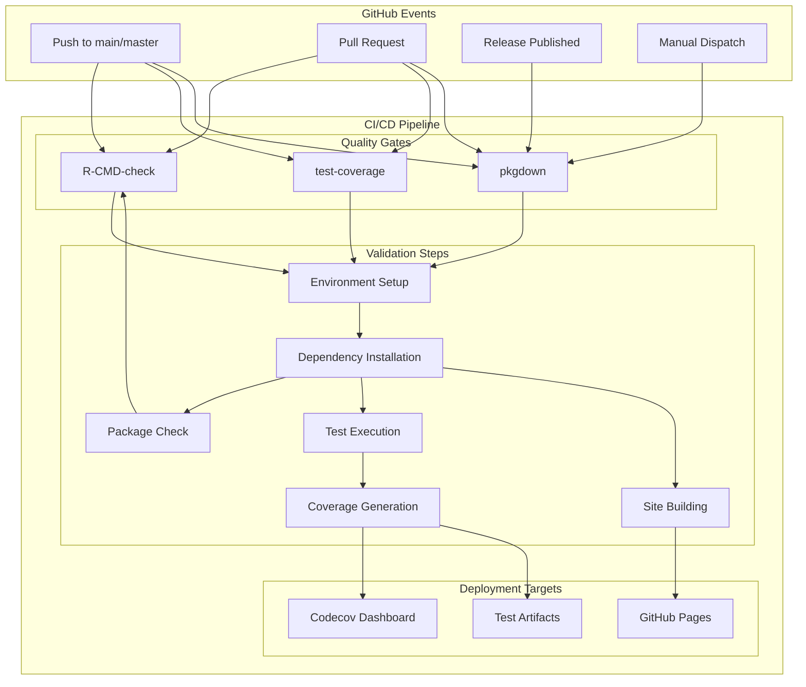
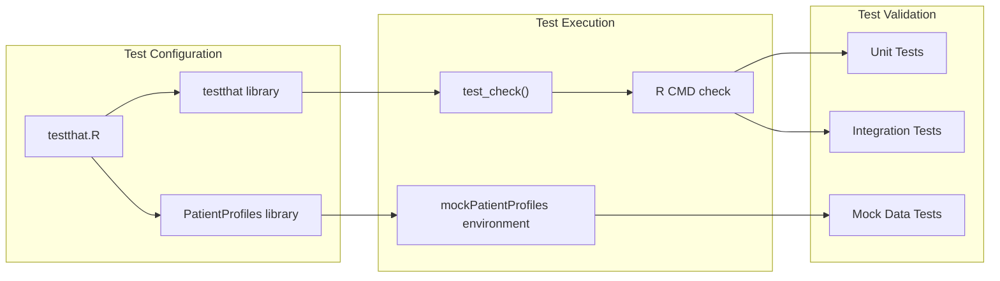
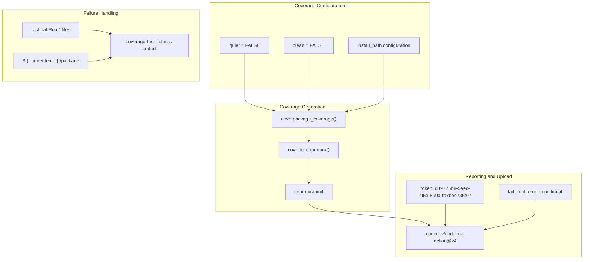
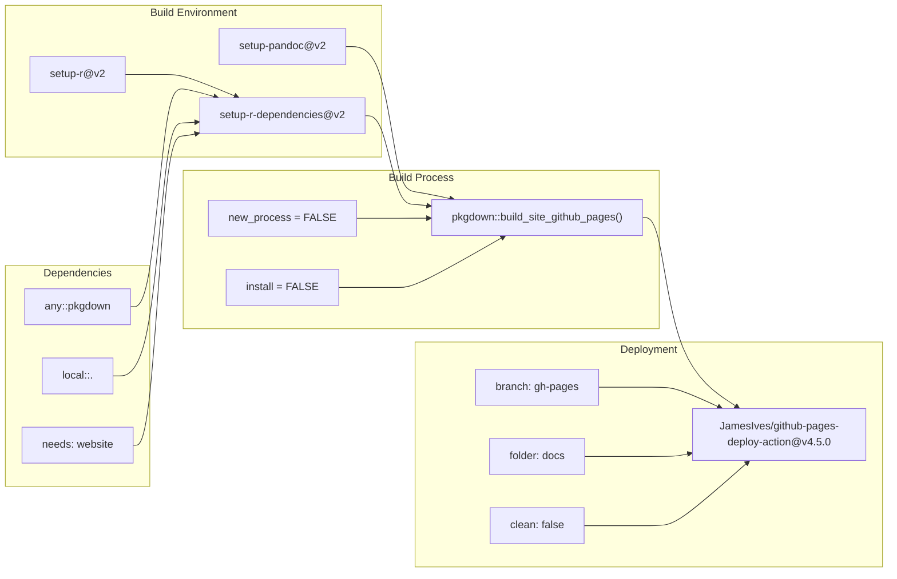
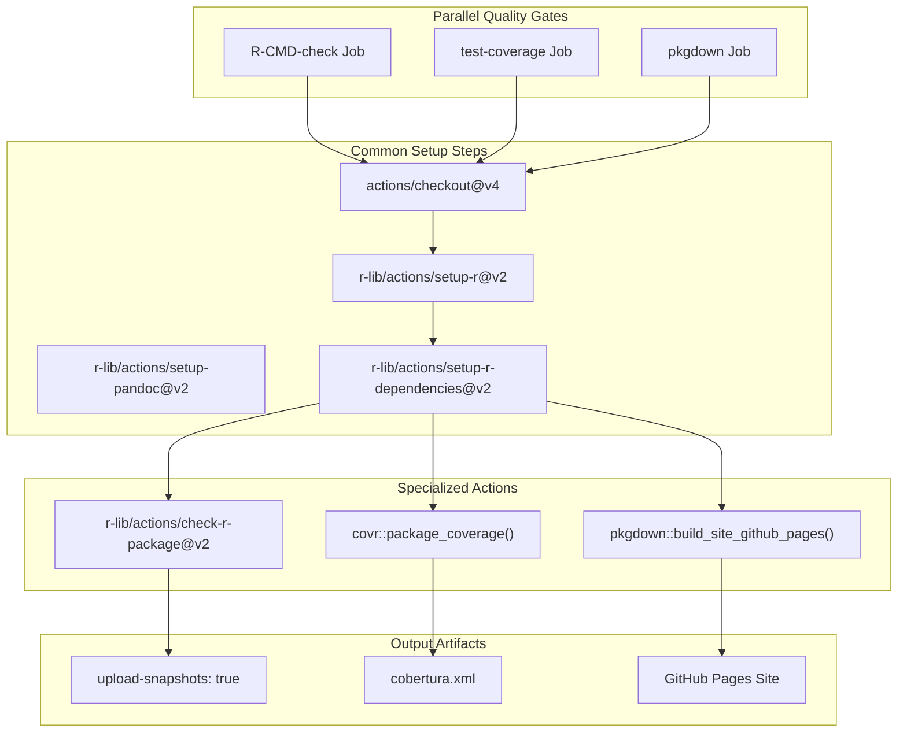

# Page: Quality Assurance and CI/CD

# Quality Assurance and CI/CD

Relevant source files

The following files were used as context for generating this wiki page:

- [.github/.gitignore](.github/.gitignore)
- [.github/workflows/R-CMD-check.yaml](.github/workflows/R-CMD-check.yaml)
- [.github/workflows/pkgdown.yaml](.github/workflows/pkgdown.yaml)
- [.github/workflows/test-coverage.yaml](.github/workflows/test-coverage.yaml)
- [codecov.yml](codecov.yml)
- [man/mockPatientProfiles.Rd](man/mockPatientProfiles.Rd)
- [tests/testthat.R](tests/testthat.R)

This document covers the automated quality assurance processes and continuous integration/continuous deployment (CI/CD) pipeline for the PatientProfiles package. This includes the GitHub Actions workflows for testing, code coverage analysis, and documentation deployment that ensure code quality and reliability.

For information about the testing mock data infrastructure, see [Mock Data and Testing](#2.2). For details about the variable type system and statistical validation, see [Variable Types and Statistical Estimates](#5.1).

## CI/CD Pipeline Architecture

The PatientProfiles package employs a comprehensive CI/CD pipeline built on GitHub Actions that automatically validates code quality, runs tests, measures coverage, and deploys documentation.

### Workflow Overview

Sources: [.github/workflows/R-CMD-check.yaml:1-47](), [.github/workflows/test-coverage.yaml:1-64](), [.github/workflows/pkgdown.yaml:1-50]()

### Workflow Trigger Configuration

The CI/CD system responds to multiple trigger events with different workflow combinations:

| Trigger Event | R-CMD-check | test-coverage | pkgdown |
|---------------|-------------|---------------|---------|
| Push to main/master | ✓ | ✓ | ✓ |
| Pull Request | ✓ | ✓ | ✓ (preview only) |
| Release Published | - | - | ✓ |
| Manual Dispatch | - | - | ✓ |

Sources: [.github/workflows/R-CMD-check.yaml:3-7](), [.github/workflows/test-coverage.yaml:3-7](), [.github/workflows/pkgdown.yaml:3-9]()

## Automated Testing Framework

The package uses the `testthat` framework for comprehensive automated testing, integrated into the CI/CD pipeline for continuous validation.

### Test Infrastructure

Sources: [tests/testthat.R:1-13]()

### R CMD Check Configuration

The primary quality gate uses `R-CMD-check` with specific build arguments optimized for the package:

- **Platform Matrix**: Ubuntu Latest with R release version
- **Build Arguments**: `--no-manual`, `--compact-vignettes=gs+qpdf`
- **Environment**: `R_KEEP_PKG_SOURCE=yes` for source preservation
- **Dependencies**: Automatic resolution with `rcmdcheck` package

Sources: [.github/workflows/R-CMD-check.yaml:20-46]()

## Code Coverage and Quality Metrics

The package maintains code quality through automated coverage analysis and reporting integrated with external quality monitoring services.

### Coverage Analysis Pipeline

Sources: [.github/workflows/test-coverage.yaml:33-63]()

### Coverage Quality Standards

The coverage system implements flexible quality thresholds:

| Metric | Target | Threshold | Mode |
|--------|--------|-----------|------|
| Project Coverage | Auto | 1% | Informational |
| Patch Coverage | Auto | 1% | Informational |

Sources: [codecov.yml:3-14]()

## Documentation Deployment

The package automatically builds and deploys documentation using `pkgdown` with GitHub Pages integration.

### Documentation Build Process

Sources: [.github/workflows/pkgdown.yaml:28-49]()

### Deployment Conditions

Documentation deployment follows conditional logic based on event type:

- **Pull Requests**: Build only (no deployment)
- **Push to main/master**: Build and deploy
- **Releases**: Build and deploy
- **Manual Dispatch**: Build and deploy

The concurrency control ensures only one deployment runs at a time: `pkgdown-${{ github.event_name != 'pull_request' || github.run_id }}`.

Sources: [.github/workflows/pkgdown.yaml:18-20](), [.github/workflows/pkgdown.yaml:44]()

## Quality Gates and Workflow Dependencies

The CI/CD system implements multiple quality gates that must pass before code integration and deployment.

### Workflow Job Matrix

Sources: [.github/workflows/R-CMD-check.yaml:26-46](), [.github/workflows/test-coverage.yaml:19-49](), [.github/workflows/pkgdown.yaml:25-49]()

### Error Handling and Artifact Collection

Each workflow includes sophisticated error handling and artifact collection:

- **R-CMD-check**: Uploads test snapshots on failure
- **test-coverage**: Collects `testthat.Rout` files and package artifacts
- **pkgdown**: Continues with clean=false to preserve existing documentation

The system uses conditional execution (`if: always()`, `if: failure()`) to ensure diagnostic information is always collected even when tests fail.

Sources: [.github/workflows/R-CMD-check.yaml:45](), [.github/workflows/test-coverage.yaml:51-63](), [.github/workflows/pkgdown.yaml:47]()