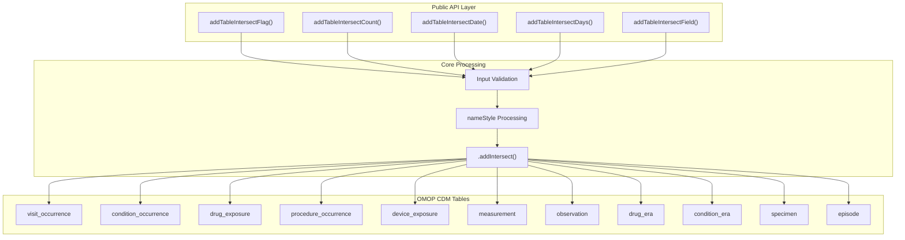
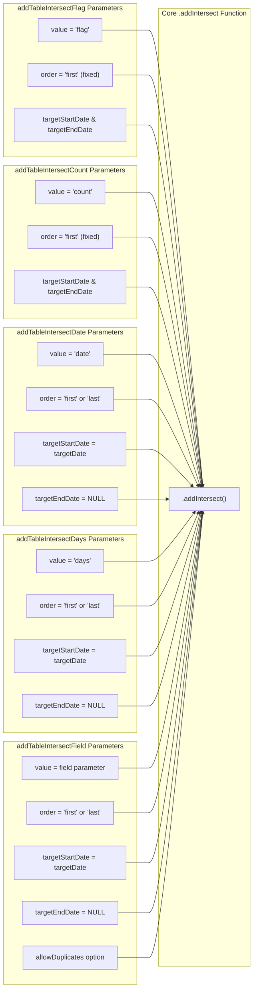

# Page: Table Intersection

# Table Intersection

<details>
<summary>Relevant source files</summary>

The following files were used as context for generating this wiki page:

- [R/addTableIntersect.R](R/addTableIntersect.R)
- [man/addTableIntersectCount.Rd](man/addTableIntersectCount.Rd)
- [man/addTableIntersectDate.Rd](man/addTableIntersectDate.Rd)
- [man/addTableIntersectDays.Rd](man/addTableIntersectDays.Rd)
- [man/addTableIntersectField.Rd](man/addTableIntersectField.Rd)
- [man/addTableIntersectFlag.Rd](man/addTableIntersectFlag.Rd)
- [tests/testthat/test-addTableIntersect.R](tests/testthat/test-addTableIntersect.R)

</details>


## Purpose and Scope

The Table Intersection system provides functions for analyzing temporal relationships between patient records and standard OMOP CDM tables. This system allows users to add derived columns to patient cohorts by identifying intersections with clinical events stored in tables such as `drug_exposure`, `condition_occurrence`, `visit_occurrence`, and other OMOP standard tables.

For intersections with cohort tables, see [Cohort Intersection](#3.1.1). For intersections with OMOP concept sets, see [Concept Intersection](#3.1.2). For the underlying intersection architecture, see [Data Intersection System](#3.1).

## Table Intersection Functions

The PatientProfiles package provides five main table intersection functions, each designed to extract different types of information from OMOP CDM tables:

| Function | Purpose | Return Value |
|----------|---------|--------------|
| `addTableIntersectFlag` | Binary indicator of intersection | 0 (no intersection) or 1 (intersection found) |
| `addTableIntersectCount` | Number of intersecting records | Integer count of matching records |
| `addTableIntersectDate` | Date of intersection event | Date of first/last matching record |
| `addTableIntersectDays` | Time to intersection | Number of days between index date and event |
| `addTableIntersectField` | Value from specific column | Actual value from target table field |

**Table Intersection Function Architecture**


Sources: [R/addTableIntersect.R:51-85](), [R/addTableIntersect.R:121-155](), [R/addTableIntersect.R:191-225](), [R/addTableIntersect.R:261-295](), [R/addTableIntersect.R:342-380]()

## Supported OMOP Tables

All table intersection functions support the following OMOP CDM standard tables:

- `visit_occurrence` - Healthcare visits and encounters
- `condition_occurrence` - Medical conditions and diagnoses  
- `drug_exposure` - Drug prescriptions and administrations
- `procedure_occurrence` - Medical procedures performed
- `device_exposure` - Medical device usage
- `measurement` - Laboratory tests and vital signs
- `observation` - General clinical observations
- `drug_era` - Derived drug exposure periods
- `condition_era` - Derived condition occurrence periods
- `specimen` - Biological specimens collected
- `episode` - Episodes of care

The system uses helper functions `startDateColumn()` and `endDateColumn()` to automatically determine the appropriate date columns for each table type.

Sources: [R/addTableIntersect.R:20-23](), [R/addTableIntersect.R:90-93]()

## Function-Specific Implementation Details

**Core Parameter Mapping to .addIntersect**


Sources: [R/addTableIntersect.R:66-82](), [R/addTableIntersect.R:136-152](), [R/addTableIntersect.R:206-222](), [R/addTableIntersect.R:276-292](), [R/addTableIntersect.R:360-377]()

### Flag and Count Functions

Both `addTableIntersectFlag` and `addTableIntersectCount` work with time periods defined by start and end dates. They use both `targetStartDate` and `targetEndDate` parameters and have a fixed `order` of "first" since the specific ordering is not relevant for counting or flag determination.

The key difference lies in the `value` parameter passed to `.addIntersect()`:
- Flag functions pass `value = "flag"`
- Count functions pass `value = "count"`

Sources: [R/addTableIntersect.R:72](), [R/addTableIntersect.R:142]()

### Date and Days Functions  

Both `addTableIntersectDate` and `addTableIntersectDays` focus on single time points rather than periods. They:
- Use only `targetDate` (mapped to `targetStartDate`)
- Set `targetEndDate = NULL`
- Allow user-configurable `order` parameter ("first" or "last")
- Differ only in the `value` parameter ("date" vs "days")

Sources: [R/addTableIntersect.R:214-215](), [R/addTableIntersect.R:284-285]()

### Field Function

`addTableIntersectField` is the most flexible function, allowing extraction of arbitrary column values from target tables. It includes an `allowDuplicates` parameter not available in other functions, and uses the `field` parameter as the `value` passed to `.addIntersect()`.

Sources: [R/addTableIntersect.R:366](), [R/addTableIntersect.R:373]()

## Common Parameters and Configuration

### Temporal Windows

All functions support the `window` parameter to define time periods relative to the `indexDate`:
- `list(c(0, Inf))` - From index date forward (default)
- `list(c(-Inf, 0))` - From any time in the past up to index date
- `list(c(-30, 30))` - 30 days before to 30 days after index date
- `list(c(-365, -1), c(1, 365))` - Multiple windows excluding index date

### Naming Conventions

The `nameStyle` parameter controls output column naming with template variables:
- `{table_name}` - Name of the target table
- `{window_name}` - Formatted window specification
- `{extra_value}` or `{value}` - Additional identifiers (field functions)

Default patterns:
- Most functions: `"{table_name}_{window_name}"`  
- Field functions: `"{table_name}_{extra_value}_{window_name}"`

Examples of generated names:
- `visit_occurrence_0_to_inf`
- `drug_exposure_drug_concept_id_m30_to_30`

Sources: [R/addTableIntersect.R:59](), [R/addTableIntersect.R:352](), [R/addTableIntersect.R:64](), [R/addTableIntersect.R:357-358]()

### Observation Period Filtering

When `inObservation = TRUE` (default), the system only considers records that fall within valid observation periods for each patient, ensuring data quality and temporal validity.

Sources: [R/addTableIntersect.R:58](), [R/addTableIntersect.R:76]()

## Integration with Core Intersection System

All table intersection functions serve as specialized wrappers around the core `.addIntersect()` function. The integration follows this pattern:

1. **Input validation** - Check CDM reference and table availability via `checkCdm(cdm, tables = tableName)`
2. **Name processing** - Replace `{table_name}` placeholder in `nameStyle`
3. **Parameter mapping** - Convert function-specific parameters to `.addIntersect()` format
4. **Core delegation** - Call `.addIntersect()` with standardized parameters

This architecture ensures consistent behavior across all intersection types while allowing for function-specific optimizations and parameter sets.

Sources: [R/addTableIntersect.R:61-63](), [R/addTableIntersect.R:66-82]()

## Usage Examples

### Basic Flag Detection
```r
# Check for any visit in the 30 days after cohort start
cdm$cohort1 |>
  addTableIntersectFlag(
    tableName = "visit_occurrence", 
    window = list(c(0, 30))
  )
```

### Counting Events
```r
# Count drug exposures in multiple time windows
cdm$cohort1 |>
  addTableIntersectCount(
    tableName = "drug_exposure",
    window = list(c(-365, 0), c(0, 365))
  )
```

### Extracting Specific Values
```r
# Get the most recent visit type before cohort start
cdm$cohort1 |>
  addTableIntersectField(
    tableName = "visit_occurrence",
    field = "visit_concept_id", 
    window = list(c(-Inf, -1)),
    order = "last"
  )
```

Sources: [tests/testthat/test-addTableIntersect.R:168-173](), [tests/testthat/test-addTableIntersect.R:262-270](), [tests/testthat/test-addTableIntersect.R:635-641]()