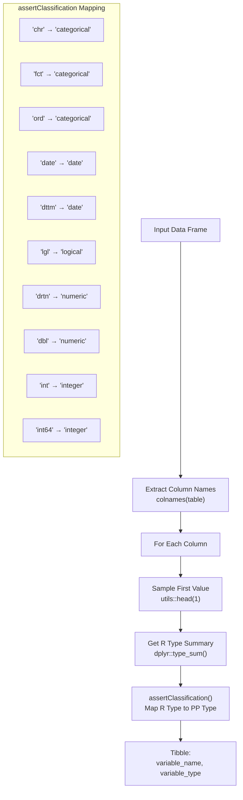
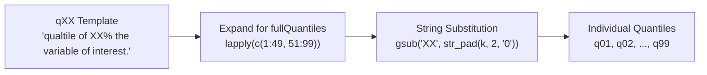
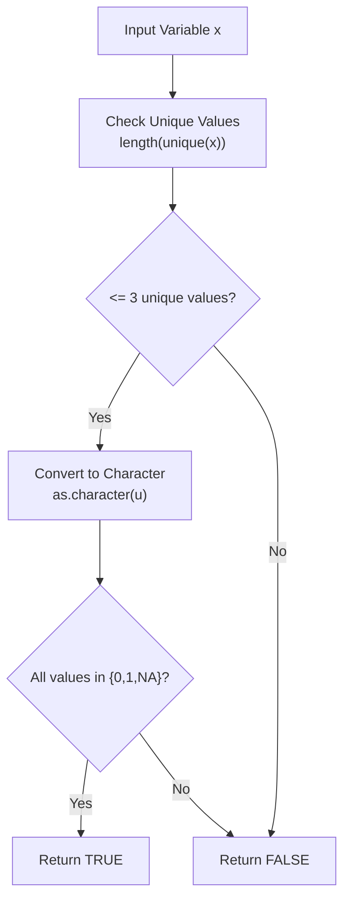

# Page: Variable Types and Statistical Estimates

# Variable Types and Statistical Estimates

<details>
<summary>Relevant source files</summary>

The following files were used as context for generating this wiki page:

- [R/formats.R](R/formats.R)
- [R/sysdata.rda](R/sysdata.rda)
- [extras/addData.R](extras/addData.R)
- [extras/formats.csv](extras/formats.csv)
- [extras/formats_old.csv](extras/formats_old.csv)
- [tests/testthat/test-format.R](tests/testthat/test-format.R)

</details>


This document covers the variable type classification system and statistical estimates registry that underlies PatientProfiles' data summarization capabilities. This system automatically classifies variables in OMOP CDM tables into standardized types and provides appropriate statistical measures for each type.

For information about how these classifications are used in practice, see [Data Summarization](#3.2). For details on data categorization functions that build on this system, see [Data Categorization](#3.3).

## Variable Type Classification System

PatientProfiles implements a unified variable type classification system that maps R data types to five standardized categories for statistical analysis:

| PatientProfiles Type | R Types | Description |
|---------------------|---------|-------------|
| `numeric` | `dbl`, `drtn` | Continuous numeric values |
| `integer` | `int`, `int64` | Discrete integer values |
| `date` | `date`, `dttm` | Date and datetime values |
| `categorical` | `chr`, `fct`, `ord` | Character strings and factors |
| `logical` | `lgl` | Boolean TRUE/FALSE values |

### Variable Type Detection

The `variableTypes()` function automatically classifies all columns in a data frame:



**Variable Type Classification Flow**

Sources: [R/formats.R:37-58](), [R/formats.R:61-75]()

### Implementation Details

The classification logic is implemented through two key functions:

- **`variableTypes(table)`** - Main classification function that processes entire data frames
- **`assertClassification(x)`** - Internal mapping function that converts R type strings to PatientProfiles types

The system handles edge cases like empty data frames and uses `dplyr::type_sum()` to get consistent type representations across different R data types.

Sources: [R/formats.R:37-58](), [R/formats.R:61-75]()

## Statistical Estimates Registry

PatientProfiles maintains a comprehensive registry of statistical estimates available for each variable type. This registry is stored in the `formats` data structure and accessed via the `availableEstimates()` function.

### Estimates by Variable Type

```mermaid
graph TD
    subgraph "NUMERIC_ESTIMATES[\"Numeric/Integer Variables\"]"
        N_CENTRAL["`Central Tendency:
        mean, median`"]
        N_SPREAD["`Variability:
        sd, min, max`"]
        N_QUANTILES["`Quantiles:
        q01-q99`"]
        N_AGGREGATE["`Aggregates:
        sum, count`"]
        N_MISSING["`Missing Data:
        count_missing, percentage_missing`"]
        N_DENSITY["`Distribution:
        density`"]
    end
    
    subgraph "DATE_ESTIMATES[\"Date Variables\"]"
        D_CENTRAL["`Central Tendency:
        mean, median`"]
        D_SPREAD["`Variability:
        sd, min, max`"]
        D_QUANTILES["`Quantiles:
        q01-q99`"]
        D_MISSING["`Missing Data:
        count_missing, percentage_missing`"]
        D_DENSITY["`Distribution:
        density`"]
    end
    
    subgraph "CATEGORICAL_ESTIMATES[\"Categorical/Logical Variables\"]"
        C_COUNT["`Frequency:
        count, percentage`"]
    end
    
    REGISTRY["`formats Data Structure
    (stored in sysdata.rda)`"] --> NUMERIC_ESTIMATES
    REGISTRY --> DATE_ESTIMATES  
    REGISTRY --> CATEGORICAL_ESTIMATES
    
    AVAILABLE_EST["`availableEstimates()
    Function`"] --> REGISTRY
```

**Statistical Estimates Registry Architecture**

Sources: [extras/addData.R:9-15](), [R/formats.R:97-146]()

### Estimate Function Implementations

The package provides two sets of estimate computation functions:

| Function Set | Purpose | Storage |
|-------------|---------|---------|
| `estimatesFunc` | Standard estimates | Named character vector |
| `estimatesFuncWeights` | Weighted estimates using Hmisc | Named character vector |

Both are stored in [R/sysdata.rda]() and contain the actual R code strings for computing each estimate.

Examples from `estimatesFunc`:
- `"min"` → `"base::min(x, na.rm = TRUE)"`  
- `"mean"` → `"base::mean(x, na.rm = TRUE)"`
- `"q25"` → `"stats::quantile(x, 0.25, na.rm = TRUE)"`

Sources: [extras/addData.R:55-65](), [extras/addData.R:66-76]()

### Quantile Handling

The system provides flexible quantile computation through a template mechanism:

1. **Template Definition**: `qXX` in base formats represents any quantile
2. **Expansion Logic**: When `fullQuantiles = TRUE`, expands to `q01` through `q99`
3. **Dynamic Substitution**: `XX` placeholder replaced with zero-padded percentile numbers



**Quantile Template Expansion Process**

Sources: [R/formats.R:105-141]()

## Data Structure Implementation

### Primary Data Structures

The variable type and estimates system relies on several key data structures stored in [R/sysdata.rda]():

| Structure | Type | Purpose |
|-----------|------|---------|
| `formats` | tibble | Maps variable types to available estimates |
| `estimatesFunc` | named character vector | R code for computing estimates |
| `estimatesFuncWeights` | named character vector | R code for weighted estimates |
| `formatsOld` | tibble | Legacy format definitions |

### Binary Variable Detection

A specialized helper function `binaryVariable()` detects variables that should be treated as binary (0/1) rather than general numeric:



**Binary Variable Detection Logic**

This function identifies variables that contain only values `"0"`, `"1"`, and `NA`, treating them as binary indicators rather than continuous numeric variables.

Sources: [R/formats.R:148-155]()

### Format Definition Process

The formats registry is built through a multi-step process in [extras/addData.R]():

1. **Define Base Estimates**: Map variable types to estimate names
2. **Load Descriptions**: Read estimate descriptions from CSV
3. **Join and Transform**: Combine estimates with descriptions  
4. **Handle Special Cases**: Add custom logic for integer means/sd and binary variables
5. **Add Density**: Include distribution density estimates
6. **Package for Distribution**: Save to sysdata.rda

Sources: [extras/addData.R:7-41](), [extras/formats.csv:1-13]()