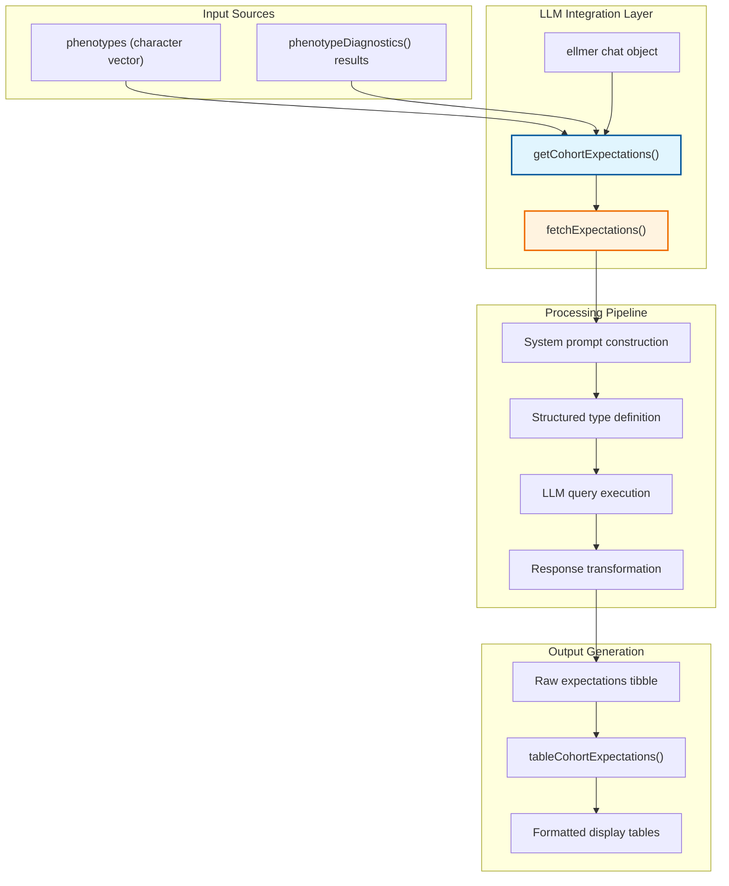
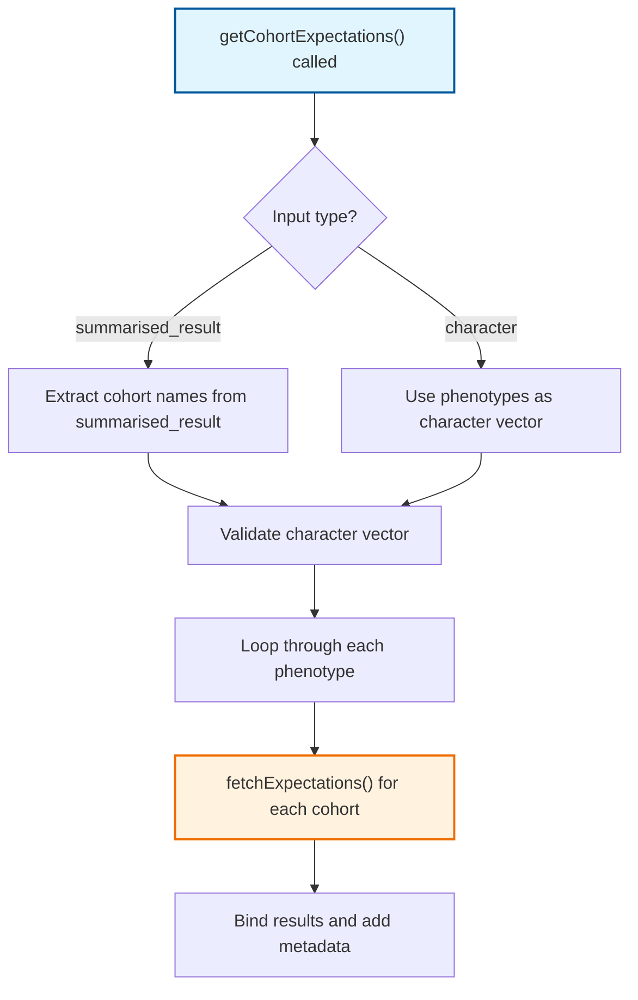
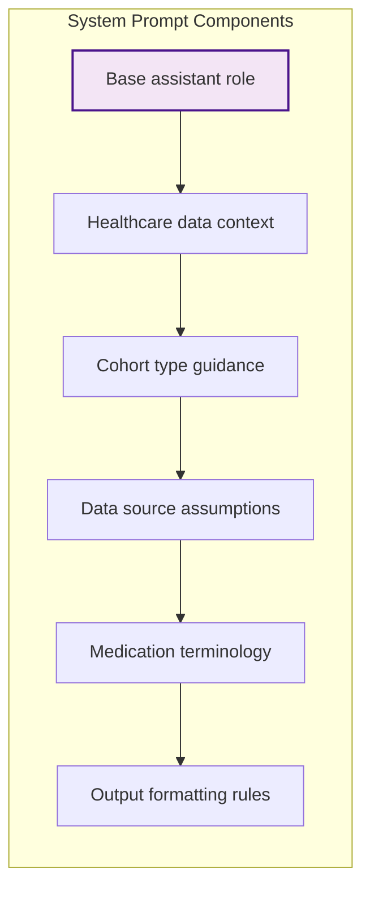
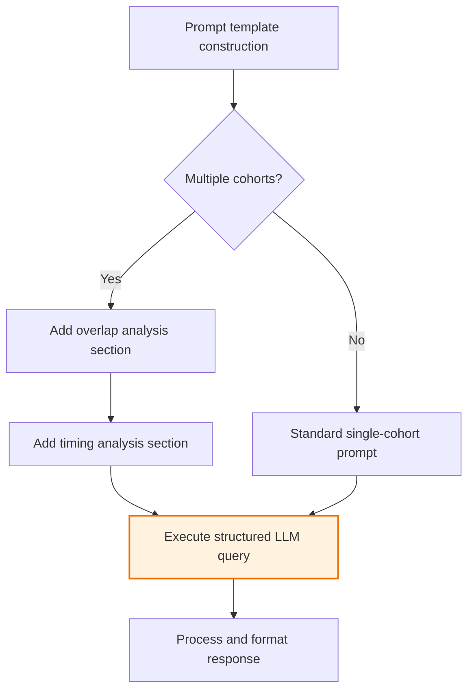
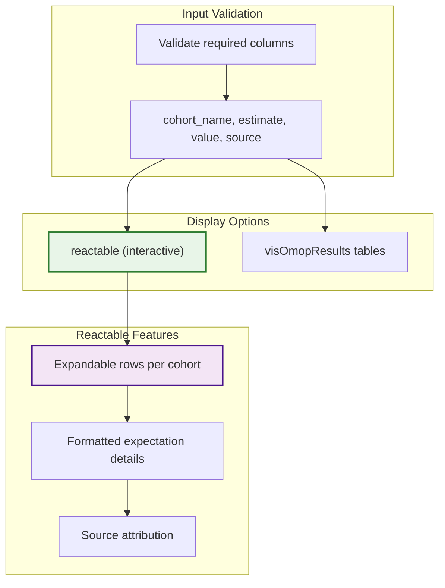
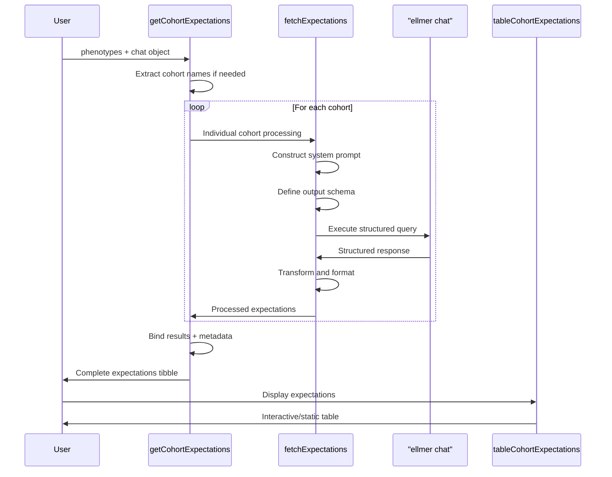
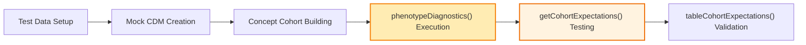

# Page: AI-Powered Expectations

# AI-Powered Expectations

Relevant source files

The following files were used as context for generating this wiki page:

- [NAMESPACE](NAMESPACE)
- [R/getCohortExpectations.R](R/getCohortExpectations.R)
- [extras/expectationsForVignette.R](extras/expectationsForVignette.R)
- [tests/testthat/test-getCohortExpectations.R](tests/testthat/test-getCohortExpectations.R)
- [vignettes/PhenotypeExpectations.Rmd](vignettes/PhenotypeExpectations.Rmd)
- [vignettes/vignette_phenotype_expectations/expectations_3.csv](vignettes/vignette_phenotype_expectations/expectations_3.csv)

This section documents PhenotypeR's AI-powered expectation generation system that leverages Large Language Models (LLMs) to automatically create clinically-informed expectations about cohort characteristics. This system helps researchers establish baselines for comparison when evaluating diagnostic results from the core phenotyping system.

For information about the core diagnostic functions that generate the results these expectations compare against, see [Core Diagnostic System](#2). For details about visualizing expectations alongside diagnostic results, see [Interactive Visualization System](#3).

## Purpose and Architecture

The AI-powered expectations system provides an automated approach to generating clinical expectations about cohort characteristics using LLMs. Rather than requiring manual creation of expectations based on clinical expertise, this system can rapidly generate structured expectations that align with the diagnostic outputs from `phenotypeDiagnostics()`.

### System Integration

**Sources:** [R/getCohortExpectations.R:1-42](), [NAMESPACE:10](), [tests/testthat/test-getCohortExpectations.R:1-22]()

## Core Functions

### Main Orchestrator: getCohortExpectations()

The `getCohortExpectations()` function serves as the primary interface for expectation generation. It accepts either a character vector of phenotype names or results from `phenotypeDiagnostics()` and processes them through an LLM to generate structured expectations.

| Parameter | Type | Description |
|-----------|------|-------------|
| `chat` | ellmer chat object | Pre-configured LLM interface |
| `phenotypes` | character vector or summarised_result | Cohort names or diagnostic results |

The function handles input validation and cohort name extraction when working with `summarised_result` objects:

**Sources:** [R/getCohortExpectations.R:11-42](), [R/getCohortExpectations.R:16-23]()

### Expectation Fetching: fetchExpectations()

The `fetchExpectations()` function handles the detailed LLM interaction for individual cohorts. It constructs specialized prompts, defines structured output schemas, and processes LLM responses into standardized formats.

#### System Prompt Construction

The function builds comprehensive system prompts that establish context for the LLM:

**Sources:** [R/getCohortExpectations.R:52-65](), [R/getCohortExpectations.R:134-137]()

#### Structured Output Schema

The system defines two different schemas depending on whether multiple cohorts are being processed (enabling overlap and timing analysis):

| Field Category | Single Cohort | Multiple Cohorts | Description |
|----------------|---------------|------------------|-------------|
| Clinical | ✓ | ✓ | Description, frequency |
| Demographics | ✓ | ✓ | Age, sex distribution |
| Outcomes | ✓ | ✓ | Survival estimates |
| Clinical Features | ✓ | ✓ | Comorbidities, symptoms, medications |
| Cohort Relationships | ✗ | ✓ | Overlap percentages, timing patterns |

**Sources:** [R/getCohortExpectations.R:68-113](), [R/getCohortExpectations.R:115-132]()

## LLM Prompting Strategy

### Dynamic Prompt Construction

The system uses templated prompts that adapt based on the number of cohorts being analyzed:

**Sources:** [R/getCohortExpectations.R:115-137](), [R/getCohortExpectations.R:124-131]()

### Response Processing Pipeline

The raw LLM response undergoes structured transformation to create the final expectations format:

1. **Field Combination**: Numeric ranges are combined with elaboration text
2. **Column Renaming**: Internal field names are mapped to display names  
3. **Data Reshaping**: Wide format is pivoted to long format for compatibility
4. **Diagnostic Mapping**: Each expectation is tagged with relevant diagnostic categories

**Sources:** [R/getCohortExpectations.R:139-220]()

## Output Formatting and Display

### tableCohortExpectations()

The `tableCohortExpectations()` function provides interactive and static table formats for displaying generated expectations:

**Sources:** [R/getCohortExpectations.R:233-302](), [R/getCohortExpectations.R:246-292]()

## Integration Workflow

### End-to-End Process

The complete workflow demonstrates how the AI expectations system integrates with the broader PhenotypeR ecosystem:

**Sources:** [R/getCohortExpectations.R:25-41](), [R/getCohortExpectations.R:45-221](), [vignettes/PhenotypeExpectations.Rmd:96-157]()

## Testing and Validation

The testing framework validates both the core functionality and integration scenarios:

### Test Coverage Areas

| Test Category | Focus | Key Validations |
|---------------|-------|-----------------|
| Basic Function | Core API | String and vector inputs work |
| Integration | Results Object | Handles `phenotypeDiagnostics()` output |
| Display | Table Generation | Multiple table formats render correctly |
| Error Handling | Input Validation | Appropriate error messages for invalid inputs |

**Sources:** [tests/testthat/test-getCohortExpectations.R:1-73]()

### Mock Data Integration

The system integrates with PhenotypeR's mock data capabilities for testing scenarios that don't require actual LLM API calls:

**Sources:** [tests/testthat/test-getCohortExpectations.R:24-58](), [tests/testthat/test-getCohortExpectations.R:31-50]()